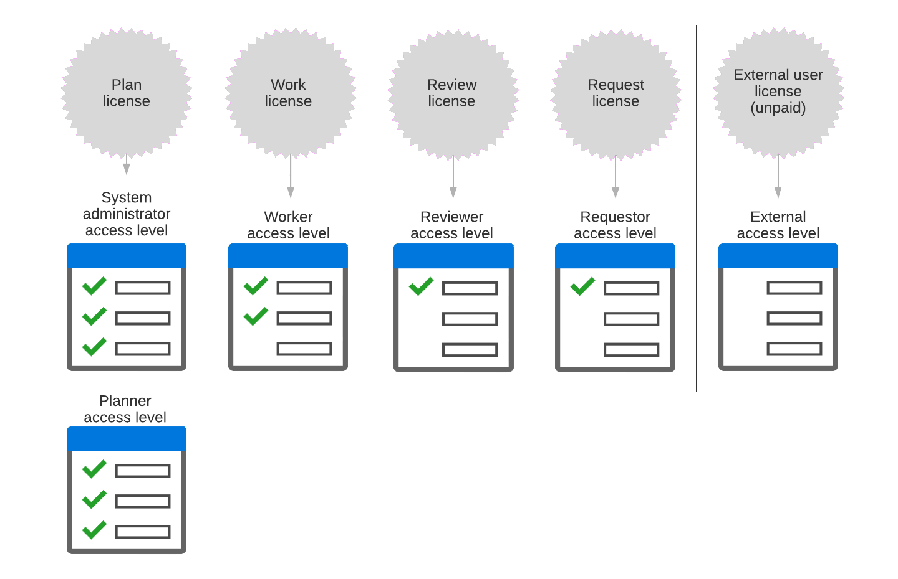

# Información general sobre las licencias de Adobe Workfront

Su organización adquirió un determinado número de licencias cuando adquirió Adobe Workfront. Como administrador de Workfront, concede uno de los 4 tipos de licencias de Workfront de pago a cada usuario al asignar un nivel de acceso.

## Vinculación entre las licencias y los niveles de acceso de Workfront

Los 4 tipos de licencias de Workfront de pago permiten diferentes niveles de acceso a Workfront. Cada nivel de acceso está adjunto a una de estas licencias.

Como administrador de Workfront, en lugar de asignar una licencia a un usuario, se le asigna el nivel de acceso adjunto a esa licencia.

En esta tabla y diagrama se muestran los niveles principales de acceso a Workfront:

| Licencia | Nivel de acceso asociado |
|--- |--- |
| Plan | Administrador del sistema, planificador |
| Trabajo | Trabajador |
| Revisar | Revisor |
| Externo* | Usuario externo |

>[!NOTE]
>
>La licencia externa no es una licencia paga. Está diseñada principalmente para compartir documentos con colaboradores que no utilizan Workfront. Para obtener más información, consulte [Niveles de acceso integrados en Adobe Workfront](default-access-levels-in-workfront.md).

## Cómo define una licencia un nivel de acceso

La licencia adjunta a un nivel de acceso determina el alcance general de la funcionalidad disponible en el nivel de acceso.

Puede copiar un nivel de acceso predeterminado y personalizar la copia según sea necesario para los usuarios. Dentro del ámbito de funcionalidad permitido por la licencia para el nivel de acceso copiado, puede ajustar la configuración de acceso para satisfacer las necesidades del usuario.

Para obtener más información, consulte [Información general sobre los niveles de acceso](../../../administration-and-setup/add-users/access-levels-and-object-permissions/access-levels-overview.md) y [Crear o modificar niveles de acceso personalizados](../../../administration-and-setup/add-users/configure-and-grant-access/create-modify-access-levels.md).

## Recuento de licencias

Al asignar un nivel de acceso a un usuario, el recuento de licencias disponible se reduce en 1.

Por ejemplo, si asigna el nivel de acceso Planificador a un usuario, el número de licencias del Plan disponibles se reduce en 1.

Puede ver las licencias y los niveles de acceso asignados a los usuarios. Para obtener más información, consulte [Enumerar los niveles de acceso y las licencias de los usuarios](../../../administration-and-setup/add-users/access-levels-and-object-permissions/list-access-levels-and-licenses-for-your-users.md).

Para obtener información sobre la administración de licencias, consulte [Administre las licencias disponibles en su sistema](../../../administration-and-setup/get-started-wf-administration/manage-available-licenses-in-your-system.md).
