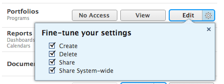

# Conceder acceso a los portafolios

Como administrador de Adobe Workfront, puede utilizar un nivel de acceso para definir el acceso de un usuario a los portafolios, tal como se explica en [Información general sobre los niveles de acceso](../../../administration-and-setup/add-users/access-levels-and-object-permissions/access-levels-overview.md).

## Requisitos de acceso

+++ Expanda para ver los requisitos de acceso para la funcionalidad en este artículo.

<table style="table-layout:auto"> 
 <col> 
 <col> 
 <tbody> 
  <tr> 
   <td role="rowheader">Plan de Adobe Workfront</td> 
   <td>Cualquiera</td> 
  </tr> 
  <tr> 
   <td role="rowheader">Licencia de Adobe Workfront</td> 
   <td>
Estándar

   
Plan
</td> 
  </tr> 
  <tr> 
   <td role="rowheader">Configuraciones de nivel de acceso</td> 
   <td> 
Debe ser administrador de Workfront.
 </td> 
  </tr> 
 </tbody> 
</table>

Para obtener más información sobre el contenido de esta tabla, consulte [Requisitos de acceso en la documentación de Workfront](/help/quicksilver/administration-and-setup/add-users/access-levels-and-object-permissions/access-level-requirements-in-documentation.md).

+++

## Configuración del acceso de usuario a los portafolios mediante un nivel de acceso personalizado

1. Comience a crear o editar el nivel de acceso, tal como se explica en [Crear o modificar niveles de acceso personalizados](../../../administration-and-setup/add-users/configure-and-grant-access/create-modify-access-levels.md).
1. Haga clic en el icono de engranaje  en el botón **Ver** o **Editar** que se encuentra a la derecha de los portafolios y, a continuación, seleccione las funcionalidades que desea conceder en **Ajustar la configuración**.

   

   >[!NOTE]
   >
   >Cuando se establece una configuración de nivel de acceso para un tipo determinado de objeto, esa configuración no afecta al acceso de los usuarios a los objetos con una clasificación inferior. Por ejemplo, puede impedir que los usuarios eliminen portafolios en su nivel de acceso, pero esto no les impide eliminar proyectos, ya que tienen una clasificación inferior a la de los portafolios. Para obtener más información sobre la jerarquía de objetos, consulte la sección [Interdependencia y jerarquía de objetos](../../../workfront-basics/navigate-workfront/workfront-navigation/understand-objects.md#understanding-interdependency-and-hierarchy-of-objects) en el artículo [Comprender los objetos en Adobe Workfront](../../../workfront-basics/navigate-workfront/workfront-navigation/understand-objects.md).

1. (Opcional) Para establecer la configuración de acceso para otros objetos y áreas del nivel de acceso en el que está trabajando, continúe con uno de los artículos enumerados en [Configurar el acceso a Adobe Workfront](../../../administration-and-setup/add-users/configure-and-grant-access/configure-access.md), como [Conceder acceso a las tareas](../../../administration-and-setup/add-users/configure-and-grant-access/grant-access-tasks.md) y [Conceder acceso a los datos financieros](../../../administration-and-setup/add-users/configure-and-grant-access/grant-access-financial.md).
1. Cuando termine, haga clic en **Guardar**.

   Una vez creado el nivel de acceso, puede asignarlo a un usuario. Para obtener más información, consulte [Editar el perfil de un usuario](../../../administration-and-setup/add-users/create-and-manage-users/edit-a-users-profile.md).

## Acceso a portafolios por el tipo de licencia

Para obtener información sobre lo que los usuarios de cada nivel de acceso pueden hacer con los portafolios, consulte la sección [Portafolio](../../../administration-and-setup/add-users/access-levels-and-object-permissions/functionality-available-for-each-object-type.md#portfoli) en el artículo [Funcionalidad disponible para cada tipo de objeto](../../../administration-and-setup/add-users/access-levels-and-object-permissions/functionality-available-for-each-object-type.md).

## Acceso a portafolios compartidos

Como propietario o creador de un portafolio, puede compartirlo con otros usuarios concediéndoles permisos, tal como se explica en [Compartir un portafolio](../../../workfront-basics/grant-and-request-access-to-objects/share-a-portfolio.md).

<!--

If you make changes here, make them also in the "Grant access to" articles where this snippet had to be converted to text:

* reports, dashboards, and calendars

* financial data

* issue

-->

Cuando comparte cualquier objeto con otro usuario, los derechos del destinatario sobre él se determinan mediante una combinación de dos cosas:

* Los permisos que concede al destinatario para el objeto
* Configuración del nivel de acceso del destinatario para el tipo de objeto

Para obtener información sobre los permisos que los usuarios pueden conceder a un portafolio cuando lo comparten, consulte [Compartir un portafolio](../../../workfront-basics/grant-and-request-access-to-objects/share-a-portfolio.md).
