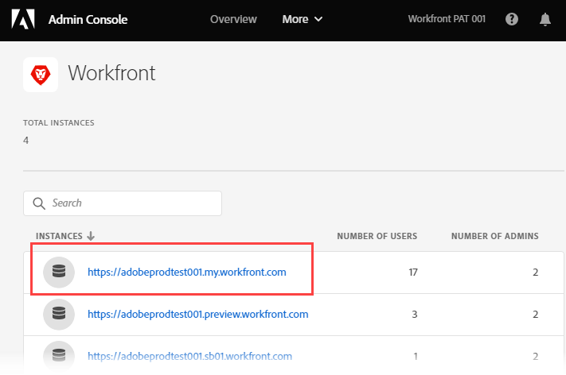

# Administración de usuarios en Adobe Admin Console

<!--The highlighted information on this page refers to functionality not yet generally available. It is available only in the Preview environment for all customers. After the monthly releases to Production, the same features are also available in the Production environment for customers who enabled fast releases.    

For information about fast releases, see [Enable or disable fast releases for your organization](/help/quicksilver/administration-and-setup/set-up-workfront/configure-system-defaults/enable-fast-release-process.md). -->

>[!IMPORTANT]
>
>La funcionalidad de este artículo solo está disponible si la instancia de Workfront de su organización se ha incorporado a Adobe Business Platform.
>
>Para obtener una lista de procedimientos que difieren según si su organización se ha incorporado a Adobe Business Platform, consulte [Diferencias de administración basadas en la plataforma (Adobe Workfront/Adobe Business Platform)](../../../administration-and-setup/get-started-wf-administration/actions-in-admin-console.md).

Como administrador de Adobe, puede crear administradores del sistema de Adobe Workfront con Adobe Admin Console. La consola es una ubicación central para administrar las autorizaciones de Adobe en toda la organización. Para obtener más información, consulte [Información general de Admin Console](https://helpx.adobe.com/es/enterprise/using/admin-console.html).

>[!NOTE]
>
>* **Los administradores de Workfront deben estar configurados en Adobe Admin Console.** Para obtener información e instrucciones, consulte [Crear administradores de sistemas en Workfront con Adobe Admin Console](#create-system-administrators-in-workfront-with-the-adobe-admin-console) en este artículo.
>* **Si su organización utiliza el inicio de sesión único (SSO)**, le recomendamos que cree usuarios y los asigne a Workfront en Adobe Admin Console. Es posible crear estos usuarios en Workfront, pero puede haber problemas para transferir esa información a Adobe Admin Console, según la configuración de Admin Console de su organización.
>  &#x200B;>   Después de crear el usuario en Adobe Admin Console, puede configurar su información en Workfront, como la asignación de funciones, grupos, equipos y niveles de acceso.
>* **Si su organización no utiliza el inicio de sesión único (SSO)**, puede agregar usuarios que no sean administradores del sistema directamente en Workfront. Es posible añadir usuarios en Adobe Admin Console, pero añadirlos en Workfront le permite establecer su nivel de acceso mientras los crear, lo que le puede ahorrar tiempo.

Al realizar cambios en los perfiles de los usuarios desde Admin Console, se agrega una actualización a la pestaña Actividad del sistema del usuario en Workfront. La actualización se muestra tal y como la realizó el &quot;Sistema&quot;. Hace referencia al administrador de Adobe Admin Console y no al administrador principal de Workfront.

## Requisitos de acceso

+++ Expanda para ver los requisitos de acceso para la funcionalidad en este artículo.

Debe tener el siguiente acceso para realizar los pasos de este artículo:

<table style="table-layout:auto"> 
 <col> 
 </col> 
 <col> 
 </col> 
 <tbody> 
  <tr> 
   <td role="rowheader">Plan de Adobe Workfront</td> 
   <td>Cualquiera</td> 
  </tr> 
  <tr> 
   <td role="rowheader">Derechos de administrador de Adobe</td> 
   <td> 
Debe ser administrador de perfil de producto de productos de Adobe para su organización
 </td> 
  </tr> 
 </tbody> 
</table>

Para obtener más información sobre esta tabla, consulte [Requisitos de acceso en la documentación de Workfront](/help/quicksilver/administration-and-setup/add-users/access-levels-and-object-permissions/access-level-requirements-in-documentation.md).

+++

## Requisitos previos

Antes de usar Admin Console para Workfront, debería recibir un correo electrónico que le invite a la consola.

1. Si es su primera vez en Adobe y ha recibido un correo electrónico que le informa de que ahora tiene derechos de administración para administrar el software y los servicios de Adobe para su organización, haga clic en el botón del correo electrónico para crear una cuenta de Adobe y abrir Admin Console.

   O

   Si ya tiene una cuenta de Adobe, vaya a la [página de Adobe Admin Console](https://adminconsole.adobe.com/).

## Detalles adicionales sobre Adobe Admin Console

* Los administradores del sistema de Workfront pueden desactivar un usuario de Workfront desde Workfront, pero esto no desactiva el usuario en Admin Console.

  <!--
  
For information about deactivating a user in Workfront, see 

  -->

* El usuario **Grupo de inicio** se determina según el usuario que los creó. Esto no se puede personalizar desde Admin Console.
* El nivel de acceso de administrador del sistema de Workfront solo se puede editar desde Adobe Admin Console.

  <!--
  DRAFTED IN FLARE:
  How is this done?
  
  -->

* El cambio del acceso de un usuario de Administrador del sistema a cualquier otro nivel de acceso debe realizarse primero a través de Admin Console.

  <!--
   This is not clear
  -->

* Para quitar el acceso de administrador del sistema a un usuario en Workfront, debe utilizar Adobe Admin Console para quitar el usuario como administrador de perfil de producto. Esto cambia el nivel de acceso de Workfront del usuario de Administrador del sistema a Solicitante.

  >[!IMPORTANT]
  >
  >No realice ningún cambio en el propio perfil del producto.

* Los administradores de Adobe Admin Console pueden configurar reglas de asignación automáticas para automatizar el proceso de asignación de productos de Adobe a los usuarios de su organización. Su organización debe migrarse a la experiencia unificada de Adobe para utilizar esta funcionalidad. Para obtener más información e instrucciones, consulte [Administrar reglas de asignación automática](https://helpx.adobe.com/enterprise/using/automatic-assignment-rules.html) en la documentación de Adobe.

  >[!NOTE]
  >
  >Si selecciona una organización de confianza al configurar asignaciones automáticas, la organización se encuentra en el área Usuarios en directorios o dominios seleccionados. Haga clic en la flecha desplegable junto al campo **Seleccionar directorio** y seleccione las organizaciones. Las organizaciones de confianza están marcadas con un distintivo de confianza.

## Acceda al área de usuario y administración para la instancia de producción de Workfront {#access-the-user-and-admin-area-for-your-production-instance-of-workfront}

1. En la [página de Adobe Admin Console](https://adminconsole.adobe.com/), seleccione la ficha **Productos** en la barra de navegación superior y, a continuación, seleccione **Workfront**.

   <!---->

1. En la lista que se muestra, seleccione el vínculo en la parte superior.

   Esta es la instancia de producción en la que trabajan los usuarios.

   <!---->

   >[!TIP]
   >
   >El segundo vínculo de la lista, la instancia de vista previa, es un entorno de prueba que replica el entorno de producción activo. Para obtener más información, consulte [Entorno de la zona protegida de previsualización de Adobe Workfront](../../../administration-and-setup/set-up-workfront/workfront-testing-environments/wf-preview-sandbox-environment.md).
   >
   >
   >También puede ver vínculos a entornos de zona protegida en la lista. Para obtener más información, consulte [Entorno de la zona protegida de previsualización de Adobe Workfront](../../../administration-and-setup/set-up-workfront/workfront-testing-environments/wf-preview-sandbox-environment.md).

1. En la lista que se muestra, con la ficha **Perfiles de producto** seleccionada, haga clic en el nombre del vínculo Perfil de producto de Workfront.

   

   Esta lista incluye todos los usuarios que ya están asignados a la instancia de producción de Workfront.

   >[!IMPORTANT]
   >
   >No realice ningún cambio en el propio perfil del producto.

1. Continúe con una de las siguientes secciones de este artículo:

   * [Crear usuarios en Workfront con Adobe Admin Console](#create-users-in-workfront-with-the-adobe-admin-console)
   * [Creación de administradores de sistemas en Workfront con Adobe Admin Console](#create-system-administrators-in-workfront-with-the-adobe-admin-console)

## Creación de administradores de sistemas en Workfront con Adobe Admin Console {#create-system-administrators-in-workfront-with-the-adobe-admin-console}

<!--Audited: 12/2023-->

El nivel de acceso de administrador del sistema solo se concede en Adobe Admin Console. No puede conceder ni eliminar el acceso de administrador desde Workfront.

Debe agregar un usuario a la instancia de producción de Workfront para poder hacerlo administrador del sistema de Workfront.

1. Vaya al área de usuario y administración en Admin Console, tal como se describe en la sección [Acceda al área de usuario y administración para su instancia de producción de Workfront](#access-the-user-and-admin-area-for-your-production-instance-of-workfront) en este artículo.
1. Seleccione la ficha **Administradores** situada encima de la lista de usuarios.
1. Seleccione **Agregar administrador**.
1. En el cuadro **Agregar administradores de perfil de producto**, escriba las direcciones de correo electrónico o los nombres de los administradores que desea agregar y, a continuación, seleccione **Guardar**.

   

   Los administradores del sistema se crean en Workfront.

   >[!IMPORTANT]
   >
   >* No realice ningún cambio en el propio perfil del producto.
   >* Asegúrese de que se encuentra en la página con el encabezado &quot;Agregar administradores de perfil de producto&quot;. Los administradores de productos desempeñan una función diferente a los administradores de perfil de productos en Adobe Admin Console y no se analiza en este artículo.

## Creación de usuarios en Workfront con Adobe Admin Console {#create-users-in-workfront-with-the-adobe-admin-console}

>[!NOTE]
>
>Recomendamos añadir usuarios que no sean administradores del sistema directamente en Workfront. Es posible añadir usuarios en Adobe Admin Console, pero añadirlos en Workfront le permite establecer su nivel de acceso mientras los crear, lo que le puede ahorrar tiempo.

* [Cree usuarios en Workfront directamente en Adobe Admin Console](#create-users-in-workfront-directly-in-the-adobe-admin-console)
* [Cree usuarios en Workfront y apruébelos en Adobe Admin Console](#create-users-in-workfront-and-approve-them-for-the-adobe-admin-console)

### Cree usuarios en Workfront directamente en Adobe Admin Console

1. Vaya al área de usuario y administración en Admin Console, tal como se describe en la sección [Acceda al área de usuario y administración para su instancia de producción de Workfront](#access-the-user-and-admin-area-for-your-production-instance-of-workfront) en este artículo.
1. Con la ficha **Usuarios** seleccionada encima de la lista, seleccione **Agregar usuario**.
1. En el cuadro **Agregar usuarios a este perfil de producto**, escriba la dirección de correo electrónico o el nombre del usuario que desea agregar y, a continuación, seleccione **Guardar**.

   El usuario se crea en Workfront con el nivel de acceso de Solicitante o Colaborador, según el paquete de Workfront de su organización.

   >[!IMPORTANT]
   >
   >No realice ningún cambio en el propio perfil del producto.

1. En Workfront, cambie el nivel de acceso del usuario.

   Para obtener instrucciones sobre cómo un administrador de Workfront puede cambiar el nivel de acceso del usuario, consulte [Editar el perfil de un usuario](../../../administration-and-setup/add-users/create-and-manage-users/edit-a-users-profile.md).

1. Repita los pasos 3 y 4 para agregar más usuarios.

   >[!NOTE]
   >
   >Para los nuevos usuarios de Adobe, Admin Console envía un correo electrónico para invitarlos a completar el proceso de registro. Todos los usuarios deben completar el proceso de registro para acceder a cualquier aplicación de Adobe.
   >
   >Para los usuarios de Adobe existentes, el usuario puede recibir o no un correo electrónico sobre la disponibilidad de Workfront. Es una preferencia controlada por el administrador de Adobe para el producto. El administrador de Adobe puede ser una persona diferente al administrador de Workfront.

### Cree usuarios en Workfront y apruébelos en Adobe Admin Console

Este flujo de trabajo permite a los administradores de grupos que no tienen acceso a Adobe Admin Console crear usuarios.

En primer lugar, el administrador del grupo crea el usuario en Workfront. Esto crea el usuario en estado Desactivado y Pendiente de aprobación.

A continuación, un administrador de Workfront aprueba al usuario. Esto activa al usuario en Workfront y lo añade a Adobe Admin Console.

#### Creación del usuario en Workfront (administrador de grupo)

Para obtener instrucciones sobre cómo crear un usuario en Workfront, consulte [Agregar usuarios](/help/quicksilver/administration-and-setup/add-users/create-and-manage-users/add-users.md).

#### Aprobación del usuario (administrador de Workfront)

Para aprobar un usuario:

{{step-1-to-users}}

1. Seleccione al usuario y luego haga clic en el icono **Más** .

1. Para aprobar al usuario, haz clic en **Aprobar** y luego haz clic en **Enviar**.

   O

   Para rechazar al usuario y eliminarlo de Workfront, haga clic en **Rechazar** y luego haga clic en **Enviar**.

   Los usuarios aprobados se añaden automáticamente a Adobe Admin Console.

   Los usuarios rechazados se eliminan automáticamente de Workfront.

## Editar usuarios existentes en Adobe Admin Console

Puede editar los siguientes detalles de usuario en Adobe Admin Console:

* Grupos de usuarios y productos asociados con el usuario
* Derechos administrativos
* País

Para obtener información sobre cómo editar un solo usuario en Adobe Admin Console, consulte [Editar detalles del usuario](https://helpx.adobe.com/enterprise/using/manage-users-individually.html#edit-user-details) en el artículo Administrar usuarios individualmente en la documentación de Adobe.

Para obtener información sobre la edición masiva de usuarios en Adobe Admin Console, consulte
[Editar detalles del usuario](https://helpx.adobe.com/enterprise/using/bulk-upload-users.html#edit-user-details) en el artículo Administrar varios usuarios en la documentación de Adobe.
<!--

&nbsp;

&nbsp;

&nbsp;

You can create Adobe Workfront users and system administrators with the <a href="https://adminconsole.adobe.com/" alt="Admin Console link">Adobe Admin Console</a>. The console is a central location for managing the Adobe entitlements across your organization. For more information, see the <a href="https://helpx.adobe.com/enterprise/using/admin-console.html" alt="Admin Console Overview">Admin Console Overview</a>.

Before using the Admin Console for Workfront, you should receive a receive an email inviting you to the console. Click in the invitation to accept it and create an account. You can also use an existing account, if already available.

<h2>Create users</h2>

Create users in WF with the Adobe admin console

-->

<!--

May need to add something about oging throug WF -- check with Jonah

To create users in Workfront with the Admin Console:

<ol>
<li value="1"> 
From the <a href="https://adminconsole.adobe.com/">Admin Console page</a>, select the <b>Products</b> tab and then select the <b>Workfront</b> product tile.
 </li>
<li value="2"> 
Select the link to the Workfront instance you want to change.
 </li>
<li value="3"> 
Select the Product profile link. This shows a list of the currently-assigned users. If the list is very long, you can also search for users in the search field above the list.
 </li>
<li value="4"> 
Select the <b>Add User</b> button.
 </li>
<li value="5"> 
In the <b>Add users</b> box, enter the email address or name of the user you want to add. Select <b>Save</b>. The administrator is created in Workfront with <b>Requestor</b> access level.
 </li>
</ol>
<h2>Create system administrators</h2>

To create system administrators:

<ol>
<li value="1"> 
Make product profile assignments first. To be a Workfront System Administrator, the user must be assigned the Workfront product profile and be an admin for that product profile.
 </li>
<li value="2"> 
From the console, select the <b>Products</b> tab and then select the <b>Admins</b> tab. 
 </li>
<li value="3"> 
Select <b>Add Admin</b>.
 </li>
<li value="4"> 
In the <b>Add product profile administrators</b> box, enter the email address or name of the administrator you want to add. Select <b>Save</b>. The user is created in Workfront with <b>Requestor</b> access level.
 </li>
</ol>
<h2>Additional details for the Admin Console</h2>
<ul>
<li> 
System Administrator access level is granted only on the Admin Console. You cannot grant or remove admin access from within Workfront.
 </li>
</ul>
<ul>
<li> 
Creating and deleting users inside Workfront is only possible through the Admin Console.
 </li>
<li> 
Workfront System Administrators can deactivate Workfront users from within Workfront, but this does not deactivate the user in the Admin Console.
 </li>
<li> 
All new users are are assigned <b>Requestor</b> access level upon creation. Also, the user <b>Home Group</b> is determined based on the user who created them. This is currently not customizable from within the Admin Console.
 </li>
<li> 
The Workfront System Administrator access level can only be edited from within the Adobe Admin Console.
 </li>
<li> 
Editing a user who is a system admin to any other access level must be done through the Admin Console first.
 </li>
<li> 
To remove Workfront system admin access, remove users as Product Profile Administrators. This action changes the user access level in Workfront from a system admin to a <b>Requestor</b>.
 </li>
</ul>

-->
