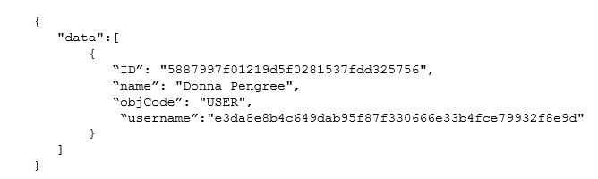

# Cambiar la contraseña de un usuario aprovisionado automáticamente

Cuando crea usuarios mediante el aprovisionamiento automático, Adobe Workfront les asigna un GUID (identificador único global) para un nombre de usuario. Un GUID es una cadena única de números aleatorios y letras, por ejemplo *5489cb430012526e1ea635e8c29f377f*.

A menudo, cuando un nuevo usuario intenta cambiar su contraseña temporal, introduce su dirección de correo electrónico para su nombre de usuario y recibe un error por un nombre de usuario incorrecto. Para que el usuario cambie su contraseña, debe introducir su nombre de usuario asignado por el sistema, que es un GUID.

Debido a que los nombres de usuario GUID pueden ser difíciles de usar, le recomendamos que cambie primero el nombre de usuario de un usuario a su dirección de correo de Workfront y que luego les permita cambiar su contraseña.

>[!TIP]
>
>Puede encontrar el GUID de un usuario de las siguientes maneras:
>
>* Vaya al perfil del usuario y copie el GUID de la dirección URL en el explorador.
>
>  Por ejemplo, en la dirección URL `https://acme.workfront.com/user/61941ab1000af22d7104628efa1c738b/details`, copiaría la cadena de números y letras entre las dos últimas barras diagonales: `61941ab1000af22d7104628efa1c738b`.
>
>  Para obtener más información, consulte [Edición del perfil de un usuario](../../../administration-and-setup/add-users/create-and-manage-users/edit-a-users-profile.md).
>
>* Cree un informe de usuario con una columna Usuario > GUID . Para obtener más información, consulte [Crear un informe](../../../reports-and-dashboards/reports/creating-and-managing-reports/create-report.md).
>
>* Consulte la API de Workfront.
>


## Requisitos de acceso

Debe tener el siguiente acceso para realizar los pasos de este artículo:

<table style="table-layout:auto"> 
 <col> 
 <col> 
 <tbody> 
  <tr> 
   <td role="rowheader">plan de Adobe Workfront</td> 
   <td>Cualquiera</td> 
  </tr> 
  <tr> 
   <td role="rowheader">Licencia de Adobe Workfront</td> 
   <td>Plan</td> 
  </tr> 
  <tr> 
   <td role="rowheader">Configuraciones de nivel de acceso</td> 
   <td> <p>Debe ser administrador de Workfront.</p> <p><b>NOTA</b>: Si todavía no tiene acceso, pregunte a su administrador de Workfront si establece restricciones adicionales en su nivel de acceso. Para obtener información sobre cómo un administrador de Workfront puede modificar su nivel de acceso, consulte <a href="../../../administration-and-setup/add-users/configure-and-grant-access/create-modify-access-levels.md" class="MCXref xref">Crear o modificar niveles de acceso personalizados</a>.</p> </td> 
  </tr> 
 </tbody> 
</table>

## Cambiar la contraseña de un usuario aprovisionado automáticamente

1. Determine el nombre de usuario GUID de un usuario pasando una solicitud de API, como se muestra en el siguiente ejemplo:

   https://`<domain>`.my.workfront.com/attask/api/v14.0/USER/search?fields=username&amp;ID=`<ID of User>` Donde *`<domain>`* es el dominio de su empresa y *`<ID of User>`* es el Workfront ID del usuario.

   Recibe una respuesta similar a la siguiente:

   

   El retorno de &quot;username&quot; es el GUID del usuario.

1. Con su GUID como nombre de usuario, cambie la contraseña del usuario.

   Para obtener más información sobre cómo cambiar la contraseña, consulte [Restaurar la contraseña](../../../workfront-basics/manage-your-account-and-profile/managing-your-workfront-account/reset-your-password.md).

   Si su organización utiliza un sistema SSO, solo un administrador del sistema de Workfront puede cambiar la contraseña de un usuario. Para obtener más información, consulte [Información general sobre el inicio de sesión único en Adobe Workfront](../../../administration-and-setup/add-users/single-sign-on/sso-in-workfront.md)

1. Con el usuario que ha iniciado sesión en Workfront, vaya a:

```
   https://<your domain>.my.workfront.com/login/convertUsername
```

1. En el **Su dirección de correo electrónico de inicio de sesión** , compruebe que la dirección de correo electrónico del usuario es correcta y, a continuación, haga clic en **Actualizar cuenta**.

   

   El nombre de usuario del usuario se cambia a su dirección de correo electrónico de Workfront.

>[!TIP]
>
>Para encontrar el ID de un usuario:
>
>1. Haga clic en el **Menú principal** icono  en la esquina superior derecha de Adobe Workfront, haga clic en **Usuarios** .
>
>1. Seleccione el usuario.
>
>   Se abre la página de perfil del usuario y su ID de usuario se muestra en la dirección URL.
