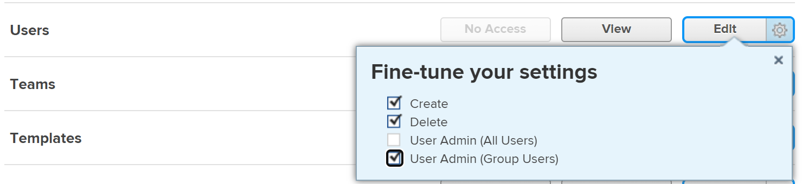

# Editar el perfil de un usuario

{{highlighted-preview}}

<!--

>[!IMPORTANT]
>
>The procedure described on this page applies only to organizations that have not yet been onboarded to the Admin Console. If your organization has been onboarded to the Adobe Admin Console, you must perform this action through the Adobe Admin Console.
>
>For instructions on editing a user's profile in the Adobe Admin Console, see the section "Edit user details" in the article [Manage users individually](https://helpx.adobe.com/enterprise/using/manage-users-individually.html) or contact your Adobe Admin Console Administrator.
>
>For a list of procedures that differ based on whether your organization has been onboarded to the Adobe Admin Console, see [Platform-based administration differences (Adobe Workfront/Adobe Business Platform)](../../../administration-and-setup/get-started-wf-administration/actions-in-admin-console.md).
-->

Como administrador de Adobe Workfront, puede crear usuarios y administrar los perfiles de los existentes. Para obtener información sobre cómo crear usuarios, consulte [Añadir usuarios](../../../administration-and-setup/add-users/create-and-manage-users/add-users.md).

Para obtener información acerca de los usuarios que actualizan sus propios perfiles, vea [Configurar mis opciones](/help/quicksilver/workfront-basics/manage-your-account-and-profile/configuring-your-user-profile/configure-my-settings.md).

## Requisitos de acceso

+++ Expanda para ver los requisitos de acceso para la funcionalidad en este artículo.

Debe tener el siguiente acceso para realizar los pasos de este artículo:

<table style="table-layout:auto"> 
 <col> 
 <col> 
 <tbody> 
  <tr> 
   <td role="rowheader">Plan de Adobe Workfront</td> 
   <td>Cualquiera</td> 
  </tr> 
  <tr> 
   <td role="rowheader">Licencia de Adobe Workfront</td> 
   <td>
Nuevo: estándar

O

Actual: plan
</td> 
  </tr> 
  <tr> 
   <td role="rowheader">Configuraciones de nivel de acceso</td> 
   <td> 
Debe tener uno de los siguientes elementos:
 
    <ul> 
     <li> 
El nivel de acceso del administrador del sistema. </li> 
     <li> 
Configuración de <b>usuarios</b> en su nivel de acceso configurado para el acceso de <b>Edición</b>, con <b>Crear</b> y al menos una de las dos opciones de <b>Administrador de usuarios</b> habilitadas en <b>Ajustar la configuración</b> . 
 
De estas dos opciones, si <b>Administrador de usuarios (usuarios de grupo)</b> está habilitado, debe ser administrador de grupo de un grupo al que pertenezca el usuario.
 </li> 
    </ul> </td> 
  </tr> 
 </tbody> 
</table>

Para obtener más información sobre el contenido de esta tabla, consulte [Requisitos de acceso en la documentación de Workfront](/help/quicksilver/administration-and-setup/add-users/access-levels-and-object-permissions/access-level-requirements-in-documentation.md).

+++

## Editar el perfil de un usuario

{{step-1-to-users}}

1. Seleccione al usuario y luego haga clic en el icono **Editar** .

   Aparece el cuadro Editar usuario.

1. En el cuadro **Editar usuario**, cambie la información en cualquiera de las secciones y haga clic en **Guardar** en cualquier momento.

### Información personal

* **Nombre**
* **Apellido**

  >[!NOTE]
  >
  >La edición del nombre de un usuario en Workfront no edita el nombre del usuario en Adobe Admin Console.

* **Dirección de correo electrónico**: La dirección de correo electrónico de un usuario también es su nombre de usuario en Workfront. Este campo distingue entre mayúsculas y minúsculas y debe ser único. Si algún usuario intenta añadir una dirección de correo electrónico no única tres veces en un intervalo de 10 minutos, aparecerá una respuesta reCAPTCHA.

  Seleccione el ajuste **No soy un robot** antes de continuar.

  Si utiliza la lista de permitidos de correo electrónico e introduce un dominio de correo electrónico que no aparece en la lista, el usuario no recibirá notificaciones por correo electrónico. Para obtener más información sobre la lista de permitidos, consulte [Configuración de la lista de permitidos de correo electrónico](/help/quicksilver/administration-and-setup/get-started-wf-administration/configure-your-email-allowlist.md).

  Si su organización se ha migrado a Adobe Admin Console, no puede editar la dirección de correo electrónico de un usuario en Workfront. La dirección de correo electrónico del usuario se establece en Adobe Admin Console.

* **Cambiar contraseña**: haga clic en este botón para restablecer la contraseña del usuario. Debe introducir su propia contraseña para poder restablecer la contraseña de otro usuario.

  Para restablecer la contraseña de otro usuario, debe ser administrador de Workfront o de grupos.

  Si es administrador de grupos, solo puede restablecer las contraseñas de los usuarios de los grupos para los que haya sido designado administrador. Además, el permiso de administrador de usuarios (usuarios de grupo) debe estar habilitado en su nivel de acceso:

  

  Esta opción está desactivada de forma predeterminada. Para obtener más información, consulte [Creación o modificación de niveles de acceso personalizados](/help/quicksilver/administration-and-setup/add-users/configure-and-grant-access/create-modify-access-levels.md).

  No puede restablecer la contraseña de un administrador de Workfront.

<!--
* **&lt;SSO Configuration&gt; Username**: If your Workfront administrator enabled an SSO integration with Workfront, the SSO Username displays in this field. The type of SSO configuration enabled for your Workfront instance is visible in this field.
* **OnlyAllow &lt;SSO Configuration&gt; Authentication**: If your Workfront administrator enabled an SSO integration with Workfront and has updated all users for SSO, this field is selected by default. The type of SSO configuration enabled for your Workfront instance is visible in this field.
  
  When this field is selected, the user is required to log into Workfront with their SSO credentials. Unchecking it will allow them to log in to Workfront with their Workfront credentials.

  For more information about configuring Workfront with an SSO solution, see [Overview of single sign-on in Adobe Workfront](/help/quicksilver/administration-and-setup/add-users/single-sign-on/sso-in-workfront.md).

  For more information about updating users for SSO, see [Update users for single sign-on](/help/quicksilver/administration-and-setup/add-users/single-sign-on/update-users-sso.md).

  >[!NOTE]
  >
  >If you are a group administrator, you can edit the &lt;SSO Configuration&gt; fields only for users in the groups where you are designated as such. Also, the User Admin (Group Users) permission must be enabled in your access level.
  >
  >If you are a group administrator and you have the User Admin (All Users) permission enabled in your access level, you can edit the &lt;SSO Configuration&gt; fields for all users.
-->

* **Foto de perfil**: Haz clic en **Cargar nuevo** para cargar la imagen de perfil del usuario. Puede cargar un archivo JPG, GIF o PNG. El límite de tamaño de archivo es de 4 MB.

  La imagen de perfil se convierte en el avatar del usuario y es visible en todo el sistema Workfront, independientemente de dónde se muestre el nombre del usuario.

* **Información del trabajo**: Información sobre el trabajo, como el cargo (en el campo **Título**) y de qué área de experiencia es responsable el usuario (en el campo **Háblame de**).
* **Información de contacto**: Número de teléfono del usuario (en el **Número de teléfono**, **Ext.** y **campos Número móvil**) y dirección (en los campos **Dirección**, **Ciudad**, **Estado**, **Código postal** y **País**).

  Si el usuario está habilitado para Unified User Management (UUM) o Adobe Identity Management System (IMS), el campo **País** de la sección Información de contacto solo acepta valores de código de país (por ejemplo, EE. UU., GB, IN).

### Preferencias

* **Zona horaria**: La zona horaria del usuario.

  Para obtener información acerca de cómo ayudar a los usuarios a colaborar en Workfront en diferentes zonas horarias, consulte [Trabajar en diferentes zonas horarias](/help/quicksilver/workfront-basics/tips-tricks-and-troubleshooting/working-across-timezones.md).

* **Configuración regional del correo electrónico**: la configuración regional de correo electrónico preferida del usuario. Esto afecta al formato de los números y de las fechas de los correos electrónicos que llegan desde Workfront a este usuario.

  >[!NOTE]
  >
  >Cuando su organización se encuentra en la experiencia unificada de Adobe, las preferencias de idioma del usuario se almacenan en su perfil de Adobe y no se utiliza la configuración regional del correo electrónico. Para obtener información sobre el acceso a estas preferencias, consulte [Experiencia unificada de Adobe para Workfront](/help/quicksilver/workfront-basics/navigate-workfront/workfront-navigation/adobe-unified-experience.md).

* **Recibir correos electrónicos de este entorno de prueba**: marque esta opción si desea recibir notificaciones por correo electrónico del entorno en el que ha iniciado sesión.

  >[!NOTE]
  >
  >Esta actualización solo está disponible en los entornos de vista previa y zona protegida. Las notificaciones por correo electrónico están habilitadas en el entorno de producción de forma predeterminada.

<!--* **Automatically set the task status to In Progress when tasks are self-assigned**: When this option is selected, work that the user self-assigns is automatically set to In Progress status instead of New.-->

<!--**Send work I assign to myself to my Working On tab**: This setting refers to a deprecated feature that has been removed from Workfront.-->

* **Generar revisiones automáticamente al cargar documentos**: marque esta opción si quiere que los documentos que el usuario carga generen inmediatamente una revisión.

### Notificaciones

Seleccione las notificaciones por correo electrónico que deben habilitarse para el nuevo usuario.

Puede seleccionar notificaciones de resumen instantáneas y diarias.

Para obtener más información, consulte [Configurar notificaciones de eventos para todos los usuarios del sistema](/help/quicksilver/administration-and-setup/manage-workfront/emails/configure-event-notifications-for-everyone-in-the-system.md).

### Acceso

* **El usuario está activo**: Habilite esta opción para indicar que el usuario está activo.  Los usuarios activos utilizan una licencia de Workfront. Al deshabilitar el campo, se desactiva el usuario y se impide que inicie sesión en Workfront.

* **Nivel de acceso**: seleccione el nivel de acceso que desea asignar a este usuario.

  Al asignar un nivel de acceso a un usuario, puede asignar un nivel igual o inferior al suyo propio. (Por ejemplo, si el nivel de acceso es Estándar, no puede asignar el nivel de acceso Administrador.)

  Sin embargo, no puede asignar un nivel de acceso que, de forma predeterminada, sea inferior a su propio nivel de acceso si el administrador de Workfront ha habilitado permisos no predeterminados en el nivel de acceso que no están habilitados también en su propio nivel de acceso.

  Por ejemplo, si tiene una licencia estándar sin acceso para eliminar tareas, no puede asignar a alguien una licencia básica con acceso para eliminar tareas, aunque la licencia básica sea inferior a la licencia estándar. Para obtener más información, consulte [Creación o modificación de niveles de acceso personalizados](/help/quicksilver/administration-and-setup/add-users/configure-and-grant-access/create-modify-access-levels.md).

  Para obtener más información sobre los niveles de acceso, consulte [Configurar el acceso a Adobe Workfront](/help/quicksilver/administration-and-setup/add-users/configure-and-grant-access/configure-access.md).

  >[!NOTE]
  >
  >Si su organización utiliza el nuevo modelo de acceso (Standard/Light/Contributor), no puede reasignar un usuario Standard o Light a un nivel de acceso Contributor si dicho usuario ya ha alcanzado su límite de decisiones del mes.
  >
  >Para obtener más información sobre el nuevo modelo de acceso, consulte [Información general sobre los nuevos niveles de acceso](/help/quicksilver/administration-and-setup/add-users/how-access-levels-work/access-level-overview.md).
  >
  >Para obtener información sobre los límites de decisión, consulte [información general sobre decisiones limitadas de documentos y de la revisión para usuarios sin pago](/help/quicksilver/review-and-approve-work/proof-doc-decision-limits.md).

* **Plantilla de diseño**: elija una plantilla de diseño para el usuario. esta plantilla de diseño tiene prioridad sobre cualquier plantilla de diseño asignada al grupo de inicio, al equipo de inicio o a la función principal del usuario. Para obtener más información acerca de la prioridad de asignación de las plantillas de diseño, vea [Crear y administrar plantillas de diseño](/help/quicksilver/administration-and-setup/customize-workfront/use-layout-templates/create-and-manage-layout-templates.md).

  La siguiente lista describe cómo la lista de plantillas disponibles en este campo depende de su acceso:

   * Como administrador de Workfront, puede ver todas las plantillas de diseño de nivel de sistema y de grupo.
   * Como administrador de grupos, puede ver la plantilla de diseño de nivel de sistema, así como las asociadas con los grupos que administra.
   * Como usuario con una licencia estándar o de planificación y acceso para editar usuarios, solo puede ver plantillas de diseño de nivel de sistema.

     Para obtener más información acerca de las plantillas de diseño de nivel de grupo, vea [Crear y modificar plantillas de diseño de un grupo](/help/quicksilver/administration-and-setup/manage-groups/work-with-group-objects/create-and-modify-a-groups-layout-templates.md).

### Organización

* **Compañía**: la compañía del usuario. Los usuarios solo pueden asociarse con una compañía. Debe crear una compañía antes de poder asociarla a un usuario. En la lista solo se muestran las compañías activas. Para obtener información acerca de cómo crear compañías, consulte [Crear y editar compañías](/help/quicksilver/administration-and-setup/set-up-workfront/organizational-setup/create-and-edit-companies.md).
* **Informa a**: si especificó una compañía para el usuario, también puede especificar el administrador directo del usuario en este campo. Un usuario solo puede tener un administrador. Este campo no se muestra si el usuario no está asociado primero con una compañía.
* **Subordinados directos**: Si especificó una compañía para el usuario, también puede especificar los subordinados directos del usuario. Un usuario puede tener varios informes directos. Este campo no se muestra si el usuario no está asociado primero con una compañía.
* **Equipo de inicio**: especifique el equipo de inicio del usuario. Los usuarios solo pueden tener un equipo de inicio. El equipo de inicio es importante a la hora de asignar una plantilla de diseño o al definir el botón Trabajar en ello para las tareas y problemas asignados al usuario.
* **Otros equipos**: los usuarios pueden pertenecer a varios equipos. Un usuario puede ver los elementos de trabajo asignados a cualquiera de sus equipos en el área de Inicio.
* **Grupo de inicio actual**: seleccione un grupo apropiado para asignar al usuario. Esto ofrece al usuario la posibilidad de acceder a los objetos compartidos con el grupo. También puede compartir plantillas de diseño con el grupo de inicio del usuario.

  Este campo es obligatorio. Todos los usuarios deben estar asociados a un grupo de inicio. Si no selecciona uno, el grupo de inicio se asignará como el grupo de inicio del nuevo usuario.

  Puede asignar un grupo a un usuario solo si se cumple una de las siguientes condiciones:

   * es administrador de Workfront
   * es el administrador del grupo
   * el grupo es público

* **Otros grupos**: los usuarios pueden pertenecer a varios grupos. Solo puede asignar un grupo a un usuario si es administrador de Workfront, si es el administrador de grupos o si el grupo es público.

  >[!IMPORTANT]
  >
  >Añadir un usuario a más de 100 grupos puede causar problemas de rendimiento en cualquier área de Workfront que cargue la lista de grupos.

  Para obtener más información sobre los grupos públicos, consulte [Crear un grupo](/help/quicksilver/administration-and-setup/manage-groups/create-and-manage-groups/create-a-group.md).

  Para obtener más información sobre los grupos, consulte [Información general sobre los grupos](/help/quicksilver/administration-and-setup/manage-groups/groups-overview/groups.md).

### Planificación de recursos

* **Tiempo de trabajo**: representa el porcentaje del tiempo Equivalente a jornada completa (EJC) que el usuario está disponible para el trabajo real, sin incluir los gastos generales. El tiempo de trabajo debe ser un número decimal de hasta 1 y no puede ser 0. Por ejemplo, una disponibilidad del 20% para el trabajo real sería de 0,2.

  El valor predeterminado del campo es 1, lo que indica que un usuario emplea todo su FTE en trabajo real relacionado con el proyecto.

  El sistema utiliza este número para calcular la disponibilidad del usuario para el trabajo real relacionado con el proyecto.

  Para obtener más información sobre cómo crear programaciones en Workfront, consulte [Crear programación](/help/quicksilver/administration-and-setup/set-up-workfront/configure-timesheets-schedules/create-schedules.md).

  Las excepciones de programación y los días libres también pueden afectar a la capacidad del usuario.

  Workfront calcula la disponibilidad de un usuario según las preferencias de Administración de recursos del área de Configuración. Para obtener más información, consulte [Configurar preferencias de administración de recursos](/help/quicksilver/administration-and-setup/set-up-workfront/configure-system-defaults/configure-resource-mgmt-preferences.md).

  >[!TIP]
  >
  >Establezca el valor Tiempo de trabajo en 1 para indicar que el usuario está disponible para el trabajo relacionado con el proyecto en su equivalente a jornada completa

* **Establecer fecha de desactivación**: haga clic en este botón si desea programar la desactivación de este usuario en una fecha y a una hora determinadas.
* **Fecha de desactivación**: La fecha y hora en que se desactiva el usuario. Para obtener información sobre cómo programar usuarios para la desactivación, consulte [Programar usuarios para la desactivación](/help/quicksilver/administration-and-setup/add-users/create-and-manage-users/deactivate-a-user.md#schedule-users-for-deactivation) en [Desactivar o reactivar un usuario](/help/quicksilver/administration-and-setup/add-users/create-and-manage-users/deactivate-a-user.md).
* **Función principal**: la función principal que el usuario puede cumplir en Workfront. Todas las tareas y problemas que se le asignan al usuario también se asignan a esta función. Las funciones de trabajo son esenciales en la administración de recursos. Solo puede actualizar este campo si dispone de una licencia Standard o Plan con acceso de usuario administrativo o si es administrador de Workfront. Para obtener más información sobre la configuración de usuarios con acceso de usuario administrativo, consulte [Conceder acceso a usuarios](/help/quicksilver/administration-and-setup/add-users/configure-and-grant-access/grant-access-other-users.md).

  En la lista solo se muestran las funciones activas.

* (Condicional) Si seleccionó una **Función principal**, se muestra el campo **Porcentaje de disponibilidad de FTE**. Especifique qué porcentaje de tiempo de la programación del usuario se asigna a esta función. El valor predeterminado para el porcentaje de disponibilidad de FTE para la función principal es 100%.
* **Otras funciones**: un usuario puede tener varias funciones en Workfront. Las funciones de trabajo son esenciales en la administración de recursos. No hay límite en cuanto a las funciones que puede desempeñar un usuario. Sin embargo, se recomienda no asignar un usuario a un número excesivamente elevado de funciones del puesto, ya que la administración de recursos podría resultar demasiado compleja para estos usuarios.

  En la lista solo se muestran las funciones activas. Para obtener más información sobre las funciones, consulte [Crear y administrar funciones](/help/quicksilver/administration-and-setup/set-up-workfront/organizational-setup/create-manage-job-roles.md).

  Solo puede actualizar este campo si dispone de una licencia Standard o Plan con acceso de usuario administrativo o si es administrador de Workfront.

  Para obtener más información sobre la configuración de usuarios con acceso de usuario administrativo, consulte [Conceder acceso a los usuarios](/help/quicksilver/administration-and-setup/add-users/configure-and-grant-access/grant-access-other-users.md).

* (Condicional) Si ha seleccionado una o varias **Otras funciones**, se muestra el campo **Porcentaje de disponibilidad de FTE** para cada función. Especifique qué porcentaje de tiempo de la programación del usuario se asigna a cada función. El valor predeterminado para el porcentaje de disponibilidad de FTE para las otras funciones es 0 %.

  Si otras funciones tienen una disponibilidad de FTE del 0 %, no se muestran en el Planificador de recursos, a menos que los usuarios estén asignados a tareas de estas funciones.

  

  La suma de todos los **porcentajes de disponibilidad de FTE** para todas las funciones debe ser igual a 100 %. Cada porcentaje de disponibilidad de FTE calcula las horas disponibles para cada función por usuario en el Planificador de recursos. Las horas disponibles para cada función por usuario dependen del tiempo disponible para el usuario.

  Workfront calcula el tiempo disponible para el usuario según el método que haya seleccionado el administrador de Workfront para calcular el valor de FTE en las Preferencias de administración de recursos.

  Para obtener información acerca de cómo calcular la disponibilidad del usuario, vea [Información general sobre el cálculo de horas y FTE para usuarios y roles en el Planificador de recursos](/help/quicksilver/resource-mgmt/resource-planning/calculate-hours-fte-for-users-roles-resource-planner.md).

  Para obtener información acerca de cómo configurar las preferencias de Administración de recursos, vea [Configurar las preferencias de Administración de recursos](/help/quicksilver/administration-and-setup/set-up-workfront/configure-system-defaults/configure-resource-mgmt-preferences.md).

  (Opcional) Las asignaciones de funciones en vigor por fecha se utilizan en los cálculos financieros si la función de funciones del usuario cambia durante un proyecto.

  Haga clic en **Definir roles por fecha**, seleccione el **Rol principal** y **Otros roles** e introduzca el porcentaje de asignación para cada rol. Las funciones podrían ser las mismas que las funciones existentes (con porcentajes diferentes) o que las nuevas funciones. Seleccione la fecha de inicio en la que se activarán estos roles. Esta puede ser una fecha futura. Cuando se activen las funciones más recientes, puede hacer clic en **Mostrar funciones anteriores** para ver las funciones anteriores e inactivas.

* **Horario**: asocie un horario al usuario. La programación del usuario calcula la cronología de las tareas que se le asignan.

  Debe crear una programación para poder asociarla a un usuario. Para obtener más información acerca de cómo crear programaciones, vea [Crear una programación](/help/quicksilver/administration-and-setup/set-up-workfront/configure-timesheets-schedules/create-schedules.md).

  >[!NOTE]
  >
  >Le recomendamos que la programación que asocie con el usuario coincida con la zona horaria del usuario.

  >[!IMPORTANT]
  >
  >Workfront usa la programación de un usuario solamente cuando la opción **Calcular disponibilidad de recursos usando** está establecida en **La programación del usuario**. Para obtener información acerca de cómo afecta esta configuración a la programación que se usa para la administración de recursos, vea [Configurar las preferencias de administración de recursos](/help/quicksilver/administration-and-setup/set-up-workfront/configure-system-defaults/configure-resource-mgmt-preferences.md).

* **Perfil de plantilla de horas**: asocie un perfil de plantilla de horas con el usuario para garantizar que las plantillas de horas se generen automáticamente para el usuario.

  La lista de perfiles disponibles en este campo depende de su acceso:

   * Como administrador de Workfront, puede ver todos los perfiles de plantilla de horas a nivel del sistema y de grupo.
   * Como administrador de grupos, puede ver perfiles de plantillas de horas de nivel del sistema, así como los asociados con los grupos que administra.
   * Como usuario con una licencia estándar o de planificación y acceso para editar usuarios, solo puede ver perfiles de hojas de horas en el sistema. Para obtener más información sobre los perfiles de plantilla de horas de nivel de grupo, consulte [Crear, editar y asignar perfiles de plantilla de horas](/help/quicksilver/timesheets/create-and-manage-timesheets/create-timesheet-profiles.md).

* **Tipo de hora predeterminado**: seleccione el tipo de hora predeterminado para el usuario. Es el tipo de hora que se utiliza de forma predeterminada cuando el usuario registra la hora.
* **Tipos de horas disponibles**: seleccione los tipos de horas que deben estar disponibles para el usuario. Estos tipos de horas son visibles en todas partes en Workfront donde el usuario puede registrar el tiempo. Un usuario solo puede ver los tipos de horas que están habilitados en el nivel de proyecto y en el nivel de usuario. Para obtener más información acerca de los tipos de horas que están disponibles para los usuarios, consulte [Definir tipos de horas y disponibilidad](/help/quicksilver/timesheets/create-and-manage-timesheets/define-hour-types-and-availability.md).
* **Registrar tiempo en**: seleccione si el usuario debe registrar tiempo en elementos de trabajo en horas o días. Para obtener más información, consulte [Configurar si el tiempo se registra en horas o días](/help/quicksilver/timesheets/config-timesheet-prefs/config-time-logged-hrs-days.md).
* **EJC**: es el Equivalente a jornada completa del usuario. Workfront utiliza este número para calcular la disponibilidad del usuario según el horario predeterminado, solo cuando las Preferencias de administración de recursos del sistema están definidas en El horario predeterminado.

  El valor de FTE indica la cantidad de tiempo que el usuario puede pasar en el trabajo. Esto incluye la sobrecarga, así como el tiempo empleado en el trabajo del proyecto. Por ejemplo, el tiempo empleado en reuniones o en formación también se incluye en el EJC.

  El valor de FTE debe ser un número decimal de hasta 1 y no puede ser 0. Por ejemplo, si el valor de EJC es 0,5 y el horario predeterminado en Workfront son 40 horas, el usuario estará disponible durante 20 horas a la semana.

  El valor predeterminado del campo es 1.

  Las excepciones de horario, el tiempo libre y el valor del tiempo de trabajo pueden afectar a la disponibilidad del usuario.

  Workfront calcula la disponibilidad de un usuario según las preferencias de Administración de recursos del área de Configuración.

  Si las Preferencias de administración de recursos en el nivel del sistema se establecen en El horario del usuario, el valor especificado aquí se ignorará y el usuario se considerará disponible según lo especificado en su horario.

  Para obtener más información, consulte [Configurar las preferencias de administración de recursos](/help/quicksilver/administration-and-setup/set-up-workfront/configure-system-defaults/configure-resource-mgmt-preferences.md).

  Para obtener más información acerca de cómo crear programaciones en Workfront, consulte [Crear programación](/help/quicksilver/administration-and-setup/set-up-workfront/configure-timesheets-schedules/create-schedules.md).

* **Conjuntos de recursos**: asocie el usuario con los conjuntos de recursos. Para obtener más información, consulte [Asociar conjuntos de recursos a los usuarios](/help/quicksilver/resource-mgmt/resource-planning/resource-pools/associate-resource-pools-with-users.md).
* **Tarifa de coste**: cantidad de coste por hora para el usuario.

  Para ver las tarifas de coste efectivas por fecha, haga clic en **Añadir tarifa**. Introduzca el valor de la tarifa de coste para el período de tiempo y asigne una fecha de inicio y una fecha de finalización según sea necesario. La tarifa de coste 1 no tendrá fecha de inicio y la última tasa de coste no tendrá fecha de finalización.

  Algunas fechas se añaden automáticamente. Por ejemplo, si la tarifa de coste 1 no tiene una fecha de finalización y añade la tarifa de coste 2 con una fecha de inicio del 1 de mayo de 2023, se añade la fecha de finalización del 30 de abril de 2023 a la tarifa de coste 1 para que no existan brechas.

* **Tarifa de facturación**: la cantidad de facturación por hora para el usuario.

  Para ver las tarifas de facturación vigentes por fecha, haga clic en **Añadir tarifa**. Introduzca el valor de la tarifa de facturación para el período de tiempo y asigne una Fecha de inicio y una Fecha de finalización según sea necesario. La tarifa de facturación 1 no tendrá una fecha de inicio y la última tarifa de facturación no tendrá una fecha de finalización.

  Algunas fechas se añaden automáticamente. Por ejemplo, si la tarifa de facturación 1 no tiene una fecha de finalización y añade una segunda con una fecha de inicio del 1 de mayo de 2023, se añade la fecha de finalización del 30 de abril de 2023 a la tarifa de facturación 1 para que no existan brechas.

  

### Formularios personalizados

Asocie un formulario personalizado de usuario existente con este usuario. Debe crear un formulario personalizado para poder asociarlo a un usuario. En la lista solo se muestran los formularios personalizados activos. Los campos que no tiene acceso para editar no se muestran en un formulario personalizado individual.

>[!NOTE]
>
>Las funciones de formulario personalizadas avanzadas, como los campos de búsqueda externa y los campos nativos de Workfront, solo están disponibles cuando abre el registro de usuario en la página de detalles, no en el cuadro de diálogo Editar usuario. (En la lista de usuarios, haga clic en el nombre del usuario para abrir los detalles).

Para obtener información sobre cómo crear formularios personalizados, consulte [Crear un formulario personalizado](/help/quicksilver/administration-and-setup/customize-workfront/create-manage-custom-forms/form-designer/design-a-form/design-a-form.md).

### Comentario

Escriba el comentario que desea enviar al usuario y al área de Actualizaciones de su perfil de usuario.

<!--
   <table style="table-layout:auto"> 
    <col> 
    <col> 
    <tbody> 
     <tr> 
      <td role="rowheader">Personal Info </td> 
      <td> 
       <ul> 
        <li>
<b>First Name</b>
</li>
        <li>
<b>Last Name</b>

<b>NOTE:</b>

Editing a user's name in Workfront does not edit the user's name in the Adobe Admin Console.
</li> 
        <li> 
<b>Email Address:</b> The email address for a user is also their username in Workfront. This field is case-sensitive and must be unique. If any user attempts to add a non-unique email address 3 times within a 10-minute window, a reCAPTCHA response appears.
 
 Select the <b>I am not a robot</b> setting before you can proceed.

If you use the email allowlist and enter an email domain not on the list, the user will not receive email notifications. For more information about the allowlist, see <a href="../../../administration-and-setup/get-started-wf-administration/configure-your-email-allowlist.md" class="MCXref xref">Configure your email allowlist</a>.

If your organization has been migrated to the Adobe Admin Console, you cannot edit a user's email address in Workfront. The user's email address is set in the Adobe Admin Console. </li> 
        <li> 
<b>Reset Password</b>: Click this link to reset the user's password. You must enter your own password before you can reset another user's password.
 
To reset another user's password, you must be a Workfront administrator, or a group administrator.
 
<b>NOTE</b>:  
          <ul> 
           <li> 
If you are a group administrator, you can reset passwords only for users in the groups where you are designated as an administrator. Also, the User Admin (Group Users) permission must be enabled in your access level:
 
  
 
This setting is disabled by default. For more information, see <a href="../../../administration-and-setup/add-users/configure-and-grant-access/create-modify-access-levels.md" class="MCXref xref">Create or modify custom access levels</a>.
 </li> 
           <li> 
You cannot reset the password of a Workfront administrator.
 </li> 
          </ul> 
 </li> 
        <li><b>&lt;SSO Configuration&gt; Username</b>: If your Workfront administrator enabled an SSO integration with Workfront, the SSO Username displays in this field. The type of SSO configuration enabled for your Workfront instance is visible in this field. </li> 
        <li> 
<b>OnlyAllow &lt;SSO Configuration&gt; Authentication</b>: If your Workfront administrator enabled an SSO integration with Workfront and has updated all users for SSO, this field is selected by default. The type of SSO configuration enabled for your Workfront instance is visible in this field.
 
When this field is selected, the user is required to log into Workfront with their SSO credentials. Unchecking it will allow them to log in to Workfront with their Workfront credentials.
 
For more information about configuring Workfront with an SSO solution, see <a href="../../../administration-and-setup/add-users/single-sign-on/sso-in-workfront.md" class="MCXref xref">Overview of single sign-on in Adobe Workfront</a>
 
For more information about updating users for SSO, see <a href="../../../administration-and-setup/add-users/single-sign-on/update-users-sso.md" class="MCXref xref">Update users for single sign-on</a>.
 
        
<b>NOTE</b>:
 
        
 If you are a group administrator, you can edit the &lt;SSO Configuration&gt; fields only for users in the groups where you are designated as such. Also, the User Admin (Group Users) permission must be enabled in your access level.
        
If you are a group administrator and you have the User Admin (All Users) permission enabled in your access level, you can edit the &lt;SSO Configuration&gt; fields for all users.
 </li> 
        <li><b>Job Info:</b> Information about the job, like the job title (in the <b>Title</b> field), and what area of expertise the user is responsible for (in the <b>Talk to Me About</b> field).</li> 
        <li>
<b>Contact Info</b>: The user's phone number (in the <b>Phone number, Ext.</b>, and <b>Mobile number</b> fields) and address (in the <b>Address, City, State, Postal Code, Country</b> fields ).

        
If the user is enabled for Unified User Management (UUM) or Adobe Identity Management System (IMS), the <b>Country</b> field in the Contact Info section only accepts country code values (for example, US, GB, IN).
</li>
       </ul> </td> 
     </tr> 
     <tr> 
      <td role="rowheader">Preferences </td> 
      <td> 
       <ul> 
      <li> 
<b>Time Zone:</b> The user's time zone.
 
For information about helping users collaborate in Workfront across time zones, see <a href="../../../workfront-basics/tips-tricks-and-troubleshooting/working-across-timezones.md" class="MCXref xref">Working across time zones</a>.
 </li>

      <li>
<b>Email Locale</b>: The user's preferred email locale. This affects the format of numbers and dates in the emails that come from Workfront to this user.

      
<b>NOTE:</b> When your organization is on the Adobe Unified Experience, the user's language preferences are stored in their Adobe profile and the email locale is not used. For information about accessing these preferences, see <a href="/help/quicksilver/workfront-basics/navigate-workfront/workfront-navigation/adobe-unified-experience.md">Adobe Unified Experience for Workfront</a>.
</li> 
      
      <li><b>Receive emails from this test environment</b>: Check this option if you want to receive email notifications from the environment that you are currently logged in.
      
<b>NOTE</b>

      
This option is available only in the Preview and Sandbox environments. Email notifications are enabled in the Production environment by default. 

      </li> 
      
      </li> 
       <li><b>Send work I assign to myself to my Working On tab</b>: This setting refers to a deprecated feature that has been removed from Workfront.</li> 
       <li><b>Automatically generate proofs when uploading documents</b>: Check this option if you want the documents that the user uploads to immediately generate a proof. </li>
       </ul> </td> 
     </tr> 
     <tr> 
      <td role="rowheader">Notifications</td> 
      <td> 
Select the email notifications which should be enabled for the new user.
 
You can select instant as well as daily digest notifications.
 
For more information, see <a href="../../../administration-and-setup/manage-workfront/emails/configure-event-notifications-for-everyone-in-the-system.md" class="MCXref xref">Configure event notifications for everyone in the system</a>.
 </td> 
     </tr> 
     <tr> 
      <td role="rowheader">Access</td> 
      <td> 
       <ul> 
      <li><b>Is Active:</b> Select this box to indicate that the user is active. Active users use a Workfront license. Clearing the box deactivates the user and prevents them from logging in to Workfront.</li> 
       <li> 
<b>Access Level:</b> Select the access level to assign to this user.
 
       
When you assign an access level to a user, you can assign a level equal to or lower than your own access level.

       
For example, if your access level is Plan, you cannot assign the Administrator access level. However, you cannot assign an access level that by default is lower than your own access level if the Workfront administrator has enabled non-default permissions on the access level that are not also enabled in your own access level. 

       
For example, if you have a Plan license with no access to delete tasks, you cannot assign someone a Work license with access to delete tasks, although the Work license is lower than the Plan license. For more information, see  <a href="../../../administration-and-setup/add-users/configure-and-grant-access/create-modify-access-levels.md" class="MCXref xref">Create or modify custom access levels</a>. 
 
       
For more information about access levels, see <a href="../../../administration-and-setup/add-users/configure-and-grant-access/configure-access.md" class="MCXref xref">Configure access to Adobe Workfront</a>.

       
 <b>NOTE:</b>
 
       
 If your organization uses the new access model (Standard/Light/Contributor), you cannot reassign a Standard or Light user to a Contributor access level if that user has already reached their decision limit for the month. 

For more information on the new access model, see <a href="../how-access-levels-work/access-level-overview.md" class="MCXref xref">New access levels overview</a>. 

For information on decision limits, see <a href="/help/quicksilver/review-and-approve-work/proof-doc-decision-limits.md" class="MCXref xref">Limited document and proof decision for non-paid users overview</a>.
</li> 
       <li> 
<b>Layout Template</b>: Choose a Layout Template for the user. This Layout Template takes precedence over any Layout Template assigned to the user's Home Group, Home Team or Primary Role. For more information about the assignment priority of Layout Templates, see <a href="../../../administration-and-setup/customize-workfront/use-layout-templates/create-and-manage-layout-templates.md" class="MCXref xref">Create and manage layout templates</a>.
 
<b>NOTE</b>:  
The following list describes how the list of templates you have available in this field depends on your access:
 
       <ul> 
       <li>As a Workfront administrator, you can see all system-level and group-level Layout Templates.</li> 
       <li>As a group administrator, you can see system-level layout template, as well as those associated with the groups that you manage.</li> 
       <li>As a user with a Plan license and access to edit users, you can see only system-level Layout Templates.</li> 
       </ul> 
For more information about group-level Layout Templates, see <a href="../../../administration-and-setup/customize-workfront/use-layout-templates/create-and-manage-layout-templates.md" class="MCXref xref">Create and manage layout templates</a>.
 
 </li> 
       </ul> </td> 
     </tr> 
     <tr> 
      <td role="rowheader">Organization </td> 
      <td> 
       <ul> 
      <li><b>Company</b>: The company of the user. Users can be associated only with one company. You must create a company before you can associate it with a user. Only active companies display in the list. For information about creating companies, see <a href="../../../administration-and-setup/set-up-workfront/organizational-setup/create-and-edit-companies.md" class="MCXref xref">Create and edit companies</a>.</li> 
      <li><b>Reports to:</b> If you specified a company for the user, you can also specify the direct manager of the user in this field. A user can have only one manager. This field does not display if the user is not associated with a company first. </li> 
      <li><b>Direct Reports:</b> If you specified a company for the user, you can also specify the direct reports of the user. A user can have multiple direct reports. This field does not display if the user is not associated with a company first.</li> 
      <li><b>Home Team</b>: Specify the home team for the user. Users can only have one home team. The Home Team is important when assigning a layout template or when defining the Work On It button for the tasks and issues assigned to the user. </li> 
      <li><b>Other Teams</b>: Users can belong to multiple teams. A user can view work items assigned to any of their teams in their Home area. </li> 
      <li> 
<b>Home Group:</b> Select an appropriate group to assign the user. This gives the user the ability to access objects that are shared with the group. You can also share layout templates with the user's Home Group.
 
This is a required field. Every user must be associated with a home group. If you don't select one, your Home Group is assigned as the new user's Home Group.
 
<b>NOTE</b>:
 
      
 You can assign a group to a user only if one of the following is true:

      <ul><li>you are a Workfront administrator</li>
      <li>you are the administrator of the group</li>
      <li>the group is public.</li></ul> 
      <li> 
<b>Other Groups</b>: Users can belong to multiple groups. You can assign a group to a user only if you are a Workfront administrator, you are the administrator of the group, or the group is public.
 
<b>IMPORTANT</b>:
 
      
Adding a user to more than 100 groups may cause performance issues in any area of Workfront that loads the list of groups.
 
For more information about public groups, see <a href="../../../administration-and-setup/manage-groups/create-and-manage-groups/create-a-group.md" class="MCXref xref">Create a group</a>.
 
For more information about groups, see <a href="../../../administration-and-setup/manage-groups/groups-overview/groups.md" class="MCXref xref">Groups overview</a>.
 </li> 
       </ul> </td> 
     </tr> 
     <tr> 
      <td role="rowheader">Resource Planning </td> 
      <td> 
       <ul>
       <li>
       <b>Work Time</b>: Represents the percentage of the Full Time Equivalent (FTE) time that the user is available for actual work, not including overhead. Work Time must be a decimal number up to 1, and it cannot be 0. For example, a 20% availability for actual work would be 0.2.

      The field's default is 1, indicating that a user spends their entire FTE on actual, project-related work.  

      The system uses this number to calculate the availability of the user for actual, project-related work. 

      For more information about creating schedules in Workfront, see <a href="../../set-up-workfront/configure-timesheets-schedules/create-schedules.md">Create a schedule</a>.

      Schedule exceptions and time off might also affect the user's capacity. 

      Workfront calculates a user's availability depending on the Resource Management preferences in your Setup area. For more information, see <a href="../../set-up-workfront/configure-system-defaults/configure-resource-mgmt-preferences.md">Configure Resource Management preferences</a>. 

      <b>TIP</b>

      Set the Work Time value to 1 to indicate that the user is available for project-related work their entire full-time equivalent.
      </li> 
      <li> <b>Schedule Deactivation</b>: Check this box if you want to schedule this user to be deactivated on a certain date and at a certain time. </li> 
       <li><b>Scheduled Deactivation Date</b>: The date and time on which the user becomes deactivated. For information about scheduling users for deactivation, see the <a href="../../../administration-and-setup/add-users/create-and-manage-users/deactivate-a-user.md#scheduling-users-for-deactivation" class="MCXref xref">Schedule users for deactivation</a> in <a href="../../../administration-and-setup/add-users/create-and-manage-users/deactivate-a-user.md" class="MCXref xref">Deactivate or reactivate a user</a>.</li> 
       <li> 
<b>Primary Role</b>: This is the primary job role that the user can fulfill in Workfront. Every task and issue that the user is assigned to is also assigned to this job role. Job roles are essential in resource management. You can update this field only if you have a Plan license with administrative user access, or if you are a Workfront administrator. For more information about setting up users with administrative user access, see <a href="../../../administration-and-setup/add-users/configure-and-grant-access/grant-access-other-users.md" class="MCXref xref">Grant access to users</a>.
 
Only active job roles display in the list. 
 </li> 
       <li>If you selected a <b>Primary Role</b>, the <b>Percentage of FTE Availability</b> field displays. Specify what percentage of time of the user's schedule is allocated to this job role. The default value for the Percentage of FTE Availability for the Primary Role is 100%. </li> 
       <li> 
<b>Other Roles</b>: A user can have multiple job roles in Workfront. Job roles are essential in resource management. There is no limit for how many job roles a user can fulfill. However, we recommend to not assign one user to an excessively large number of job roles, because resource management might become too complex for these users.
Only active job roles display in the list. For more information about job roles, see <a href="../../../administration-and-setup/set-up-workfront/organizational-setup/create-manage-job-roles.md" class="MCXref xref">Create and manage job roles</a>.
 
You can update this field only if you have a Plan license with administrative user access, or if you are a Workfront administrator.  For more information about setting up users with administrative user access, see <a href="../../../administration-and-setup/add-users/configure-and-grant-access/grant-access-other-users.md" class="MCXref xref">Grant access to users</a>.
 </li> 
       <li> 
(Conditional) If you selected one or multiple <b>Other Roles</b>, the <b>Percentage of FTE Availability</b> field displays for each role. Specify what percentage of time of the user's schedule is allocated to each job role. The default value for the Percentage of FTE Availability for the Other Roles is 0%.
 
<b>NOTE</b>:  If Other Roles have a 0% FTE Availability, they do not display in the Resource Planner, unless the users are assigned to tasks in these roles.
 
  
 
<b>NOTE</b>: 
The sum of all <b>Percentages of FTE Availability</b> for all roles must equal 100%. Each Percentage of FTE Availability calculates the Available Hours for each role per user in the Resource Planner. The Available Hours for each role per user depends on the available time for the user.
 
The available time for the user is calculated by Workfront depending on the method that has been selected by the Workfront administrator to calculate the FTE in the Resource Management Preferences.
 
For information about calculating availability for the user, see <a href="../../../resource-mgmt/resource-planning/calculate-hours-fte-for-users-roles-resource-planner.md" class="MCXref xref">Overview of calculating hours and FTE for users and roles in the Resource Planner</a>.
 
For information about configuring Resource Management preferences, see <a href="../../../administration-and-setup/set-up-workfront/configure-system-defaults/configure-resource-mgmt-preferences.md" class="MCXref xref">Configure Resource Management preferences</a>.
 

       
(Optional) Date effective job role assignments are used in financial calculations if the user's job role changes during a project.

Click <b>Define roles by date</b>, select the <b>Primary Role</b> and <b>Other Roles</b>, and enter the allocation percentage for each role. The roles could be the same as the existing roles (using different percentages), or new roles. Select the <b>Start date</b> when these roles become active. This can be a future date. When the newest roles become active, you can click <b>Show previous roles</b> to see the previous, inactive roles.
 </li>
       <li> 
<b>Schedule</b>: Associate a schedule with the user. The schedule of the user calculates the timeline of the tasks the user is assigned to.
 
You must create a schedule before you can associate it with a user. For more information about creating schedules, see <a href="../../../administration-and-setup/set-up-workfront/configure-timesheets-schedules/create-schedules.md" class="MCXref xref">Create a schedule</a>.
 
<b>NOTE</b>: We recommend that the schedule you associate with the user matches the user's Time Zone.
 </li> 
       <li> 
<b>Timesheet Profile</b>: Associate a Timesheet Profile with the user to ensure that timesheets generate automatically for the user.
 
<b>NOTE</b>:  The list of profiles you have available in this field depends on your access:
       <ul>
       <li>As a Workfront administrator, you can see all system-level and all group-level Timesheet Profiles.</li>
       <li>As a group administrator, you can see system-level Timesheet Profiles, as well as those associated with the groups that you manage.</li>
       <li>As a user with a Plan license and access to edit users, you can see only system-level Timesheet Profiles. For more information about group-level Timesheet Profiles, see <a href="../../../timesheets/create-and-manage-timesheets/create-timesheet-profiles.md" class="MCXref xref">Create, edit, and assign timesheet profiles</a>.</li>
      </ul>
 </li> 
       <li><b>Default Hour Type</b>: Select the default hour type for the user. This is the hour type that is used by default when the user logs time.</li> 
       <li><b>Available Hour Types</b>: Select the hour types that should be available to the user. These hour types are visible everywhere in Workfront where the user can log time. A user can only see the hour types that are enabled at the project level as well as the user level. For more information about what hour types are available to users, see <a href="../../../timesheets/create-and-manage-timesheets/define-hour-types-and-availability.md" class="MCXref xref">Define hour types and availability</a>.</li> 
       <li><b>Log Time in:</b> Select whether the user should log time on work items in hours or days. For more information, see <a href="../../../timesheets/config-timesheet-prefs/config-time-logged-hrs-days.md" class="MCXref xref">Configure whether time is logged in hours or days</a>.</li>
       
      <li> <b>FTE</b>: This is the Full Time Equivalent of the user. Workfront uses this number to calculate the availability of the user based on the Default Schedule only when the Resource Management Preferences at the system level are set to The Default Schedule. 

      
The FTE indicates the amount of time that the user can spend at work. This includes overhead, as well as time spent on project work. For example, time that is spent in meetings, or training is also included in the FTE.
 

      The FTE must be a decimal number up to 1, and it cannot be 0. For example, if the FTE value is 0.5 and the Default Schedule in Workfront is 40 hours, the user is available for 20 hours a week. 

      The field's default is 1.

      Schedule exceptions, time off might, and the value of Work Time may affect the availability of the user. 

      Workfront calculates a user's availability depending on the Resource Management preferences in your Setup area.

      If the Resource Management Preferences at the system level are set to The User's Schedule, the value you specify here is ignored and the user is considered to be available according to what is specified in their schedule. 

      For more information, see <a href="../../set-up-workfront/configure-system-defaults/configure-resource-mgmt-preferences.md">Configure Resource Management preferences</a>. 

      For more information about creating schedules in Workfront, see <a href="../../set-up-workfront/configure-timesheets-schedules/create-schedules.md">Create a schedule</a>.
      </li> 
      
      <li><b>Resource Pools</b>: Associate the user with Resource Pools. For more information, see <a href="../../../resource-mgmt/resource-planning/resource-pools/associate-resource-pools-with-users.md" class="MCXref xref">Associate resource pools with users </a>.</li> 
      
      <li><b>Cost Rate</b>: The amount of cost per hour for the user.
      
For date effective cost rates, click <strong>Add Rate</strong>. Enter the value of the cost rate for the time period, and assign a Start Date and End Date as needed. Cost Rate 1 will not have a start date and the last cost rate will not have an end date.

Some dates are added automatically. For example, if Cost Rate 1 does not have an end date, and you add Cost Rate 2 with a start date of May 1, 2023, an end date of April 30, 2023 is added to Cost Rate 1 so that no gaps exist.
</li> 
      
      <li><b>Billing Rate</b>: The amount of billing per hour for the user.
      
For date effective billing rates, click <strong>Add Rate</strong>. Enter the value of the billing rate for the time period, and assign a Start Date and End Date as needed. Billing Rate 1 will not have a start date and the last billing rate will not have an end date.
 
Some dates are added automatically. For example, if Billing Rate 1 does not have an end date, and you add a second with a start date of May 1, 2023, an end date of April 30, 2023 is added to Billing Rate 1 so that no gaps exist.

  
</li>

      </ul> </td> 
     </tr> 
     <tr> 
      <td role="rowheader">Custom Forms</td> 
      <td>
Associate an existing user custom form with this user. You must create a custom form before you can associate it with a user. Only active custom forms display in the list. Fields you do not have access to edit are not displayed in an individual custom form.
 
<strong>Note:</strong> Advanced custom form features such as External lookup fields and Workfront native fields are only available when you open the user record on the details page, not on the Edit User dialog. (From the list of users, click the user name to open the details.)
 
For information about creating custom forms, see <a href="/help/quicksilver/administration-and-setup/customize-workfront/create-manage-custom-forms/form-designer/design-a-form/design-a-form.md" class="MCXref xref">Create a custom form</a>.
</td> 
     </tr> 
     <tr> 
      <td role="rowheader">Comment</td> 
      <td>Type the comment you want to send to the users and to the Updates area of their user profiles.</td> 
     </tr> 
    </tbody> 
   </table>
-->
