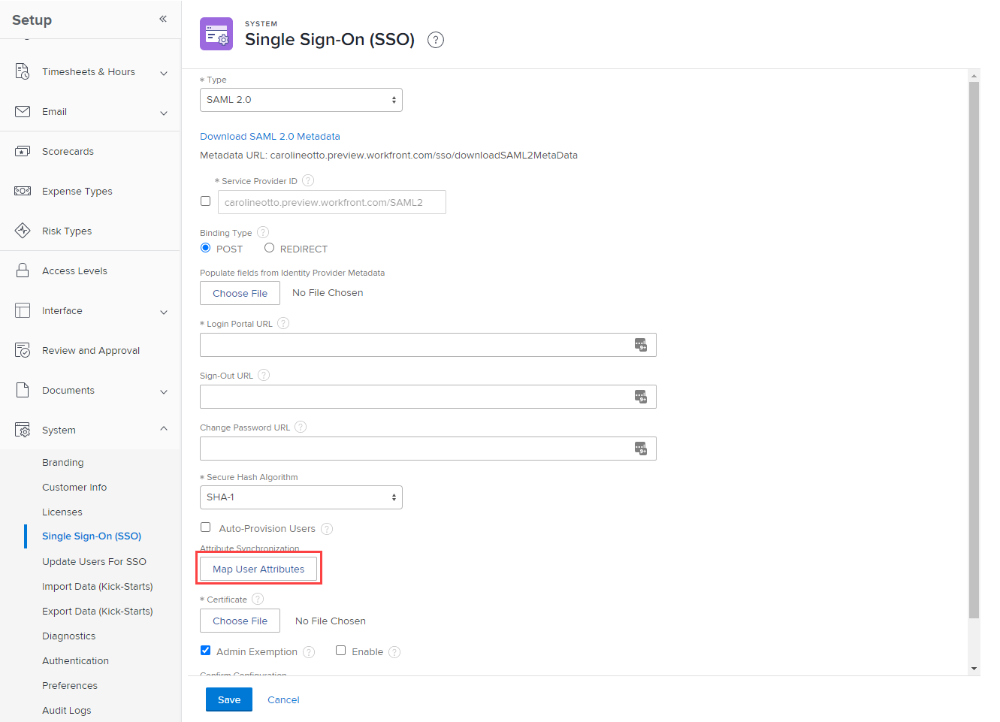
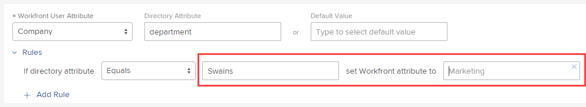

# Asignar atributos de usuario

<!--Audited 2/2024-->

Mediante el inicio de sesión único (SSO), puede pasar atributos del Active Directory de su proveedor de identidades a los usuarios de Adobe Workfront.

## Requisitos de acceso

+++ Expanda para ver los requisitos de acceso para la funcionalidad en este artículo.

Debe tener el siguiente acceso para realizar los pasos de este artículo:

<table style="table-layout:auto"> 
 <col> 
 <col> 
 <tbody> 
  <tr> 
   <td role="rowheader">Plan de Adobe Workfront</td> 
   <td>Cualquiera</td> 
  </tr> 
  <tr> 
   <td role="rowheader">Licencia de Adobe Workfront</td> 
   <td>
Nuevo: estándar

O

Actual: plan
</td> 
  </tr> 
  <tr> 
   <td role="rowheader">Configuraciones de nivel de acceso</td> 
   <td>[!UICONTROL System Administrator]</td>
  </tr> 
 </tbody> 
</table>

Para obtener más información sobre el contenido de esta tabla, consulte [Requisitos de acceso en la documentación de Workfront](/help/quicksilver/administration-and-setup/add-users/access-levels-and-object-permissions/access-level-requirements-in-documentation.md).

+++

## Sugerencias para asignar atributos

Tenga en cuenta lo siguiente al asignar atributos:

* Realice siempre pruebas en una zona protegida de vista previa o una zona protegida de actualización del cliente (CR).
* Realice pruebas con cuentas de administrador y de otro tipo para confirmar que está asignando los atributos correctamente.
* Los atributos asignados se aplican cada vez que un usuario inicia sesión con el inicio de sesión único.

  Ejemplo: si asigna “apellidos” y actualiza su nombre en Workfront sin actualizar el valor en su proveedor de identidad, los apellidos se sobrescribirán para que coincidan con el valor del proveedor de identidad la próxima vez que el usuario inicie sesión.

## Asignar atributos de usuario para su organización

El procedimiento para asignar atributos difiere según si la organización se encuentra en la experiencia unificada de Adobe.

Para determinar si su organización está en Adobe Unified Experience, examine la URL que utiliza para acceder a Workfront.

| URL | Adobe Experience |
|---|---|
| (CompanyName).my.workfront.com | Experiencia clásica |
| experience.adobe.com | Adobe Unified Experience |

* [Asignar atributos de usuario en la experiencia clásica](#map-user-attributes-in-the-classic-experience)
* [Asignar atributos de usuario en la experiencia unificada de Adobe](#map-user-attributes-in-the-adobe-unified-experience)

### Asignar atributos de usuario en la experiencia clásica

1. Haga clic en el icono **Menú principal**  en la esquina superior derecha de Adobe Workfront y, a continuación, haga clic en **Configurar** .

1. Haga clic en **Sistema** > **Inicio de sesión único (SSO)**.

1. En la lista desplegable **Tipo**, haga clic en **SAML 2.0**.

1. Haga clic en **Asignar atributos de usuario**.

   

1. En la fila de opciones que aparece, asigne los atributos que necesite para los usuarios de Workfront.

   Puede asignar atributos como Dirección, Responsable, Función, Grupo de inicio, etc.

   Las asignaciones de atributos funcionan en una proporción 1:1. Por ejemplo, no puede establecer todos los grupos a los que pertenece un usuario; solo puede establecer uno por usuario.

   >[!IMPORTANT]
   >
   >No se recomienda asignar niveles de acceso en las asignaciones de atributos. Si lo hace, tenga cuidado al configurar el valor predeterminado para asegurarse de que no elimine el acceso de administrador de forma involuntaria.

   En la tabla siguiente se explican los campos que se pueden utilizar para asignar atributos:

   <table style="table-layout:auto"> 
    <col data-mc-conditions=""> 
    <col data-mc-conditions=""> 
    <tbody> 
     <tr> 
      <td role="rowheader">Atributo de usuario de Workfront</td> 
      <td>Elija el nombre del atributo que está asignando</td> 
     </tr> 
     <tr> 
      <td role="rowheader">Atributo de directorio</td> 
      <td>Escriba la etiqueta de atributo SSO que desee utilizar.</td> 
     </tr> 
     <tr> 
      <td role="rowheader">Valor predeterminado</td> 
      <td> 
Después de elegir un atributo de usuario de Workfront, si el valor es NULL durante la conexión, este campo se rellena con el valor predeterminado correspondiente en el sistema. Escriba un valor aquí solo si planea aplicar reglas de asignación de atributos (consulte el paso 7). El valor predeterminado actúa como una excepción a esas reglas.</td> 
     </tr> 
    </tbody> 
   </table>

1. (Opcional) Haga clic en **Reglas** para añadir una regla al atributo.

   1. En la lista desplegable, elija el modificador de atributo que desee utilizar.
   1. En los 2 campos de la derecha, escriba el valor del atributo de directorio y el valor con el que desea reemplazarlo.

      

   Puede hacer clic en **Añadir regla** para añadir más reglas al atributo.

1. (Opcional) Para asignar más atributos de usuario, haga clic en **Añadir asignación** y repita los pasos del 6 al 7.
1. Haga clic en **Guardar**.

### Asignar atributos de usuario en la experiencia unificada de Adobe

1. Haga clic en el icono **Menú principal**  en la esquina superior izquierda de Adobe Workfront y, a continuación, haga clic en **Configurar** .

1. Haga clic en **Sistema** > **Inicio de sesión único (SSO)**.

1. Seleccione la ficha **Adobe**.

1. (Opcional y condicional) Si su organización tenía la asignación de atributos configurada en la experiencia clásica y desea copiar esa asignación de atributos en la experiencia unificada de Adobe, haga clic en **Migrar asignaciones**. A continuación, puede descartar, eliminar o editar estas asignaciones.

   >[!NOTE]
   >
   >Se recomienda migrar las asignaciones la primera vez que se configuren en la experiencia unificada de Adobe. No pasa nada por migrarlos de nuevo más adelante, pero hacerlo más de una vez es innecesario.

1. Para crear una nueva asignación de atributos, haga clic en **Añadir asignación**.

1. Haga clic en la flecha situada junto al nombre del campo Workfront y seleccione el campo de [!DNL Workfront] al que desee asignar.

1. (Opcional) Si desea crear más de una regla para un campo determinado, haga clic en la flecha situada junto a **Siempre** y seleccione el operador que desea que utilice la regla.

1. (Condicional) Si ha seleccionado un operador además de Siempre, seleccione el campo Workfront y el valor a los que se aplica el operador.

   >[!NOTE]
   >
   >Los operadores `Is Truthy` y `Is Falsy` no requieren valores.

1. Seleccione si desea aplicar el valor de un atributo en el administrador de identidades al campo Workfront o si desea aplicar un valor constante específico.

1. Introduzca el nombre del campo del administrador de identidades que desea aplicar o el texto del valor de constante que desea aplicar.

1. (Opcional) Para añadir más reglas para el mismo campo de Workfront, haga clic en **Añadir nueva regla** y siga los pasos 4-9.

   >[!IMPORTANT]
   >
   > * Se ignorará cualquier regla que se encuentre por debajo de la regla Siempre. Si tiene una regla Siempre, debe moverla al final de la lista de reglas. Para mover reglas en la lista, haga clic en el menú de tres puntos situado a la derecha de la regla y mueva la regla hacia arriba o hacia abajo.
   > * Para crear una regla en medio de la lista, haga clic en el menú de tres puntos situado junto a la regla que desea que esté por encima o por debajo de la nueva regla y seleccione **Añadir regla por encima** o **Añadir regla por debajo**.

1. Para eliminar una regla, haga clic en el menú de tres puntos situado junto a la regla que desea eliminar y seleccione **Eliminar**.
1. Para eliminar una asignación, haga clic en el icono **Eliminar** que se encuentra en la tarjeta de esa asignación.

1. Para guardar, desplácese hasta la parte superior de la página y haga clic en **Guardar**.

