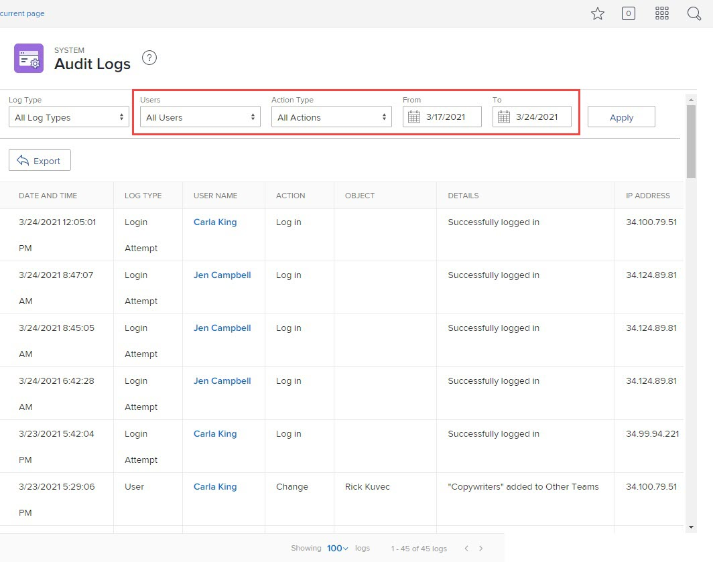

# Ver y exportar registros de auditoría

<!--
**DON'T DELETE, DRAFT OR HIDE THIS ARTICLE. IT IS LINKED TO THE PRODUCT, THROUGH THE CONTEXT SENSITIVE HELP LINKS. **
-->

Puede ver todos los registros de auditoría del sistema o aquellos que cumplan ciertos criterios de filtrado. También puede exportar registros de auditoría.

Los registros de auditoría enumeran los cambios de usuario activados en el sistema durante los últimos 90 días.

Para obtener información sobre todos los tipos de registro de auditoría y lo que los genera, consulte [Registros de auditoría](../../../administration-and-setup/add-users/create-and-manage-users/audit-logs.md).

## Requisitos de acceso

Debe tener lo siguiente para realizar los pasos de este artículo:

<table style="table-layout:auto"> 
 <col> 
 <col> 
 <tbody> 
  <tr> 
   <td role="rowheader">plan de Adobe Workfront</td> 
   <td>Cualquiera</td> 
  </tr> 
  <tr> 
   <td role="rowheader">Licencia de Adobe Workfront</td> 
   <td> 
Plan 
 
Debe ser administrador de Workfront.
 </td> 
  </tr> 
 </tbody> 
</table>

## Ver registros de auditoría

1. Haga clic en el **Menú principal** icono  en la esquina superior derecha de Adobe Workfront, haga clic en **Configuración** .

1. En el panel izquierdo, haga clic en **Sistema > Registros de auditoría**.
1. En el **Tipo de registro** menú desplegable, seleccione el tipo de registro de auditoría que desea ver.

   **Todos los tipos de registro** está seleccionado de forma predeterminada.

   Para obtener una lista de todos los tipos de registro de auditoría que puede ver y la información que incluye, consulte [Registros de auditoría](../../../administration-and-setup/add-users/create-and-manage-users/audit-logs.md).

1. (Opcional) Defina cualquiera de los filtros disponibles.

   >[!NOTE]
   >
   >Las opciones del menú desplegable Tipo de acción varían según el registro de auditoría seleccionado.

   

1. Haga clic en **Aplicar**.
1. (Opcional) Haga clic en **Borrar filtros** para restablecer los cambios realizados en los filtros.

## Exportar registros de auditoría

1. Haga clic en el **Menú principal** icono  en la esquina superior derecha de Adobe Workfront, haga clic en **Configuración** .

1. En el panel izquierdo, haga clic en **Sistema > Registros de auditoría**.

1. En el **Tipo de registro** menú desplegable, seleccione un registro de auditoría.

   **Todos los tipos de registro** está seleccionado de forma predeterminada.

1. Defina cualquiera de los filtros disponibles y haga clic en **Aplicar**.

   >[!IMPORTANT]
   >
   >No se pueden exportar más de 50 000 registros al mismo tiempo. Workfront exporta los registros en función de los filtros establecidos, no del número de registros que se muestran en la página. Puede ver el número total de registros filtrados en la esquina inferior derecha de la página.

1. Haga clic en **Exportar**.
