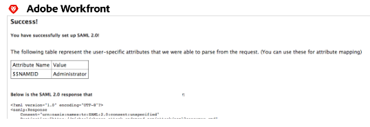

# Configuración de Adobe Workfront con SAML 2.0 mediante ADFS

{{important-admin-console-onboard}}

Como administrador de Adobe Workfront, puede integrar Workfront con una solución Security Assertion Markup Language (SAML) 2.0 para el inicio de sesión único mientras utiliza los Servicios de federación de Active Directory (ADFS).

Esta guía se centra en la configuración de ADFS sin aprovisionamiento automático ni asignaciones de atributos. Le recomendamos que complete la configuración y la pruebe antes de configurar el aprovisionamiento automático.

## Requisitos de acceso

Debe tener el siguiente acceso para realizar los pasos de este artículo:

<table style="table-layout:auto"> 
 <col> 
 <col> 
 <tbody> 
  <tr> 
   <td role="rowheader">plan de Adobe Workfront</td> 
   <td>Cualquiera</td> 
  </tr> 
  <tr> 
   <td role="rowheader">Licencia de Adobe Workfront</td> 
   <td>Plan</td> 
  </tr> 
  <tr> 
   <td role="rowheader">Configuraciones de nivel de acceso</td> 
   <td> 
Debe ser administrador de Workfront.
 
<b>NOTA</b>: Si todavía no tiene acceso, pregunte a su administrador de Workfront si establece restricciones adicionales en su nivel de acceso. Para obtener información sobre cómo un administrador de Workfront puede modificar su nivel de acceso, consulte <a href="../../../administration-and-setup/add-users/configure-and-grant-access/create-modify-access-levels.md" class="MCXref xref">Crear o modificar niveles de acceso personalizados</a>.
 </td> 
  </tr> 
 </tbody> 
</table>

## Habilitar la autenticación en Workfront con SAML 2.0

Para habilitar la autenticación en la aplicación web de Workfront y en la aplicación móvil de Workfront con SAML 2.0, complete las siguientes secciones:

* [Recuperación del archivo de metadatos SSO de Workfront](#retrieve-the-workfront-sso-metadata-file)
* [Configurar confianzas de terceros](#configure-relying-party-trusts)
* [Configurar reglas de solicitud](#configure-claim-rules)
* [Cargue el archivo de metadatos y pruebe la conexión](#upload-the-metadata-file-and-test-the-connection)

### Recuperación del archivo de metadatos SSO de Workfront {#retrieve-the-workfront-sso-metadata-file}

1. Haga clic en el **Menú principal** icono  en la esquina superior derecha de Adobe Workfront, haga clic en **Configuración** .
1. En el panel izquierdo, haga clic en **Sistema** > **Inicio de sesión único (SSO)**.
1. En el **Tipo** menú desplegable, haga clic en **SAML 2.0** para mostrar información y opciones adicionales.
1. Copie la dirección URL que aparece después de **Dirección URL de metadatos**.
1. Continúe con la siguiente sección, [Configurar confianzas de terceros](#configure-relying-party-trusts).

### Configurar confianzas de terceros {#configure-relying-party-trusts}

1. Abra el **Administrador de ADFS** uso del servidor Windows 2008 R2 (la versión puede variar).
1. Vaya a **Inicie.**
1. Haga clic en **Herramientas de administración.**
1. Haga clic en **Administración de ADFS 2.0.**
1. Select **ADFS** y expanda **Relaciones de confianza**.
1. Clic con el botón derecho **Confiar en las confianzas del partido** y, a continuación, seleccione **Añadir confianza de entidad de confianza** para iniciar el Asistente para agregar confianza de terceros.
1. En el **Página de bienvenida**, seleccione **Inicio**.
1. En el **Seleccionar origen de fecha** pegue la URL de metadatos de Workfront.
1. Haga clic en **Siguiente**.
1. Haga clic en **OK** para confirmar el mensaje de advertencia.
1. En el **Especificar nombre para mostrar** , agregue **Nombre para mostrar** y **Notas** para distinguir la confianza, haga clic en **Siguiente**.
1. Select **Permitir que todos los usuarios accedan a esta parte de confianza** (O **Ninguna** si desea configurarlo más adelante).
1. Haga clic en **Siguiente**.

   Esto le lleva al **Listo para agregar confianza** para obtener más información.

1. Continúe con la siguiente sección [Configurar reglas de solicitud](#configure-claim-rules).

### Configurar reglas de solicitud {#configure-claim-rules}

1. Haga clic en **Siguiente** en el **Listo para agregar confianza** y, a continuación, asegúrese de que la variable **Abrir el cuadro de diálogo Editar reglas de reclamación** está seleccionada.

   Esto le permitirá editar las reglas de reclamación en un paso futuro.

1. Haga clic en **Cerrar**.
1. Haga clic en **Agregar regla.**
1. Select **Enviar atributo LDAP como solicitudes**.
1. Haga clic en **Siguiente** para mostrar el **Configurar regla de solicitud** paso a paso.
1. Especifique los siguientes requisitos mínimos para configurar la regla de la reclamación: (Esto pasará a la sección **ID de federación** en la configuración del usuario y se utiliza para distinguir quién está iniciando sesión).

   <table >                
      <tbody>
            <tr>
               <td>Reclamar nombre de regla
               </td>
               <td>Especifique un nombre para la regla de la reclamación. Por ejemplo, "Workfront".</td>
            </tr>
            <tr>
               <td>Almacén de atributos</td>
               <td >Select <b>Active Directory</b> en el menú desplegable.</td>
            </tr>
            <tr>
               <td>Atributo LDAP</td>
               <td>Puede ser cualquier tipo de atributo. Se recomienda usar <b>SAM-Account-Name</b> para este atributo.</td>
            </tr>
            <tr>
               <td>Tipo de reclamación saliente</td>
               <td>Debe seleccionar <b>ID de nombre</b> como tipo de reclamación saliente</td>
            </tr>
      </tbody>
   </table>

1. (Opcional) Para establecer el aprovisionamiento automático, agregue las siguientes reclamaciones adicionales tanto en el atributo LDAP como en el tipo de solicitud saliente:

   * Nombre dado
   * Apellido
   * Dirección de correo electrónico

1. Haga clic en **Finalizar** y haga clic en **OK** en la siguiente pantalla.
1. Haga clic con el botón derecho en el nuevo **Confiar en la confianza de las partes** y, a continuación, seleccione **Propiedades**.
1. Seleccione el **Ficha Avanzado**. Y debajo de **Algoritmo de hash seguro** seleccione SHA-1 o SHA-256.

   >[!NOTE]
   >
   >La opción que seleccione en Algoritmo de hash seguro debe coincidir con el campo Algoritmo de hash seguro de Workfront en Configuración > Sistema > Inicio de sesión único (SSO).

1. Continúe con la siguiente sección [Cargue el archivo de metadatos y pruebe la conexión](#upload-the-metadata-file-and-test-the-connection).

### Cargue el archivo de metadatos y pruebe la conexión {#upload-the-metadata-file-and-test-the-connection}

1. Abra un explorador y vaya a `https://<yourserver>/FederationMetadata/2007-06/FederationMetadata.xml` .

   Esto debería descargar un archivo de metadatos FederationMetadata.xml.

1. Haga clic en **Elegir archivo** under **Rellenar campos de los metadatos del proveedor de identidad** y seleccione **FederationMetadata.xml** archivo.

1. (Opcional) Si la información del certificado no se rellenó con el archivo de metadatos, puede cargar un archivo por separado. Select **Elegir archivo** en el **Certificado** para obtener más información.

1. Haga clic en **Probar conexión**. Si está configurado correctamente, debería ver una página similar a la que se muestra a continuación:

   

   >[!NOTE]
   >
   >Si desea configurar la asignación de atributos, asegúrese de copiar los atributos de Test Connection en el atributo de directorio. Para obtener más información, consulte Asignación de atributos de usuario.

1. Select **Exención de administración** para permitir a los administradores de Workfront iniciar sesión con las credenciales de Workfront con la url de derivación.

   Marcadores que apuntan a `<yourdomain>`.my.workfront.com/login evite el redireccionamiento.

1. Seleccione el **Habilitar** para activar la configuración.
1. Haga clic en **Guardar**.

## Acerca de la actualización de usuarios para SSO

Siguiendo esta guía, la variable **Nombre de usuario de SSO** será su **Nombre de usuario de Active Directory**.

Como administrador de Workfront, puede actualizar usuarios de forma masiva para SSO. Para obtener más información sobre la actualización de usuarios para SSO, consulte [Actualización de usuarios para el inicio de sesión único](../../../administration-and-setup/add-users/single-sign-on/update-users-sso.md).

Como administrador de Workfront, también puede asignar de forma manual un ID de federación que edite el perfil del usuario y complete el campo ID de federación . Para obtener más información sobre cómo editar un usuario, consulte [Edición del perfil de un usuario](../../../administration-and-setup/add-users/create-and-manage-users/edit-a-users-profile.md).

>[!NOTE]
>
>Al editar los perfiles de los usuarios para incluir un ID de federación, seleccione **Permitir solo la autenticación SAML 2.0** elimina la capacidad de iniciar sesión en Workfront mediante la url de bypass (`<yourdomain>`.my.workfront.com/login).
