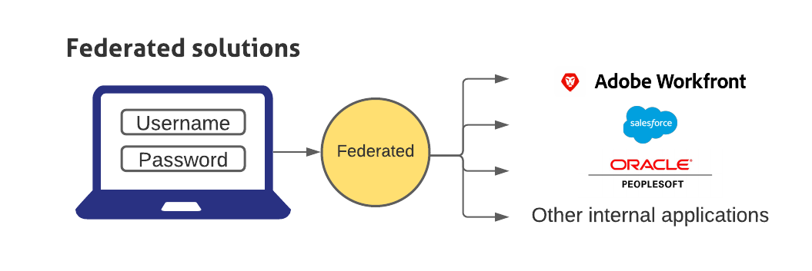

# Información general sobre el inicio de sesión único en Adobe Workfront

<!--Audited: 12/2023-->

{{important-admin-console-onboard}}

Workfront proporciona una configuración de inicio de sesión único (SSO) administrada de forma centralizada que integra Workfront con su solución de SSO empresarial existente. Esta configuración está disponible tanto para clientes de OnDemand como de OnPremise Enterprise.

Para utilizar la funcionalidad de SSO en Workfront, su organización debe configurar una aplicación de SSO. A continuación, puede configurar Workfront para que pueda comunicarse con su solución de SSO.

Las soluciones federadas permiten a los usuarios iniciar sesión en todas sus aplicaciones introduciendo su nombre de usuario y contraseña en un portal de inicio de sesión centralizado.

## Configurar el cortafuegos

Al utilizar una solución de SSO, Workfront inicia una conexión con el servidor en el puerto especificado.

Si el cortafuegos o el servidor de correo están configurados para permitir el acceso únicamente a proveedores específicos, debe añadir determinadas direcciones IP de Workfront a la lista de permitidos del cortafuegos. Para obtener más información, consulte [Configuración de la lista de permitidos del cortafuegos](../../../administration-and-setup/get-started-wf-administration/configure-your-firewall.md).

## Configurar un inicio de sesión único

Workfront se integra con las siguientes soluciones SSO:

* Soluciones federadas compatibles con SAML 2.0

  Para obtener información sobre la integración de Workfront con SAML 2.0, consulte [Configuración de Adobe Workfront con SAML 2.0](../../../administration-and-setup/add-users/single-sign-on/configure-workfront-saml-2.md).

* Soluciones federadas compatibles con SAML 2.0 mediante ADFS

  Para obtener información sobre la integración de Workfront con SAML 2.0 mediante ADFS, consulte [Configuración de Adobe Workfront con SAML 2.0 mediante ADFS](../../../administration-and-setup/add-users/single-sign-on/configure-workfront-saml-2-adfs.md).
