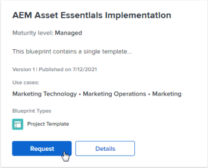

# Examinar el catálogo de modelos y solicitar la instalación de modelos

Los modelos proporcionan componentes básicos que le ayudarán a crear un sistema de administración del trabajo que evolucione con usted. Todos los usuarios de [!DNL Adobe Workfront] pueden examinar el catálogo de modelos. Además, puede solicitar que su administrador de [!DNL Workfront] le instale un modelo específico, si el administrador ha habilitado las solicitudes de modelos.

Solo el administrador del sistema puede instalar modelos. Para obtener más información, consulte [Instalar un modelo](../../administration-and-setup/blueprints/blueprints-install.md).

## Requisitos de acceso

+++ Expanda para ver los requisitos de acceso para la funcionalidad en este artículo.

<table style="table-layout:auto"> 
 <col> 
 <col> 
 <tbody> 
  <tr> 
   <td role="rowheader">Paquete Adobe Workfront</td> 
   <td> 
Cualquiera 
 </td> 
  </tr> 
  <tr> 
   <td role="rowheader">Licencia de Adobe Workfront</td> 
   <td>
Colaborador o superior

Solicitante o superior

  </td> 
  </tr> 
 </tbody> 
</table>

Para obtener más información, consulte [Requisitos de acceso en la documentación de Workfront](/help/quicksilver/administration-and-setup/add-users/access-levels-and-object-permissions/access-level-requirements-in-documentation.md).

+++

## Examinar el catálogo de modelos

El catálogo muestra todos los modelos disponibles para su organización. Para obtener información sobre modelos, como los tipos de modelos y los niveles de madurez, consulte [Información general sobre modelos](../../administration-and-setup/blueprints/blueprints-overview.md).

{{step1-to-blueprints}}

1. Examine el catálogo de modelos.
1. Utilice el panel de filtro de la derecha para filtrar el catálogo con las siguientes opciones:

   * Caso de uso (como [!UICONTROL Recursos humanos] o [!UICONTROL Marketing])
   * Nivel de madurez ([!UICONTROL administrado] o [!UICONTROL integrado])
   * Estado de la instalación ([!UICONTROL instalado] o no [!UICONTROL instalado])
   * Tipo de modelo ([!UICONTROL Panel de control], [!UICONTROL Estructura organizativa], [!UICONTROL Plantilla de proyecto]<!-- above Custom Form; here, Request Queue, Setup Feature-->)

1. (Opcional) Haga clic en **[!UICONTROL Detalles]** en un modelo para saber cómo funciona.

   Para obtener información sobre el contenido disponible en la página [!UICONTROL Detalles], consulte [Información general sobre modelos](../../administration-and-setup/blueprints/blueprints-overview.md).

## Solicitar la instalación de un modelo

Puede solicitar la instalación de un modelo si el administrador del sistema permite las solicitudes de modelos. Para obtener más información, consulte [Configurar el acceso a los modelos](../../administration-and-setup/blueprints/configure-access-to-blueprints.md).

Cuando se solicita la instalación de un modelo, la solicitud se envía al administrador del sistema. Se le notificará cuando se complete la solicitud, según sus preferencias de notificación.

{{step1-to-blueprints}}

1. Busque el modelo que desee instalar. Puede filtrar por el caso de uso, el nivel de madurez, el estado de la instalación y el tipo utilizando los filtros del panel situado a la derecha.
1. Haga clic en **[!UICONTROL Solicitud]** en el modelo.

   Si el botón **[!UICONTROL Solicitud]** no aparece en el modelo, el administrador del sistema no ha habilitado las solicitudes.

   
