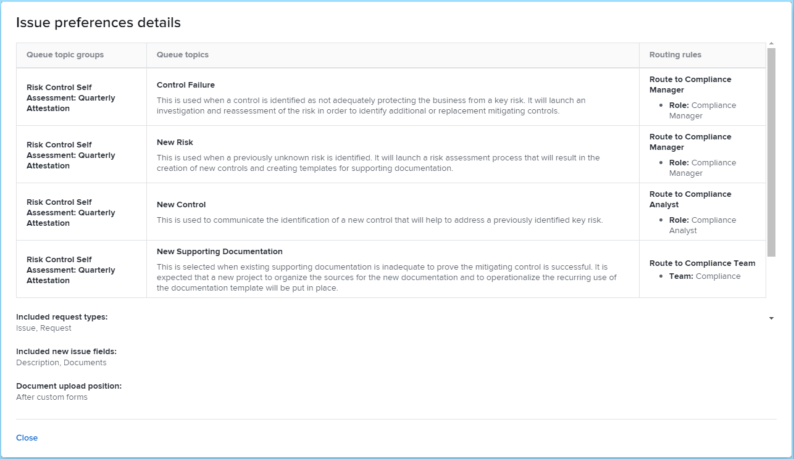

# Configurar un modelo

Puede configurar los detalles del modelo antes de instalarlo. Los tipos de modelo de plantilla de proyecto y estructura organizativa suelen requerir que se establezcan algunas preferencias y que se asignen algunas propiedades. Otros tipos de modelo no requerirán configuración y se instalarán tal cual. Para obtener más información sobre la instalación, consulte [Instalar un modelo](/help/quicksilver/administration-and-setup/blueprints/blueprints-install.md).

## Requisitos de acceso

+++ Expanda para ver los requisitos de acceso para la funcionalidad en este artículo.

<table style="table-layout:auto"> 
 <col> 
 <col> 
 <tbody> 
  <tr> 
   <td role="rowheader">paquete de Adobe Workfront</td> 
   <td>Cualquiera</td> 
  </tr> 
  <tr> 
   <td role="rowheader">Licencia de Adobe Workfront</td> 
   <td>
   
Estándar

   
Plan
</td> 
  </tr> 
  <tr> 
   <td role="rowheader">Configuraciones de nivel de acceso</td> 
   <td>Administrador de Workfront </td> 
  </tr> 
 </tbody> 
</table>

Para obtener más información sobre el contenido de esta tabla, consulte [Requisitos de acceso en la documentación de Workfront](/help/quicksilver/administration-and-setup/add-users/access-levels-and-object-permissions/access-level-requirements-in-documentation.md).

+++

## Configurar un modelo de plantilla de proyecto

1. Busque el modelo que desea utilizar.
1. Haga clic en **[!UICONTROL Instalar]** y, a continuación, elija un entorno:

   <table style="table-layout:auto">
        <tr>
        <td><strong>Producción</strong></td>
        <td>La producción es el entorno en directo.</td>
    </tr>
    <tr>
        <td><strong>Vista previa de zona protegida</strong></td>
        <td>La vista previa de zona protegida es un entorno de prueba que sirve como réplica del entorno en directo y que Workfront actualiza cada fin de semana.</td>
    </tr>
    <tr>
        <td><strong>Zonas protegidas 1 y 2</strong></td>
        <td>La zona protegida de actualización personalizada es un entorno de prueba independiente que se actualiza manualmente por usted. La zona protegida de actualización personalizada tiene un coste adicional.</td>
    </tr>
   </table>

1. Continúe con las secciones siguientes:

   * [[!UICONTROL Preferencias de plantilla]](#template-preferences)
   * [[!UICONTROL Asignación de funciones]](#role-mapping)
   * [[!UICONTROL Asignación de equipos]](#team-mapping)
   * [[!UICONTROL Asignación de la compañía]](#company-mapping)
   * [[!UICONTROL Asignación de grupos]](#group-mapping)

## [!UICONTROL Preferencias de plantilla] {#template-preferences}

Elija cómo desea instalar la plantilla.

También puede designar la propiedad de la plantilla antes de instalar el modelo. Puede realizar cambios en estos campos después de instalar la plantilla. Para obtener más información, consulte [Editar plantillas del proyecto](../../manage-work/projects/create-and-manage-templates/edit-templates.md).

![[!UICONTROL Sección] Preferencias de plantilla](assets/Blueprints_TemplatePreferences.png)

1. En la sección [!UICONTROL Preferencias de plantilla], especifique un nuevo nombre para la plantilla.
1. Especifique lo siguiente:

   <table style="table-layout:auto">
    <tr>
        <td><strong>[!UICONTROL Template owner]<strong></td>
        <td>Esta persona recibe permisos de [!UICONTROL Manage] en la plantilla y se convertirá en el propietario del proyecto cuando la plantilla se utilice para crear un proyecto.</td>
    </tr>
    <tr>
        <td><strong>[!UICONTROL Template sponsor]</strong></td>
        <td>Esta persona suele ser un administrador, un ejecutivo o un responsable de departamento que necesita saber qué está pasando con el proyecto. El Patrocinador del proyecto no obtiene acceso adicional al proyecto, pero se añade a las notificaciones por correo electrónico del proyecto.</td>
    </tr>
    <tr>
        <td><strong>[!UICONTROL Portfolio]</strong></td>
        <td>Este es el portafolio al que pertenecerá el proyecto cuando se cree.</td>
    </tr>
    <tr>
        <td><strong>[!UICONTROL Program]</strong></td>
        <td>Este es el programa al que pertenecerá el proyecto cuando se cree.</td>
    </tr>
   </table>

1. Seleccione si la plantilla está instalada como activa o inactiva.
1. Si las preferencias están disponibles, seleccione si desea utilizar las nuevas preferencias de problema definidas.

   Haga clic en **[!UICONTROL See issue preferences]** para revisar las preferencias específicas que se instalarán con el modelo. Los proyectos creados a partir de la plantilla importada utilizan estas preferencias para los nuevos problemas añadidos en la sección [!UICONTROL Issues].

   <table style="table-layout:auto"> 
    <col> 
    <col> 
    <tbody> 
     <tr> 
      <td role="rowheader"><strong>Grupos de tema de la cola</strong></td> 
      <td> 
Los grupos de temas de cola definen el nivel más alto de categorías para los problemas o las solicitudes. Los usuarios ven los grupos de temas como opciones de menú al seleccionar dónde enviar las solicitudes. Un grupo de temas puede contener varios temas de cola. Para obtener más información, consulte <a href="../../manage-work/requests/create-and-manage-request-queues/create-topic-groups.md" class="MCXref xref">Crear grupos de temas</a>. 
 </td> 
     </tr> 
     <tr> 
      <td role="rowheader"><strong>Temas de la cola</strong></td> 
      <td> 
Los temas de cola funcionan junto con las reglas de enrutamiento para asignar problemas o solicitudes. Son las opciones de menú que los usuarios seleccionan al introducir un problema o una solicitud, después de seleccionar un grupo de temas. Para obtener más información, consulte <a href="../../manage-work/requests/create-and-manage-request-queues/create-queue-topics.md" class="MCXref xref">Crear temas de la cola</a>. 
 </td> 
     </tr> 
     <tr> 
      <td role="rowheader"><strong>Reglas de enrutamiento</strong></td> 
      <td>Las reglas de enrutamiento envían problemas o solicitudes a funciones, usuarios o equipos específicos. También pueden enviar las solicitudes a proyectos específicos que no sean los asociados a la cola de solicitudes. Para obtener más información, consulte <a href="../../manage-work/requests/create-and-manage-request-queues/create-routing-rules.md" class="MCXref xref">Crear reglas de enrutamiento</a>. </td> 
     </tr> 
    </tbody> 
   </table>

   >[!INFO]
   >
   >**Ejemplo:** Las nuevas preferencias de problema de este modelo proporcionan cuatro temas de cola. El usuario selecciona uno de estos temas al crear un problema. (Dado que solo existe un grupo de temas, se aplica automáticamente y el usuario no tiene que seleccionarlo). Cuando el usuario completa y envía el problema, las reglas de enrutamiento determinan a qué rol o equipo de trabajo se asigna.
   >
   >
   >

   >[!TIP]
   >
   >* El uso de las preferencias de problemas ayuda a crear coherencia en la forma en que se capturan los nuevos problemas o solicitudes en los proyectos.
   >* Al establecer estas preferencias, los proyectos creados a partir de la plantilla no se convierten automáticamente en colas de solicitudes. Para obtener información sobre la configuración de una cola de solicitudes, consulte [Crear una cola de solicitudes](../../manage-work/requests/create-and-manage-request-queues/create-request-queue.md).
   >* No todos los modelos contienen nuevas preferencias de problema.

## [!UICONTROL Role mapping] {#role-mapping}

>[!NOTE]
>
>Esta sección puede no aparecer en algunos modelos.

Algunas plantillas incluyen funciones prescritas. Las funciones ayudan a asignar las personas adecuadas cuando la plantilla se convierte en un proyecto. Puede personalizar cómo se asignan las funciones antes de instalar el modelo. Haga clic en **[!UICONTROL See role descriptions]** para obtener más información sobre las funciones disponibles en el modelo.

El modelo busca por el nombre de la función para ver si hay funciones existentes que coinciden. La búsqueda distingue entre mayúsculas y minúsculas, por lo que los nombres deben coincidir de forma exacta. Si no hay funciones existentes que coincidan, puede hacer que el modelo las cree automáticamente.

![[!UICONTROL Role Mapping] section](assets/Blueprints_RoleMapping.png)

1. Si existe una función, puede elegir una de las siguientes opciones:

   1. Crear una nueva función con un nombre diferente y, a continuación, escribir el nombre en el cuadro de texto.
   1. Utilizar la función existente y luego seleccionar una en el cuadro de selección.
   1. No utilizar la función asignada. No se recomienda esta opción porque algunas tareas no tendrán funciones asignadas.

1. Si una función no existe, puede elegir una de las siguientes opciones:

   1. Crear una función nueva. Esta opción crea la función que recomienda el modelo.
   1. Crear una nueva función con un nombre diferente y, a continuación, escribir el nombre en el cuadro de texto.
   1. Utilizar la función existente y luego seleccionar una en el cuadro de selección.
   1. No utilizar la función asignada. No se recomienda esta opción porque algunas tareas no tendrán funciones asignadas.

>[!NOTE]
>
>El proceso de instalación no aplica funciones a personas específicas. Debe comprobar las personas con esas funciones después de instalar la solución de modelo y asignar personas si es necesario. Para obtener más información, consulte [Acciones que se deben realizar después de instalar un modelo](../../administration-and-setup/blueprints/best-next-actions-after-install.md).

Para obtener más información sobre las funciones en [!DNL Workfront], consulte [Crear y administrar funciones](../../administration-and-setup/set-up-workfront/organizational-setup/create-manage-job-roles.md).

## [!UICONTROL Asignación de equipos] {#team-mapping}

>[!NOTE]
>
>Esta sección puede no aparecer en algunos modelos.

Algunas plantillas incluyen equipos prescritos. Cualquier miembro de un equipo puede completar el trabajo asignado a un equipo. Puede personalizar cómo se asignan los equipos antes de instalar el modelo. Haga clic en **[!UICONTROL Ver descripciones del equipo]** para obtener más información sobre los equipos disponibles en el modelo.

El modelo busca por el nombre del equipo para ver si algún equipo existente coincide. La búsqueda distingue entre mayúsculas y minúsculas, por lo que los nombres deben coincidir de forma exacta. Si no coinciden los equipos existentes, puede hacer que el modelo los cree automáticamente.

![[!UICONTROL Asignación de equipos], sección](assets/Blueprints_TeamMapping.png)

1. Si existe un equipo, puede elegir una de las siguientes opciones:

   1. Cree un nuevo equipo con un nombre diferente y, a continuación, escriba el nombre en el cuadro de texto.
   1. Utilice un [!UICONTROL equipo existente] y después seleccione un equipo en el cuadro de diálogo de selección.
   1. No utilice un equipo asignado. No se recomienda esta opción porque algunas tareas no tendrán equipos asignados.

1. Si no existe ningún equipo, puede elegir una de las siguientes opciones:

   1. Crear un nuevo equipo. Esta opción crea el equipo que recomienda el modelo.
   1. Cree un nuevo equipo con un nombre diferente y, a continuación, escriba el nombre en el cuadro de texto.
   1. Utilice un [!UICONTROL equipo existente] y después seleccione un equipo en el cuadro de diálogo de selección.
   1. No utilice un equipo asignado. No se recomienda esta opción porque algunas tareas no tendrán equipos asignados.

>[!NOTE]
>
>El proceso de instalación no añade personas a los equipos. Debe verificar las personas en los equipos después de instalar la solución del modelo y asignar personas si es necesario. Para obtener más información, consulte [Acciones que se deben realizar después de instalar un modelo](../../administration-and-setup/blueprints/best-next-actions-after-install.md).

Para obtener más información acerca de cómo funcionan los equipos en [!DNL Workfront], consulte [Crear y administrar equipos](../../people-teams-and-groups/create-and-manage-teams/create-and-mange-teams.md).

## Asignación de la compañía {#company-mapping}

>[!NOTE]
>
>Esta sección puede no aparecer en algunos modelos.

Algunos modelos incluyen compañías recetadas. Una compañía es una unidad organizativa que puede representar a su organización, a un departamento dentro de la organización o a un cliente con el que trabaja. Puede personalizar cómo se asignan las empresas antes de instalar el modelo. Haga clic en **[!UICONTROL Ver descripciones de la compañía]** para obtener más información sobre las compañías disponibles en el modelo.

El modelo busca por el nombre de la empresa para ver si alguna empresa existente coincide. La búsqueda distingue entre mayúsculas y minúsculas, por lo que los nombres deben coincidir de forma exacta. Si ninguna compañía existente coincide, puede hacer que el modelo las cree por usted. La compañía principal del modelo se asigna a la compañía principal de su entorno, aunque no tengan el mismo nombre.

![[!UICONTROL Asignación de la compañía], sección](assets/Blueprints_CompanyMapping.png)

1. Si existe una compañía, puede elegir una de las siguientes opciones:

   1. Cree una nueva compañía con un nombre diferente y, a continuación, escriba el nombre en el cuadro de texto.
   1. Utilice una compañía existente y, a continuación, seleccione una compañía en el cuadro de diálogo de selección.\

      La compañía principal del modelo se asigna a la compañía principal de su entorno, aunque no tengan el mismo nombre.
   1. No utilice una compañía asignada. Esta opción no es recomendable porque las referencias de la compañía en otros objetos estarán vacías.

1. Si la compañía no existe, puede elegir una de las siguientes opciones:

   1. Crear una nueva compañía. Esta opción crea la empresa que recomienda el modelo.
   1. Cree una nueva compañía con un nombre diferente y, a continuación, escriba el nombre en el cuadro de texto.
   1. Utilice una compañía existente y, a continuación, seleccione una compañía en el cuadro de diálogo de selección.
   1. No utilice una compañía asignada. Esta opción no es recomendable porque las referencias de la compañía en otros objetos estarán vacías.

>[!NOTE]
>
>Para configurar las compañías después de instalar el modelo, consulte [Acciones que se deben realizar después de instalar un modelo](../../administration-and-setup/blueprints/best-next-actions-after-install.md).

Para obtener información sobre la asociación de una plantilla a una compañía, consulte [Editar plantillas del proyecto](../../manage-work/projects/create-and-manage-templates/edit-templates.md).

Para obtener información sobre cómo funcionan las empresas en [!DNL Workfront], consulte [Crear y editar empresas](../../administration-and-setup/set-up-workfront/organizational-setup/create-and-edit-companies.md).

## [!UICONTROL Asignación de grupos] {#group-mapping}

>[!NOTE]
>
>Esta sección puede no aparecer en algunos modelos.

Algunos modelos incluyen grupos prescritos. Un grupo es un grupo de usuarios que coincide con la estructura de su departamento. Los grupos son similares a los equipos y las compañías en Workfront, pero distintos de ellos. Puede personalizar cómo se asignan los grupos antes de instalar el modelo. Haga clic en **[!UICONTROL Ver descripciones de grupos]** para obtener más información sobre los grupos disponibles en el modelo.

El modelo busca por el nombre del grupo para ver si algún grupo existente coincide. La búsqueda distingue entre mayúsculas y minúsculas, por lo que los nombres deben coincidir de forma exacta. Si ningún grupo existente coincide, puede hacer que el modelo los cree automáticamente.

![[!UICONTROL Sección Asignación de grupos]](assets/Blueprints_GroupMapping.png)

1. Si existe un grupo, puede seleccionar **[!UICONTROL Reasignar grupo]** y elegir una de las siguientes opciones:

   1. **[!UICONTROL Crear un nuevo grupo con un nombre diferente]**. A continuación, escriba el nombre que desea asignar a este grupo. Las referencias al grupo en la definición del modelo se asociarán a este nuevo grupo en su lugar.
   1. **[!UICONTROL Reemplazar por un grupo existente]**. A continuación, busque y seleccione un grupo en el cuadro de selección.

      >[!NOTE]
      >
      >No puede cambiar el nombre de un grupo existente.

1. Si un grupo no existe, puede:

   1. Cambiar el nombre del grupo sugerido escribiéndolo en el cuadro de texto.
   1. Seleccione **[!UICONTROL Reasignar grupo]** y elija [!UICONTROL Reemplazar por un grupo existente]. A continuación, busque y seleccione un grupo en el cuadro de diálogo de selección.
   1. Seleccione **[!UICONTROL Reasignar grupo]** y elija **[!UICONTROL Insertar debajo de un grupo existente]**. A continuación, busque y seleccione un grupo en el cuadro de diálogo de selección. Esta opción crea un nuevo subgrupo bajo el grupo existente.

>[!NOTE]
>
>Para configurar los grupos después de instalar el modelo, consulte [Acciones que se deben realizar después de instalar un modelo](../../administration-and-setup/blueprints/best-next-actions-after-install.md).

Para obtener información sobre el uso de grupos en [!DNL Workfront], consulte [Información general sobre grupos](../../administration-and-setup/manage-groups/groups-overview/groups.md).
