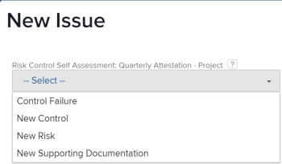

# Configuración de un modelo

Puede configurar los detalles de un modelo antes de instalarlo. Los tipos de modelo de plantilla de proyecto y estructura organizativa suelen requerir que se establezcan algunas preferencias y que se asignen algunas propiedades. Es posible que otros tipos de modelo no requieran configuración y que los instale tal cual. Para obtener más información sobre la instalación, consulte [Instalación de un modelo](/help/quicksilver/administration-and-setup/blueprints/blueprints-install.md).

## Requisitos de acceso

Debe tener el siguiente acceso para realizar los pasos de este artículo:

<table style="table-layout:auto"> 
 <col> 
 <col> 
 <tbody> 
  <tr> 
   <td role="rowheader"><strong>[!DNL Adobe Workfront] plan</strong></td>
   <td>Cualquiera</td> 
  </tr> 
  <tr> 
   <td role="rowheader"><strong>Adobe [!DNL Workfront] licencia</strong></td>
   <td>[!UICONTROL Plan]</td> 
  </tr> 
  <tr> 
   <td role="rowheader"><strong>Configuraciones de nivel de acceso</strong></td>
   <td> 
[!UICONTROL System administrator]
 </td> 
  </tr> 
 </tbody> 
</table>

## Configuración de un modelo de plantilla de proyecto

1. Busque el modelo que desee utilizar.
1. Haga clic en **[!UICONTROL Instalar]** y, a continuación, elija un entorno:

   <table style="table-layout:auto">
        <tr>
        <td><strong>Producción</strong></td>
        <td>La producción es su entorno en directo.</td>
    </tr>
    <tr>
        <td><strong>Vista previa de espacio aislado</strong></td>
        <td>La vista previa de espacio aislado es un entorno de prueba que sirve como réplica del entorno en directo y Workfront la actualiza todos los fines de semana.</td>
    </tr>
    <tr>
        <td><strong>Simulador para pruebas 1 y 2</strong></td>
        <td>El Simulador para pruebas de actualización personalizado es un entorno de prueba independiente que usted actualiza manualmente. Hay un coste adicional para obtener el Simulador para pruebas de actualización personalizado.</td>
    </tr>
   </table>

1. Continúe con las siguientes secciones:

   * [[!UICONTROL Preferencias de plantilla]](#template-preferences)
   * [[!UICONTROL Asignación de funciones]](#role-mapping)
   * [[!UICONTROL Asignación de equipos]](#team-mapping)
   * [[!UICONTROL Asignación de la empresa]g](#company-mapping)
   * [[!UICONTROL Asignación de grupos]](#group-mapping)

## [!UICONTROL Preferencias de plantilla] {#template-preferences}

Elija cómo desea instalar la plantilla.

También puede designar la propiedad de la plantilla antes de instalar el modelo. Puede realizar cambios en estos campos después de instalar la plantilla. Para obtener más información, consulte [Editar plantillas de proyecto](../../manage-work/projects/create-and-manage-templates/edit-templates.md).

![[!UICONTROL Preferencias de plantilla] sección](assets/Blueprints_TemplatePreferences.png)

1. En el [!UICONTROL Preferencias de plantilla] , especifique un nuevo nombre de plantilla.
1. Especifique lo siguiente:

   <table style="table-layout:auto">
    <tr>
        <td><strong>[!UICONTROL Template owner]<strong></td>
        <td>Esta persona recibe permisos de [!UICONTROL Administrar] en la plantilla y se convierte en el propietario del proyecto cuando la plantilla se utiliza para crear un proyecto.</td>
    </tr>
    <tr>
        <td><strong>[!UICONTROL Plantilla patrocinador]</strong></td>
        <td>Normalmente, esta persona es un gerente, ejecutivo o accionista que necesita saber qué está pasando con el proyecto. El patrocinador del proyecto no obtiene acceso adicional al proyecto, pero se añade a las notificaciones por correo electrónico del proyecto.</td>
    </tr>
    <tr>
        <td><strong>[!UICONTROL Portfolio]</strong></td>
        <td>Este es el portafolio al que pertenecerá el proyecto cuando se cree.</td>
    </tr>
    <tr>
        <td><strong>[!UICONTROL Program]</strong></td>
        <td>Este es el programa al que pertenecerá el proyecto cuando se cree.</td>
    </tr>
   </table>

1. Seleccione si la plantilla está instalada como activa o inactiva.
1. Seleccione si desea utilizar las nuevas preferencias de problema definidas, si las preferencias están disponibles.

   Haga clic en **[!UICONTROL Consulte las preferencias del problema]** para revisar las preferencias específicas que se instalarán con el modelo. Los proyectos creados a partir de la plantilla importada utilizan estas preferencias para los nuevos problemas añadidos en la variable [!UICONTROL Problemas] para obtener más información.

   <table style="table-layout:auto"> 
    <col> 
    <col> 
    <tbody> 
     <tr> 
      <td role="rowheader"><strong>Grupos de tema de la cola</strong></td> 
      <td> 
Los grupos de temas de cola definen el nivel más alto de categorías para los problemas o las solicitudes. Los usuarios ven los grupos de temas como opciones de menú al seleccionar dónde enviar las solicitudes. Un grupo de temas puede contener varios temas de cola. Para obtener más información, consulte <a href="../../manage-work/requests/create-and-manage-request-queues/create-topic-groups.md" class="MCXref xref">Crear grupos de temas</a>. 
 </td> 
     </tr> 
     <tr> 
      <td role="rowheader"><strong>Temas de la cola</strong></td> 
      <td> 
Los temas de cola funcionan junto con las reglas de enrutamiento para asignar problemas o solicitudes. Son las opciones de menú que los usuarios seleccionan al introducir un problema o una solicitud, después de seleccionar un grupo de temas. Para obtener más información, consulte <a href="../../manage-work/requests/create-and-manage-request-queues/create-queue-topics.md" class="MCXref xref">Crear temas de cola</a>. 
 </td> 
     </tr> 
     <tr> 
      <td role="rowheader"><strong>Reglas de enrutamiento</strong></td> 
      <td>Las reglas de enrutamiento envían problemas o solicitudes a funciones de trabajo, usuarios o equipos específicos. También pueden enviar las solicitudes a proyectos específicos, distintos del asociado a la cola de solicitudes. Para obtener más información, consulte <a href="../../manage-work/requests/create-and-manage-request-queues/create-routing-rules.md" class="MCXref xref">Crear reglas de enrutamiento</a>. </td> 
     </tr> 
    </tbody> 
   </table>

   >[!INFO]
   >
   >**Ejemplo:** Las nuevas preferencias de problema de este modelo proporcionan cuatro temas de cola. El usuario selecciona uno de estos temas al crear un problema. (Dado que solo existe un grupo de temas, se aplica automáticamente y el usuario no tiene que seleccionarlo). Cuando el usuario completa y envía el problema, las reglas de enrutamiento determinan a qué rol o equipo de trabajo se asigna.
   >
   >
   >

   >[!TIP]
   >
   >* El uso de las preferencias de problemas ayuda a crear coherencia en la forma en que se capturan nuevos problemas o solicitudes en los proyectos.
   >* Al establecer estas preferencias, los proyectos creados a partir de la plantilla no se convierten automáticamente en colas de solicitud. Para obtener información sobre la configuración de una cola de solicitudes, consulte [Crear una cola de solicitud](../../manage-work/requests/create-and-manage-request-queues/create-request-queue.md).
   >* No todos los modelos contienen nuevas preferencias de problemas.

## [!UICONTROL Asignación de funciones] {#role-mapping}

>[!NOTE]
>
>Es posible que esta sección no aparezca en algunos modelos.

Algunas plantillas incluyen funciones de trabajo prescritas. Las funciones de trabajo ayudan a asignar las personas adecuadas cuando la plantilla se convierte en un proyecto. Puede personalizar cómo se asignan las funciones antes de instalar el modelo. Haga clic en **[!UICONTROL Consulte las descripciones de funciones]** para obtener más información sobre las funciones disponibles en el modelo.

El modelo busca por el nombre del rol para ver si coincide alguna función existente. La búsqueda distingue entre mayúsculas y minúsculas, por lo que los nombres deben coincidir exactamente. Si no coinciden las funciones existentes, puede hacer que el modelo las cree por usted.

![[!UICONTROL Asignación de funciones] sección](assets/Blueprints_RoleMapping.png)

1. Si existe una función, puede elegir una de las siguientes opciones:

   1. Cree una función nueva con un nombre diferente y luego escriba el nombre en el cuadro de texto.
   1. Utilice una función existente y, a continuación, seleccione una función en el cuadro de selección.
   1. No utilice el rol asignado. Esta opción no se recomienda porque algunas tareas no tendrán roles asignados.

1. Si no existe una función, puede elegir una de las siguientes opciones:

   1. Cree una función nueva. Esta opción crea la función que recomienda el modelo.
   1. Cree una función nueva con un nombre diferente y luego escriba el nombre en el cuadro de texto.
   1. Utilice una función existente y, a continuación, seleccione una función en el cuadro de selección.
   1. No utilice el rol asignado. Esta opción no se recomienda porque algunas tareas no tendrán roles asignados.

>[!NOTE]
>
>El proceso de instalación no aplica funciones a personas específicas. Debe verificar las personas en esas funciones después de instalar la solución de modelo y asignar personas si es necesario. Para obtener más información, consulte [Acciones que deben realizarse después de instalar un modelo](../../administration-and-setup/blueprints/best-next-actions-after-install.md).

Para obtener más información sobre las funciones de trabajo en [!DNL Workfront], consulte [Crear y administrar funciones de trabajo](../../administration-and-setup/set-up-workfront/organizational-setup/create-manage-job-roles.md).

## [!UICONTROL Asignación de equipos] {#team-mapping}

>[!NOTE]
>
>Es posible que esta sección no aparezca en algunos modelos.

Algunas plantillas incluyen equipos prescritos. Cualquier miembro del equipo puede completar el trabajo asignado a un equipo. Puede personalizar el modo en que se asignan los equipos antes de instalar el modelo. Haga clic en **[!UICONTROL Consulte las descripciones de equipo]** para obtener más información sobre los equipos disponibles en el modelo.

El modelo busca por el nombre del equipo para ver si coincide alguno de los equipos existentes. La búsqueda distingue entre mayúsculas y minúsculas, por lo que los nombres deben coincidir exactamente. Si no coinciden los equipos existentes, puede hacer que el modelo los cree por usted.

![[!UICONTROL Asignación de equipos] sección](assets/Blueprints_TeamMapping.png)

1. Si existe un equipo, puede elegir una de las siguientes opciones:

   1. Cree un nuevo equipo con un nombre diferente y luego escriba el nombre en el cuadro de texto.
   1. Uso [!UICONTROL equipo existente]y, a continuación, seleccione un equipo en el cuadro de selección.
   1. No utilice equipos asignados. Esta opción no se recomienda porque algunas tareas no tendrán equipos asignados.

1. Si no existe un equipo, puede elegir una de las siguientes opciones:

   1. Cree un nuevo equipo. Esta opción crea el equipo que recomienda el modelo.
   1. Cree un nuevo equipo con un nombre diferente y luego escriba el nombre en el cuadro de texto.
   1. Uso [!UICONTROL equipo existente]y, a continuación, seleccione un equipo en el cuadro de selección.
   1. No utilice equipos asignados. Esta opción no se recomienda porque algunas tareas no tendrán equipos asignados.

>[!NOTE]
>
>El proceso de instalación no agrega personas a los equipos. Debe verificar las personas de los equipos después de instalar la solución de modelo y asignar personas si es necesario. Para obtener más información, consulte [Acciones que deben realizarse después de instalar un modelo](../../administration-and-setup/blueprints/best-next-actions-after-install.md).

Para obtener más información sobre cómo funcionan los equipos en [!DNL Workfront], consulte [Crear y administrar equipos](../../people-teams-and-groups/create-and-manage-teams/create-and-mange-teams.md).

## Asignación de empresas {#company-mapping}

>[!NOTE]
>
>Es posible que esta sección no aparezca en algunos modelos.

Algunos proyectos incluyen empresas prescritas. Una empresa es una unidad organizativa que puede representar a su organización, a un departamento de la organización o a un cliente con el que trabaja. Puede personalizar cómo se asignan las empresas antes de instalar el modelo. Haga clic en **[!UICONTROL Consulte las descripciones de las empresas]** para obtener más información sobre las empresas disponibles en el modelo.

El modelo busca por el nombre de la empresa para ver si coincide alguna empresa existente. La búsqueda distingue entre mayúsculas y minúsculas, por lo que los nombres deben coincidir exactamente. Si ninguna empresa existente coincide, puede hacer que el modelo las cree por usted. La empresa principal del modelo se asigna a la empresa principal de su entorno, aunque no tenga el mismo nombre.

![[!UICONTROL Asignación de la empresa] sección](assets/Blueprints_CompanyMapping.png)

1. Si existe una empresa, puede elegir una de las siguientes opciones:

   1. Cree una nueva empresa con un nombre diferente y luego escriba el nombre en el cuadro de texto.
   1. Utilice una empresa existente y, a continuación, seleccione una empresa en el cuadro de selección.\

      La empresa principal del modelo se asigna a la empresa principal de su entorno, aunque no tenga el mismo nombre.
   1. No utilice una empresa asignada. No se recomienda esta opción porque las referencias de la empresa en otros objetos estarán vacías.

1. Si una empresa no existe, puede elegir una de las siguientes opciones:

   1. Crear nueva compañía. Esta opción crea la empresa que recomienda el modelo.
   1. Cree una nueva empresa con un nombre diferente y luego escriba el nombre en el cuadro de texto.
   1. Utilice una empresa existente y, a continuación, seleccione una empresa en el cuadro de selección.
   1. No utilice una empresa asignada. No se recomienda esta opción porque las referencias de la empresa en otros objetos estarán vacías.

>[!NOTE]
>
>Para configurar las empresas después de instalar el modelo, consulte [Acciones que deben realizarse después de instalar un modelo](../../administration-and-setup/blueprints/best-next-actions-after-install.md).

Para obtener información sobre cómo asociar una plantilla a una empresa, consulte [Editar plantillas de proyecto](../../manage-work/projects/create-and-manage-templates/edit-templates.md).

Para obtener información sobre cómo funcionan las empresas en [!DNL Workfront], consulte [Crear y editar empresas](../../administration-and-setup/set-up-workfront/organizational-setup/create-and-edit-companies.md).

## [!UICONTROL Asignación de grupos] {#group-mapping}

>[!NOTE]
>
>Es posible que esta sección no aparezca en algunos modelos.

Algunos modelos incluyen grupos prescritos. Un grupo es un grupo de usuarios que coincide con su estructura departamental. Los grupos son similares a los equipos y las empresas de Workfront, pero distintos de ellos. Puede personalizar cómo se asignan los grupos antes de instalar el modelo. Haga clic en **[!UICONTROL Consulte las descripciones de grupo]** para obtener más información sobre los grupos disponibles en el modelo.

El modelo busca por el nombre del grupo para ver si coincide alguno de los grupos existentes. La búsqueda distingue entre mayúsculas y minúsculas, por lo que los nombres deben coincidir exactamente. Si no coinciden los grupos existentes, puede hacer que el modelo los cree por usted.

![[!UICONTROL Asignación de grupos] sección](assets/Blueprints_GroupMapping.png)

1. Si existe un grupo, puede seleccionar **[!UICONTROL Grupo de reasignación]** y elija una de las siguientes opciones:

   1. **[!UICONTROL Crear un nuevo grupo con un nombre diferente]** y, a continuación, escriba el nombre que desea asignar a este grupo. Las referencias al grupo en la definición del modelo se asociarán a este nuevo grupo.
   1. **[!UICONTROL Reemplazar por un grupo existente]** y, a continuación, busque y seleccione un grupo en el cuadro de selección.

      >[!NOTE]
      >
      >No se puede cambiar el nombre de un grupo existente.

1. Si un grupo no existe, puede:

   1. Cambie el nombre del grupo sugerido escribiéndolo en el cuadro de texto.
   1. Select **[!UICONTROL Grupo de reasignación]** y elija [!UICONTROL Reemplazar por un grupo existente]y, a continuación, busque y seleccione un grupo en el cuadro de selección.
   1. Select **[!UICONTROL Grupo de reasignación]** y elija **[!UICONTROL Insertar en un grupo existente]** y, a continuación, busque y seleccione un grupo en el cuadro de selección. Esta opción crea un nuevo subgrupo bajo el grupo existente.

>[!NOTE]
>
>Para configurar los grupos después de instalar el modelo, consulte [Acciones que deben realizarse después de instalar un modelo](../../administration-and-setup/blueprints/best-next-actions-after-install.md).

Para obtener información sobre el uso de grupos en [!DNL Workfront], consulte [Información general sobre grupos](../../administration-and-setup/manage-groups/groups-overview/groups.md).
