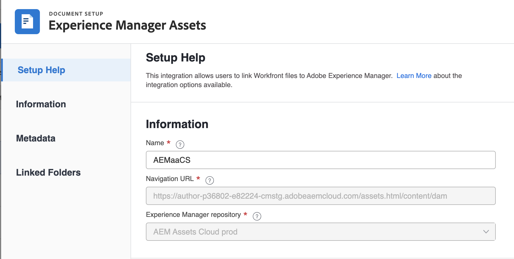
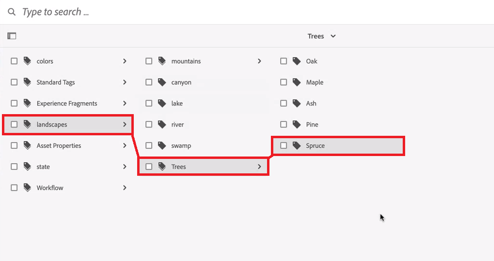
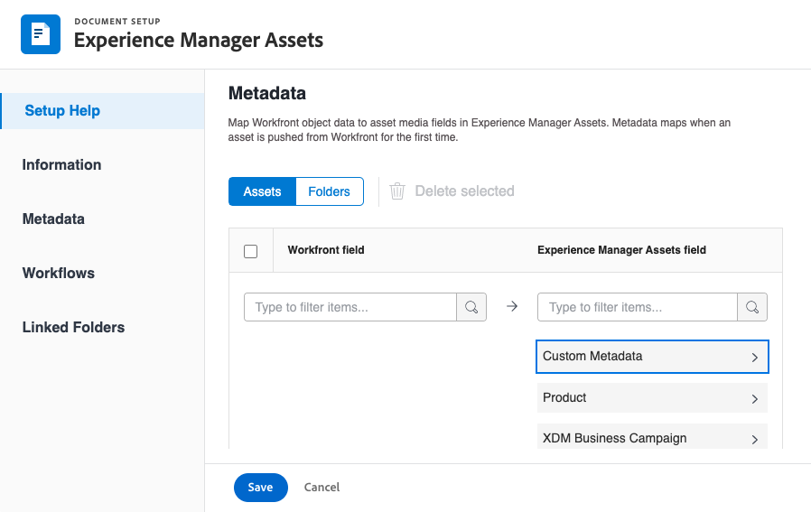
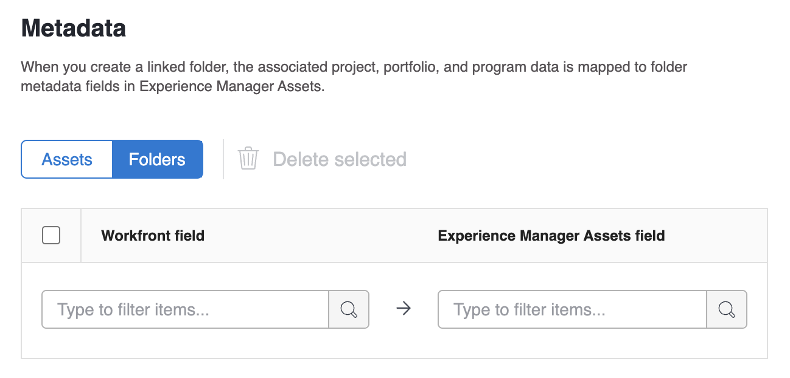

# Configure las variables [!UICONTROL Experience Manager Assets as a Cloud Service] integración

<!-- Audited: 1/2024 -->

>[!IMPORTANT]
>
>Esta funcionalidad solo está disponible para las organizaciones que se han incorporado al [!DNL Adobe Admin Console].

Puede conectar su trabajo con el contenido en [!DNL Experience Manager Assets]dividido en:

* Insertar recursos y metadatos de [!DNL Adobe Workfront] hasta [!DNL Experience Manager Assets]palo de golf
* Vincular recursos de [!DNL Experience Manager Assets] a sus proyectos y tareas en [!DNL Workfront&#x200B;]
* Facilitar casos de uso de versiones
* Crear carpetas vinculadas a [!DNL Experience Manager Assets]
* Seguimiento de metadatos para recursos y carpetas
* Sincronizar metadatos de proyecto entre [!DNL Workfront] y [!DNL Experience Manager Assets]

>[!NOTE]
>
>También puede conectar varias [!DNL Experience Manager Assets] repositorios a uno [!UICONTROL Workfront] entorno o varios [!DNL Workfront] Entornos a uno [!DNL Experience Manager Assets] Repositorio en los ID de organización. Siga las instrucciones de configuración de este artículo para cada integración que desee configurar.

## Requisitos de acceso

Debe tener lo siguiente:

<table>
  <tr>
   <td><strong>[!DNL Adobe Workfront] plan</strong>
   </td>
   <td>Cualquiera
   </td>
  </tr>
  <tr>
   <td><strong>[!DNL Adobe Workfront] licencias</strong>
   </td>
   <td>Actual: [!UICONTROL plan]  
   Nuevo: [!UICONTROL Standard]
   </td>
  </tr>
  <tr>
   <td><strong>[!DNL Experience Manager] licencia</strong>
   </td>
   <td>[!UICONTROL Standard]
   </td>
  </tr>
  <tr>
   <td><strong>Product</strong>
   </td>
   <td>Debe tener [!DNL Experience Manager Assets as a Cloud Service]y se le debe añadir al producto como usuario.
   </td>
  </tr>
  <tr>
   <td>Configuraciones de nivel de acceso*
   </td>
   <td>Debe ser un [!DNL Workfront] administrador.
   </td>
  </tr>
</table>

Para obtener más información sobre esta tabla, consulte [Requisitos de acceso en la documentación de Workfront](/help/quicksilver/administration-and-setup/add-users/access-levels-and-object-permissions/access-level-requirements-in-documentation.md).

## Requisitos previos

Antes de empezar,

* Debe tener [!DNL Workfront] y [!DNL Adobe Experience Manager Assets] asociado a un ID de organización en [!DNL Adobe Admin Console]. Para obtener más información, consulte [Diferencias de administración basadas en la plataforma ([!DNL Adobe Workfront]/[!DNL Adobe Business Platform])](/help/quicksilver/administration-and-setup/get-started-wf-administration/actions-in-admin-console.md).

## Configuración de la información de integración

{{step-1-to-setup}}

1. Seleccionar **[!UICONTROL Documentos]** en el panel izquierdo, seleccione **[!UICONTROL [!DNL Experience Manager]Integración]**.

   >[!NOTE]
   >
   >Esta área de configuración solo aparece si su [!DNL Workfront] El entorno de se incluye en una [!DNL Adobe Admin Console].

1. Seleccionar **[!UICONTROL Añadir [!DNL Experience Manager] Integración]**.
1. En el **[!UICONTROL Nombre]** , introduzca el nombre que desea que los usuarios vean al interactuar con esta integración en Workfront y Experience Manager Assets.
1. En el **[!UICONTROL URL de navegación]** , el sistema rellena automáticamente la URL de navegación. Esta dirección URL de solo lectura se utiliza para vincular con la dirección URL de su organización [!DNL Experience Manager] instancia desde el [!UICONTROL Menú principal] para un acceso rápido.
1. Elija un repositorio de la **[!UICONTROL [!DNL Experience Manager]Repositorio de recursos]** menú desplegable. El sistema rellena automáticamente cualquier [!DNL Experience Manager] repositorios asociados con el ID de organización al que está asignado el perfil de usuario.
   

1. Clic **[!UICONTROL Guardar]** o continúe con la [Configuración de metadatos (opcional)](#set-up-metadata-optional) de este artículo.

   >[!NOTE]
   >
   >Debido a la complejidad de la integración, no puede cambiar el repositorio después de guardar la configuración inicial.

## Configuración de metadatos (opcional)

Puede asignar [!DNL Workfront] datos de objeto a campos de medios de recursos en [!DNL Experience Manager] Recursos.

>[!IMPORTANT]
>
>Los metadatos solo se pueden asignar en una dirección: desde [!DNL Workfront] hasta [!DNL Experience Manager]. Metadatos de documentos vinculados a [!DNL Workfront] de [!DNL Experience Manager] no se puede transferir a [!DNL Workfront].

### Configurar campos de metadatos

Antes de empezar a asignar campos de metadatos, debe configurarlos tanto en Workfront como en Experience Manager Assets.

Para configurar campos de metadatos:

1. Configuración de un esquema de metadatos en [!DNL Experience Manager Assets] como se explica en [Configuración de la asignación de metadatos de recursos entre Adobes [!DNL Workfront] y [!DNL Experience Manager Assets]](https://experienceleague.adobe.com/docs/experience-manager-cloud-service/content/assets/integrations/configure-asset-metadata-mapping.html?lang=en).

1. Configure campos de formulario personalizados en Workfront. [!DNL Workfront] tiene muchos campos personalizados integrados que puede utilizar. Sin embargo, también puede crear sus propios campos personalizados, tal como se explica en [Crear o editar un formulario personalizado](/help/quicksilver/administration-and-setup/customize-workfront/create-manage-custom-forms/create-or-edit-a-custom-form.md).

+++ **Amplíe para ver más información sobre los campos Workfront y Experience Manager Assets compatibles**

**Etiquetas de Experience Manager Assets**

Puede asignar cualquier campo compatible con Workfront a una etiqueta de Experience Manager Assets. Para ello, debe asegurarse de que los valores de las etiquetas en Experience Manager Assets coinciden con Workfront.

* Los valores de los campos Etiquetas y Workfront deben coincidir exactamente en cuanto a ortografía y formato.
* Los valores de los campos de Workfront asignados a las etiquetas de recursos de Experience Manager deben estar en minúsculas, incluso si la etiqueta de Experience Manager Assets parece tener letras mayúsculas.
* Los valores de los campos de Workfront no deben incluir espacios.
* El valor del campo en Workfront también debe incluir la estructura de carpetas de la etiqueta Experience Manager Assets.
* Para asignar varios campos de texto de una sola línea a las etiquetas, introduzca una lista separada por comas de los valores de las etiquetas en el lado Workfront de la asignación de metadatos, y `xcm:keywords` en el lado de Experience Manager Assets. Cada valor de campo se asigna a una etiqueta independiente. Puede utilizar un campo calculado para combinar varios campos de Workfront en un único campo de texto separado por comas.
* Puede asignar valores de los campos desplegable, botón de opción o casilla de verificación introduciendo una lista separada por comas de los valores disponibles en ese campo.

>[!INFO]
>
>**Ejemplo**: Para que coincida con la etiqueta que se muestra en la estructura de carpetas, el valor del campo en Workfront sería `landscapes:trees/spruce`. Tenga en cuenta las letras minúsculas en el valor del campo Workfront.
>
>Si desea que la etiqueta sea el elemento situado más a la izquierda en el árbol de etiquetas, debe ir seguida de dos puntos. En este ejemplo, para asignar a la etiqueta de paisajes, el valor de campo en Workfront sería `landscapes:`.
>
>

Una vez creadas las etiquetas en Experience Manager Assets, aparecerán en la lista desplegable Etiquetas de la sección Metadatos. Para vincular un campo a una etiqueta, seleccione `xcm:keywords` en el menú desplegable del campo Experience Manager Assets, en el área de asignación de metadatos.

Para obtener más información sobre las etiquetas en Experience Manager Assets, incluido cómo crear y administrar etiquetas, consulte [Administración de etiquetas](https://experienceleague.adobe.com/docs/experience-manager-64/administering/contentmanagement/tags.html).

**Campos de esquema de metadatos personalizados de Experience Manager Assets**

Puede asignar campos de Workfront integrados y personalizados a campos de esquema de metadatos personalizados en Experience Manager Assets.

Los campos de metadatos personalizados creados en Experience Manager Assets se organizan en su propia sección, en el área de Configuración de metadatos.

<!-- 
link to documentation about creating schema - waiting on response from Anuj about best article to link to
-->

**Campos de Workfront**

Puede asignar campos de Workfront integrados y personalizados a Experience Manager Assets. Los siguientes valores de campo deben coincidir en ambos casos y entre Workfront y Experience Manager Assets:

* Campos desplegables
* Campos de selección múltiple

>[!TIP]
>
> Para comprobar si los valores del campo coinciden exactamente, vaya a
>
> * Configuración > Forms personalizado en Workfront o el campo en el objeto
> * Recursos > Esquemas de metadatos en Experience Manager Assets

+++

### Asignar metadatos a los recursos

Los metadatos se asignan cuando se inserta un recurso desde [!DNL Workfront] por primera vez. Los documentos con los campos integrados o personalizados se asignan automáticamente a los campos especificados la primera vez que se envía un recurso a [!DNL Experience Manager Assets].

Para asignar metadatos a los recursos:

<!--
1. Select **[!UICONTROL Assets]** above the metadata table.
-->
1. En el **[!UICONTROL [!DNL Workfront]campo]** , elija un campo integrado o personalizado de Workfront.

   >[!NOTE]
   >
   >Puede asignar un solo [!DNL Workfront] campo a múltiple [!UICONTROL Experience Manager Assets] campos. No se pueden asignar varios [!DNL Workfront] campos a un único [!DNL Experience Manager Assets] field.
   ><!--To map a Workfront field to an Experience Manager Assets tag, see -->

1. En el [!DNL Experience Manager Assets] , busque en las categorías previamente completadas o escriba al menos dos letras en el campo de búsqueda para acceder a categorías adicionales.
1. Repita los pasos 2 y 3 según sea necesario.
   
1. Clic [!UICONTROL Guardar] o continúe con la [Configuración de flujos de trabajo](#set-up-workflows-optional) de este artículo.

<!--

### Map metadata for folders

When users create a linked folder on a project, the associated project, portfolio, and program data is mapped to folder metadata fields in [!DNL Experience Manager Assets].

>[!NOTE]
>
>This integration does not support custom metadata from [!DNL Adobe Experience Manager].

To map metadata for folders: 

1. Select **[!UICONTROL Folders]** above the metadata table.
1. In the **[!UICONTROL [!DNL Workfront] field]** column, choose a built-in or custom Workfront field.

    >[!NOTE]
    >
    >You can map a single Workfront field to multiple Experience Manager Assets fields. You can't map multiple [!DNL Workfront] fields to a single [!DNL Experience Manager Assets] field.

1. In the **[!DNL Experience Manager Assets]** field, search through the pre-populated categories or enter at least two letters in the search field to access additional categories.
1. Repeat steps 2 and 3 as needed.

1. Click **[!UICONTROL Save]** or move on to the [Project metadata sync](#project-metadata-sync) section in this article.

### Object metadata sync

An [!DNL Experience Manager] fields that is mapped to [!DNL Workfront] portfolio, program, project, task, issue, and document fields update automatically when the field is changed in [!DNL Workfront].

When this option is enabled, any asset that has been pushed to Adobe Experience manager includes a card on the Document Details page that displays a real-time view of the document's Adobe Experience Manager metadata.

>[!IMPORTANT]
>
>Users must have write access in [!DNL Experience Manager] for assets living in the object in order for the metadata to sync when it's updated.

1. Enable the **[!UICONTROL Sync object metadata]** field.
1. Click **Save** or move on to the [Set up workflows (Optional)](#set-up-workflows-optional) section in this article.-->

## Configuración de flujos de trabajo (opcional)

Un flujo de trabajo es un conjunto de acciones que conectan Workfront con Adobe Experience Manager as a Cloud Service. Como administrador de Workfront, puede configurar flujos de trabajo en Workfront y, a continuación, asignarlos a plantillas de proyecto. Cuando se crea un proyecto utilizando una plantilla de proyecto a la que se asigna un flujo de trabajo, se activan las acciones definidas en el flujo de trabajo.

Los flujos de trabajo están habilitados y configurados para Adobe Experience Manager en su conjunto. Estos flujos de trabajo se pueden aplicar a las plantillas de proyecto y ajustar o personalizar en el nivel de plantilla o proyecto.

Los siguientes flujos de trabajo están disponibles en la integración de Adobe Experience Manager:

* [Crear carpetas vinculadas de Adobe Experience Manager](#create-adobe-experience-manager-linked-folders)
* [Publicar recursos enviados a Adobe Experience Manager Assets](#publish-assets-that-are-sent-to-adobe-experience-manager-assets)

### Crear carpetas vinculadas de Adobe Experience Manager

1. Alternar el **[!UICONTROL Crear carpeta vinculada]** en.
1. Escriba un nombre para la carpeta vinculada que está creando.
1. (Condicional) Habilite la variable **Árbol de carpetas predeterminado** si desea que esta carpeta vinculada sea la carpeta predeterminada para los proyectos creados con plantillas que utilizan esta integración. Puede seleccionar una o varias carpetas predeterminadas.
1. Elija una ruta de carpeta para indicar dónde desea que estén asociadas todas las carpetas vinculadas con esta integración.
1. (Condicional) Para agregar un árbol de carpetas (carpetas anidadas) a esta integración, haga lo siguiente:

   1. Haga clic en **Añadir carpeta** icono .
   1. En el **Tipo de nombre** , seleccione cómo desea asignar un nombre a la carpeta:

      * **Nombre**: escriba un nombre para la carpeta.
      * **Datos de objeto**: seleccione el origen del nombre de la carpeta, como Nombre del proyecto.

      >[!NOTE]
      >
      >* Los nombres de carpeta deben tener menos de 100 caracteres.
      >* Los siguientes caracteres se eliminarán de los nombres de carpeta:
      >
      >   `/`, `:`, `[`, `]`, `|`, `*`

   1. Para añadir una carpeta anidada al árbol de carpetas, haga clic en el menú de tres puntos situado junto a la carpeta en la que desea crear una carpeta anidada y seleccione **Añadir carpeta**. Rellene los campos como se describe en el paso anterior.
   1. Para vincular una carpeta a Workfront, selecciónela y haga clic en **Crear carpeta vinculada**   icono .
   1. (Opcional) Para editar una carpeta, selecciónela y haga clic en **Editar carpeta** icono .
   1. (Opcional) Para eliminar una carpeta, selecciónela y haga clic en **Eliminar carpeta** icono .
1. (Condicional) Para agregar otro árbol de carpetas, haga clic en **+ Agregar árbol de carpetas** y siga los pasos del paso 5.

1. Clic **[!UICONTROL Guardar]**, o continúe con la [Publicar recursos enviados a Adobe Experience Manager Assets](#publish-assets-that-are-sent-to-adobe-experience-manager-assets) de este artículo.

>[!NOTE]
>
>* Esta integración no creará más de 100 carpetas, independientemente de cuántos árboles de carpetas se creen. Por ejemplo, una integración con 4 árboles de carpetas puede crear hasta 100 carpetas, no 400 carpetas.
>* La primera carpeta del árbol de carpetas se marca automáticamente como vinculada a Workfront. Si no desea vincular esta carpeta, puede desvincularla.
>* Si no se proporciona ningún árbol de carpetas, la carpeta raíz se convierte en la carpeta vinculada.

### Publicar recursos enviados a Adobe Experience Manager Assets

1. Alternar en **[!UICONTROL Publicar recursos automáticamente]**.
1. Marque la casilla junto a la ubicación en la que desea publicar los recursos enviados a los recursos de Adobe Experience Manager. Puede activar una o ambas opciones.
1. (Condicional) Si ha habilitado la opción Brand Portal, seleccione la Brand Portal en la que desea publicar los recursos.
1. Clic **[!UICONTROL Guardar]** o continúe con la [Configuración de carpetas vinculadas (opcional)](#set-up-linked-folders-optional) de este artículo.

## Configuración de carpetas vinculadas (opcional)

Puede permitir a los usuarios crear carpetas vinculadas a [!DNL Experience Manager] mientras está en [!DNL Workfront] proyecto. Cuando se vincula una carpeta, cualquier recurso agregado a la carpeta se muestra automáticamente en ambas [!DNL Workfront] y [!DNL Experience Manager]. Cuando se agrega un recurso a la carpeta vinculada en [!DNL Workfront] por primera vez, los metadatos del recurso se insertan en [!DNL Experience Manager Assets].

En los pasos siguientes, indique dónde desea que se creen las carpetas vinculadas. Cada integración solo puede tener una ubicación para todas las carpetas vinculadas.

Para configurar carpetas vinculadas:

1. Alternar el **[!UICONTROL Habilitar carpeta vinculada]** en.
1. Elija una ruta de carpeta para indicar dónde desea que estén asociadas todas las carpetas vinculadas con esta integración.

   >[!NOTE]
   >
   >Los usuarios necesitan acceso de escritura en [!DNL Adobe Experience Manager Assets] a la carpeta especificada para crear una carpeta vinculada.

1. Haga clic en **[!UICONTROL Guardar]**.
