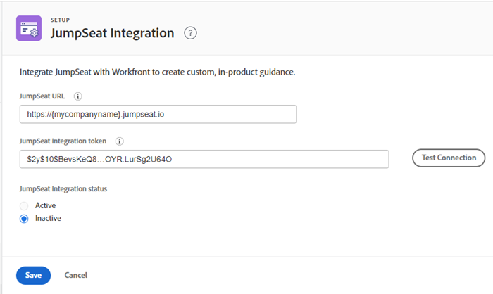

# Configuración de la integración de JumpSeat

Se puede integrar [!DNL JumpSeat] con [!DNL Workfront] para crear orientación personalizada en el producto.

## Requisitos de acceso

Debe tener el siguiente acceso para realizar los pasos de este artículo:

<table style="table-layout:auto"> 
 <col> 
 <col> 
 <tbody> 
  <tr> 
   <td role="rowheader"><strong>[!DNL Adobe Workfront] plan*</strong></td> 
   <td> 
[!UICONTROL Enterprise] 
 </td> 
  </tr> 
  <tr> 
   <td role="rowheader"><strong>[!DNL Adobe Workfront] licencia*</strong></td> 
   <td>[!UICONTROL Plan]</td> 
  </tr> 
  <tr> 
   <td role="rowheader"><strong>Product</strong></td> 
   <td>Debe tener un activo [!DNL JumpSeat] plan.</td> 
  </tr> 
  <tr> 
   <td role="rowheader"><strong>Configuraciones de nivel de acceso*</strong></td> 
   <td> 
 Debe ser un [!DNL Workfront] administrador. Para obtener información sobre [!DNL Workfront] administradores, consulte <a href="../../administration-and-setup/add-users/configure-and-grant-access/grant-a-user-full-administrative-access.md" class="MCXref xref">Conceder a un usuario acceso administrativo completo</a>.
 </td> 
  </tr> 
 </tbody> 
</table>

&#42;Para saber qué plan, tipo de licencia o acceso tiene, póngase en contacto con su [!DNL Workfront] administrador.

## Requisitos previos

Antes de empezar, debe

* Agregar y activar [!DNL Workfront] como aplicación en [!DNL JumpSeat]. Para obtener más información, consulte [Cómo Agregar O Eliminar Una Aplicación](https://support.jumpseat.io/article/how-to-add-an-application/).

## Configure las variables [!DNL JumpSeat] integración

Se recomienda configurar un [!DNL JumpSeat] integración en los entornos de Previsualización y Producción.

>[!TIP]
>
>Debe agregar y activar dos dispositivos independientes [!DNL Workfront] aplicaciones en [!DNL JumpSeat]: uno para la vista previa y otro para la producción. Consulte [Cómo Agregar O Eliminar Una Aplicación](https://support.jumpseat.io/article/how-to-add-an-application/) para obtener más información.

Para configurar la variable [!DNL JumpSeat] integración:

1. Haga clic en **[!UICONTROL Menú principal]** icono  en la esquina superior derecha de [!DNL Adobe Workfront], luego haga clic en **[!UICONTROL Configurar]**.
1. En el panel izquierdo, haga clic en **[!UICONTROL Sistema]** > **[!UICONTROL [!DNL JumpSeat]Integración]**.
1. Introduzca su **[!UICONTROL [!DNL JumpSeat]URL]**, que se encuentra en el icono de su extensión en [!DNL JumpSeat].

   **Ejemplo:** [!DNL https]://{mycompanyname}.jumpseat.io

1. Introduzca el **[!UICONTROL [!DNL JumpSeat]token de integración]**. Puede encontrar esto en la **[!UICONTROL Configuración]** página en [!DNL JumpSeat].

   **Ejemplo:** $2y$10$BevsKeQ8....OYR.LurSg2U64O

1. Clic **[!UICONTROL Probar configuración]**.
1. Elija si desea que la integración sea **[!UICONTROL Activo]** o **[!UICONTROL Inactivo]**.

   >[!IMPORTANT]
   >
   >La prueba de configuración realizada en el paso 5 debe pasar para activar la integración.

   

1. Haga clic en **[!UICONTROL Guardar]**.

>[!TIP]
>
>Para obtener más información sobre la configuración de [!DNL JumpSeat] integración, consulte las [!DNL JumpSeat] documentación para [JumpSeat+Workfront](https://jumpseat.io/landing-page/jumpseat-workfront/).
