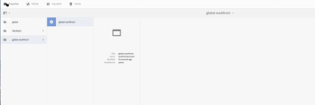

# Configurar [!DNL Workfront] con [!DNL Adobe Experience Manager] conector heredado

Como [!DNL Adobe Workfront] administrador, puede integrar [!DNL Workfront] con [!UICONTROL Recursos Adobe Experience Manager (AEM)] y proporcione a su organización una solución de administración de contenido completa para la creación, el uso compartido y el mantenimiento de recursos dentro del flujo de trabajo.

## Requisitos de acceso

Debe tener el siguiente acceso para realizar los pasos de este artículo:

<table style="table-layout:auto"> 
 <col> 
 <col> 
 <tbody> 
  <tr> 
   <td role="rowheader">[!DNL Adobe Workfront] plan*</td> 
   <td>Cualquiera</td> 
  </tr> 
  <tr> 
   <td role="rowheader">[!DNL Adobe Workfront] licencia*</td> 
   <td>[!UICONTROL Plan]</td> 
  </tr> 
  <tr> 
   <td role="rowheader">Configuraciones de nivel de acceso*</td> 
   <td> <p>Debe ser [!DNL Workfront] administrador. Para obtener información sobre [!DNL Workfront] administradores, consulte <a href="../../administration-and-setup/add-users/configure-and-grant-access/grant-a-user-full-administrative-access.md" class="MCXref xref">Conceder a un usuario acceso administrativo completo</a>.</p> </td> 
  </tr> 
 </tbody> 
</table>

&#42;Para saber qué plan, tipo de licencia o acceso tiene, póngase en contacto con su [!DNL Workfront] administrador.

## [!DNL Workfront for AEM Assets]

La variable [!DNL Workfront for AEM Assets connector] permite a su organización hacer lo siguiente:

* Colabore y administre contenido creativo vinculando AEM recursos y carpetas a proyectos, tareas, problemas y solicitudes en [!DNL Workfront].

   Para obtener más información sobre la configuración de integraciones de documentación con aplicaciones de terceros, consulte  [Configurar integraciones de documentos](../../administration-and-setup/configure-integrations/configure-document-integrations.md).

* Integración con [!DNL AEM Digital Asset Managemen]repositorio t (DAM), que le permite usar [!DNL Workfront] para administrar y compartir recursos digitales almacenados en DAM.

   Para obtener más información sobre la vinculación de documentos y carpetas de recursos, consulte   [Vincular documentos de aplicaciones externas](../../documents/adding-documents-to-workfront/link-documents-from-external-apps.md).

* Combine y aplique metadatos de ambas aplicaciones a un recurso.
* Vea un flujo de comunicación todo incluido para un recurso. Actualizaciones y comentarios realizados en un recurso en [!DNL Workfront] o [!UICONTROL AEM Assets] se sincronizan con la otra aplicación, estableciendo un historial completo de comunicaciones realizadas al recurso.

   Para obtener más información sobre cómo realizar comentarios en [!DNL Workfront], consulte [Agregar una actualización a un documento](../../documents/managing-documents/add-update-documents.md).

## Requisitos previos para instalar la variable [!DNL AEM Assets] connector

Antes de instalar la variable [!DNL Workfront] conector para [!UICONTROL AEM Assets], asegúrese de que se cumplen los siguientes requisitos previos:

* [!UICONTROL AEM Assets] instalado y configurado, versión 6.5 o posterior. Para obtener información sobre la instalación [!UICONTROL AEM Assets], consulte la [[!DNL Adobe Experience Manager] documentación](https://experienceleague.adobe.com/docs/experience-manager.html).
* (Condicional) Si las reglas del cortafuegos no permiten el tráfico como se espera, agregue la dirección IP o el dominio del clúster a la lista de permitidos. Para obtener más información, consulte [Configurar la lista de permitidos del cortafuegos](../../administration-and-setup/get-started-wf-administration/configure-your-firewall.md).

## Instale el [!DNL Workfront for AEM Assets] paquete de conector {#install-the-workfront-for-aem-assets-connector-package}

>[!IMPORTANT]
>
>Las siguientes instrucciones son para un [!DNL Workfront with AEM Assets] conector heredado que se ha sustituido por el [[!DNL Workfront for Experience Manager] conector mejorado](../../documents/workfront-and-experience-manager-integrations/workfront-for-experience-manager-enhanced-connector/workfront-for-aem-enhanced-connector.md). Póngase en contacto con su representante de cuentas para obtener más información.

Para instalar el [!DNL Workfront for AEM Assets] conector, debe importar el conector en AEM como paquete utilizando la variable [!UICONTROL Administrador de paquetes CRX].

1. En una estación de trabajo en la que ya haya instalado AEM, descargue el [!DNL Workfront for AEM Assets] Archivo de instalación del conector.

   Puede obtener la variable [!DNL Workfront for AEM Assets] conector del [!DNL Workfront] representante.

1. Inicie sesión en AEM con una cuenta de administrador.
1. Haga clic en **[!UICONTROL Herramientas]** > **[!UICONTROL Implementación]** > **[!UICONTROL Paquetes]**.

   La variable [!UICONTROL Administrador de paquetes CRX] se abre.

1. Haga clic en **[!UICONTROL Cargar paquete].**

1. En el [!UICONTROL Cargar paquete] , busque y seleccione el [!UICONTROL Conector de Workfront] y, a continuación, haga clic en **[!UICONTROL OK]**.\
   El paquete se muestra en la [!UICONTROL Administrador de paquetes CRX].

1. Haga clic en **[!UICONTROL Instalar].**

1. En el [!UICONTROL Paquete] , ignore la configuración avanzada y haga clic en **[!UICONTROL Instalar]**.
1. (Opcional) Para confirmar que el conector se ha instalado correctamente, asegúrese de que la siguiente instrucción aparece en la sección [!UICONTROL Registro de actividades]:

   ```
   Package installed in <time>
   ```

1. Cierre las [!UICONTROL Administrador de paquetes CRX].

   El conector está instalado y ahora puede configurar [!DNL AEM Assets] para integrar con [!DNL Workfront].

1. Continuar con [Configurar [!DNL AEM Assets] para integrar con [!DNL Workfront]](#configure-aem-assets-to-integrate-with-workfront).

## Configurar [!DNL AEM Assets] para integrar con [!DNL Workfront] {#configure-aem-assets-to-integrate-with-workfront}

Después de instalar el conector, importe el paquete del conector en AEM y configure AEM para vincularlo a los documentos en [!DNL Workfront].

Para obtener información sobre la instalación del conector, consulte  [Instale el [!DNL Workfront for AEM Assets] paquete de conector](#install-the-workfront-for-aem-assets-connector-package).

* [Requisitos previos](#prerequisites)
* [Integrar AEM con [!DNL Workfront]](#integrate-aem-with-workfront)
* [Configure las variables [!UICONTROL AEM externalizador]](#configure-the-aem-externalizer)

### Requisitos previos {#prerequisites}

Antes de empezar, debe habilitar los permisos para el servicio principal de trabajo:

1. En AEM, vaya a **[!UICONTROL Herramientas]**> **[!UICONTROL Seguridad]**> **[!UICONTROL Permisos]**.
1. En la esquina superior izquierda, elija **[!UICONTROL Usuarios]**&#x200B; en el menú desplegable y escriba *[!UICONTROL workfront-service]* en el **[!UICONTROL Buscar]**&#x200B; campo . Seleccione el [!UICONTROL workfront-service] usuario.
1. En el lado derecho de la pantalla, seleccione **[!UICONTROL Añadir ACE]** para crear nuevas entradas.
1. En el &#x200B;**[!UICONTROL Agregar nueva entrada]**&#x200B; ventana, seleccione el icono de casilla de verificación en la **[!UICONTROL Ruta]**&#x200B; campo y seleccione la carpeta : */conf*
1. En el campo Privilegios , introduzca: *jcr:read*
1. Select **[!UICONTROL Agregar]**&#x200B; en la esquina superior derecha
1. (Opcional) Repita los pasos para crear más entradas.

### Integrar AEM con [!DNL Workfront] {#integrate-aem-with-workfront}

1. Inicie sesión en AEM Assets como administrador.
1. Haga clic en **[!UICONTROL Herramientas]** >**[!UICONTROL Cloud Services]**>**[!UICONTROL Configuración de integración de Workfront]** >**[!UICONTROL Global-Workfront].**&#x200B;**&#x200B;**

1. (Condicional) Si aún no lo ha hecho, cree un [!DNL Workfront] archivo de configuración de nube.

   1. Haga clic en  **[!UICONTROL Crear]** en la esquina superior derecha del [!DNL Global-Workfront] página.
   1. En el **[!UICONTROL URL de Workfront]** especifique la dirección URL de su [!DNL Workfront] instancia.

      Por ejemplo, [!DNL https]://`<account>`.my.workfront.com, donde `<account>` es la cuenta que utiliza para las integraciones con AEM.

   1. En el &#x200B;**[!UICONTROL Carpeta base]** , seleccione el icono de casilla de verificación y, en el menú desplegable, seleccione la ruta donde están vinculados los documentos [!DNL Workfront] se almacenan.
   1. En el modal de AEM que aparece, siga la ruta a la carpeta con los documentos conectados a [!DNL Workfront] objetos. Elija la carpeta y pulse **[!UICONTROL Select]**&#x200B; en la esquina superior derecha.

      Puede vincular a cualquier carpeta debajo de la raíz /content/dam/.

   1. En el **[!UICONTROL Clave de API de Workfront]** especifique su [!UICONTROL Workfront] Clave de API.

      Para recuperar el [!DNL Workfront] Clave de API:

      1. Abra una pestaña del explorador e inicie sesión en su [!DNL Workfront] cuenta como [!DNL Workfront] administrador.
      1. Haga clic en el **[!UICONTROL Menú principal]** icono  en la esquina superior derecha de [!DNL Adobe Workfront]y haga clic en **[!UICONTROL Configuración]** .

      1. Haga clic en **[!UICONTROL Sistema]** >**[!UICONTROL Información del cliente]**.

         Si ya ha generado una clave de API, su [!DNL Workfront] La clave de API se muestra en la etiqueta Clave de API del usuario.

      1. (Condicional) Si aún no ha generado una clave de API, debe generar una:

         1. En el **[!UICONTROL Configuración de clave de API]** asegúrese de que la función **[!UICONTROL Después de la creación, las claves de API caducan en]** está configurada en None.

            Si selecciona un periodo de caducidad, el conector dejará de funcionar una vez caducada la clave de API. A continuación, tendrá que volver a generar una clave de API y actualizar su [!DNL Workfront] configuración.

         1. En el **[!UICONTROL Clave de API del usuario]** etiqueta, haga clic en **[!UICONTROL Generar clave de API]**.

            Una clave de API para [!DNL Workfront] genera y muestra.
      1. Copie la clave de API en el portapapeles.
      1. Abra la pestaña del explorador para AEM conector y en la sección **[!DNL Workfront API Key]** , pegue la clave de API que ha copiado.
   1. (Condicional) Haga clic en el **[!UICONTROL Avanzadas]** en la esquina superior izquierda de la pestaña [!UICONTROL [!DNL Workfront] Configuración de integración] y seleccione las siguientes opciones, si corresponde:

      **[!UICONTROL Permitir exploración de colecciones]:**&#x200B; Seleccione esta opción si su organización lo permite [!DNL Workfront] usuarios para vincular colecciones de AEM Assets a [!DNL Workfront] objetos.

      **[!UICONTROL Federated ID de usuario]:** Seleccione esta opción si su organización utiliza Federated ID o Single Sign-On (SSO) al iniciar sesión en Workfront.

      **[!UICONTROL Ignorar dominio de correo electrónico]:** Seleccione esta opción si los usuarios de AEM no utilizan el nombre de dominio en su ID de usuario.

      **[!UICONTROL Restringir acceso]:** Seleccione esta opción para especificar la [!DNL Workfront] Direcciones IP que deben agregarse a la lista de permitidos . Para obtener más información sobre la lista de permitidos, consulte [Configurar la lista de permitidos del cortafuegos](../../administration-and-setup/get-started-wf-administration/configure-your-firewall.md).

   1. Haga clic en el **[!UICONTROL Básico]** en la esquina superior izquierda de la página Configuración de integración de Workfront y, a continuación, haga clic en **[!UICONTROL Connect]**.

      >[!NOTE]
      >
      >Los cambios pueden tardar algún tiempo en aplicarse. El reinicio del paquete puede acelerar el proceso.


1. (Condicional) Si ya ha creado un [!DNL Workfront] archivo de configuración de nube, seleccione **[!UICONTROL Global-[!DNL Workfront]]** y, a continuación, en la esquina superior izquierda, haga clic en **[!UICONTROL Propiedades]**.

1. Genere la clave de API AEM haciendo clic en **[!UICONTROL Generar clave],** a continuación, copie la clave de API AEM en el portapapeles.

   Necesitará la clave de API AEM más adelante al configurar [!UICONTROL Workfront] para integrar con [!UICONTROL AEM Assets]. Para obtener más información, consulte [Configuración de Workfront para integrarse con AEM recursos](#configure-workfront-to-integrate-with-aem-assets).

1. En la esquina superior derecha, haga clic en **[!UICONTROL Guardar]**.

   La variable [!UICONTROL Global-[!DNL Workfront]] se muestra.

   

1. (Opcional) Sincronice la comunicación bidireccional entre AEM y [!DNL Workfront].

   1. Haga clic en **[!UICONTROL Global-[!DNL Workfront]].**
   1. En la esquina superior izquierda de la ventana, haga clic en **[!UICONTROL Propiedades]**.

      La variable [!UICONTROL [!DNL Workfront] Configuración de integración] se muestra.

      

   1. (Opcional) Para permitir la sincronización de comentarios entre [!UICONTROL AEM Assets] y [!DNL Workfront], haga clic en **[!UICONTROL Habilitar sincronización de comentarios]**.

      >[!IMPORTANT]
      >
      >Debe habilitar [!UICONTROL Sincronización de documentos] para sincronizar los recursos.

   1. (Opcional) Para desactivar la sincronización de comentarios, haga clic en **[!UICONTROL Deshabilitar sincronización de comentarios].**

      O

      Elimine el [!UICONTROL CREAR NOTA] suscripción de evento registrada en la instancia de AEM.

      Para obtener información sobre las suscripciones a eventos, consulte [API de suscripción de evento](../../wf-api/general/event-subs-api.md).

1. Continuar con [Configure las variables [!UICONTROL AEM externalizador]](#configure-the-aem-externalizer).

### Configure las variables [!UICONTROL AEM externalizador] {#configure-the-aem-externalizer}

La variable [!UICONTROL AEM externalizador] AEM permite pasar direcciones URL en un formato que se puede usar en [!DNL Workfront]. Si no se configura correctamente, [!DNL Workfront] no puede realizar llamadas a la API de AEM y las direcciones URL que vinculan documentos AEM en Workfront no funcionarán.

1. En AEM, haga clic en **[!UICONTROL Herramientas]** > **[!UICONTROL Operaciones]** >**[!UICONTROL Consola web]**.

1. Haga clic en **[!UICONTROL OSGI]** y haga clic en **[!UICONTROL Configuración]** en el menú desplegable.

1. En la lista de configuración, seleccione &#x200B;**[!UICONTROL Externalizador de vínculos de CQ de día].**

   La variable [!UICONTROL Externalizador] se muestra.

1. En el **[!UICONTROL Dominios]** asegúrese de que el dominio que aparece en la sección [!UICONTROL Autor] field es el nombre de dominio al que pueden acceder externamente los usuarios de AEM.

   El nombre de dominio de la variable [!UICONTROL author] debe coincidir con el dominio enumerado en la línea URL de la instancia de AEM.

   ![[!DNL Extenalizer].png](assets/extenalizer-350x128.png)

1. (Condicional) Si es necesario, actualice el dominio en la variable [!UICONTROL Autor] campo .
1. Haga clic en **[!UICONTROL Guardar]**.

   [!UICONTROL AEM Assets] ahora está configurado para vincular documentos con [!DNL Workfront]

1. Continuar con [Configurar [!DNL Workfront] para integrar con [!DNL AEM assets]](#configure-workfront-to-integrate-with-aem-assets).

## Configurar [!DNL Workfront] para integrar con [!DNL AEM assets] {#configure-workfront-to-integrate-with-aem-assets}

Después de instalar el [!UICONTROL Workfront para AEM Assets] Conector (tal como se describe en [Instale el [!UICONTROL Workfront para AEM Assets] paquete de conector](#install-the-workfront-for-aem-assets-connector-package)) y configurar [!UICONTROL AEM Assets] (tal como se describe en [Configurar[!UICONTROL  AEM Assets] para integrar con [!DNL Workfront]](#configure-aem-assets-to-integrate-with-workfront)), debe configurar [!DNL Workfront] para vincular documentos entre [!DNL Workfront] y [!DNL AEM Assets].

1. Iniciar sesión en [!DNL Workfront] como [!UICONTROL Workfront] administrador.

   >[!TIP]
   >
   >[!UICONTROL Workfront] recomienda crear un [!UICONTROL Workfront] administrador dedicado exclusivamente a su integración de AEM. Para obtener más información sobre la asignación de la variable [!UICONTROL Workfront] nivel de acceso de administrador a un usuario, consulte [Conceder a los usuarios acceso administrativo a determinadas áreas](../../administration-and-setup/add-users/configure-and-grant-access/grant-users-admin-access-certain-areas.md).

1. Haga clic en el **[!UICONTROL Menú principal]** icono  en la esquina superior derecha de [!DNL Adobe Workfront]y haga clic en **[!UICONTROL Configuración]** .

1. Haga clic en **[!UICONTROL Documentos]**> **[!UICONTROL Integración personalizada].**

1. Haga clic en **[!UICONTROL Agregar integración personalizada]**.
1. En el **[!UICONTROL Nombre]** especifique el nombre de la integración personalizada.

   Este es el nombre que ven los usuarios al utilizar la integración en [!UICONTROL Workfront]; por ejemplo, puede introducir *&quot;[!DNL AEM Assets]&quot;* para el nombre.

1. En el **[!UICONTROL URL de API base]** especifique la dirección URL de la instancia de AEM.

   La dirección URL de la API base consiste en la dirección URL de la instancia de AEM seguida de la ruta de acceso: /bin/webhooks/api/

   

1. En el **[!UICONTROL Tipo de autenticación]** menú desplegable, seleccione **[!UICONTROL ApiKey].**

1. En el &#x200B;**[!UICONTROL Clave de API]** , pegue la clave de API AEM que copió al configurar [!UICONTROL AEM Assets].
1. Haga clic en **[!UICONTROL Guardar]**.
1. (Opcional) Asegúrese de que la integración esté marcada [!UICONTROL Activo].\
   

   [!DNL Workfront] ahora está configurado para funcionar con [!DNL AEM Assets].

   Para acceder a los recursos en AEM, cada [!DNL Workfront] el usuario que necesita utilizar el conector debe configurarse como usuario en AEM. Para obtener información sobre la creación de usuarios, consulte  [Configuración de usuarios para utilizar el conector](#set-up-users-to-use-the-connector).

## Configuración de usuarios para utilizar el conector {#set-up-users-to-use-the-connector}

Para que los usuarios puedan acceder al conector, deben tener un perfil de usuario en AEM y pertenecer a un [!DNL Workfront] grupo que tiene niveles de acceso que incluyen la variable [!UICONTROL Crear] y [!UICONTROL Eliminar] permisos.

Para obtener más información, consulte [!DNL Workfront] permisos, consulte [Crear o modificar niveles de acceso personalizados](../../administration-and-setup/add-users/configure-and-grant-access/create-modify-access-levels.md).

* [Configurar usuarios en [!DNL AEM assets]](#set-up-users-in-aem-assets)

### Configurar usuarios en [!DNL AEM assets] {#set-up-users-in-aem-assets}

1. Iniciar sesión en [!DNL AEM Assets] como [!DNL Workfront] administrador.
1. Haga clic en **[!UICONTROL Herramientas]** >**&#x200B;**&#x200B;**[!UICONTROL Seguridad]** >**[!UICONTROL Usuarios]**.

1. (Condicional) Si el usuario no tiene un perfil de usuario en AEM, cree un perfil de usuario AEM.

   1. Haga clic en **[!UICONTROL Crear usuario].**
   1. Introduzca la información personal del usuario.

      

      El único campo obligatorio es el campo ID. El ID de AEM del usuario debe coincidir con su [!DNL Workfront] ID, que es el [!DNL Workfront] dirección de correo electrónico.

      Si seleccionó la variable [!UICONTROL Ignorar dominio de correo electrónico] cuando haya configurado AEM para integrar con [!DNL Workfront], el ID de AEM no coincidirá con la variable [!DNL Workfront] dirección de correo electrónico.

1. (Condicional) Si el usuario tiene un perfil AEM, abra el perfil de AEM del usuario.

   1. Haga clic en &#x200B;**[!UICONTROL Usuario].**

      La variable [!UICONTROL Administración de usuarios] se muestra.

   1. Haga clic en el usuario que desee agregar y, a continuación, haga clic en **[!UICONTROL Propiedades]**.

      Se muestra la página de configuración del usuario.

1. Haga clic en el **[!UICONTROL Grupos]** pestaña .

   

1. Asegúrese de que el usuario pertenece al menos a uno [!DNL Workfront] grupo que tiene niveles de acceso que incluyen la variable [!UICONTROL Crear] y [!UICONTROL Eliminar] permisos.

   1. Para agregar el usuario a un grupo existente, empiece a escribir el nombre del grupo en el **[!UICONTROL Nombre del grupo de tipos]** y, a continuación, seleccione el grupo cuando aparezca en el menú desplegable.

      O

      Para seleccionar un grupo al que pertenece el usuario, seleccione un grupo en la **[!UICONTROL Grupos de los que es miembro este usuario]** para obtener más información.

1. Haga clic en **[!UICONTROL Guardar].**
