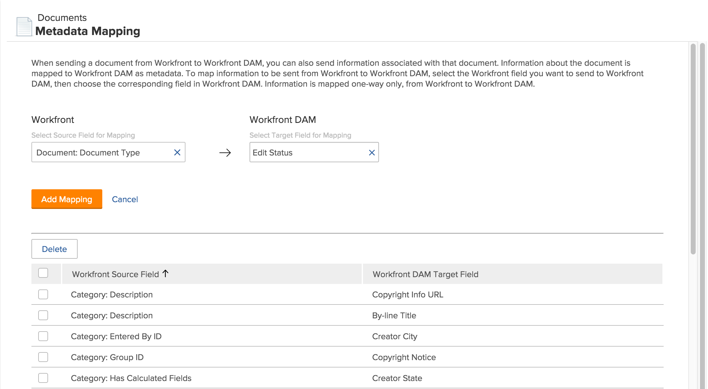

# Configuración de la asignación de metadatos

Los metadatos son información descriptiva asociada a un documento. Puede configurar [!DNL Adobe Workfront] para que incluya metadatos con los documentos enviados a las aplicaciones [!DNL Workfront].

## Requisitos de acceso

Debe tener el siguiente acceso para realizar los pasos de este artículo:

<table style="table-layout:auto"> 
 <col> 
 <col> 
 <tbody> 
  <tr> 
   <td role="rowheader">[!DNL Adobe Workfront] plan</td> 
   <td>Cualquiera</td> 
  </tr> 
  <tr> 
   <td role="rowheader">[!DNL Adobe Workfront] licencia</td> 
   <td>[!UICONTROL Plan]</td> 
  </tr> 
  <tr> 
   <td role="rowheader">Configuraciones de nivel de acceso</td> 
   <td> 
Debe ser administrador de [!DNL Workfront]. Para obtener más información, consulte <a href="../../administration-and-setup/add-users/configure-and-grant-access/grant-a-user-full-administrative-access.md" class="MCXref xref">Conceder acceso administrativo completo a un usuario</a>.
 
<b>NOTA</b>: Si todavía no tiene acceso, pregunte al administrador de [!DNL Workfront] si ha establecido restricciones adicionales en su nivel de acceso. Para obtener información sobre cómo un administrador de [!DNL Workfront] puede modificar su nivel de acceso, vea <a href="../../administration-and-setup/add-users/configure-and-grant-access/create-modify-access-levels.md" class="MCXref xref">Crear o modificar niveles de acceso personalizados</a>.
 </td> 
  </tr> 
 </tbody> 
</table>

## Acerca de [!DNL Workfront] metadatos

Los metadatos de los documentos de [!DNL Workfront] pueden incluir información como el nombre del proyecto relacionado, la descripción de la tarea o la fecha planificada de finalización. Como administrador de [!DNL Workfront], puede configurar [!DNL Workfront] para que incluya metadatos con los documentos enviados desde [!DNL Workfront] a las [!DNL Workfront] aplicaciones siguientes:

* [!DNL Workfront DAM]

Para poder enviar metadatos con documentos, primero debe especificar o asignar los metadatos que desea incluir. Puede asignar cualquier campo utilizado en [!DNL Workfront]. Una vez configurada la asignación de metadatos, todos los documentos cargados en una aplicación [!DNL Workfront] incluirán los metadatos asignados.

Cuando un usuario envía un documento de [!DNL Workfront] a una aplicación [!DNL Workfront], los metadatos asignados se transfieren a lo largo del documento. Aunque la versión del documento en la aplicación [!DNL Workfront] está vinculada a [!DNL Workfront], los cambios realizados en los metadatos del documento en [!DNL Workfront] no se reflejan en los metadatos del documento en la aplicación [!DNL Workfront]. Si se cambia un campo asignado en [!DNL Workfront], debe enviar una nueva versión del documento con los metadatos actualizados a la aplicación [!DNL Workfront].

>[!NOTE]
>
>Solo puede asignar metadatos en una dirección: de [!DNL Workfront] a [!DNL Workfront DAM]. Los metadatos de los documentos enlazados a [!DNL Workfront] desde [!DNL Workfront DAM] no se pueden transferir a Workfront.

Puede asignar el mismo campo [!DNL Workfront] a varios campos de metadatos en [!DNL Workfront DAM], pero no puede utilizar un campo de metadatos en ninguna de esas aplicaciones para varios campos de metadatos de [!DNL Workfront].

Para configurar varios campos [!DNL Workfront] para exportarlos a un campo de metadatos en una aplicación [!DNL Workfront], cree primero un campo personalizado calculado en [!DNL Workfront] para mostrar todos los campos personalizados individuales de un objeto. A continuación, asigne el campo [!DNL Workfront] calculado a un campo de metadatos en la aplicación [!DNL Workfront]. Para obtener más información sobre los campos personalizados calculados, vea [Agregar campos calculados a un formulario](/help/quicksilver/administration-and-setup/customize-workfront/create-manage-custom-forms/form-designer/design-a-form/add-a-calculated-field.md).

Para poder asignar campos para el proceso de asignación de metadatos, debe habilitar la aplicación en [!DNL Workfront]. Para obtener más información, consulte [Configurar integraciones de documentos](../../administration-and-setup/configure-integrations/configure-document-integrations.md).

## Configurar [!DNL Workfront] para enviar metadatos

1. Haga clic en el icono **[!UICONTROL Menú principal]**  en la esquina superior derecha de [!DNL Adobe Workfront] y, a continuación, haga clic en **[!UICONTROL Configurar]** .

1. En el panel izquierdo, haga clic en **[!UICONTROL Documentos]** > **[!UICONTROL Asignación de metadatos]**.

   

1. En el cuadro **[!UICONTROL Seleccionar el campo de Source para la asignación]**, empiece a escribir el nombre del campo de Workfront que desea asignar a [!DNL Workfront DAM] y, a continuación, selecciónelo cuando lo vea en la lista.
1. En el cuadro **[!UICONTROL Seleccionar campo de destino para asignación]**, seleccione el campo que desee rellenar con la información del campo [!DNL Workfront] seleccionado.

1. Haga clic en **[!UICONTROL Agregar asignación]**.

   El campo asignado se muestra en los campos asignados enumerados en la parte inferior de la página.

1. Repita los pasos 5 y 6 hasta que agregue todos los campos [!DNL Workfront] deseados y sus correspondientes campos [!DNL Workfront DAM].

## Eliminar campos asignados

1. Inicie sesión en [!DNL Workfront] como administrador.
1. Haga clic en el icono **[!UICONTROL Menú principal]**  en la esquina superior derecha de [!DNL Adobe Workfront] y, a continuación, haga clic en **[!UICONTROL Configurar]** .

1. En el panel izquierdo, haga clic en **[!UICONTROL Documentos]** > **[!UICONTROL Asignación de metadatos]**.

1. En la lista de campos asignados, seleccione los campos que desea eliminar de la asignación de metadatos.
1. Haga clic en **[!UICONTROL Eliminar]**.

   Los campos designados ya no están asignados. Ahora, cuando un usuario envía un documento de [!DNL Workfront] a [!DNL Workfront DAM], los metadatos contenidos en los campos eliminados no se transfieren con el documento.

   Un documento enviado antes de eliminar los campos asignados conserva los metadatos originales enviados con él, incluidos los metadatos de los campos eliminados.
