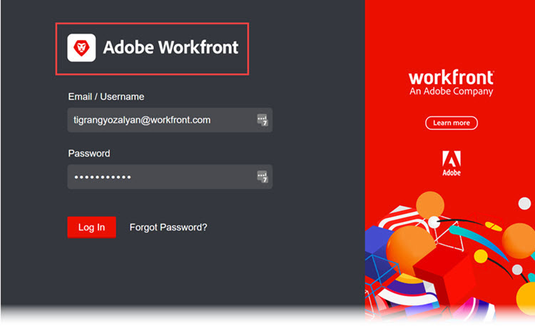

# Marca la instancia de Adobe Workfront

<!--
**DON'T DELETE, DRAFT OR HIDE THIS ARTICLE. IT IS LINKED TO THE PRODUCT, THROUGH THE CONTEXT SENSITIVE HELP LINKS. **
-->

Como administrador de Workfront, puede personalizar Workfront con logotipos en los siguientes lugares:

* Pantalla de inicio de sesión

   

* Área de navegación superior

   

* Menú principal

   

También puede cambiar la imagen de fondo y el color de la pantalla de inicio de sesión:

>[!NOTE]
>
>* El cambio de la imagen y el color de fondo del inicio de sesión no está disponible si la instancia de Workfront de su organización utiliza un portal SSO personalizado. Si necesita más información, consulte con su administrador de red o TI.

><!--
>or is enabled with Adobe IMS  >
>  >
>-->
>
>* Un administrador de grupo o administrador de Workfront también puede asignar una marca a Workfront para determinados grupos y usuarios mediante una plantilla de diseño. La promoción de la marca en una plantilla de diseño anula la promoción de la marca a nivel del sistema que se explica en este artículo. Para obtener instrucciones sobre la marca en una plantilla de diseño, consulte [Brand Adobe Workfront mediante una plantilla de diseño](../../../administration-and-setup/customize-workfront/use-layout-templates/brand-wf-using-a-layout-template.md).

## Requisitos de acceso

Debe tener el siguiente acceso para realizar los pasos de este artículo:

<table style="table-layout:auto"> 
 <col> 
 <col> 
 <tbody> 
  <tr> 
   <td role="rowheader">plan de Adobe Workfront</td> 
   <td>Cualquiera</td> 
  </tr> 
  <tr> 
   <td role="rowheader">Licencia de Adobe Workfront</td> 
   <td>Plan</td> 
  </tr> 
  <tr> 
   <td role="rowheader">Configuraciones de nivel de acceso</td> 
   <td> 
Debe ser administrador de Workfront.
 
<b>NOTA</b>: Si todavía no tiene acceso, pregunte a su administrador de Workfront si establece restricciones adicionales en su nivel de acceso. Para obtener información sobre cómo un administrador de Workfront puede modificar su nivel de acceso, consulte <a href="../../../administration-and-setup/add-users/configure-and-grant-access/create-modify-access-levels.md" class="MCXref xref">Crear o modificar niveles de acceso personalizados</a>.
 </td> 
  </tr> 
 </tbody> 
</table>

## Marca de la pantalla de inicio de sesión

1. Haga clic en el **Menú principal** icono  en la esquina superior derecha de Adobe Workfront, haga clic en **Configuración** .

1. Haga clic en **Sistema** > **Marcas**.

1. Realice cualquiera de los siguientes cambios para personalizar Workfront con sus imágenes de marca.

   <table style="table-layout:auto"> 
    <col> 
    <col> 
    <tbody> 
     <tr> 
      <td role="rowheader"> 
Icono de marca de inicio (se muestra en el extremo izquierdo del área de navegación superior)
 </td> 
      <td> 
En el <strong>Área de navegación superior</strong> en <strong>Icono de inicio</strong>, haga clic en cualquier lugar del cuadro y, a continuación, busque y seleccione la imagen del logotipo. O arrastre una imagen al cuadro.
 
Para recortar la imagen, utilice los controles de desplazamiento y arrastre la imagen a la posición que desee dentro del espacio prescrito.
 
Se recomienda una imagen de 120 x 120. Puede estar en cualquiera de los siguientes formatos: GIF, JPG, PNG, SVG.
 
Este icono también aparece en informes, listas, tableros e informes entregados que los usuarios exportan como archivos de PDF.
 </td> 
     </tr> 
     <tr> 
      <td role="rowheader"> 
Marca del menú principal  logo (se muestra en la esquina superior derecha del menú principal)
 </td> 
      <td> 
En el <strong>Área de navegación superior</strong> en <strong>Logotipo del menú principal</strong>, haga clic en cualquier lugar del cuadro y, a continuación, busque y seleccione la imagen del logotipo. O arrastre una imagen al cuadro.
 
Para recortar la imagen, utilice los controles de desplazamiento y arrastre la imagen a la posición que desee dentro del espacio prescrito.
 
Se recomienda una imagen de 300 x 120 píxeles. Puede estar en cualquiera de los siguientes formatos: GIF, JPG, PNG, SVG.
 </td> 
     </tr> 
     <tr> 
      <td role="rowheader">Marca del logotipo de la pantalla de inicio de sesión (aparece en la parte superior izquierda del cuadro donde los usuarios escriben las credenciales de inicio de sesión)</td> 
      <td> 
En <strong>Pantalla de inicio de sesión</strong>, haga clic en cualquier lugar del cuadro y, a continuación, busque y seleccione la imagen del logotipo. Para recortar la imagen, utilice los controles de desplazamiento y arrastre la imagen a la posición que desee dentro del espacio prescrito.
 
Se recomienda una imagen de 300 x 120 píxeles. Puede estar en cualquiera de los siguientes formatos: GIF, JPG, PNG, SVG.
 </td> 
     </tr> 
     <tr> 
      <td role="rowheader">Marca del color de fondo de la pantalla de inicio de sesión (aparece detrás del cuadro donde los usuarios escriben credenciales de inicio de sesión)</td> 
      <td> 
En <strong>Pantalla de inicio de sesión</strong>, establezca un <strong>Color de fondo</strong>. 
 
Puede utilizar códigos de color RGB o HEX.
 
El color de fondo solo es visible si el fondo de la pantalla de inicio de sesión es mayor que la imagen de fondo de la pantalla de inicio de sesión (consulte la siguiente fila de esta tabla) o si hay alguna transparencia en la imagen.
 </td> 
     </tr> 
     <tr> 
      <td role="rowheader">Marca de la imagen de fondo de la pantalla de inicio de sesión (aparece detrás del cuadro donde los usuarios escriben sus credenciales de inicio de sesión)</td> 
      <td> 
       <ol style="list-style-type: lower-alpha;"> 
        <li value="1"> 
 En el <strong>Pantalla de inicio de sesión</strong> área, bajo <strong>Imagen de fondo</strong>, haga clic en el cuadro y, a continuación, busque y seleccione su JPG o imagen o imágenes PNG (hasta 20 ). 
 
Se muestran varias imágenes de fondo en orden aleatorio, cambiando cada vez que los usuarios actualizan su página de inicio de sesión. Se recomiendan imágenes que no superen los 2 MB.
 </li> 
        <li value="2"> 
Pase el ratón sobre cada imagen de fondo que haya cargado, haga clic en el icono Configuración (engranaje) y utilice cualquiera de las siguientes opciones para especificar dónde y cómo desea que aparezca la imagen en el fondo de la pantalla de inicio de sesión:
 
         <ul> 
          <li> 
<strong>Pantalla de relleno</strong>: Para la imagen con el fondo de la pantalla de inicio de sesión, que puede ampliar la imagen. Utilice una imagen de alta resolución (hasta 2 MB) para obtener los mejores resultados.
 
Cuando se utiliza esta opción, el banner de Workfront, que no se puede personalizar, oscurece la parte de la imagen.
 </li> 
          <li> 
<strong>Mosaico</strong>: Mosaica la imagen en el área de fondo de la pantalla de inicio de sesión, en su tamaño original. Esto resulta útil para crear un patrón. Seleccione una opción de alineación azul para iniciar el mosaico desde la esquina superior izquierda, el centro superior o la parte superior derecha del área de fondo.
 </li> 
          <li> 
<strong>Posición</strong>: Coloca la imagen en su tamaño original en la posición que elija con una de las opciones de alineación azul: en la parte superior izquierda, en el centro superior o en la parte superior derecha del área de fondo de la pantalla de inicio de sesión.
 
El color de fondo rellena el resto del área de fondo de la pantalla de inicio de sesión. Para obtener más información sobre el color de fondo, consulte la fila anterior de esta tabla.
 </li> 
         </ul> </li> 
       </ol> </td> 
     </tr> 
     <tr> 
      <td role="rowheader">Restablecer a la marca predeterminada</td> 
      <td> 
Al restablecer la marca predeterminada, se eliminan todas las fotos e imágenes que haya cargado.
 
Haga clic en <strong>Restablecer todas las marcas a los valores predeterminados de Workfront</strong> en la esquina inferior derecha de la pantalla, haga clic en <strong>Sí</strong>.
 </td> 
     </tr> 
    </tbody> 
   </table>

   >[!NOTE]
   >
   >Esto no está disponible si la instancia de Workfront de su organización utiliza un portal SSO personalizado.
   ><!--   >
   >or is enabled with Adobe IMS   >
   >   >
   >-->
   >
   >Si necesita más información, consulte con su administrador de red o TI.

1. Haga clic en **Guardar**.
