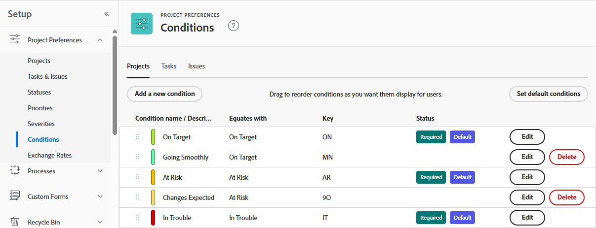

# Crear o editar una condición personalizada

Como administrador de Adobe Workfront, puede crear o editar una condición personalizada para proyectos, tareas y problemas para que coincida con las necesidades de su organización.

## Requisitos de acceso

+++ Expanda para ver los requisitos de acceso para la funcionalidad en este artículo.

Debe tener el siguiente acceso para realizar los pasos de este artículo:

<table style="table-layout:auto"> 
 <col> 
 <col> 
 <tbody> 
  <tr> 
   <td role="rowheader">Plan de Adobe Workfront</td> 
   <td>Cualquiera</td> 
  </tr> 
  <tr> 
  <tr> 
   <td role="rowheader">Licencia de Adobe Workfront</td> 
   <td>
Nuevo: estándar

       
O

       
Actual: plan
</td>
  </tr> 
  </tr> 
  <tr> 
   <td role="rowheader">Configuraciones de nivel de acceso</td> 
   <td>[!UICONTROL System Administrator]</td>
  </tr> 
 </tbody> 
</table>

Para obtener más información sobre el contenido de esta tabla, consulte [Requisitos de acceso en la documentación de Workfront](/help/quicksilver/administration-and-setup/add-users/access-levels-and-object-permissions/access-level-requirements-in-documentation.md).

+++

## Crear o editar una condición personalizada

{{step-1-to-setup}}

1. Haga clic en **Preferencias del proyecto** > **Condiciones**.

1. Haga clic en la ficha del tipo de objeto (**Proyecto**, **Tarea** o **Problema**) que desee asociar con la condición.

1. Para crear una nueva condición, haga clic en **Agregar nueva condición**.

   O

   Para editar una condición existente, haga clic en **Editar** junto al nombre de la condición.

   

1. Configure la condición personalizada con las siguientes opciones:

   <table style="table-layout:auto"> 
    <col> 
    <col> 
    <tbody> 
     <tr> 
      <td>Nombre de la condición</td> 
      <td>(Obligatorio) Escriba un nombre descriptivo para la condición.</td> 
     </tr> 
     <tr> 
      <td>Descripción</td> 
      <td>(Opcional) Escriba una descripción del propósito de la condición para aquellos que la utilizarán.</td> 
     </tr> 
     <tr> 
      <td>Color</td> 
      <td>(Opcional) Haga clic en el icono de color y, a continuación, elija el color que desee para la condición cuando se muestre en proyectos, tareas o problemas. También puede escribir un número hexadecimal.</td> 
     </tr> 
     <tr> 
      <td>Igual a </td> 
      <td>
(Obligatorio, solo para proyectos) Haga clic en la opción de la lista desplegable que mejor describa la función de la nueva condición. Por ejemplo, para una condición denominada Bien de seguimiento, debe hacer clic en En el destino. Esto determina cómo funcionan las condiciones predeterminadas. Cada condición que cree debe coincidir con una de las opciones del menú desplegable.

      
Para obtener información acerca de las condiciones predeterminadas, vea <a href="../../../administration-and-setup/customize-workfront/create-manage-custom-conditions/set-custom-condition-default-projects.md" class="MCXref xref">Establecer una condición personalizada como predeterminada para los proyectos</a> y <a href="../../../administration-and-setup/customize-workfront/create-manage-custom-conditions/set-custom-condition-default-tasks-issues.md" class="MCXref xref">Establecer una condición personalizada como predeterminada para tareas y problemas</a>.

      
Esta opción no se puede modificar una vez que haya terminado de crear la condición.
</td> 
     </tr> 
     <tr> 
      <td>Clave</td> 
      <td>
(Obligatorio) Para una condición de proyecto, escriba una abreviatura alfanumérica que los usuarios puedan reconocer. Para una condición de tarea o problema, escriba un código numérico de dos dígitos del 01 al 99. 

      
Esta clave, que se utiliza en la API y puede utilizarse para fines de creación de informes, debe ser única para cada objeto.

      
No puede cambiar la clave de una condición después de guardarla. 
</td> 
     </tr> 
     <tr> 
      <td>Ocultar condición</td> 
      <td>
(Opcional) Esta opción está disponible para condiciones personalizadas que ya no desea que utilicen los usuarios, pero que desea conservar por motivos históricos. 

      
Si oculta una condición personalizada que se ha utilizado en elementos de trabajo, seguirá apareciendo en esos elementos de trabajo después de ocultarla. 
</td> 
     </tr> 
    </tbody> 
   </table>

   >[!TIP]
   >
   >Puede estandarizar la terminología y los colores de las condiciones en los tres tipos de objetos. Para ello, copie el nombre de la condición y el código hexadecimal de color de una pestaña (Proyecto, Tarea, Problema) a la condición correspondiente en las otras dos pestañas.

1. (Opcional) Arrastre  cualquier condición a una nueva posición para reordenar la lista.

   Esto cambia el orden en que se muestran las condiciones en los proyectos, tareas y problemas:

   * Cuando un usuario está editando un proyecto

     

   <!-- 
   * When a user is changing the condition for a task or issue on the Updates tab:

     
   -->

   * Cuando un usuario cambia la condición de una tarea o un problema en una vista de lista:

     

1. Haga clic en **Guardar**.

Puede establecer la condición personalizada como condición predeterminada para proyectos o para tareas y problemas. Para obtener más información, vea [Establecer una condición personalizada como predeterminada para los proyectos](../../../administration-and-setup/customize-workfront/create-manage-custom-conditions/set-custom-condition-default-projects.md) y [Establecer una condición personalizada como predeterminada para tareas y problemas](../../../administration-and-setup/customize-workfront/create-manage-custom-conditions/set-custom-condition-default-tasks-issues.md).

Para obtener más información acerca de las condiciones personalizadas, vea [Condiciones personalizadas](../../../administration-and-setup/customize-workfront/create-manage-custom-conditions/custom-conditions.md).
