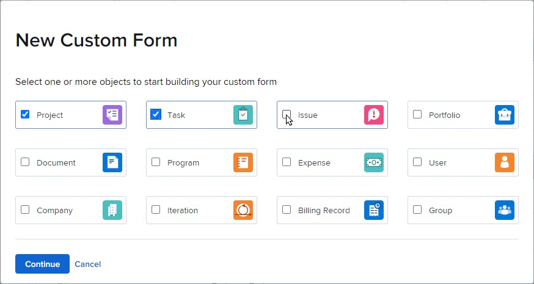
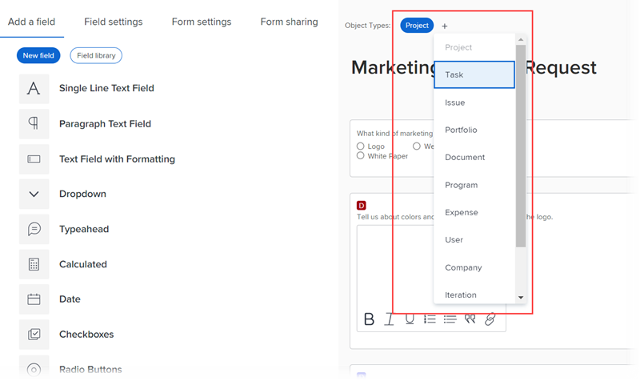

# Crear o editar un formulario personalizado con el generador de formularios heredado

Puede crear o editar un nuevo formulario personalizado. Ambas tareas se explican en este artículo.

Para obtener información sobre cómo crear un nuevo formulario personalizado a partir de uno existente, consulte [Copiar un formulario personalizado para crear uno nuevo con el generador de formularios heredados](../../../administration-and-setup/customize-workfront/create-manage-custom-forms/copy-custom-form-to-create-a-new-one.md).

## Requisitos de acceso

Debe tener lo siguiente para realizar los pasos de este artículo:

<table style="table-layout:auto"> 
 <col> 
 <col> 
 <tbody> 
  <tr data-mc-conditions=""> 
   <td role="rowheader"> 
plan Adobe Workfront*
 </td> 
   <td>Cualquiera</td> 
  </tr> 
  <tr> 
   <td role="rowheader">Licencia de Adobe Workfront*</td> 
   <td>Plan</td> 
  </tr> 
  <tr data-mc-conditions=""> 
   <td role="rowheader">Configuraciones de nivel de acceso*</td> 
   <td> 
Acceso administrativo a formularios personalizados
 
Para obtener información sobre cómo los administradores de Workfront conceden este acceso, consulte <a href="../../../administration-and-setup/add-users/configure-and-grant-access/grant-users-admin-access-certain-areas.md" class="MCXref xref">Conceder a los usuarios acceso administrativo a determinadas áreas</a>.
 </td> 
  </tr>  
 </tbody> 
</table>

&#42;Para saber qué configuraciones de plan, tipo de licencia o nivel de acceso tiene, póngase en contacto con su administrador de Workfront.

## Empezar a crear un formulario personalizado

1. Haga clic en **Menú principal** icono  en la esquina superior derecha de Adobe Workfront, haga clic en **Configurar** .

1. Clic **Forms personalizado** en el panel izquierdo.

   En la vista que aparece, puede revisar todos los formularios y campos personalizados que se han creado para su organización. También puede ver quién creó cada formulario y los campos asociados a él.

1. Clic **Nuevo formulario personalizado.**
1. Seleccione al menos un tipo de objeto que desee asociar con el formulario personalizado y, a continuación, haga clic en **Continuar**.

   

1. En el **Configuración de formulario** pestaña que se abre, escriba un **Título del formulario** y un opcional **Descripción** para el formulario personalizado.

1. (Opcional) Si desea agregar más tipos de objetos al formulario para que se pueda adjuntar a más objetos, haga clic en el signo más después de Tipos de objetos y, a continuación, seleccione el tipo de objeto que desee en el menú que aparece.

   Puede repetir esto para agregar todos los tipos de objeto que desee. También puede hacer clic en la X de un tipo de objeto para eliminarlo del formulario.

   Para obtener información sobre cómo eliminar tipos de objetos de un formulario personalizado que ya ha guardado, consulte [Eliminar tipos de objetos en un formulario personalizado](../../../administration-and-setup/customize-workfront/create-manage-custom-forms/delete-object-type-on-a-custom-form.md).

1. Clic **Listo**.

   >[!TIP]
   >
   >Puede hacer clic en **Aplicar** en cualquier momento mientras crea un formulario personalizado para guardar los cambios y mantener el formulario abierto.

1. Si desea agregar un nuevo campo personalizado al formulario, continúe a [Agregar un campo personalizado a un formulario personalizado](../../../administration-and-setup/customize-workfront/create-manage-custom-forms/add-a-custom-field-to-a-custom-form.md) o [Reutilización de un campo o widget personalizado en un formulario personalizado](../../../administration-and-setup/customize-workfront/create-manage-custom-forms/reuse-an-existing-field.md).

   O

   Si desea seguir creando el formulario personalizado de otras formas, consulte uno de los siguientes artículos:

   * [Agregar o editar un widget de recursos en un formulario personalizado](../../../administration-and-setup/customize-workfront/create-manage-custom-forms/add-widget-or-edit-its-properties-in-a-custom-form.md)
   * [Colocar campos y widgets personalizados en un formulario personalizado](../../../administration-and-setup/customize-workfront/create-manage-custom-forms/position-fields-in-a-custom-form.md)
   * [Agregar un salto de sección a un formulario personalizado](../../../administration-and-setup/customize-workfront/create-manage-custom-forms/add-a-section-break-to-a-custom-form.md)
   * [Añadir datos calculados a un formulario personalizado](../../../administration-and-setup/customize-workfront/create-manage-custom-forms/add-calculated-data-to-custom-form.md)
   * [Reutilizar un campo personalizado calculado existente en un formulario personalizado](../../../administration-and-setup/customize-workfront/create-manage-custom-forms/use-existing-calc-field-new-custom-form.md)
   * [Agregar lógica de visualización y saltar lógica a un formulario personalizado](../../../administration-and-setup/customize-workfront/create-manage-custom-forms/display-or-skip-logic-custom-form.md)

## Empezar a editar un formulario personalizado

Puede editar un formulario personalizado en cualquier momento después de crearlo.

>[!CAUTION]
>
>Para obtener información sobre cómo quitar campos de un formulario personalizado sin perder los datos que los usuarios han introducido en esos campos, consulte la sección [Quitar un campo personalizado sin perder los datos introducidos por los usuarios](../../../administration-and-setup/customize-workfront/create-manage-custom-forms/delete-a-custom-field.md#remove) en el artículo [Eliminar un campo o widget personalizado del sistema](../../../administration-and-setup/customize-workfront/create-manage-custom-forms/delete-a-custom-field.md).
>
>En general, se recomienda minimizar el número de veces que se edita un formulario personalizado que ya está en uso. No hay ningún sistema de notificación que avise a las personas que utilizan el formulario personalizado sobre sus cambios.

1. Haga clic en **Menú principal** icono  en la esquina superior derecha de Adobe Workfront, haga clic en **Configurar** .

1. Clic **Forms personalizado** en el panel izquierdo.

   En la vista que aparece, puede revisar todos los formularios personalizados que se han creado para su organización. También puede ver quién creó cada formulario, con qué tipo de objeto funciona y si está activo.

1. Seleccione el formulario personalizado que desee editar y haga clic en **Editar**.
1. (Opcional) Para cambiar el título y la descripción del formulario personalizado, haga clic en **Configuración de formulario** y, a continuación, escriba un **Título del formulario** y **Descripción**.

1. (Opcional) Si desea agregar más tipos de objetos al formulario para que se pueda adjuntar a más objetos, haga clic en el signo más + después **Tipos de objetos**, a continuación, seleccione el tipo que desee en el menú que se muestra.

   

   Puede repetir esto para agregar todos los tipos de objetos que desee.

   También puede hacer clic en la X de un tipo de objeto para eliminarlo del formulario. Esto debe hacerse con precaución cuando desee eliminar un tipo de objeto de un formulario personalizado que ya haya guardado. Para obtener más información, consulte [Eliminar tipos de objetos en un formulario personalizado](../../../administration-and-setup/customize-workfront/create-manage-custom-forms/delete-object-type-on-a-custom-form.md).

1. Clic **Listo**.

   >[!TIP]
   >
   >Puede hacer clic en **Aplicar** en cualquier momento mientras crea un formulario personalizado para guardar los cambios y mantener el formulario abierto.

1. Si desea agregar un nuevo campo personalizado al formulario, continúe a [Agregar un campo personalizado a un formulario personalizado](../../../administration-and-setup/customize-workfront/create-manage-custom-forms/add-a-custom-field-to-a-custom-form.md) o [Reutilización de un campo o widget personalizado en un formulario personalizado](../../../administration-and-setup/customize-workfront/create-manage-custom-forms/reuse-an-existing-field.md).

   O

   Si desea seguir creando el formulario personalizado de otras formas, consulte uno de los siguientes artículos:

   * [Agregar o editar un widget de recursos en un formulario personalizado](../../../administration-and-setup/customize-workfront/create-manage-custom-forms/add-widget-or-edit-its-properties-in-a-custom-form.md)
   * [Colocar campos y widgets personalizados en un formulario personalizado](../../../administration-and-setup/customize-workfront/create-manage-custom-forms/position-fields-in-a-custom-form.md)
   * [Agregar un salto de sección a un formulario personalizado](../../../administration-and-setup/customize-workfront/create-manage-custom-forms/add-a-section-break-to-a-custom-form.md)
   * [Añadir datos calculados a un formulario personalizado](../../../administration-and-setup/customize-workfront/create-manage-custom-forms/add-calculated-data-to-custom-form.md)
   * [Reutilizar un campo personalizado calculado existente en un formulario personalizado](../../../administration-and-setup/customize-workfront/create-manage-custom-forms/use-existing-calc-field-new-custom-form.md)
   * [Agregar lógica de visualización y saltar lógica a un formulario personalizado](../../../administration-and-setup/customize-workfront/create-manage-custom-forms/display-or-skip-logic-custom-form.md)
