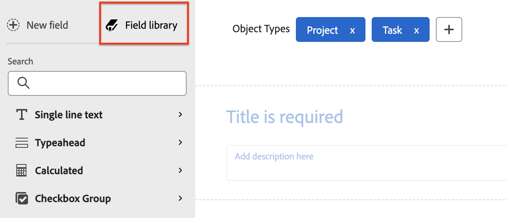

# Adición de campos calculados a un formulario

Puede agregar un campo personalizado calculado que utilice datos existentes para generar datos nuevos cuando el formulario personalizado se adjunte a un objeto.

Un campo personalizado calculado puede contener:

* Una sencilla referencia a un único campo integrado.

>[!BEGINSHADEBOX]

**Ejemplo:** Para calcular los ingresos generados por proyectos y tareas, puede crear un campo personalizado calculado que contenga el campo integrado Ingresos reales. Cuando alguien adjunta el formulario personalizado a un proyecto o tarea, los ingresos del proyecto o tarea se muestran en el campo.

>[!ENDSHADEBOX]

* Expresión que hace referencia a uno o varios campos. Pueden ser campos personalizados, otros campos personalizados calculados y campos integrados.

>[!BEGINSHADEBOX]

**Ejemplo:** Para calcular el beneficio generado por proyectos y tareas, puede crear un campo personalizado calculado denominado Beneficio que contenga una expresión matemática que reste costos de ingresos.

Para ello, se puede utilizar la expresión matemática SUB (subtract) con los campos integrados de Workfront Coste real e Ingresos reales.

En los pasos siguientes, puede ver cómo crear una expresión como en este ejemplo.

>[!ENDSHADEBOX]

>[!NOTE]
>
>Los cambios en un campo directo almacenan automáticamente en déclencheur una actualización del valor del campo calculado. (Los campos directos son campos disponibles en el Explorador de API de Workfront o campos personalizados en un formulario personalizado adjunto a un objeto). Los cambios realizados en una referencia o fórmula requieren que se recalculen manualmente los valores de los campos.

## Requisitos de acceso

+++ Expanda para ver los requisitos de acceso para la funcionalidad en este artículo.

Debe tener lo siguiente para realizar los pasos de este artículo:

<table style="table-layout:auto"> 
 <col> 
 <col> 
 <tbody> 
  <tr data-mc-conditions=""> 
   <td role="rowheader"> 
plan de Adobe Workfront
 </td> 
   <td>Cualquiera</td> 
  </tr> 
  <tr> 
   <td role="rowheader">Licencia de Adobe Workfront</td> 
   <td>
   
Nuevo: estándar

   
o

   
Actual: plan
</td>
  </tr> 
  <tr data-mc-conditions=""> 
   <td role="rowheader">Configuraciones de nivel de acceso</td> 
   <td> 
Acceso administrativo a formularios personalizados
 </td> 
  </tr> 
 </tbody> 
</table>

Para obtener más información sobre esta tabla, consulte [Requisitos de acceso en la documentación de Workfront](/help/quicksilver/administration-and-setup/add-users/access-levels-and-object-permissions/access-level-requirements-in-documentation.md).

+++

## Reutilizar un campo personalizado calculado existente en un formulario personalizado

Puede utilizar el mismo campo personalizado calculado en formularios personalizados que pertenezcan a objetos diferentes. Por ejemplo, puede utilizar el campo calculado Beneficio que ha creado para el formulario personalizado del proyecto en un formulario personalizado de tarea.

Cuando se utiliza un campo personalizado calculado existente, el cálculo no se transfiere al nuevo formulario. Debe volver a agregar el cálculo, en el mismo campo, en el nuevo formulario personalizado.

También puede tener un cálculo diferente para el mismo campo, en el nuevo formulario. Mantener el mismo nombre para el campo personalizado calculado garantiza la coherencia y la cohesión en la convención de nombres.

>[!IMPORTANT]
>
>Los cambios en las expresiones calculadas pueden hacer que el valor del campo en los objetos quede obsoleto. Para asegurarse de ver siempre el cálculo actualizado en estos campos, realice una de las siguientes acciones:
>
>* Después de guardar un objeto en el que ha editado datos en un formulario personalizado adjunto, haga clic en el icono Más  de la página principal del objeto y, a continuación, vuelva a calcular las expresiones personalizadas.
>* Seleccione la opción Recalcular expresiones personalizadas al editar objetos de forma masiva.
>* Seleccione la opción Actualizar cálculos anteriores al editar un campo personalizado calculado en un formulario personalizado.

Para reutilizar un campo personalizado calculado existente:

{{step-1-to-setup}}

1. Haga clic en **Forms personalizado** en el panel izquierdo.

   <!-- >[!TIP]
    >
    >In the view that appears, you can review all custom forms and custom fields that have been created for your organization. You can also see who created each form and the fields that are associated with it. -->

1. Haga clic en **Nuevo formulario personalizado.**
1. Seleccione a qué tipos de objetos desea adjuntar el formulario personalizado y, a continuación, haga clic en **Continuar**.

1. En la parte superior izquierda de la pantalla, haga clic en **Biblioteca de campos**.

   

1. Utilice el cuadro de búsqueda o expanda la sección **Calculado** para localizar el campo calculado que necesita y, a continuación, arrastre el campo al lugar donde desea que aparezca en el formulario personalizado.

1. (Opcional) Repita el paso anterior para agregar otros campos.

   >[!NOTE]
   >
   >Puede agregar hasta 500 campos y widgets en un solo formulario personalizado. Sin embargo, puede producirse una degradación del rendimiento cuando existen más de 100 en un formulario, según su complejidad.
   >
   >
   >Algunos ejemplos de formularios complejos son formularios con parámetros en cascada, campos de datos personalizados calculados y varias opciones de valor en un único campo.

1. Para guardar los cambios, haz clic en **Aplicar** y pasa a otra sección para seguir creando el formulario.

   o

   Haga clic en **Guardar y cerrar**.

## Añadir un nuevo campo calculado

>[!IMPORTANT]
>
>Antes de crear un nuevo campo personalizado calculado, identifique los campos existentes que desee incluir para estar seguro de que los datos necesarios para el cálculo están presentes en Workfront.

{{step-1-to-setup}}

1. Haga clic en **Forms personalizado** en el panel izquierdo.

   <!-- >[!TIP]
    >
    >In the view that appears, you can review all custom forms and custom fields that have been created for your organization. You can also see who created each form and the fields that are associated with it. -->

1. Haga clic en **Nuevo formulario personalizado.**
1. Seleccione a qué tipos de objetos desea adjuntar el formulario personalizado y, a continuación, haga clic en **Continuar**.

1. En el lado izquierdo de la pantalla, busca **Calculado** y arrástralo a una sección del lienzo.

   

1. En el lado derecho de la pantalla, configure las opciones disponibles para el tipo de campo personalizado que está agregando:

   <table style="table-layout:auto"> 
    <col> 
    </col> 
    <col> 
    </col> 
    <tbody> 
     <tr> 
      <td role="rowheader">Etiqueta</td> 
      <td>Escriba una etiqueta para el campo. Esto es lo que los usuarios verán cuando usen el formulario personalizado. Workfront hace referencia al campo <b>Name</b>, que se rellena automáticamente, en los informes.</td> 
     </tr> 
     <tr> 
      <td role="rowheader" id="instructions">Instrucciones</td> 
      <td> De forma predeterminada, la fórmula que cree para el campo se almacena aquí. Puede agregar texto para proporcionar información adicional sobre el campo y la fórmula que contiene. Esto puede resultar útil de dos maneras: 
       <ul> 
      <li>
Como recordatorio de qué es la fórmula y cómo funciona. Esto resulta especialmente útil si planea utilizar este campo personalizado calculado en varios formularios.
 </li> 
      <li> 
Como información de objeto, los usuarios pueden ver cuando pasan el ratón por encima del campo. Aquí puede agregar el texto que desee que vea en la información del objeto.
 
Si no desea que vean la fórmula en la información del objeto, lo que puede resultar confuso para ellos, puede ocultarla.</li> 
       </ul> </td> 
     </tr> 
     <tr> 
      <td role="rowheader">Formato</td> 
      <td> 
El formato en el que desea que se almacenen y muestren los resultados del campo.
 
Si el campo se va a usar en cálculos matemáticos, use siempre un formato <strong>Number</strong> o <strong>Currency</strong>. Al seleccionar Número o Moneda, el sistema trunca automáticamente los números que comienzan por 0.
 
      
<b>IMPORTANTE</b>: Antes de elegir un formato, considere el formato correcto para el nuevo campo. El campo de formato no se puede editar después de guardar el formulario personalizado. Y seleccionar el formato incorrecto podría afectar a futuros cálculos y valores acumulados en las agrupaciones de informes y listas.

      
<strong>NOTA:</strong> Los campos calculados con un formato Moneda no deben incluir comillas. (Por ejemplo, use 800,00 y no "800,00"). El uso de comillas puede tener consecuencias inesperadas debido a los matices del formato de idioma para los tipos de moneda.
</td>
     </tr> 
    </tbody> 
   </table>

1. En el cuadro **Cálculo**, empiece a crear el cálculo:
   1. Haga clic en **Maximizar** para abrir el Editor de cálculos y generar el cálculo.

Un cálculo suele comenzar con una expresión, seguida de paréntesis que contienen los campos a los que se desea hacer referencia cuando se adjunta el formulario personalizado a un objeto.

      Cada campo debe estar comprendido entre llaves. Cuando empiece a escribir el nombre de un campo, el sistema realiza sugerencias y puede seleccionar una para insertarla en el cálculo.

+++ **Amplíe para ver la sintaxis requerida en los campos personalizados calculados**

      Cada campo debe utilizar la sintaxis explicada a continuación, con llaves alrededor de cada nombre de campo. Cuando empiece a escribir el nombre de un campo, el sistema realiza sugerencias y puede seleccionar una para insertarla en el cálculo. Si introduce datos incorrectamente en un cálculo, un mensaje de advertencia le avisará. No puede guardar el formulario a menos que edite el cálculo para que contenga campos válidos y una expresión calculada válida.

      >[!NOTE]
      >
      >Actualmente, el sistema solo realiza sugerencias cuando empieza a escribir el nombre de un campo al que desea hacer referencia en un objeto al que se adjuntará el formulario personalizado. No se sugieren campos del objeto principal.

      **Nombres de campos envolventes con llaves**

      * Si desea que el cálculo haga referencia a un campo integrado, el nombre del campo debe estar entre llaves.

        Por ejemplo: `{actualRevenue}`

        Los nombres de campo distinguen entre mayúsculas y minúsculas y deben aparecer en el cálculo exactamente como aparecen en el sistema de Workfront.

        Vaya a [Explorador de API de Workfront](https://developer.adobe.com/workfront/api-explorer/) para identificar los nombres de campo que se pueden usar en los cálculos.

      * Si desea que el cálculo haga referencia a un campo personalizado, el nombre del campo debe ir entre llaves y precedido de `DE:` entre corchetes.

        Por ejemplo: `{DE:Profit}`

        El sistema enumera todos los campos personalizados que puede elegir al escribir `DE:`.

         * Si desea que el cálculo haga referencia a un campo que extraerá datos del objeto *parent* cuando el formulario personalizado esté adjunto a un objeto, debe anteponer el nombre del campo al tipo de objeto del objeto principal, también entre llaves.

        Por ejemplo, si el formulario personalizado está configurado para trabajar con tareas y desea que el campo calcule los ingresos reales del objeto principal cuando el formulario se adjunta a una tarea, debe indicar `Project` como el tipo de objeto del campo:

        `{project}.{actualRevenue}`

        O bien, si es un campo personalizado:

        `{project}.{DE:profit}`

        **Separar elementos con puntos**

        Cuando haga referencia a un objeto relacionado en un campo personalizado calculado, debe separar los nombres y atributos de los objetos con puntos.

        Por ejemplo, en un formulario personalizado de tipo de tarea, para mostrar el nombre del Propietario del Portfolio en un campo personalizado calculado, debe escribir lo siguiente:

        `{project}.{porfolio}.{owner}`

        Esto determinaría lo siguiente: Desde el objeto del formulario personalizado (una tarea), puede acceder al siguiente objeto relacionado con la tarea (un proyecto). Desde allí, puede acceder al siguiente objeto relacionado con el proyecto (un portafolio) y, a continuación, hacer referencia a los campos definidos para el objeto del portafolio (el propietario)

        **Sintaxis de nombre para hacer referencia a un campo personalizado**

        Cuando haga referencia a otro campo personalizado en un campo personalizado calculado, debe introducir el nombre del campo tal y como se muestra en la interfaz de usuario de Workfront.

        Por ejemplo, para hacer referencia a la opción seleccionada en un campo personalizado denominado Patrocinador ejecutivo, debe escribir lo siguiente:

        `{DE:Executive sponsor}`

        >[!NOTE]
        >
        >La sintaxis de un campo de escritura anticipada es un poco diferente a la de otros tipos de campos porque necesita agregar `:name` al final.
        >
        >Por ejemplo, para hacer referencia a la opción seleccionada en un campo de escritura anticipada personalizado denominado &quot;Patrocinador ejecutivo&quot;, escribiría:
        >
        >`{DE:Executive sponsor:name}`

        **Campos personalizados calculados en formularios personalizados de varios objetos**

        En un formulario personalizado de varios objetos, los tipos de objeto seleccionados deben ser compatibles con al menos un campo al que se haga referencia en los campos personalizados calculados del formulario. Los campos no compatibles con el objeto mostrarán N/D en el formulario.

        Para asegurarse de que el campo calculado muestra un resultado correcto para todos los tipos de objeto, debe utilizar `$$OBJCODE` para definir un cálculo para cada tipo de objeto.

        >[!INFO]
        >
        >**Ejemplo:**
        >
        >En un formulario personalizado configurado para trabajar con proyectos, tareas y problemas, puede utilizar la siguiente fórmula para mostrar el tipo de objeto:
        >
        >`IF($$OBJCODE="PROJ","This is a project",IF($$OBJCODE="TASK","This is a task","This is an issue"))`
        >
        >En un proyecto, el campo mostrará &quot;Esto es un proyecto&quot;, en una tarea mostrará &quot;Esto es una tarea&quot; y en un problema dirá &quot;Esto es un problema&quot;.

        >[!INFO]
        >
        >**Ejemplo:** Aunque no hay ningún campo Asignado a: Nombre en los proyectos, hay un campo Propietario integrado (que se rellena automáticamente con el nombre de la persona que creó el proyecto, a menos que alguien lo cambie manualmente).
        >
        >Por lo tanto, en su campo personalizado A cargo, puede utilizar `$$OBJCODE` como se muestra a continuación para hacer referencia al campo Propietario cuando el formulario personalizado se adjunta a un proyecto y al campo Asignado a: Nombre cuando el formulario se adjunta a una tarea:
        >
        >`IF($$OBJCODE="PROJ",{owner}.{name},{assignedTo}.{name})`

        Para obtener más información acerca de variables como `$$OBJCODE,`, vea [Resumen de las variables de filtro comodín](/help/quicksilver/reports-and-dashboards/reports/reporting-elements/understand-wildcard-filter-variables.md).

        **Actualizaciones automáticas de campos personalizados calculados**

        Los campos personalizados calculados en un objeto se vuelven a calcular automáticamente cuando ocurren las siguientes cosas:

         * Algo en el objeto cambia, como un cálculo diario de la escala de tiempo.
         * Alguien edita otro campo al que se hace referencia mediante un campo personalizado calculado en el objeto.
         * La expresión calculada está vacía y el campo contiene un valor; esto establece el valor en nulo.

           >[!NOTE]
           >
           >
En un formulario personalizado adjunto a un objeto, las instrucciones de fecha y hora de los campos personalizados calculados se calculan y guardan mediante la hora universal coordinada (UTC), no mediante las configuraciones de zona horaria establecidas para la instancia de su organización y el perfil de usuario. Los cálculos de un formulario personalizado se generan en función de las zonas horarias individuales de cada usuario.

+++

   1. Haga clic en el cuadro de texto grande y, a continuación, haga clic en **Expresiones** y **Campos** que están disponibles para agregarlos al cálculo.

      Expanda un nombre de objeto bajo **Campos** para ver todos los campos disponibles para ese objeto. La lista está limitada a 200 elementos. Si conoce el nombre del campo, puede buscarlo.

      También puede empezar a escribir una expresión o campo en el cuadro de texto grande y, a continuación, seleccionarlo cuando se muestre. Cada elemento se muestra con una &quot;F&quot; para el campo o una &quot;E&quot; para la expresión.

      Si escribe un paréntesis de apertura, el paréntesis de cierre se agrega automáticamente.

+++ **Amplíe para ver sugerencias útiles**

      >[!TIP]
      >
      >Puede realizar cualquiera de las siguientes acciones para obtener ayuda con el cálculo:
      > 
      >* Pase el ratón sobre una expresión del cálculo para ver una descripción, un ejemplo que muestre cómo se puede usar y un vínculo &quot;Más información&quot; para obtener más información en el artículo [Información general sobre las expresiones de datos calculados](/help/quicksilver/reports-and-dashboards/reports/calc-cstm-data-reports/calculated-data-expressions.md).
      >  
      >* Utilice la codificación de color para identificar los componentes que ha añadido. Las expresiones se muestran en azul y los campos en verde.
      >  
      >* Busque errores de cálculo resaltados en rosa a medida que avanza. Puede situarse sobre un error resaltado para mostrar una breve descripción de su causa.
      >  
      >* En el área debajo del cálculo, previsualice los resultados de un objeto de Workfront existente.
      ><!--or by providing test values (NOT READY YET; CHANGE THIS SCREENSHOT WHEN IT IS)-->
      >  
      >* Expresiones de referencia en un cálculo largo utilizando los números de línea que se muestran a la izquierda.

+++
   1. Haga clic en **Minimizar** cuando termine de crear el cálculo para el campo personalizado calculado.

   1. (Opcional) Utilice cualquiera de las siguientes opciones para configurar aún más el campo personalizado calculado:

      <table style="table-layout:auto">
   <col> 
    <col> 
    <tbody> 
     <tr> 
      <td role="rowheader">Agregar lógica</td> 
      <td>Puede agregar Lógica de visualización para determinar si el campo calculado se muestra, en función de al menos una opción que realice un usuario en un campo de opción múltiple anterior (Lista desplegable, Casillas de verificación o Botones de opción) al rellenar el formulario. <!-- For more information, see <a href="Need to add link for new article when it's written" class="MCXref xref">Add display logic and skip logic to a custom form</a>.--> 
Esto solo está disponible cuando al menos una casilla de verificación, un botón de opción o un campo desplegable preceden al campo personalizado calculado en el formulario. 
 
La lógica de omisión no está disponible para los campos personalizados calculados.
 </td> 
     </tr> 
     <tr> 
      <td role="rowheader">Actualizar cálculos anteriores</td> 
      <td>Cuando esté editando un campo personalizado calculado existente, puede seleccionar esta opción para almacenar en déclencheur una actualización en el cálculo al guardar el formulario personalizado. Esto solo ocurre una vez al guardar el formulario personalizado. La opción vuelve a su estado deshabilitado después de hacerlo.</td> 
     </tr> 
     <tr> 
      <td role="rowheader">Mostrar fórmula en las instrucciones</td> 
      <td>Deje esta opción habilitada si desea que los usuarios que rellenan el formulario personalizado vean la fórmula del campo cuando pasan el ratón por encima del campo. Para obtener más información, vea la información sobre <a href="#instructions" class="MCXref xref">Instrucciones</a> anteriormente en esta tabla.</td> 
     </tr> 
    </tbody> 
   </table>

1. Para guardar los cambios, haz clic en **Aplicar** y pasa a otra sección para seguir creando el formulario.

   o

   Haga clic en **Guardar y cerrar**.
