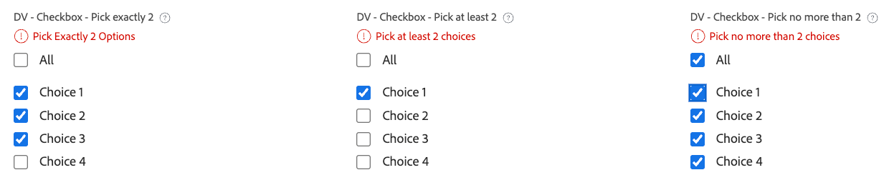

# Ejemplos de lógica avanzada en formularios personalizados

Las reglas lógicas permiten personalizar aún más los campos en un formulario personalizado.

Este artículo proporciona ejemplos de expresiones utilizadas para crear lógica avanzada en campos personalizados.

Para obtener más información sobre cómo agregar lógica a un formulario personalizado, consulte [Agregar reglas lógicas a formularios y campos personalizados](/help/quicksilver/administration-and-setup/customize-workfront/create-manage-custom-forms/form-designer/design-a-form/display-skip-logic-form-designer.md).

## Requisitos de acceso

+++ Expanda para ver los requisitos de acceso para la funcionalidad en este artículo.

<table style="table-layout:auto"> 
 <col> 
 <col> 
 <tbody> 
  <tr> 
   <td>Paquete de Adobe Workfront</td> 
   <td><p>Cualquiera</p></td> 
  </tr> 
  <tr> 
   <td>Licencia de Adobe Workfront</td> 
   <td><p>Estándar</p>
       <p>Plan</p></td>
  </tr> 
  <tr> 
   <td>Configuraciones de nivel de acceso</td> 
   <td> <p>Acceso administrativo a formularios personalizados</p> </td> 
  </tr>  
 </tbody> 
</table>

Para obtener más información, consulte [Requisitos de acceso en la documentación de Workfront](/help/quicksilver/administration-and-setup/add-users/access-levels-and-object-permissions/access-level-requirements-in-documentation.md).

+++

## Ejemplos de lógica de validación

La lógica de validación se crea mediante fórmulas y puede hacer que la lógica sea tan simple o tan compleja como necesite. La validación se puede basar en los valores de otros campos o en el estado de los objetos, y puede proporcionar un mensaje de error para cuando falle la validación.

Si el campo con la lógica aplicada cumple las condiciones de validación definidas cuando un usuario rellena el formulario personalizado, el campo se resalta y se muestra el mensaje de error.

Puede aplicar lógica de validación a los siguientes tipos de campo: texto de una línea, párrafo, lista desplegable de selección única, lista desplegable de selección múltiple, búsqueda externa, escritura anticipada, fecha, grupo de casillas de verificación y botones de opción.

### Solamente permitir que el propietario del proyecto seleccione &quot;Apurar&quot; SLA

En este ejemplo, un campo desplegable de selección única tiene opciones para SLA de Standard: 14 días, Priority: 7 días y Rush: 2 días.

Expresión de validación:

```
IF({ownerID}!=$$USER&&{DE:DV - Dropdown - Control Dates}="2",CONCAT("Only ",{owner}.{name}," may select X Rush"))
```

Cuando alguien que no es el propietario del proyecto (incluido el administrador del sistema) intenta seleccionar **X Rush**, se muestra un error:


### Validación de fecha basada en la opción del campo anterior

Siguiendo con el ejemplo de SLA, puede añadir un campo de fecha que se valide en función de la configuración del campo desplegable anterior.

Expresión de validación:

```
IF(
    DATEDIFF({DE:DV - Date - Dropdown SLA}, 
        ADDDAYS($$TODAY,{DE:DV - Dropdown - Control Dates})) < 0, 
    CONCAT("Earliest: ", 
        ADDDAYS($$TODAY,{DE:DV - Dropdown - Control Dates})))
```

Si el usuario selecciona una fecha anterior a la fecha permitida, el mensaje muestra la fecha más temprana que puede seleccionar:

 de abril

### Recuento mínimo de caracteres con la opción de anulación

En este ejemplo, se aplica un recuento mínimo de caracteres en un campo de texto, mostrando el recuento de caracteres. Además, se configura una casilla de verificación independiente para deshabilitar la validación del recuento de caracteres.

Expresión de validación:

```
IF({DE:DV - Override}!="Disable Validation"&&LEN({DE:DV - Text - Min Length})<"7",CONCAT(LEN({DE:DV - Text - Min Length})," characters / ",("7"-LEN({DE:DV - Text - Min Length}))," remaining"))
```

La aplicación de la validación se puede anular seleccionando la casilla de verificación:


Se incluye un recuento de caracteres en ejecución en el campo de texto:


### Bloquear un campo para que solo el propietario pueda editarlo

En este ejemplo, un campo solo lo puede editar el propietario del proyecto. Ni siquiera el administrador del sistema puede editar el campo.

Expresión de validación:

```
IF({ownerID}!=$$USER,IF(ISBLANK({ownerID}),"Project Owner will provide this.",CONCAT("Only ",{owner}.{name}," can edit this.")))
```

Si un usuario que no es el propietario del proyecto intenta escribir en el campo, verá un mensaje que indica que solo el propietario del proyecto puede editar el campo.


### Escribir con anticipación permite o rechaza valores basados en otros valores de campo

En este ejemplo, un campo de escritura anticipada permite o rechaza dinámicamente valores basados en el valor introducido en otro campo del formulario.

Expresión de validación:

```
IF({DE:DV - Text - Budget}>"10000",
   IF({DE:DV - TA User - by Budget}.{role}!="Director","Requires Director Approver")
)
```

Si el valor del campo de presupuesto es superior a 10 000 $, solo se pueden seleccionar usuarios con la función de director en el tipo de delante, aunque no haya ningún filtro de función habilitado en la configuración de tipo de delante.


### No permitir valores que sean inferiores a 10 días desde la fecha de entrada

En este ejemplo, la validación solo permite valores que sean 10 días en el futuro desde la fecha de entrada. La opción para anular la validación (en un campo de casilla de verificación independiente) también se incluye en la fórmula, junto con lo que permite que el campo de fecha esté en blanco.

Expresión de validación:

```
IF({DE:DV - Override}!="Disable Validation"&&ISBLANK({DE:DV - Date - Deadline})!="true"&&{DE:DV - Date - Deadline}<ADDDAYS({entryDate},"10"),CONCAT("Earliest: ",ADDDAYS({entryDate},"10")))
```

Cualquier valor inferior a 10 días a partir de la validación de los déclencheur de fecha de entrada:


Un valor en blanco no almacena en déclencheur el mensaje de validación:


### Aplicar selecciones exactas/mínimas/máximas en un campo de selección múltiple

En este ejemplo, un campo de selección múltiple como un grupo de casillas de verificación requiere que el usuario elija un determinado número de opciones.

Expresión de validación (elija exactamente dos):

```
IF({DE:DV - Override}!="Disable Validation"&&ARRAYLENGTH(ARRAY({DE:DV - Checkbox - Pick exactly 2},","))!="2","Pick Exactly 2 Options")
```

Expresión de validación (elija al menos dos):

```
IF({DE:DV - Override}!="Disable Validation"&&ARRAYLENGTH(ARRAY({DE:DV - Checkbox - Pick at least 2},","))<"2","Pick at least 2 choices")
```

Expresión de validación (elija no más de dos):

```
IF({DE:DV - Override}!="Disable Validation"&&ARRAYLENGTH(ARRAY({DE:DV - Checkbox - Pick no more than 2},","))>"2","Pick no more than 2 choices")
```

El usuario ve errores de validación si no selecciona el número correcto de opciones.


