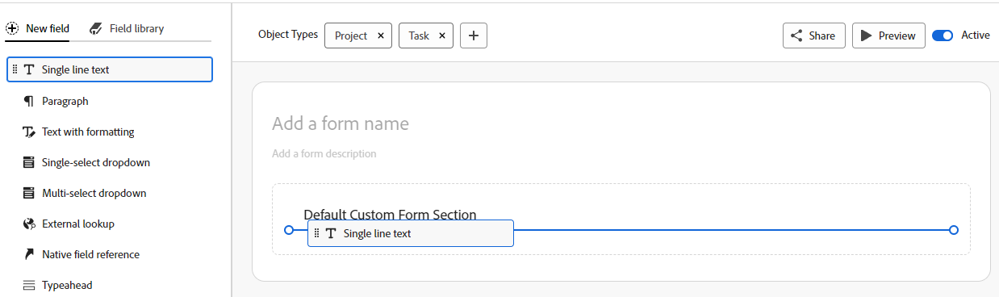

# Crear un formulario personalizado

<!-- Audited: 6/2025 -->

{{preview-fast-release-general}}

Puede diseñar un formulario personalizado con el diseñador de formularios en Adobe Workfront. Puede adjuntar formularios personalizados a diferentes objetos de Workfront para capturar datos sobre esos objetos.

## Requisitos de acceso

+++ Expanda para ver los requisitos de acceso para la funcionalidad en este artículo.

<table style="table-layout:auto"> 
 <col> 
 <col> 
 <tbody> 
  <tr> 
   <td>Paquete de Adobe Workfront</td> 
   <td> 
Para crear formularios personalizados para roles, tarjetas de valoración y asignaciones de puestos: Flujo de trabajo Ultimate

      
Para crear formularios personalizados para todos los demás objetos admitidos: Cualquier paquete de flujo de trabajo o Workfront
 </td> 
  </tr>  
  <tr> 
   <td>Licencia de Adobe Workfront</td> 
   <td>
Estándar

       
Plan
</td>
  </tr> 
  <tr> 
   <td>Configuraciones de nivel de acceso</td> 
   <td>Acceso administrativo a formularios personalizados</td> 
  </tr>  
 </tbody> 
</table>

Para obtener más información, consulte [Requisitos de acceso en la documentación de Workfront](/help/quicksilver/administration-and-setup/add-users/access-levels-and-object-permissions/access-level-requirements-in-documentation.md).

+++

## Empezar a diseñar un formulario personalizado

{{step-1-to-setup}}

1. En el panel izquierdo, haga clic en **Formularios personalizados** y luego seleccione **Formularios**.

1. Haga clic en **Nuevo formulario personalizado.**
1. Seleccione a qué tipos de objetos desea adjuntar el formulario personalizado y, a continuación, haga clic en **Continuar**.

   

   +++ Expanda para ver la lista de objetos que admiten formularios personalizados.

   * Proyecto
   * Tarea
   * Problema/Solicitud
   * Portafolio
   * Documento
   * Programa
   * Gasto
   * Usuario
   * Compañía
   * Iteración
   * Registro de facturación
   * Grupo
   * Equipo

   Si se encuentra en el paquete Workflow Ultimate, también puede crear formularios personalizados para estos objetos:

   * Función
   * Tarjeta de tarifas
   * Asignación

   +++

1. En el área **Añadir un nombre de formulario**, escriba el título del formulario personalizado.
1. (Opcional) Si desea agregar más tipos de objetos al formulario para que se pueda adjuntar a más objetos, haga clic en **Tipos de objetos** en el encabezado del diseñador de formularios. Seleccione los tipos de objeto que desea añadir y anule la selección de los tipos de objeto que desee eliminar del formulario.

   >[!CAUTION]
   >
   >Al eliminar un formulario personalizado también se eliminan todos los datos personalizados de los objetos asociados con el formulario. Los datos eliminados no se pueden recuperar. También puede desactivar un formulario personalizado que ya no utilice, que conservará todos los datos históricos asociados.
   >
   >Para obtener más información, consulte [Añadir o eliminar tipos de objetos de un formulario personalizado existente](/help/quicksilver/administration-and-setup/customize-workfront/create-manage-custom-forms/form-designer/manage-a-form/add-or-remove-objects-from-a-form.md) y [Desactivar o reactivar un formulario personalizado](/help/quicksilver/administration-and-setup/customize-workfront/create-manage-custom-forms/form-designer/manage-a-form/activate-deactivate-form.md).

1. A continuación, puede empezar a añadir campos a su formulario personalizado. Para obtener más información, consulte las siguientes secciones:
   * [Reutilizar un campo o widget existente ya utilizado en otro formulario personalizado](#reuse-an-existing-field-or-widget-already-used-in-another-custom-form)
   * [Notas sobre nombres de campo y etiquetas](#notes-on-field-names-and-labels)
   * [Añadir campos de búsqueda](#add-text-fields)
   * [Añadir campos calculados](#add-calculated-fields)
   * [Añadir botones de opción, grupos de casillas de verificación y menús desplegables](#add-radio-buttons-checkbox-groups-and-drop-downs)
   * [Añadir campos de fecha y typeahead](#add-typeahead-and-date-fields)
   * [Añadir campos de búsqueda externa](#add-external-lookup-fields)
   * [Añadir imágenes, PDF y vídeos](#add-images-pdfs-and-videos)
   * [Añadir campos nativos de Workfront](#add-workfront-native-fields)
   * [Añadir archivos Adobe XD](#add-adobe-xd-files)
   * [Añadir campos de conexión de Planning](#add-planning-connection-fields)

## Añadir campos nuevos o existentes al formulario personalizado

Puede utilizar campos nuevos o existentes al diseñar su formulario personalizado.

Los formularios personalizados están limitados a 500 campos. Un contador situado en la parte inferior izquierda muestra cuántos campos se utilizan en el formulario y siempre está visible al desplazarse por el diseñador de formularios.

### Reutilizar un campo o widget existente ya utilizado en otro formulario personalizado

1. En la parte superior izquierda de la pantalla, haga clic en **Biblioteca de campos**.

1. Arrastre y suelte el campo o widget deseado en el lienzo. Repita este paso para añadir otros campos o widgets.

   >[!NOTE]
   >
   >Puede añadir hasta 500 campos y widgets en un único formulario personalizado. Sin embargo, puede producirse una degradación del rendimiento cuando existan más de 100 campos en un formulario, según su complejidad.
   >
   >
   >Algunos ejemplos de formularios complejos son los formularios con parámetros en cascada, los campos de datos personalizados calculados y varias opciones de valor en un único campo.

   >[!NOTE]
   >
   >Si se marca un campo existente como inactivo, no estará disponible para su uso en elementos de creación de informes y formularios personalizados a partir de ese momento. Si el campo inactivo se utiliza actualmente en un informe o un formulario, el campo y sus datos históricos permanecen en su lugar.

1. Para guardar los cambios, haga clic en **Aplicar** y pase a otra sección para seguir creando el formulario.

   O

   Haga clic en **Guardar y Cerrar**.

### Notas sobre nombres de campo y etiquetas {#notes-on-field-names-and-labels}

La etiqueta está disponible para la mayoría de los campos. Es una etiqueta descriptiva que aparece encima del campo o widget en el formulario personalizado. Puede cambiar la etiqueta en cualquier momento.

>[!NOTE]
>
>Evite utilizar caracteres especiales en esta etiqueta, ya que no se muestran correctamente en los informes.

Es obligatorio un nombre para cada campo. Este nombre es el modo en que el sistema identifica el campo personalizado cuando se agrega a varias áreas a través de Workfront, como informes, Página de inicio e interacciones de API. Cuando configure el campo o widget por primera vez y escriba la etiqueta, el campo Nombre se rellenará automáticamente para que coincida. Los campos Etiqueta y Nombre no están sincronizados. Esto le proporciona la opción de cambiar la etiqueta que ven los usuarios sin tener que cambiar el nombre que ve el sistema.

Cada nombre de campo personalizado debe ser único en la instancia de Workfront de su organización. De este modo, puede reutilizar uno que ya se haya creado para otro formulario personalizado.

>[!NOTE]
>
>Aunque es posible hacerlo, le recomendamos que no cambie este nombre después de que usted u otros usuarios empiecen a utilizar el formulario personalizado en Workfront. Si lo hace, el sistema ya no reconocerá el campo personalizado, donde ahora se podría hacer referencia a él en otras áreas de Workfront.
>Por ejemplo, si agrega el campo personalizado a un informe y posteriormente cambia su nombre, Workfront no lo reconocerá en el informe y dejará de funcionar correctamente allí a menos que lo vuelva a agregar al informe con el nuevo nombre.
>
>Se recomienda no escribir un nombre que ya se utilice en los campos integrados de Workfront.
>
>Se recomienda no utilizar el carácter del punto en el nombre del campo personalizado para evitar errores al usar el campo en diferentes áreas de Workfront.

Los nombres y etiquetas de campos personalizados no admiten los siguientes caracteres especiales.

* \t
* \n
* \r
* \f
* `[`
* `]`
* (
* )
* :
* `{`
* `}`

### Añadir campos de búsqueda

Puede añadir varios campos de texto diferentes a un formulario personalizado.

+++ Amplíe para ver las descripciones de los campos de texto disponibles.

* **Campo de texto de línea única**: permite a los usuarios escribir una sola línea de texto en el campo.
* **Campo de párrafo**: permite a los usuarios escribir varias líneas de texto en el campo.
* **Texto enriquecido**: Permite a los usuarios escribir varias líneas de texto en el campo y aplicarle formato de negrita, cursiva, subrayado, viñetas, numeración, subíndice y superíndice, hipervínculos, citas de bloque, encabezados y tablas. El límite de caracteres de 15.000 proporciona un gran espacio para texto y formato.

  El tipo de campo Texto enriquecido reemplaza el texto por el tipo de campo de formato. Puede convertir rápidamente el texto existente con campos de formato en texto enriquecido haciendo clic en el botón **Convertir en texto enriquecido** en las opciones de campo de la derecha.

* **Campo de texto con formato**: permite a los usuarios escribir varias líneas de texto en el campo y aplicar al texto negrita, cursiva, subrayado, viñetas, numeración, hipervínculos y citas en bloque. Un límite de 15 000 caracteres permite texto y formato abundantes.

  Este tipo de campo personalizado no se admite en filtros de listas e informes.

  Para obtener información sobre cómo obtener acceso a este campo mediante la API, consulte [Almacenamiento de campo de texto enriquecido en la API](/help/quicksilver/administration-and-setup/customize-workfront/create-manage-custom-forms/rich-text-field-storage-in-the-api.md).

  >[!NOTE]
  >
  >Los campos de texto con formato no están disponibles para las aplicaciones móviles de Workfront (disponibles en próximas versiones).

* **Texto descriptivo**: permite incluir instrucciones y vínculos a páginas fuera de Workfront.

+++

Para añadir un campo de texto:

1. En la pestaña **Nuevo campo** situada en la parte izquierda de la pantalla, busque uno de los siguientes campos de texto y arrástrelo a una sección del lienzo:

   * Texto de línea única
   * Párrafo
   * Texto enriquecido
   * Texto con formato
   * Texto descriptivo

   

1. En el lado derecho de la pantalla, configure las opciones disponibles para el tipo de campo personalizado que va a añadir:

   <table>
    <tr>
    <td>Entrada en</td>
    <td>Descripción</td>
    <td>Disponible para </td>
    </tr>
    <tr>
    <td>Tamaño</td>
    <td>
(Opcional) Cambie el tamaño de los campos de texto del formulario.

   </td>
    <td><ul>
    <li>Texto de línea única</li>
    <li>Párrafo</li>
    <li>Texto enriquecido</li>
    <li>Texto con formato</li>
    <li>Texto descriptivo</li>
    </ul></td>
    </tr>
    <tr>
    <td>Etiqueta</td>
    <td>
(Obligatorio) Escriba una etiqueta descriptiva para mostrar encima del campo. Puede cambiar la etiqueta en cualquier momento.

    
<b>Importante</b>: evite usar caracteres especiales en esta etiqueta, ya que no se muestran correctamente en los informes. Para obtener más información, consulte <a href="design-a-form.md#notes-on-field-names-and-labels">Notas sobre nombres de campo y etiquetas</a>.
</td>
    <td><ul>
    <li>Texto de línea única</li>
    <li>Párrafo</li>
    <li>Texto enriquecido</li>
    <li>Texto con formato</li>
    </ul></td>
    </tr>
    <tr>
     <td>Nombre</td>
    <td>
(Obligatorio) Este nombre es con el que el sistema identifica el campo. Cuando configure el widget por primera vez y escriba la etiqueta, el campo Nombre se rellenará automáticamente para que coincida. Los campos Etiqueta y Nombre no están sincronizados. Esto le proporciona la opción de cambiar la etiqueta que ven los usuarios sin tener que cambiar el nombre que ve el sistema.

    
Para obtener más información, consulte <a href="design-a-form.md#notes-on-field-names-and-labels">Notas sobre nombres de campo y etiquetas</a>.

    </td>
    <td><ul>
    <li>Texto de línea única</li>
    <li>Párrafo</li>
    <li>Texto enriquecido</li>
    <li>Texto con formato</li>
    <li>Texto descriptivo</li>
    </ul></td>
    </tr>
    <tr>
    <td>Instrucciones</td>
    <td>Escriba cualquier información adicional sobre el campo. Cuando los usuarios rellenan el formulario personalizado, pueden situarse sobre el icono del signo de interrogación para ver una información de objeto que contenga la información que escriba aquí.
    
    </td>
    <td><ul>
    <li>Texto de línea única</li>
    <li>Párrafo</li>
    <li>Texto enriquecido</li>
    <li>Texto con formato</li>
    </ul></td>
    </tr>
    <tr>
    <td>Formato</td>
    <td>
Seleccione el tipo de datos que se capturarán en el campo personalizado.
 
<b>Nota</b>:   
    <ul> 
    <li>Este campo no se puede editar después de guardar el formulario. Si tiene intención de utilizar el campo en cálculos matemáticos, asegúrese de seleccionar un formato de Número o de Moneda.</li> 
    <li>Al seleccionar Número o Moneda, el sistema trunca automáticamente los números que comienzan por 0.</li>
    <li>El límite de caracteres para los campos Número es de 16. También puede utilizar un campo Texto para introducir números y evitar el límite.</li>
     </ul>
</td> </td>
    <td><ul>
    <li>Texto de línea única</li>
    <li>Párrafo</li>
    </ul></td>
    </tr>
    <tr>
      <td>Tipo de permiso financiero</td>
      <td>
Seleccione el tipo de permiso financiero que deben tener los usuarios para poder ver o editar este campo personalizado. Se debe seleccionar Currency format.

      <ul>
      <li>
<strong>No se requieren permisos:</strong> Todos los usuarios pueden ver este campo
</li>
      <li>
<strong>General:</strong> Los usuarios deben tener permisos para editar o ver Finanzas generales
</li>
      <li>
<strong>Factura:</strong> Los usuarios deben tener permisos para editar o ver las tarifas de facturación
</li>
      <li>
<strong>Costo:</strong> Los usuarios deben tener permisos para editar o ver las tasas de costo
</li>
      </ul>
      
Para obtener más información, consulte <a href="/help/quicksilver/administration-and-setup/customize-workfront/create-manage-custom-forms/form-designer/design-a-form/restrict-access-to-financial-data.md">Restringir el acceso a datos financieros en campos personalizados</a>.

      </td>
      <td><ul>
       <li>Texto de línea única</li>
       <li>Párrafo</li>
       </ul></td>
    </tr>
    <tr>
    <td>Tipo de visualización</td>
    <td>Cambiar entre campos de texto de una sola línea y de párrafo.</td>
    <td><ul>
    <li>Texto de línea única</li>
    <li>Párrafo</li>
    </ul></td>
    </tr>
    <tr>
    <td>Hipervínculo</td>
    <td> Si desea aplicar un hipervínculo al texto descriptivo que ha escrito, añádalo aquí. El texto descriptivo se muestra como un vínculo en los objetos a los que está adjunto el formulario.</td>
    <td><ul><li>Texto descriptivo</li></ul></td>
    </tr>
    <tr>
     <td>Activo</td>
     <td>
Esta opción está habilitada de forma predeterminada.

Cuando se establece un campo como Inactivo, se excluye de los informes, los filtros y las vistas y ya no está disponible en la biblioteca de campos de formularios personalizados.
</td>
     <td><ul>
     <li>Texto de línea única</li>
     <li>Párrafo</li>
     <li>Texto enriquecido</li>
     <li>Texto con formato</li>
     <li>Texto descriptivo</li></ul></td>
    </tr>
    <tr> 
      <td>Cambiar un campo a obligatorio</td>
      <td>
Seleccione esta opción si desea que el campo sea obligatorio para que el usuario complete el formulario personalizado.
</td>
    <td><ul>
    <li>Texto de línea única</li>
    <li>Párrafo</li>
    <li>Texto enriquecido</li>
    <li>Texto con formato</li>
    </ul></td> 
    </tr> 
   </table>

1. (Opcional) Repita el paso anterior para añadir otros campos o widgets.

   O

   Para copiar un campo, pase el puntero por encima de él y haga clic en el icono Copiar.

   

1. Para guardar los cambios, haga clic en **Aplicar** y continúe en otra sección para seguir creando el formulario.

   O

   Haga clic en **Guardar y cerrar**.

### Añadir campos calculados

En un formulario personalizado, puede añadir un campo personalizado calculado que utilice datos existentes para generar datos nuevos cuando el formulario personalizado se adjunta a un objeto.

Para añadir un campo calculado, consulte [Añadir campos calculados con el diseñador de formularios](/help/quicksilver/administration-and-setup/customize-workfront/create-manage-custom-forms/form-designer/design-a-form/add-a-calculated-field.md).

### Añadir botones de opción, grupos de casillas de verificación y menús desplegables

Puede añadir botones de opción, grupos de casillas de verificación, listas desplegables y listas desplegables de selección múltiple a un formulario personalizado.

+++ Expanda para ver las descripciones de los campos disponibles.

* **Botones de radio**: requiere que los usuarios seleccionen solo una opción.
* **Grupo de casillas de verificación**: permite a los usuarios seleccionar varias opciones.
* **Menú desplegable de selección única**: proporciona una lista de opciones desplegables.
* **Menú desplegable de selección múltiple**: permite a los usuarios seleccionar varias opciones en una lista desplegable.

+++

>[!NOTE]
>
>Los campos que permiten varias selecciones, como el grupo de casillas de verificación y la lista desplegable de selección múltiple, son difíciles de trazar y agrupar en informes. Para facilitar la creación de gráficos y la agrupación de los informes, puede crear campos independientes para cada opción (p. ej., un campo de texto de una sola línea).

Para añadir botones de opción, grupos de casillas de verificación y menús desplegables, haga lo siguiente:

1. En la pestaña **Nuevo campo** situada en la parte izquierda de la pantalla, busque uno de los siguientes campos y arrástrelo a una sección del lienzo:

   * Botones de opción
   * Grupo de casillas de verificación
   * Menú desplegable de selección única
   * Menú desplegable de selección múltiple

   

1. En el lado derecho de la pantalla, configure las opciones disponibles para el tipo de campo personalizado que va a añadir:

   <table style="table-layout:auto"> 
    <tbody> 
    <tr>
    <td>Entrada en</td>
    <td>Descripción</td>
    <td>Disponible para </td>
    </tr>
    <tr> 
     <td role="rowheader">Etiqueta</td> 
     <td> 
(Obligatorio) Escriba una etiqueta descriptiva para mostrar encima del campo personalizado. Puede cambiar la etiqueta en cualquier momento.
 
<b>Importante</b>: evite usar caracteres especiales en esta etiqueta, ya que no se muestran correctamente en los informes. Para obtener más información, consulte <a href="design-a-form.md#notes-on-field-names-and-labels">Notas sobre nombres de campo y etiquetas</a>.
 </td> 
     <td><ul>
    <li>Botones de opción</li>
    <li>Grupo de casillas de verificación</li>
    <li>Menú desplegable de selección única</li>
    <li>Menú desplegable de selección múltiple</li>
    </ul></td>
     </tr> 
     <tr> 
    <td role="rowheader">Nombre</td> 
     <td> 
(Obligatorio) Este nombre es con el que el sistema identifica el campo. Cuando configure el widget por primera vez y escriba la etiqueta, el campo Nombre se rellenará automáticamente para que coincida. Los campos Etiqueta y Nombre no están sincronizados. Esto le proporciona la opción de cambiar la etiqueta que ven los usuarios sin tener que cambiar el nombre que ve el sistema.
 
    
Para obtener más información, consulte <a href="design-a-form.md#notes-on-field-names-and-labels">Notas sobre nombres de campo y etiquetas</a>.
 </td>
     <td><ul>
    <li>Botones de opción</li>
    <li>Grupo de casillas de verificación</li>
    <li>Menú desplegable de selección única</li>
    <li>Menú desplegable de selección múltiple</li>
    </ul></td>
    </tr> 
    <tr> 
    <td role="rowheader">Instrucciones</td> 
    <td> 
Escriba cualquier información adicional sobre el campo personalizado. Cuando los usuarios rellenan el formulario personalizado, pueden pasar el puntero por encima del icono del signo de interrogación para ver una ayuda contextual que contiene la información que escriba aquí.
 
    
   

    </td> 
    <td><ul>
    <li>Botones de opción</li>
    <li>Grupo de casillas de verificación</li>
    <li>Menú desplegable de selección única</li>
    <li>Menú desplegable de selección múltiple</li>
    </ul></td>
    </tr> 
    <tr> 
    <td role="rowheader">Formato</td> 
    <td> 
Seleccione el tipo de datos que se capturarán en el campo personalizado.
 
<b>Nota</b>:   
     <ul> 
    <li>Este campo no se puede editar después de guardar el formulario. Si tiene intención de utilizar el campo en cálculos matemáticos, asegúrese de seleccionar un formato de Número o de Moneda. </li> 
    <li>Al seleccionar Número o Moneda, el sistema trunca automáticamente los números que comienzan por 0.</li>
    <li>El límite de caracteres para los campos Número es de 16. También puede utilizar un campo Texto para introducir números y evitar el límite.</li>
     </ul>
</td> 
     <td><ul>
    <li>Botones de opción</li>
    <li>Grupo de casillas de verificación</li>
    <li>Menú desplegable de selección única</li>
    <li>Menú desplegable de selección múltiple</li>
    </ul></td>
    </tr> 
    <tr>
      <td>Tipo de permiso financiero</td>
      <td>
Seleccione el tipo de permiso financiero que deben tener los usuarios para poder ver o editar este campo personalizado. Se debe seleccionar Currency format.

      <ul>
      <li>
<strong>No se requieren permisos:</strong> Todos los usuarios pueden ver este campo
</li>
      <li>
<strong>General:</strong> Los usuarios deben tener permisos para editar o ver Finanzas generales
</li>
      <li>
<strong>Factura:</strong> Los usuarios deben tener permisos para editar o ver las tarifas de facturación
</li>
      <li>
<strong>Costo:</strong> Los usuarios deben tener permisos para editar o ver las tasas de costo
</li>
      </ul>
      
Para obtener más información, consulte <a href="/help/quicksilver/administration-and-setup/customize-workfront/create-manage-custom-forms/form-designer/design-a-form/restrict-access-to-financial-data.md">Restringir el acceso a datos financieros en campos personalizados</a>.

      </td>
      <td><ul>
       <li>Botones de opción</li>
       <li>Grupo de casillas de verificación</li>
       <li>Menú desplegable de selección única</li>
       <li>Menú desplegable de selección múltiple</li>
       </ul></td>
    </tr>
    <tr> 
     <td role="rowheader">Tipo de visualización</td> 
    <td>Cambie entre botones de opción, grupos de casillas de verificación, menús desplegables de selección única o menús desplegables de selección múltiple para el campo.</td> 
    <td><ul>
    <li>Botones de opción</li>
    <li>Grupo de casillas de verificación</li>
    <li>Menú desplegable de selección única</li>
    <li>Menú desplegable de selección múltiple</li>
    </ul></td>
    </tr> 
    <td role="rowheader">Opciones </td> 
    <td> 
    
Seleccione una de las siguientes opciones:
 
    <ul> 
    <li><strong>Mostrar valores</strong>: muestra los valores de cada opción en el campo. La etiqueta de cada opción se muestra de forma predeterminada.</li>
   <li><strong>Ordenar opciones A-Z</strong>: ordena las opciones que se añaden alfabéticamente en el campo.</li>
    </ul>
     
Para cada opción que añada para el usuario, haga clic en el icono de engranaje  y, a continuación, seleccione una de las siguientes opciones:
 
    <ul> 
    <li><strong>Mostrar de forma predeterminada</strong>: seleccione la opción de forma predeterminada en el campo.</li> 
    <li> 
<strong>Ocultar opción</strong>: oculta la opción en el campo. Las opciones ocultas siguen estando accesibles en los informes.
 </li> 
    <li> 
<strong>Quitar opción</strong>: quite la opción del campo.
 
<b>Advertencia</b>: Si tiene objetos actuales que utilizan esta opción, no la quite del campo. Su eliminación hará que se pierdan datos históricos. En su lugar, seleccione la opción para ocultarla, esto impedirá que los usuarios la seleccionen en el futuro.
 </li> 
    </ul>   
    
<b>Nota:</b> No hay límite para la cantidad de opciones que puede seleccionar. 
    
    </td> 
    <td><ul>
    <li>Botones de opción</li>
    <li>Grupo de casillas de verificación</li>
    <li>Menú desplegable de selección única</li>
    <li>Menú desplegable de selección múltiple</li>
    </ul>
    </td>
     </tr>
    <tr>
     <td>Activo</td>
     <td>
Esta opción está habilitada de forma predeterminada.

Cuando se establece un campo como Inactivo, se excluye de los informes, los filtros y las vistas y ya no está disponible en la biblioteca de campos de formularios personalizados.
</td>
     <td><ul>
     <li>Botones de opción</li>
     <li>Grupo de casillas de verificación</li>
     <li>Menú desplegable de selección única</li>
     <li>Menú desplegable de selección múltiple</li></ul></td>
    </tr>
    <tr> 
    <td role="rowheader">Cambiar un campo a obligatorio</td> 
    <td>Seleccione esta opción si desea que el campo sea obligatorio para que el usuario complete el formulario personalizado. </td> 
    <td><ul>
    <li>Botones de opción</li>
    <li>Grupo de casillas de verificación</li>
    <li>Menú desplegable de selección única</li>
    <li>Menú desplegable de selección múltiple</li>
    </ul></td>
     </tr> 
    <tr> 
    </tbody> 
    </table>

1. (Opcional) Repita el paso anterior para añadir otros campos o widgets.

   O

   Para copiar un campo, pase el puntero por encima de él y haga clic en el icono Copiar.

   

1. Para guardar los cambios, haga clic en **Aplicar** y pase a otra sección para seguir creando el formulario.

   O

   Haga clic en **Guardar y Cerrar**.

### Añadir campos de fecha y typeahead

Puede añadir campos de escritura anticipada y fecha a un formulario personalizado.

+++ Expanda para ver las descripciones de los campos disponibles.

* **Escritura anticipada**: permite a los usuarios escribir el nombre de un objeto existente en Workfront. Aparece una lista de sugerencias cuando el usuario empieza a escribir. Este tipo de campo admite los siguientes objetos:
   * Usuario
   * Grupo
   * Función
   * Portafolio
   * Programa
   * Proyecto
   * Equipo
   * Plantilla
   * Compañía
* **Fecha**: muestra un calendario donde los usuarios pueden seleccionar una fecha y una hora.

+++

Para añadir los campos de fecha y escritura anticipada:

1. En la pestaña **Nuevo campo** situada en la parte izquierda de la pantalla, busque uno de los siguientes campos y arrástrelo a una sección del lienzo.

   * Escritura anticipada
   * Fecha

   

1. En el lado derecho de la pantalla, configure las opciones disponibles para el tipo de campo personalizado que va a añadir:

   <table style="table-layout:auto"> 
    <tbody> 
     <tr>
    <td>Configuración de campo</td>
    <td>Descripción</td>
    <td>Disponible para </td>
    </tr>
     <tr> 
      <td role="rowheader">Etiqueta</td> 
      <td> 
(Obligatorio) Escriba una etiqueta descriptiva para mostrar encima del campo personalizado. Puede cambiar la etiqueta en cualquier momento.
 
<b>Importante</b>: evite usar caracteres especiales en esta etiqueta, ya que no se muestran correctamente en los informes. Para obtener más información, consulte <a href="design-a-form.md#notes-on-field-names-and-labels">Notas sobre nombres de campo y etiquetas</a>.
 </td> 
       <td><ul>
    <li>Escritura anticipada</li>
    <li>Fecha</li>
    </ul></td>
     </tr> 
     <tr> 
      <td role="rowheader">Nombre</td> 
      <td> 
(Obligatorio) Este nombre es con el que el sistema identifica el campo. Cuando configure el widget por primera vez y escriba la etiqueta, el campo Nombre se rellenará automáticamente para que coincida. Los campos Etiqueta y Nombre no están sincronizados. Esto le proporciona la opción de cambiar la etiqueta que ven los usuarios sin tener que cambiar el nombre que ve el sistema.
 
      
Para obtener más información, consulte <a href="design-a-form.md#notes-on-field-names-and-labels">Notas sobre nombres de campo y etiquetas</a>.
 </td>
    <td><ul>
    <li>Escritura anticipada</li>
    <li>Fecha</li>
    </ul></td>
     </tr> 
     <tr> 
      <td role="rowheader">Instrucciones</td> 
      <td> 
Escriba cualquier información adicional sobre el campo personalizado. Cuando los usuarios rellenan el formulario personalizado, pueden pasar el puntero por encima del icono del signo de interrogación para ver una ayuda contextual que contiene la información que escriba aquí.
 
      
  

      </td> 
         <td><ul>
    <li>Escritura anticipada</li>
    <li>Fecha</li>
    </ul></td>
     </tr> 
     <tr> 
      <td role="rowheader">Mostrar hora del día</td> 
      <td>Seleccione esta opción si desea mostrar la hora del día junto con la fecha en el campo.</td> 
         <td><ul>
    <li>Fecha</li>
    </ul></td>
     </tr> 
     <tr> 
      <td role="rowheader">Tipo de objeto referenciado</td> 
      <td> 
Seleccione el tipo de objeto que desea asociar al campo.
 
Una vez que haya hecho clic en <b>Aplicar</b> o en <b>Guardar y cerrar</b>, no puede cambiar el tipo de objeto del campo.
 
<b>Nota</b>:   
        <ul> 
         <li>Si el administrador de Workfront personalizó el nombre para Portafolios, Programas o Proyectos en la interfaz de usuario de Workfront, será el nombre de Workfront predeterminado para el objeto el que aparezca en esta lista desplegable, no el nombre personalizado. Póngase en contacto con el administrador de Workfront si necesita ayuda sobre esto. </li> 
         <li>Los siguientes tipos de objetos son compatibles con las aplicaciones móviles de Workfront para iOS y Android: usuario, compañía, grupo, función de trabajo, portafolio, programa, proyecto y plantilla.</li> 
        </ul> 
 </td> 
         <td><ul>
    <li>Escritura anticipada</li>
    </ul></td>
     </tr>
     <tr>
      <td role="rowheader">Añadir filtro</td>
      <td>
Añada un filtro para un tipo de objeto y limitar los objetos que los usuarios pueden elegir cuando utilizan el campo. 
 
Por ejemplo, puede limitar un campo para que los nombres de usuario solo se puedan seleccionar si cumplen los siguientes criterios:
 
       <ul> 
        <li>Pertenecen a uno o varios grupos especificados.</li> 
        <li>Están asociados a una función o un título de trabajo especificados.</li> 
        <li>Pertenecen al mismo grupo que la persona que utiliza el campo.</li> 
       </ul>
       
Debe definir el filtro para el tipo de objeto que haya seleccionado mediante la sintaxis de modo de texto. Para obtener información acerca de cómo crear un filtro mediante el modo de texto, consulte <a href="/help/quicksilver/reports-and-dashboards/reports/text-mode/edit-text-mode-in-filter.md">Editar un filtro mediante el modo de texto</a>.

       
<b>Sugerencia:</b> Puede crear un informe para probar el filtro antes de añadirlo directamente al campo de escritura anticipada. Esto le ayudará a comprobar que el filtro devuelve los objetos correctos. A continuación, puede cambiar al modo de texto en el informe, copiar la instrucción de modo de texto y añadirla al filtro de escritura anticipada.

       
<b>Nota</b>:
       <ul> 
        <li>Si está editando un formulario personalizado existente, al añadir un filtro a un campo de escritura anticipada, no se elimina ningún objeto (fuera del ámbito del filtro) que los usuarios ya hayan añadido mediante el campo.</li> 
        <li>Este filtro no está disponible en los dispositivos móviles. Si utiliza el filtro para un campo de escritura anticipada, el campo aparecerá en los dispositivos móviles de los usuarios no afectados por el filtro.</li> 
        </ul>
</td> 
      <td>
       <ul>
       <li>Escritura anticipada</li>
       </ul>
      </td>
     </tr>
     <tr>
      <td>Activo</td>
      <td>
Esta opción está habilitada de forma predeterminada.

Cuando se establece un campo como Inactivo, se excluye de los informes, los filtros y las vistas y ya no está disponible en la biblioteca de campos de formularios personalizados.
</td>
      <td><ul>
      <li>Escritura anticipada</li>
      <li>Fecha</li></ul></td>
     </tr>
     <tr> 
      <td role="rowheader">Cambiar un campo a obligatorio</td> 
      <td>Seleccione esta opción si desea que el campo sea obligatorio para que el usuario complete el formulario personalizado. </td> 
       <td><ul>
    <li>Escritura anticipada</li>
    <li>Fecha</li>
    </ul></td>
     </tr> 
    </tbody> 
   </table>

1. (Opcional) Repita el paso anterior para añadir otros campos o widgets.

   O

   Para copiar un campo, pase el puntero por encima de él y haga clic en el icono Copiar.

   

1. Para guardar los cambios, haga clic en **Aplicar** y continúe en otra sección para seguir creando el formulario.

   O

   Haga clic en **Guardar y cerrar**.

### Añadir campos de búsqueda externa

Un campo de búsqueda externa llama a una API externa y devuelve valores como opciones en un campo desplegable. Los usuarios que trabajen con el objeto al que está adjunto el formulario personalizado pueden seleccionar una o varias de estas opciones en el menú desplegable, en función de si el campo de búsqueda externo es de selección única o múltiple. Los campos de búsqueda externos también están disponibles en listas e informes.

Para obtener ejemplos sobre el uso del campo de búsqueda externa para llamar a la misma instancia de Workfront o a una API pública, consulte [Ejemplos del campo de búsqueda externa en un formulario personalizado](/help/quicksilver/administration-and-setup/customize-workfront/create-manage-custom-forms/form-designer/design-a-form/external-lookup-examples.md).

>[!NOTE]
>
>* Los campos de búsqueda externos no están disponibles en las listas cuando el campo tiene una dependencia con otro campo.

Para añadir una búsqueda externa, haga lo siguiente:

1. En la pestaña **Nuevo campo** situada en la parte izquierda de la pantalla, busque **Búsqueda externa** o **Búsqueda externa de selección múltiple** y arrástrela a una sección del lienzo.
1. En el lado derecho de la pantalla, configure las opciones para el campo personalizado:

   <table style="table-layout:auto"> 
    <col> 
    <col> 
    <tbody> 
     <tr> 
      <td role="rowheader">Etiqueta</td> 
      <td> 
(Obligatorio) Escriba una etiqueta descriptiva para mostrar encima del campo personalizado. Puede cambiar la etiqueta en cualquier momento.
 
<b>Importante</b>: evite usar caracteres especiales en esta etiqueta, ya que no se muestran correctamente en los informes. Para obtener más información, consulte <a href="design-a-form.md#notes-on-field-names-and-labels">Notas sobre nombres de campo y etiquetas</a>.
 </td> 
     </tr> 
     <tr> 
      <td role="rowheader">Nombre</td> 
      <td> 
(Obligatorio) Este nombre es con el que el sistema identifica el campo. Cuando configure el widget por primera vez y escriba la etiqueta, el campo Nombre se rellenará automáticamente para que coincida. Sin embargo, los campos Etiqueta y Nombre no están sincronizados, lo que le da la opción de cambiar la etiqueta que ven los usuarios sin tener que cambiar el nombre que ve el sistema.

      
Para obtener más información, consulte <a href="design-a-form.md#notes-on-field-names-and-labels">Notas sobre nombres de campo y etiquetas</a>.
 </td>
     </tr> 
      <td role="rowheader">Instrucciones</td> 
      <td> 
Escriba cualquier información adicional sobre el campo personalizado. Cuando los usuarios rellenan el formulario personalizado, pueden pasar el puntero por encima del icono del signo de interrogación para ver una ayuda contextual que contiene la información que escriba aquí.
 </td> 
     </tr> 
     <tr> 
      <td role="rowheader">Formato</td>
      <td>
Seleccione el tipo de datos que se capturarán en el campo personalizado.

      
<strong>Nota:</strong>

      <ul><li>Puede cambiar el tipo de formato después de guardar el formulario, con una limitación: todos los valores existentes en los objetos deben poder convertirse al nuevo tipo. (Por ejemplo, si el tipo de formato es Texto y un objeto almacena el valor "abc", no se puede convertir el campo y aparecerá un error que indica que el sistema no puede convertir "abc" en número/moneda.) Si tiene intención de utilizar el campo en cálculos matemáticos, asegúrese de seleccionar un formato de Número o de Moneda.</li>
      <li>Al seleccionar Número o Moneda, el sistema trunca automáticamente los números que comienzan por 0.</li>
      <li>El límite de caracteres para los campos Número es de 16. También puede utilizar un campo Texto para introducir números y evitar el límite.</li>
      </ul></td>
     </tr> 
     <tr>
      <td>Tipo de permiso financiero</td>
      <td>
Seleccione el tipo de permiso financiero que deben tener los usuarios para poder ver o editar este campo personalizado. Se debe seleccionar Currency format.

      <ul>
      <li>
<strong>No se requieren permisos:</strong> Todos los usuarios pueden ver este campo
</li>
      <li>
<strong>General:</strong> Los usuarios deben tener permisos para editar o ver Finanzas generales
</li>
      <li>
<strong>Factura:</strong> Los usuarios deben tener permisos para editar o ver las tarifas de facturación
</li>
      <li>
<strong>Costo:</strong> Los usuarios deben tener permisos para editar o ver las tasas de costo
</li>
      </ul>
      
Para obtener más información, consulte <a href="/help/quicksilver/administration-and-setup/customize-workfront/create-manage-custom-forms/form-designer/design-a-form/restrict-access-to-financial-data.md">Restringir el acceso a datos financieros en campos personalizados</a>.

      </td>
     </tr>
     <tr> 
      <td role="rowheader">URL de API básica</td> 
      <td>
Escriba o pegue la URL de la API.

La URL de la API debe devolver un contenido JSON de las opciones que desee mostrar en el menú desplegable. Puede utilizar el campo Ruta JSON para seleccionar los valores específicos del JSON devuelto para que sean opciones desplegables.

Al introducir la URL de la API, puede, opcionalmente, pasar los siguientes valores en la URL:

      <ul>
      <li>$$HOST: representa el host actual de Workfront y se puede utilizar para hacer o buscar llamadas de la API a la API de Workfront. Cuando se utiliza este comodín, se administra la autenticación y los usuarios no necesitan enviar encabezados de autenticación. (Por ejemplo, los usuarios pueden buscar tareas utilizando la dirección URL base <code>$$HOST/attask/api/task/search</code> y permitirá buscar tareas y seleccionar valores de una lista de tareas devuelta).</li>
      <li>
$$QUERY: representa el texto de búsqueda que el usuario final escribe en el campo y le permite implementar el filtrado de consultas para los usuarios finales. (El usuario buscará el valor en la lista desplegable).

      
Si la API a la que hace referencia lo permite, también puede incluir modificadores en la consulta de búsqueda para identificar cómo debería funcionar la búsqueda. Por ejemplo, puede usar lo siguiente como dirección URL de la API base para permitir que las personas busquen cualquier proyecto de Workfront que contenga texto específico: <code>$$HOST/attask/api/v15.0/proj/search?name=$$QUERY&name_Mod=contains</code>.

Obtenga más información acerca de los modificadores de búsqueda de Workfront en <a href="/help/quicksilver/wf-api/general/api-basics.md">Conceptos básicos de API</a>.

      
<strong>Nota:</strong> Si no usa $$QUERY y el usuario escribe texto en el cuadro de búsqueda, reducirá las opciones que ya tiene. Sin embargo, si utiliza $$QUERY y el usuario escribe cualquier cosa, se realiza una nueva llamada de red a la API. Por lo tanto, si tiene más de 2000 valores en la API y esta admite consultas, puede utilizar $$QUERY no solo para buscar entre los 2000 valores existentes, sino también desde la API original con las opciones reducidas.
</li>
      <li>
{fieldName}: donde fieldName es cualquier campo personalizado o nativo en Workfront. De este modo, puede implementar filtros de opciones desplegables en cascada cuando pase el valor de un campo ya seleccionado al campo Búsqueda externa para filtrar las opciones. (Por ejemplo, el campo Región ya existe en el formulario y está restringiendo una lista de países de la API a los que están en una región específica).

      
En el caso de un campo de búsqueda externo que dependa de otros campos (con la sintaxis {fieldName}), las opciones devueltas por la API se limitan a las que coinciden con cualquier cadena o valor introducido en los demás campos. (Esta funcionalidad no es compatible con listas e informes).
</li>
      <li>{referenceObject}.{fieldName}: el campo forma parte de un objeto. Esta sintaxis es similar a las expresiones personalizadas. (Por ejemplo, portfolioID={project}.{portfolioID})</li></ul>
      
<strong>Sugerencia:</strong> Revise la documentación de la API con la que está trabajando para ver las consultas específicas que puede definir.
</td>
     </tr>
     <tr> 
      <td role="rowheader">Método HTTP</td> 
      <td>Seleccione <strong>Get</strong>, <strong>Post</strong> o <strong>Put</strong> para el método.</td> 
     </tr>
     <tr> 
      <td role="rowheader">Ruta JSON</td>
      <td>
Escriba o pegue la ruta JSON para la API.
 
Esta opción permite extraer datos del JSON devuelto por la URL de la API. Sirve para seleccionar qué valores dentro del JSON aparecerán en las opciones desplegables.

Por ejemplo, si la dirección URL de la API devuelve JSON en el siguiente formato, puede usar “$.data[*].name” para seleccionar EE. UU. y Canadá como opciones desplegables: 
      <pre>
      {
       data: {
         { name: "USA"},
         { name: "Canada"}
       }
      }
      </pre>
      

     
Para obtener más información sobre la ruta JSON y cómo asegurarse de que escribe la ruta JSON correcta, consulte <a href="https://jsonpath.com/">https://jsonpath.com/</a>.
</td>
     </tr>
     <tr> 
      <td role="rowheader">Encabezados</td>
      <td>
Haga clic en <strong>Añadir encabezado</strong> y escriba o pegue el par clave-valor necesario para la autenticación con la API.

<strong>Nota:</strong> Los campos de encabezado no son un lugar seguro para almacenar credenciales, y debe tener cuidado con lo que escribe y guarda.
</td>
     </tr>
     <tr> 
      <td role="rowheader">Menú desplegable de selección múltiple</td>
      <td>
Seleccione esta opción para permitir que el usuario seleccione más de un valor en la lista desplegable.
</td>
     </tr>
     <tr>
      <td>Activo</td>
      <td>
Esta opción está habilitada de forma predeterminada.

Cuando se establece un campo como Inactivo, se excluye de los informes, los filtros y las vistas y ya no está disponible en la biblioteca de campos de formularios personalizados.
</td>
     </tr>
     <tr> 
      <td role="rowheader">Cambiar un campo a obligatorio</td>
      <td>
Seleccione esta opción si desea que el campo sea obligatorio para que el usuario complete el formulario personalizado.
</td>
     </tr>       
    </tbody>
   </table>

1. Para guardar los cambios, haga clic en **Aplicar** y pase a otra sección para seguir generando el formulario.

   O

   Haga clic en **Guardar y cerrar**.

>[!NOTE]
>
>Los siguientes elementos son limitaciones técnicas de la llamada a la API externa:
>
>* Número máximo de opciones: 2000 (solo se muestran las 2000 primeras opciones únicas del JSON devuelto)
>* Tiempo de espera: 30 segundos
>* Número de reintentos: 3
>* Duración de espera entre reintentos: 500 ms
>* Estados de respuesta esperados: 2xx

### Añadir imágenes, PDF y vídeos

Puede añadir imágenes, PDF y vídeos a un formulario personalizado. Los usuarios que trabajen con el objeto al que está adjunto el formulario personalizado solo podrán ver la imagen, el PDF o el vídeo en las áreas siguientes:

* El área de detalles del objeto (por ejemplo, para un proyecto, el área Detalles del proyecto).
* El cuadro Editar del objeto, si tiene la apariencia de la experiencia nueva de Adobe Workfront (por ejemplo, los cuadros Editar proyecto y Editar tarea).

<!--
 Do we need to tell them where they can't see it if we tell them where they can see it?
Currently, users cannot see the widget in the following areas:​
Lists and reports
Home and Summary
The Edit box for the object, if it doesn't have the new Adobe Workfront experience look and feel (for example, the Edit Expense box)
The Workfront Mobile app
-->

+++ Expanda para ver las descripciones de los campos disponibles.

* **Imagen**: permite a los usuarios añadir archivos de imagen.
* **PDF**: permite a los usuarios añadir documentos PDF
* **Vídeos**: permite a los usuarios añadir archivos de vídeo.

+++

Para añadir imágenes, PDF o vídeos:

1. En la pestaña **Nuevo campo** situada en la parte izquierda de la pantalla, busque uno de los siguientes campos y arrástrelo a una sección del lienzo.

   * Imagen
   * PDF
   * Vídeo

   

1. Escriba o edite cualquiera de las siguientes propiedades para el widget:

   <table style="table-layout:auto"> 
    <col> 
    <col> 
    <tbody> 
         <tr> 
      <td role="rowheader">Tamaño</td> 
      <td>(Opcional) Cambie el tamaño de visualización del widget según sea necesario.</td> 
     </tr> 
     <tr> 
      <td role="rowheader">Etiqueta</td> 
      <td> 
(Obligatorio) Escriba una etiqueta descriptiva para mostrar encima del widget. Puede cambiar la etiqueta en cualquier momento.
 
<b>Importante</b>: evite usar caracteres especiales en esta etiqueta, ya que no se muestran correctamente en los informes. Para obtener más información, consulte <a href="design-a-form.md#notes-on-field-names-and-labels">Notas sobre nombres de campo y etiquetas</a>.
 </td> 
     </tr> 
     <tr> 
      <td role="rowheader">Nombre</td> 
      <td> 
(Obligatorio) Este nombre es con el que el sistema identifica el widget. Cuando configure el widget por primera vez y escriba la etiqueta, el campo Nombre se rellenará automáticamente para que coincida. Los campos Etiqueta y Nombre no están sincronizados. Esto le proporciona la opción de cambiar la etiqueta que ven los usuarios sin tener que cambiar el nombre que ve el sistema.
 
Para obtener más información, consulte <a href="design-a-form.md#notes-on-field-names-and-labels">Notas sobre nombres de campo y etiquetas</a>.
 </td> 
     </tr> 
     <tr> 
      <td role="rowheader">URL</td> 
      <td> 
(Obligatorio) Escriba o pegue la dirección URL del widget donde está almacenado en Internet.
 
      
Si desea añadir un widget de vídeo, actualmente puede hacerlo añadiendo lo siguiente en el cuadro URL:
 
      <ul> 
      <li> 
Vínculo de YouTube o Vimeo
 </li> 
      <li> 
Vínculo de vídeo a Google Drive
 </li> 
      <li> 
Vínculo a vídeo con extensión MP4 y MOV
 </li> 
      <li> 
Vínculo a un vídeo ya cargado en el área Documentos de la instancia de Workfront. Para obtener instrucciones, consulte <a href="#add-a-video-widget-to-a-custom-form-from-the-documents-area" class="MCXref xref">Añadir un widget de vídeo a un formulario personalizado desde el área Documentos</a> en este artículo.
 </li> 
      </ul> 
       </td> 
     </tr> 
     <tr> 
      <td role="rowheader">Instrucciones</td> 
      <td> 
Escriba cualquier información adicional sobre el widget. Cuando los usuarios rellenan el formulario personalizado, pueden pasar el puntero por encima del icono del signo de interrogación para ver una ayuda contextual que contiene la información que escriba aquí.
 </td> 
     </tr> 
     <tr>
      <td>Activo</td>
      <td>
Esta opción está habilitada de forma predeterminada.

Cuando se establece un campo como Inactivo, se excluye de los informes, los filtros y las vistas y ya no está disponible en la biblioteca de campos de formularios personalizados.
</td>
     </tr>
    </tbody> 
   </table>

   >[!NOTE]
   >En el caso de los PDF, se recomienda utilizar Grande para el tamaño de visualización del widget.
   >El visor de PDF de un explorador afecta a la visualización de los usuarios, que pueden tener que ajustar el tamaño de la ventana y el porcentaje de zoom del explorador si la visualización de PDF no es óptima.

1. (Opcional) Repita el paso anterior para añadir otros campos o widgets.

   O

   Para copiar un campo, pase el puntero por encima de él y haga clic en el icono Copiar.

   

1. Para guardar los cambios, haga clic en **Aplicar** y continúe en otra sección para seguir creando el formulario.

   O

   Haga clic en **guardar y cerrar**.

#### Añadir un vídeo a un formulario personalizado desde el área Documentos{#add-a-video-widget-to-a-custom-form-from-the-documents-area}

>[!IMPORTANT]
>
>Cuando se añade un vídeo a un formulario personalizado de esta manera, los permisos establecidos en el área Documentos se aplican al vídeo cuando los usuarios acceden al formulario en un objeto.

1. Vaya al vídeo en el área Documentos y genere una prueba para este, tal como se describe en [Crear una prueba interactiva para un sitio web u otro contenido web](/help/quicksilver/review-and-approve-work/proofing/creating-proofs-within-workfront/generate-interactive-proof-for-website-or-other-web-content.md).
1. Abra la prueba.
1. Haga clic con el botón derecho en cualquier lugar del vídeo y, a continuación, seleccione **Copiar dirección de vídeo**.
1. En el formulario personalizado donde esté añadiendo el widget de vídeo, pegue la dirección copiada en el cuadro **URL**.
1. Para guardar los cambios, haga clic en **Aplicar** y pase a otra sección para seguir creando el formulario.

   O

   Haga clic en **Guardar y cerrar**.

### Añadir campos nativos de Workfront

Puede añadir campos nativos de Workfront a los formularios personalizados. Cuando el formulario personalizado se adjunta a un objeto, el campo se rellena a partir de los datos del objeto. Por ejemplo, el campo Descripción de un formulario personalizado adjunto a un proyecto extraerá la descripción del proyecto. (Puede que el campo muestre &quot;N/D&quot; si no hay datos disponibles).

+++ Expanda para ver la lista de campos nativos admitidos.

Esta tabla enumera los campos nativos disponibles para objetos de Workfront específicos en un formulario personalizado.

| Nombre de campo | Proyecto | Tarea | Problema | Plantilla | Tarea de plantilla | Portafolio | Programa | Grupo |
|--------------------------- |-------- |------- |------- |--------- |-------------- | --------- |-------- |------ |
|  beneficio real  | ✓  |   |   |   |   |   |   |   |
| Fecha real de finalización | ✓ | ✓ | ✓ |   |   |   |   |   |
| Duración real | ✓ |   |   |   |   |   |   |   |
| Horas reales | ✓ |   | ✓ |   |   |   |   |   |
| Fecha real de inicio | ✓ | ✓ | ✓ |   |   |   |   |   |
|  presupuesto  | ✓  |   |   |  ✓  |   |  ✓  |   |   |
| Compañía | ✓ |   |   | ✓ |   |   |   |   |
| Condición | ✓ | ✓ | ✓ |   |   |   |   |   |
| Tipo de condición | ✓ |   |   | ✓ |   |   |   |   |
|  divisa  |  ✓  |   |   |  ✓  |   |   |   |   |
| Descripción | ✓ | ✓ | ✓ | ✓ | ✓ | ✓ | ✓ | ✓ |
| Duración |   | ✓ |   |   | ✓ |   |   |   |
| Tipo de duración |   | ✓ |   |   | ✓ |   |   |   |
| Unidad de duración |   | ✓ |   |   | ✓ |   |   |   |
| Introducido por | ✓ | ✓ | ✓ | ✓ | ✓ |   |   | ✓ |
| Fecha de entrada | ✓ | ✓ | ✓ | ✓ | ✓ |   |   | ✓ |
|  Fecha de tipo de cambio  |  ✓  |   |   |   |   |   |   |   |
|  costo fijo  |  ✓  |   |   |  ✓  |   |   |   |   |
|  ingresos fijos  |  ✓  |   |   |  ✓  |   |   |   |   |
| Grupo | ✓ |   |   | ✓ |   | ✓ | ✓ |   |
| Última actualización por | ✓ | ✓ | ✓ | ✓ | ✓ |   |   |   |
| Fecha de la última actualización | ✓ | ✓ | ✓ | ✓ | ✓ |   |   |   |
| Nombre | ✓ | ✓ | ✓ | ✓ | ✓ | ✓ | ✓ | ✓ |
| Propietario | ✓ |   |   | ✓ |   | ✓ | ✓ |   |
| Método  del índice de rendimiento de  |  ✓  |   |   |  ✓  |   |   |   |   |
|  beneficio planificado  |  ✓  |   |   |  ✓  |   |   |   |   |
| Fecha planificada de finalización | ✓ | ✓ | ✓ |   |   |   |   |   |
| Duración planificada | ✓ |   |   | ✓ |   |   |   |   |
| Horas planificadas | ✓ | ✓ | ✓ |   | ✓ |   |   |   |
| Fecha de inicio planificada | ✓ |   |   |   |   |   |   |   |
| Portafolio | ✓ |   |   | ✓ |   |   | ✓ |   |
| Prioridad | ✓ | ✓ | ✓ | ✓ | ✓ |   |   |   |
| Programar | ✓ |   |   | ✓ |   |   |   |   |
| Fecha proyectada de finalización | ✓ | ✓ |   |   |   |   |   |   |
| Minutos de duración proyectada |   | ✓ |   |   |   |   |   |   |
| Fecha proyectada de inicio | ✓ | ✓ |   |   |   |   |   |   |
| Número de referencia | ✓ | ✓ | ✓ | ✓ | ✓ |   |   |   |
| Modo de programación | ✓ |   |   | ✓ |   |   |   |   |
| Gravedad |   |   | ✓ |   |   |   |   |   |
| Patrocinador | ✓ |   |   | ✓ |   |   |   |   |
| Estado | ✓ | ✓ |   |   |   |   |   |   |
| Puntos de la historia |   | ✓ |   |   |   |   |   |   |
| Plantilla | ✓ |   |   |   |   |   |   |   |
|  Costo total estimado  |  ✓  |   |   |  ✓  |   |   |   |   |
|  ingresos totales estimados  |  ✓  |   |   |  ✓  |   |   |   |   |
| URL | ✓ | ✓ |   | ✓ | ✓ |   |   |   |

{style="table-layout:auto"}

Estos tipos de objetos de formulario personalizados adicionales también admiten referencias de campo nativas.

* Registro de facturación: campo Ingresos fijos
* Documento: campos Nombre y Descripción
* Empresa: nombre, campos de grupo
* Tarjeta de tarifas: campos Nombre, Descripción, Empresa, Grupo
* Función del puesto: campos Nombre, Descripción

<!--
Non-Labor Resource: Name, Description, Home Group, Non-labor Category, Non-labor Group, Unique Identifier fields
Staffing Plan: Name, Description, Owner, Group, Company, Currency, Schedule, Start Date, End Date, Available Estimated Hours, Total Estimated Hours, Reference Number, Entered By, Entry Date, Last Updated By, Last Updated Date, Total Estimated Cost, Total Estimated Revenue fields
Staffing Plan Resource: Total Estimated Cost, Total Estimated Revenue fields
-->

+++

1. En la pestaña **Nuevo campo** situada en la parte izquierda de la pantalla, busque **Referencia de campo nativo** y arrástrelo a una sección del lienzo.
1. En el lado derecho de la pantalla, configure las opciones para el campo personalizado:

   <table style="table-layout:auto"> 
    <col> 
    <col> 
    <tbody> 
         <tr> 
      <td role="rowheader">Tamaño</td> 
      <td>(Opcional) Cambie el tamaño de visualización del campo según sea necesario.</td> 
     </tr> 
     <tr> 
      <td role="rowheader">Etiqueta</td> 
      <td> 
(Obligatorio) Escriba una etiqueta descriptiva para mostrar encima del campo. Puede cambiar la etiqueta en cualquier momento.
 
<b>Importante</b>: evite usar caracteres especiales en esta etiqueta, ya que no se muestran correctamente en los informes. Para obtener más información, consulte <a href="design-a-form.md#notes-on-field-names-and-labels">Notas sobre nombres de campo y etiquetas</a>.
 </td> 
     </tr> 
     <tr> 
      <td role="rowheader">Nombre</td>
      <td> 
(Obligatorio) Este nombre es con el que el sistema identifica el campo. Cuando configure el campo por primera vez y escriba la etiqueta, el campo Nombre se rellenará automáticamente para que coincida. Los campos Etiqueta y Nombre no están sincronizados. Esto le proporciona la opción de cambiar la etiqueta que ven los usuarios sin tener que cambiar el nombre que ve el sistema.

      
Para obtener más información, consulte <a href="design-a-form.md#notes-on-field-names-and-labels">Notas sobre nombres de campo y etiquetas</a>.
</td> 
     </tr> 
     <tr> 
      <td role="rowheader">Instrucciones</td> 
      <td> 
Escriba cualquier información adicional sobre el campo. Cuando los usuarios rellenan el formulario personalizado, pueden pasar el puntero por encima del icono del signo de interrogación para ver una ayuda contextual que contiene la información que escriba aquí.</td> 
     </tr> 
     <tr> 
      <td role="rowheader">Campo de referencia</td> 
      <td>
(Obligatorio) Seleccione un campo nativo de Workfront.

Solo están disponibles los campos nativos de los objetos del formulario. Por ejemplo, si la lista Tipos de objetos de la parte superior del diseñador de formularios muestra Proyecto, podrá seleccionar campos nativos para proyectos, pero no campos específicos de tareas.
</td>
     </tr>
     <tr>
      <td role="rowheader">Añadir filtro</td>
      <td>
Añade un filtro para el campo de referencia para limitar la lista de elementos entre los que pueden elegir los usuarios cuando utilizan el campo. 
 
Por ejemplo, puede limitar un campo para que los nombres de usuario solo se puedan seleccionar si cumplen los siguientes criterios:
 
       <ul>
        <li>Pertenecen a uno o varios grupos especificados.</li> 
        <li>Están asociados a una función o un título de trabajo especificados.</li> 
        <li>Pertenecen al mismo grupo que la persona que utiliza el campo.</li> 
       </ul>
       
Debe definir el filtro para el campo de referencia que haya seleccionado mediante la sintaxis de modo de texto. Para obtener más información, vea <a href="/help/quicksilver/reports-and-dashboards/reports/text-mode/edit-text-mode-in-filter.md">Editar un filtro mediante el modo de texto</a>.

       
<b>Nota</b>:
       <ul> 
        <li>La opción de filtro solo está disponible cuando se hace referencia a un campo de escritura anticipada nativo, como Portafolio, Compañía o Propietario.</li>
        <li>Si está editando un formulario personalizado existente, al añadir un filtro a un campo nativo no se elimina ningún objeto (fuera del ámbito del filtro) que los usuarios ya hayan añadido mediante el campo.</li> 
        <li>Este filtro no está disponible en los dispositivos móviles. Si utiliza el filtro para un campo nativo, el campo aparece en los dispositivos móviles de los usuarios no afectados por el filtro.</li> 
        </ul>
</td> 
      <td>
     </tr>
     <tr>
      <td>Activo</td>
      <td>
Esta opción está habilitada de forma predeterminada.

Cuando se establece un campo como Inactivo, se excluye de los informes, los filtros y las vistas y ya no está disponible en la biblioteca de campos de formularios personalizados.
</td>
     </tr>
     <tr> 
      <td role="rowheader">Cambiar un campo a obligatorio</td>
      <td>
Seleccione esta opción si desea que el campo sea obligatorio para que el usuario complete el formulario personalizado.
</td>
     </tr> 
    </tbody> 
   </table>

1. Para guardar los cambios, haga clic en **Aplicar** y pase a otra sección para seguir generando el formulario.

   O

   Haga clic en **Guardar y cerrar**.

### Añadir archivos Adobe XD

Puede añadir un prototipo de Adobe XD directamente a un formulario personalizado. Los usuarios que trabajen con el objeto al que está adjunto el formulario personalizado solo podrán ver el archivo Adobe XD en las áreas siguientes:

* El área de detalles del objeto (por ejemplo, para un proyecto, el área Detalles del proyecto)
* El cuadro Editar del objeto, si tiene la apariencia de experiencia nueva de Adobe Workfront (por ejemplo, los cuadros Editar proyecto y Editar tarea)

Para añadir un archivo Adobe XD:

1. En la pestaña **Nuevo campo** situada en la parte izquierda de la pantalla, busque **Adobe XD** y arrástrelo a una sección del lienzo.
1. Escriba o edite cualquiera de las siguientes propiedades para el widget:

   <table style="table-layout:auto"> 
    <col> 
    <col> 
    <tbody> 
         <tr> 
      <td role="rowheader">Tamaño</td> 
      <td>(Opcional) Cambie el tamaño de visualización del widget según sea necesario.</td> 
     </tr> 
     <tr> 
      <td role="rowheader">Etiqueta</td> 
      <td> 
(Obligatorio) Escriba una etiqueta descriptiva para mostrar encima del widget. Puede cambiar la etiqueta en cualquier momento.
 
<b>Importante</b>: evite usar caracteres especiales en esta etiqueta, ya que no se muestran correctamente en los informes. Para obtener más información, consulte <a href="design-a-form.md#notes-on-field-names-and-labels">Notas sobre nombres de campo y etiquetas</a>.
 </td> 
     </tr> 
     <tr> 
      <td role="rowheader">Nombre</td> 
      <td> 
(Obligatorio) Este nombre es con el que el sistema identifica el widget. Cuando configure el widget por primera vez y escriba la etiqueta, el campo Nombre se rellenará automáticamente para que coincida. Los campos Etiqueta y Nombre no están sincronizados. Esto le proporciona la opción de cambiar la etiqueta que ven los usuarios sin tener que cambiar el nombre que ve el sistema.

    
Para obtener más información, consulte <a href="design-a-form.md#notes-on-field-names-and-labels">Notas sobre nombres de campo y etiquetas</a>.
</td> 
     </tr> 
     <tr> 
      <td role="rowheader">URL</td> 
      <td> 
(Obligatorio) Escriba o pegue un vínculo válido de prototipo de XD.
 
      
<b>Nota</b>: la configuración de Acceso a vínculos en la ficha Compartir de Adobe XD debe establecerse en Cualquiera que tenga el vínculo. De lo contrario, los usuarios no podrán ver el prototipo. 
   </td> 
     </tr> 
     <tr> 
      <td role="rowheader">Instrucciones</td> 
      <td> 
Escriba cualquier información adicional sobre el widget. Cuando los usuarios rellenan el formulario personalizado, pueden pasar el puntero por encima del icono del signo de interrogación para ver una ayuda contextual que contiene la información que escriba aquí.
    
 </td> 
     </tr>
     <tr>
      <td>Activo</td>
      <td>
Esta opción está habilitada de forma predeterminada.

Cuando se establece un campo como Inactivo, se excluye de los informes, los filtros y las vistas y ya no está disponible en la biblioteca de campos de formularios personalizados.
</td>
     </tr>
    </tbody> 
   </table>

1. (Opcional) Repita el paso anterior para añadir otros campos o widgets.

   O

   Para copiar un campo, pase el puntero por encima de él y haga clic en el icono Copiar.

   

1. Para guardar los cambios, haga clic en **Aplicar** y continúe en otra sección para seguir creando el formulario.

   O

   Haga clic en **guardar y cerrar**.

### Añadir campos de conexión de Planning

>[!IMPORTANT]
>
>La información de esta sección hace referencia a Adobe Workfront Planning, una funcionalidad adicional de Adobe Workfront.
>
>Debe tener paquetes adicionales para acceder a Workfront Planning.
>
>Para obtener una lista completa de los requisitos para acceder a Workfront Planning, consulte [Información general sobre el acceso a Adobe Workfront Planning](/help/quicksilver/planning/access/access-overview.md).
> 
>Para obtener más información sobre Workfront Planning, consulte [Introducción a Adobe Workfront Planning](/help/quicksilver/planning/general/planning-overview.md).

Puede ver los registros conectados desde Workfront Planning en un campo personalizado de un objeto de Workfront añadiendo un campo personalizado de conexión de Planning al formulario personalizado de un objeto.

Puede añadir el campo de conexión de Planning a los formularios personalizados de todos los objetos. Sin embargo, los registros conectados solo se pueden mostrar en los formularios personalizados asociados a objetos de Workfront que se pueden conectar desde Workfront Planning.

>[!NOTE]
>
>Los usuarios que ven información en el campo personalizado deben tener acceso a Workfront Planning y a los espacios de trabajo que contienen los tipos de registro conectados a objetos de Workfront.

Para añadir un campo de conexión de Planning, haga lo siguiente:

1. En la pestaña **Nuevo campo** situada en la parte izquierda de la pantalla, busque **Conexión de Planning** y arrástrelo a una sección del lienzo.
1. En el lado derecho de la pantalla, configure las opciones para el campo personalizado:

   <table style="table-layout:auto"> 
    <col> 
    <col> 
    <tbody> 
    <tr> 
      <td role="rowheader">Tamaño</td> 
      <td>(Opcional) Cambie el tamaño de visualización del widget según sea necesario.</td> 
     </tr> 
     <tr> 
      <td role="rowheader">Etiqueta</td> 
      <td> 
(Obligatorio) Escriba una etiqueta descriptiva para mostrar encima del campo. Puede cambiar la etiqueta en cualquier momento.
 
<b>Importante</b>: Evite utilizar caracteres especiales en esta etiqueta.
 
      
Le recomendamos que elija una etiqueta que le ayude a identificar fácilmente de dónde proviene el registro de Planning. Añada información como el nombre del espacio de trabajo o el nombre del tipo de registro. 
   </td> 
     </tr> 
     <tr> 
      <td role="rowheader">Nombre</td>
      <td> 
(Obligatorio) El nombre es con el que el sistema identifica el campo. Cuando configure el campo por primera vez y escriba la etiqueta, el campo Nombre se rellenará automáticamente para que coincida. Los campos Etiqueta y Nombre no están sincronizados. Esto le proporciona la opción de cambiar la etiqueta que ven los usuarios sin tener que cambiar el nombre que ve el sistema.
</td> 
     </tr> 
     <tr> 
      <td role="rowheader">Instrucciones</td> 
      <td> 
(Recomendado) Escriba cualquier información adicional sobre el campo. Cuando los usuarios rellenan el formulario personalizado, pueden pasar el puntero por encima del icono del signo de interrogación para ver una ayuda contextual que contiene la información que escriba aquí.

      
Aquí puede añadir información detallada sobre el registro y los objetos que está conectando. 

      </td> 
     </tr> 
     <tr> 
      <td role="rowheader">Tipo de objeto</td> 
      <td>
(Obligatorio) Seleccione un tipo de objeto de Workfront conectado a un tipo de registro en Workfront Planning.

      Puede seleccionar entre los siguientes tipos de objetos:
      <ul><li> Proyecto</li>
      <li> Portafolio</li><li> Programar</li><li> Compañía</li><li> Grupo</li></ul>
       
Solo están disponibles los tipos de objetos de Workfront para los tipos de objetos del formulario.
 
 Por ejemplo, si la lista Tipos de objetos situada en la parte superior del diseñador de formularios muestra Proyecto, solo podrá seleccionar Proyecto en este campo y no Portafolio, aunque los portafolios también se pueden conectar a tipos de registros.

      </td>
     </tr>
     <tr> 
      <td role="rowheader">Espacio de trabajo</td> 
      <td> 
(Obligatorio) Seleccione el espacio de trabajo de Planning de donde proceden los registros que desea mostrar en Workfront.
 
 Solo se muestran los espacios de trabajo conectados a los tipos de objeto seleccionados en el campo Tipo de objeto. </td> 
     </tr> 
     <tr> 
      <td role="rowheader">Tipo de registro</td> 
      <td>
(Obligatorio) Seleccione el tipo de registro de Workfront Planning que tiene una conexión con el tipo de objeto de Workfront.

Solo se muestran los tipos de registro que tienen conexiones con el tipo de objeto seleccionado en el campo Tipo de objeto. 
</td> 
     </tr>
     <tr> 
      <td role="rowheader">Campo de conexión</td> 
      <td>
(Obligatorio) Seleccione el campo de conexión entre el tipo de registro de Planning seleccionado que desea mostrar en los objetos de Workfront y el tipo de objeto de Workfront. 
 
 <b>Nota</b>: Puede tener varios campos de conexión entre los mismos tipos de objeto y registro, pero solo puede seleccionar un campo.
  </td> 
     </tr>

<tr> 
      <td role="rowheader">Campos de tipo de registro</td> 
      <td>
(Opcional) Seleccione hasta siete campos de búsqueda del tipo de registro conectado para mostrarlos en el formulario personalizado. El campo principal está seleccionado de forma predeterminada y no se puede editar. 
 
 Los campos del registro conectado que seleccione se muestran en una vista de tabla del formulario personalizado. Cuando el formulario se adjunta a un objeto de Workfront, la vista de tabla es de solo lectura. 
  
    </td> 
     </tr>
     <tr>
      <td>Activo</td>
      <td>
Esta opción está habilitada de forma predeterminada.

Cuando se establece un campo como Inactivo, se excluye de los informes, los filtros y las vistas y ya no está disponible en la biblioteca de campos de formularios personalizados.
</td>
     </tr>
      </tbody> 
   </table>

1. (Opcional) Repita los pasos anteriores para añadir otros campos.

   O

   Para copiar un campo, pase el puntero por encima de él y haga clic en el icono Copiar.

   

1. Para guardar los cambios, haga clic en **Aplicar** y continúe en otra sección para seguir creando el formulario.

   O

   Haga clic en **guardar y cerrar**.

   Ahora puede adjuntar el formulario a un objeto conectado desde Workfront Planning y realizar una de las siguientes acciones:

   * Ver los tipos de registros de Workfront Planning conectados al objeto de Workfront, si los hay.
   * Conecte o desconecte registros del objeto de Workfront.

   Para obtener más información, consulte [Administrar conexiones de registro desde objetos de Workfront](/help/quicksilver/planning/records/manage-records-in-planning-section.md)

### Añadir extensiones de IU

Una aplicación se puede incrustar en un formulario personalizado de Workfront con el tipo de campo Extensiones de IU. Para crear extensiones de IU, debe tener acceso a Adobe App Builder en Adobe Developer Console. Para obtener más información, consulte [Incrustar una aplicación con un formulario personalizado de Workfront](/help/quicksilver/app-builder/app-builder.md#embed-an-app-using-a-workfront-custom-form) en el artículo [Crear aplicaciones personalizadas para Workfront con Adobe App Builder](/help/quicksilver/app-builder/app-builder.md).

## Organizar y obtener una vista previa de un formulario con el diseñador de formularios

Para obtener información sobre cómo organizar un formulario personalizado con saltos de sección y ver una previsualización del formulario, consulte [Organizar y previsualizar un formulario con el diseñador de formularios](/help/quicksilver/administration-and-setup/customize-workfront/create-manage-custom-forms/form-designer/design-a-form/organize-a-form.md).

