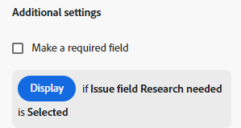
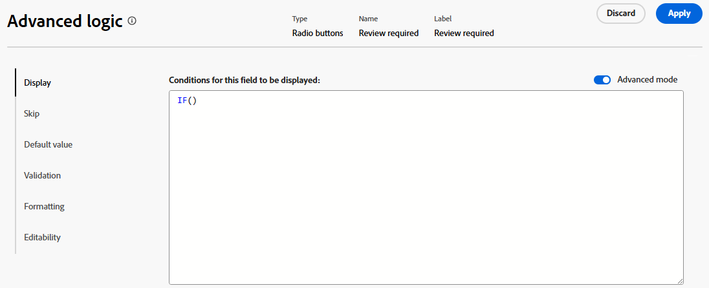
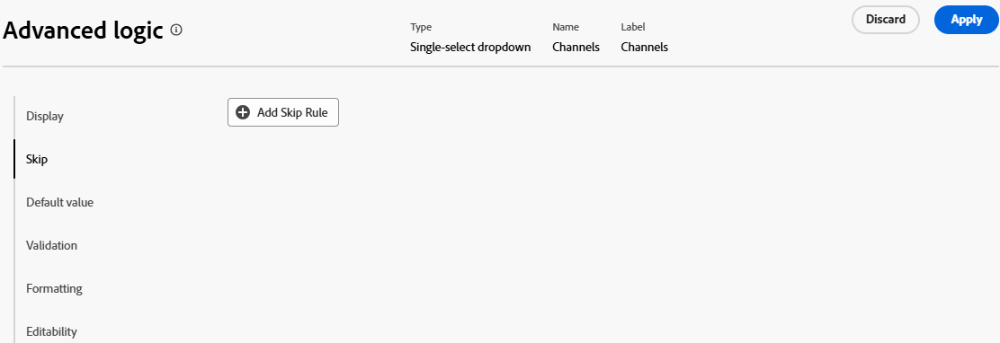

# Añadir reglas lógicas a formularios y campos personalizados

Las reglas lógicas permiten personalizar aún más los campos del formulario.

Por ejemplo, puede mostrar u omitir campos o secciones en un formulario personalizado en función de las opciones que realice un usuario al rellenarlo.

>[!NOTE]
>
>La lógica solo se aplica dentro de un formulario y no se puede basar en selecciones de un formulario diferente.

## Requisitos de acceso

+++ Expanda para ver los requisitos de acceso para la funcionalidad en este artículo.

<table style="table-layout:auto"> 
 <col> 
 <col> 
 <tbody> 
  <tr> 
   <td>Paquete de Adobe Workfront</td> 
   <td> <p>Para aplicar una visualización avanzada, un valor predeterminado, un formato condicional o una lógica de editabilidad: Workflow Prime o superior</p>
         <p>Para aplicar todos los demás tipos de lógica: Cualquier paquete de Workfront o de flujo de trabajo</p> </td> 
  </tr> 
  <tr> 
   <td>Licencia de Adobe Workfront</td> 
   <td><p>Estándar</p>
       <p>Plan</p></td>
  </tr> 
  <tr> 
   <td>Configuraciones de nivel de acceso</td> 
   <td> <p>Acceso administrativo a formularios personalizados</p> </td> 
  </tr>  
 </tbody> 
</table>

Para obtener más información, consulte [Requisitos de acceso en la documentación de Workfront](/help/quicksilver/administration-and-setup/add-users/access-levels-and-object-permissions/access-level-requirements-in-documentation.md).

+++

## Iconos de indicador lógico

Los formularios personalizados muestran iconos para indicar cuándo se aplica la lógica a los campos.

Haga clic en **Mostrar lógica** en el encabezado del diseñador de formularios para mostrar u ocultar los iconos de los distintos tipos de lógica de campo.

| Icono | Definición |
| --- | --- |
|  | El campo es el campo de destino donde se aplica la lógica de visualización. Si se realiza una selección específica en el formulario, se muestra este campo. |
|  | El campo es el campo de referencia para la lógica de visualización. Una selección o un valor específico de este campo muestra el campo de destino. |
|  | El campo es el campo de destino donde se aplica la lógica de omisión. Una selección o valor específico de este campo omite otros campos y va directamente al campo de referencia. |
|  | El campo es el campo de referencia para la lógica de omisión. Si se realiza una selección específica en el campo de destino, el formulario se salta este campo y los campos intermedios están ocultos. |
|  | El campo es el campo de destino donde se aplica la lógica de validación. Una selección o un valor específico del campo de referencia determina si la validación falla. El campo de destino y el campo de referencia pueden ser los mismos para la lógica de validación. |
|  | El campo es el campo de referencia para la lógica de validación. Una selección o un valor específicos de este campo determinan si la validación falla en el campo de destino. El campo de destino y el campo de referencia pueden ser los mismos para la lógica de validación. |
|  | El campo es el campo de destino donde se aplica la lógica de valor predeterminada. Una selección o un valor específico del campo de referencia determina el valor predeterminado. El campo de destino y el campo de referencia pueden ser los mismos para la lógica de valor predeterminada. |
|  | El campo es el campo de referencia para la lógica de valor predeterminada. Una selección o un valor específicos de este campo determinan el valor predeterminado del campo de destino. El campo de destino y el campo de referencia pueden ser los mismos para la lógica de valor predeterminada. |
|  | El campo es el campo de destino donde se aplica la lógica de formato. Una selección o un valor específico del campo de referencia determina el formato. El campo de destino y el campo de referencia pueden ser los mismos para la lógica de formato. |
|  | El campo es el campo de referencia para la lógica de formato. Una selección o un valor específico de este campo determina el formato del campo de destino. El campo de destino y el campo de referencia pueden ser los mismos para la lógica de formato. |
|  | El campo es el campo de destino donde se aplica la lógica de editabilidad. El campo puede ser editable o de solo lectura cuando se cumplen las condiciones definidas. El campo de destino y el campo de referencia pueden ser los mismos para la lógica de editabilidad. |
|  | El campo es el campo de referencia para la lógica de editabilidad. Cuando se cumplen las condiciones definidas en este campo, la lógica se aplica en el campo de destino. El campo de destino y el campo de referencia pueden ser los mismos para la lógica de editabilidad. |


Solo para lógica de visualización y de omisión, seleccione un campo para mostrar las reglas lógicas existentes en la configuración del campo.



## Consideraciones para utilizar la lógica de visualización y la lógica de omisión

* Para agregar lógica de visualización en un campo personalizado, widget o salto de sección, debe colocarse al menos un campo de opción múltiple (botones de opción, listas desplegables o casillas de verificación) antes de él en el formulario.
Para obtener información sobre los campos y widgets personalizados en los formularios personalizados, consulte [Crear un formulario personalizado](/help/quicksilver/administration-and-setup/customize-workfront/create-manage-custom-forms/form-designer/design-a-form/design-a-form.md).
* No se puede añadir lógica de omisión a un widget o salto de sección. Solo puede añadirlo a un campo de opción múltiple (botones de opción, listas desplegables o casillas de verificación).
* No se puede aplicar la lógica de visualización u omisión para mostrar u ocultar las opciones de un campo de varias opciones. Por ejemplo, no puede restringir las opciones que se muestran para un campo Desplegable, un grupo de casillas de verificación o un campo de botón de opción en función de la lógica de visualización u omisión de otro campo.
* Puede añadir lógica de visualización y lógica de omisión a un campo personalizado si se cumplen todas las condiciones siguientes en relación con el campo personalizado:

   * Es un campo de opción múltiple (botones de opción, listas desplegables o casillas de verificación)
   * Va precedido de un campo de opción múltiple
   * Va seguido de otro campo personalizado

* Al copiar formularios con lógica de visualización o lógica de omisión, la lógica se copia al nuevo formulario personalizado.
* Al editar objetos de forma masiva, todos los campos personalizados se muestran en el cuadro Editar objetos, incluidos los campos omitidos u ocultos.
* Tenga en cuenta lo siguiente al crear una regla de lógica de visualización para un formulario personalizado:

   * De forma predeterminada, los campos personalizados no incluidos en una instrucción lógica de visualización se muestran en un formulario personalizado.
   * Puede crear instrucciones lógicas de visualización de varios campos.
   * Si todos los campos bajo una división de sección tienen lógica de visualización aplicada y todos están ocultos como resultado de la lógica, toda la sección se ocultará en el formulario personalizado.

## Agregar lógica de visualización a un formulario personalizado

La lógica de visualización define qué campos personalizados aparecen en el formulario cuando el usuario selecciona un valor específico en un campo de opción múltiple. La lógica se añade al campo de destino, que solo se muestra cuando se selecciona el valor.

>[!NOTE]
>
>Este procedimiento describe el modo básico de la lógica de visualización. También está disponible la lógica de visualización avanzada. Para obtener más información, consulte [Agregar lógica de visualización avanzada a un formulario personalizado](#add-advanced-display-logic-to-a-custom-form), en este artículo.

{{step-1-to-setup}}

1. Haga clic en **Formularios personalizados**.
1. Cree un nuevo formulario personalizado o abra uno existente. Consulte [Crear un formulario personalizado](/help/quicksilver/administration-and-setup/customize-workfront/create-manage-custom-forms/form-designer/design-a-form/design-a-form.md) para obtener más información.
1. Agregue campos al formulario según sea necesario. Al menos un campo de opción múltiple (botón de radio, menú desplegable o casilla de verificación) debe estar posicionado antes del campo objetivo que se mostrará.
1. Seleccione el campo de destino y haga clic en **Agregar lógica**.
1. Seleccione la ficha **Mostrar** en el generador de lógica.
1. Haga clic en **Agregar regla para mostrar**.

   

1. Siga los pasos a continuación para crear la instrucción lógica en el generador.

   1. La primera opción es elegir el campo de definición. Este es el campo con el valor de selección que muestra el objetivo. Debe ser un campo de opción múltiple.
   1. La segunda opción es elegir el valor de selección. Solo están disponibles los valores ya definidos para ese campo.
   1. La tercera opción es **Seleccionado** o **No seleccionado**. Elegir **Seleccionado** significa que cuando se selecciona el valor, se muestra el campo de destino. Elegir **No seleccionado** significa que cuando se selecciona cualquier otro valor en el campo definitorio, se muestra el campo objetivo.
   1. Para añadir una regla **Y** a la instrucción lógica, haga clic en **Agregar regla** directamente debajo de la regla que acabas de crear. Siga las mismas indicaciones para generar la regla. Todas las reglas Y deben cumplirse para que el campo objetivo se muestre.

      

   1. Para añadir una regla **O** a la instrucción lógica, haz clic en **Agregar regla** cerca de la parte inferior del generador de lógica. Luego, haga clic en **Agregar regla** dentro del área O y siga las mismas indicaciones para generar la regla. Cuando se cumple una regla O, el campo objetivo se muestra.

1. Haga clic en **Aplicar** cuando termine de crear la instrucción lógica.

   La lógica se aplica y los iconos lógicos se agregan al campo de destino y al campo de referencia en el diseñador de formularios.

## Agregar lógica de visualización avanzada a un formulario personalizado

La lógica de visualización avanzada para campos de formulario personalizados le permite crear una lógica compleja mediante fórmulas. Puede aplicar esta lógica a los siguientes tipos de campo: texto de una sola línea, párrafo, texto con formato, lista desplegable de selección única, lista desplegable de selección múltiple, búsqueda externa, búsqueda externa de selección múltiple, referencia de campo nativo, escritura anticipada, calculada, fecha, grupo de casillas de verificación y botones de opción.

>[!NOTE]
>
>Este procedimiento describe el modo avanzado de la lógica de visualización. También está disponible la lógica básica de visualización. Para obtener más información, consulte [Agregar lógica de visualización a un formulario personalizado](#add-display-logic-to-a-custom-form), en este artículo.

### Ejemplos

Puede utilizar la lógica de visualización avanzada para controlar la visibilidad de las secciones de formulario personalizadas en función de las funciones de usuario y la visibilidad de un campo en función del estado de otro campo.

No se aplica ninguna lógica a la sección predeterminada del formulario, por lo que siempre es visible para todos los usuarios.

Con la siguiente condición, la sección Recursos necesarios solo se muestra cuando un usuario con la función de administrador de recursos ve el formulario.

`IF($$USER.{roleID}="123abc", true)`

Tenga en cuenta que `123abc` representa el identificador de rol del Administrador de recursos.


La misma condición con un ID de rol diferente se aplica a la sección de KPI financieros del proyecto para definir que solo la función de Asesor financiero pueda ver la sección.

Con la siguiente condición, el campo KPI Vendido solo se vuelve visible cuando se completa el proyecto. Esta lógica se aplica directamente al campo en lugar de a una sección del formulario. No es necesario especificar qué función puede ver el campo, porque eso ya está definido en la sección en la que se encuentra el campo.

`IF({status}="CPL", true)`


### Definir lógica de visualización avanzada

{{step-1-to-setup}}

1. Haga clic en **Formularios personalizados**.
1. Cree un nuevo formulario personalizado o abra uno existente. Consulte [Crear un formulario personalizado](/help/quicksilver/administration-and-setup/customize-workfront/create-manage-custom-forms/form-designer/design-a-form/design-a-form.md) para obtener más información.
1. Agregue campos al formulario según sea necesario.
1. Seleccione el campo al que aplicar lógica y haga clic en **Agregar lógica**.
1. Seleccione la ficha **Mostrar** en el generador de lógica.
1. Activar **modo avanzado**.

   Esta opción podría activarse automáticamente para los tipos de campo que no admiten el modo simple de lógica de visualización.

   

1. Cree la condición de visualización en el editor.

   Para obtener más información sobre cálculos y expresiones, vea [Agregar campos calculados a un formulario](/help/quicksilver/administration-and-setup/customize-workfront/create-manage-custom-forms/form-designer/design-a-form/add-a-calculated-field.md) y [Información general sobre expresiones de datos calculados](/help/quicksilver/reports-and-dashboards/reports/calc-cstm-data-reports/calculated-data-expressions.md).

1. Haga clic en **Aplicar**.

   La lógica se aplica y los iconos lógicos se agregan al campo de destino y al campo de referencia en el diseñador de formularios.

   >[!NOTE]
   >
   >La lógica de visualización avanzada no se admite en el modo de vista previa del diseñador de formularios.

## Agregar lógica de omisión a un formulario personalizado

La lógica de omisión define campos de formulario personalizados que se omiten cuando el usuario selecciona un valor específico en un campo de opción múltiple. Los campos omitidos están ocultos en el formulario. La lógica se aplica al campo de definición donde se realiza la selección, no a los campos que se omiten.

{{step-1-to-setup}}

1. Haga clic en **Formularios personalizados**.
1. Cree un nuevo formulario personalizado o abra uno existente. Consulte [Crear un formulario personalizado](/help/quicksilver/administration-and-setup/customize-workfront/create-manage-custom-forms/form-designer/design-a-form/design-a-form.md) para obtener más información.
1. Agregue campos al formulario según sea necesario. El campo de definición para la lógica de omisión debe ser un campo de selección múltiple (botón de opción, lista desplegable o casilla de verificación).
1. Seleccione el campo de definición y haga clic en **Agregar lógica** en la parte inferior izquierda de la pantalla.
1. Seleccione la ficha **Omitir** en el generador de lógica.
1. Haga clic en **Agregar regla de omisión**.

   

1. Siga los pasos a continuación para crear la instrucción lógica en el generador.

   1. El campo de definición se muestra en el generador. Es el campo seleccionado al que se aplica la lógica de omisión.
   1. La primera opción es elegir el valor de selección. Solo están disponibles los valores ya definidos para el campo.
   1. La segunda opción es **Seleccionado** o **No seleccionado**. Elegir **Seleccionado** significa que cuando se selecciona el valor, el campo objetivo se muestra y los campos intermedios se omiten. Elegir **No seleccionado** significa que cuando se selecciona cualquier otro valor en el campo de definición, se muestra el campo de destino y se omiten los campos intermedios.
   1. La tercera opción es el campo de destino o el punto al que saltar. Seleccione un nombre de campo o de **Fin de formulario**. Es posible que tenga que hacer clic primero en la palabra “vacío” antes de seleccionar una opción.

      

   1. Para añadir una regla **O** a la instrucción lógica, haga clic en **Agregar regla** cerca de la parte inferior del generador de lógica. A continuación, seleccione las opciones siguiendo las mismas indicaciones para generar la regla. Cuando se cumple una regla **O** se muestra el campo de destino.

1. Haga clic en **Aplicar** cuando termine de crear la instrucción lógica.

   La lógica se aplica y los iconos lógicos se agregan al campo de destino y al campo de referencia en el diseñador de formularios.

## Agregar la lógica de valores predeterminada a un formulario personalizado

La lógica de valores predeterminada permite configurar los valores predeterminados de los campos de formulario personalizados mediante fórmulas. El valor predeterminado se muestra cuando se cumplen las condiciones definidas. Un valor predeterminado puede ser un valor estático o dinámico que haga referencia a otros campos dentro del objeto. Aunque el valor predeterminado puede hacer referencia a otros campos, no cambiará a medida que cambien otros campos del formulario.

Puede aplicar lógica de valor predeterminada avanzada a los siguientes tipos de campo: texto de una línea, párrafo, lista desplegable de selección única, lista desplegable de selección múltiple, búsqueda externa, búsqueda externa de selección múltiple. referencia de campo nativo, escritura anticipada, grupo de casillas de verificación y botones de opción.

>[!TIP]
>
>Un valor predeterminado se aplica solo una vez a un campo personalizado, cuando el formulario personalizado se adjunta al objeto. Si la fórmula de valor predeterminada depende del valor de otro campo, el valor del otro campo ya debe existir cuando se adjunta el formulario personalizado.

>[!NOTE]
>
>La lógica de valor predeterminada estándar del diseñador de formularios sigue existiendo. Si ambos tipos se aplican en el mismo campo, la lógica avanzada tiene prioridad. Para obtener información sobre la lógica de valor predeterminada estándar, consulte [Agregar botones de opción, grupos de casillas de verificación y listas desplegables](/help/quicksilver/administration-and-setup/customize-workfront/create-manage-custom-forms/form-designer/design-a-form/design-a-form.md#add-radio-buttons-checkbox-groups-and-drop-downs) en [Crear un formulario personalizado](/help/quicksilver/administration-and-setup/customize-workfront/create-manage-custom-forms/form-designer/design-a-form/design-a-form.md).

### Ejemplo

Mediante la fórmula siguiente, el campo desplegable de selección múltiple al que se aplica la lógica extraerá su valor predeterminado de la descripción del proyecto cuando el estado del proyecto sea Planificación.

```
IF({status} = 'PLN', ARRAY({description}, ','))
```

Cuando el formulario personalizado se adjunta a un proyecto y el estado del proyecto es Planificación, el valor del campo de descripción del proyecto se utiliza como valor predeterminado en el campo de selección múltiple. Como es un campo de selección múltiple, se puede extraer más de un valor cuando los valores coinciden con la descripción. Si el valor de descripción no coincide con ninguna de las opciones de valores de selección múltiple, el campo de selección múltiple no tendrá un valor predeterminado y el usuario puede seleccionar un valor de la lista desplegable.

### Definir lógica de valor predeterminada

1. Haga clic en **Formularios personalizados**.
1. Cree un nuevo formulario personalizado o abra uno existente. Consulte [Crear un formulario personalizado](/help/quicksilver/administration-and-setup/customize-workfront/create-manage-custom-forms/form-designer/design-a-form/design-a-form.md) para obtener más información.
1. Agregue campos al formulario según sea necesario.
1. Seleccione el campo al que aplicar lógica y haga clic en **Agregar lógica**.
1. Seleccione la ficha **Valor predeterminado** en el generador de lógica.

   

1. Cree la condición de valor predeterminado en el editor.

   Para obtener más información sobre cálculos y expresiones, vea [Agregar campos calculados a un formulario](/help/quicksilver/administration-and-setup/customize-workfront/create-manage-custom-forms/form-designer/design-a-form/add-a-calculated-field.md) y [Información general sobre expresiones de datos calculados](/help/quicksilver/reports-and-dashboards/reports/calc-cstm-data-reports/calculated-data-expressions.md).

1. Haga clic en **Aplicar**.

   La lógica se aplica y los iconos lógicos se agregan al campo de destino y al campo de referencia en el diseñador de formularios.

   >[!NOTE]
   >
   >La lógica de valor predeterminada no se admite en el modo de vista previa del diseñador de formularios.

## Agregar lógica de validación a un formulario personalizado

La lógica de validación se crea mediante fórmulas y puede hacer que la lógica sea tan simple o tan compleja como necesite. La validación se puede basar en los valores de otros campos o en el estado de los objetos, y puede proporcionar un mensaje de error para cuando falle la validación.

Si el campo con la lógica aplicada cumple las condiciones de validación definidas cuando un usuario rellena el formulario personalizado, el campo se resalta y se muestra el mensaje de error.

Puede aplicar lógica de validación a los siguientes tipos de campo: texto de una línea, párrafo, lista desplegable de selección única, lista desplegable de selección múltiple, búsqueda externa de selección múltiple, búsqueda externa de selección múltiple, escritura anticipada, fecha, grupo de casillas de verificación y botones de opción.

### Ejemplos

Si se cumple la siguiente condición, el campo Presupuesto muestra un mensaje debajo del campo cuando el usuario introduce un valor que almacena en déclencheur el mensaje. Por ejemplo, si el valor introducido es negativo, se muestra el primer mensaje. Si el usuario intenta cambiar el estado del proyecto a Actual antes de introducir un valor de presupuesto, se muestra el segundo mensaje.

```
IF({DE:Budget Field} < 0,
     "Budget cannot be negative",
     IF({DE:Budget Field} == 0 && {status} == "CUR", "Budget must be specified before moving to Current status")
)
```

Otro ejemplo sencillo es que un campo de número de teléfono debe contener un determinado número de dígitos para ser válido.

Un ejemplo adicional de validación basado en otros campos es un campo para el tamaño de la sala de reuniones (pequeña, mediana o grande) y un campo independiente para el número de asistentes a la reunión. El número de personas para cada tamaño de habitación se escribe en la fórmula de validación. Si el número de asistentes que el usuario introduce es demasiado para la sala de reuniones elegida, se muestra el mensaje de error.

Para obtener más ejemplos de lógica de validación, consulte [Ejemplos de lógica avanzada en formularios personalizados](/help/quicksilver/administration-and-setup/customize-workfront/create-manage-custom-forms/form-designer/design-a-form/advanced-logic-examples.md).

### Definir lógica de validación

{{step-1-to-setup}}

1. Haga clic en **Formularios personalizados**.
1. Cree un nuevo formulario personalizado o abra uno existente. Consulte [Crear un formulario personalizado](/help/quicksilver/administration-and-setup/customize-workfront/create-manage-custom-forms/form-designer/design-a-form/design-a-form.md) para obtener más información.
1. Agregue campos al formulario según sea necesario.
1. Seleccione el campo al que aplicar lógica y haga clic en **Agregar lógica**.
1. Seleccione la ficha **Validación** en el generador de lógica.

   

1. Genere la condición de validación en el editor, incluido el mensaje de error que se mostrará cuando no se cumpla la validación.

   Para obtener más información sobre cálculos y expresiones, vea [Agregar campos calculados a un formulario](/help/quicksilver/administration-and-setup/customize-workfront/create-manage-custom-forms/form-designer/design-a-form/add-a-calculated-field.md) y [Información general sobre expresiones de datos calculados](/help/quicksilver/reports-and-dashboards/reports/calc-cstm-data-reports/calculated-data-expressions.md).

1. Haga clic en **Aplicar**.

   La lógica se aplica y los iconos lógicos se agregan al campo de destino y al campo de referencia en el diseñador de formularios.

   >[!NOTE]
   >
   >La lógica de validación no se admite en el modo de vista previa del diseñador de formularios.

## Agregar lógica de formato a un formulario personalizado

La lógica de formato resalta un valor de campo cuando cumple las condiciones definidas. El formato aplicado funciona en varios campos a la vez.

Puede aplicar lógica de formato a los siguientes tipos de campo: texto de una línea, párrafo, lista desplegable de selección única, lista desplegable de selección múltiple, búsqueda externa de selección múltiple, búsqueda externa de selección múltiple, escritura anticipada, calculado, fecha, grupo de casillas de verificación y botones de opción.

El formato aplicado a los formularios personalizados es independiente del formato aplicado a las listas y los informes. Para obtener información sobre el formato del informe, vea [Usar formato condicional en las vistas](/help/quicksilver/reports-and-dashboards/reports/reporting-elements/use-conditional-formatting-views.md).

### Ejemplo

Con la siguiente condición, el campo Presupuesto aparece en rojo cuando el usuario introduce un valor de 1000 o más. El campo aparece en amarillo cuando el usuario introduce un valor de 500 o más.

Para añadir una definición de formato al pasar el ratón por encima, utilice el campo Instrucciones en el formulario personalizado. Por ejemplo, un mensaje en el campo Presupuesto podría decir &quot;Introduzca un presupuesto dentro de un rango razonable. Los valores superiores a 500 son un aviso de advertencia y superiores a 1000 se consideran demasiado altos&quot;.

```
IF(
     {DE:Budget Field} >=1000,
     FORMAT($$NEGATIVE),
     IF({DE:Budget Field} >= 500, FORMAT($$NOTICE))
)
```

### Definir lógica de formato

{{step-1-to-setup}}

1. Haga clic en **Formularios personalizados**.
1. Cree un nuevo formulario personalizado o abra uno existente. Consulte [Crear un formulario personalizado](/help/quicksilver/administration-and-setup/customize-workfront/create-manage-custom-forms/form-designer/design-a-form/design-a-form.md) para obtener más información.
1. Agregue campos al formulario según sea necesario.
1. Seleccione el campo al que aplicar lógica y haga clic en **Agregar lógica**.
1. Seleccione la ficha **Formato** en el generador de lógica.

   

1. Cree la condición de formato en el editor.

   Puede agregar hasta cinco reglas de formato por campo.

   Las opciones de color de resaltado de campo son:

   * `$$POSITIVE (green)`
   * `$$INFORMATIVE (blue)`
   * `$$NEGATIVE (red)`
   * `$$NOTICE (orange)`

   Las opciones de formato de texto son:

   * `$$BOLD`
   * `$$ITALIC`
   * `$$UNDERLINE`

   Solo se puede utilizar una opción de color por función, junto con hasta tres opciones de formato de texto adicionales. Si no se especifica ninguna opción de color, se aplica el color predeterminado del sistema.

   Para obtener más información sobre cálculos y expresiones, vea [Agregar campos calculados a un formulario](/help/quicksilver/administration-and-setup/customize-workfront/create-manage-custom-forms/form-designer/design-a-form/add-a-calculated-field.md) y [Información general sobre expresiones de datos calculados](/help/quicksilver/reports-and-dashboards/reports/calc-cstm-data-reports/calculated-data-expressions.md).

1. Haga clic en **Aplicar**.

   La lógica se aplica y los iconos lógicos se agregan al campo de destino y al campo de referencia en el diseñador de formularios.

   >[!NOTE]
   >
   >La lógica de formato no se admite en el modo de vista previa del diseñador de formularios.

## Agregar lógica de edición a un formulario personalizado

La lógica de editabilidad determina si un campo de formulario personalizado se puede editar o si es de solo lectura. Esta lógica se crea mediante fórmulas y cuando el campo cumple las condiciones definidas, se puede establecer como editable o de solo lectura.

Puede aplicar lógica de editabilidad a los siguientes tipos de campos: texto de una sola línea, párrafo, texto con formato, lista desplegable de selección única, lista desplegable de selección múltiple, búsqueda externa, búsqueda externa de selección múltiple, escritura anticipada, fecha, grupo de casillas de verificación y botones de opción.

### Ejemplo

Con la fórmula siguiente, el campo con lógica aplicada solo se puede editar cuando otro campo llamado Radio tiene seleccionada la opción Enabled.

```
IF({DE:Radio} = "Enabled", true)
```

Con la siguiente fórmula, el campo Descripción solo se puede editar cuando está en blanco. Una vez introducido un valor, este se convierte en de solo lectura.

```
IF(ISBLANK({DE:Description}), true)
```

Con la fórmula siguiente, el campo con lógica aplicada solo se puede editar cuando un usuario con la función de trabajo de Administrador de recursos ve el formulario.

```
IF($$USER.{role}.{name}="Resource Manager", true)
```

### Definir lógica de edición

{{step-1-to-setup}}

1. Haga clic en **Formularios personalizados**.
1. Cree un nuevo formulario personalizado o abra uno existente. Consulte [Crear un formulario personalizado](/help/quicksilver/administration-and-setup/customize-workfront/create-manage-custom-forms/form-designer/design-a-form/design-a-form.md) para obtener más información.
1. Agregue campos al formulario según sea necesario.
1. Seleccione el campo al que aplicar lógica y haga clic en **Agregar lógica**.
1. Seleccione la ficha **Editabilidad** en el generador de lógica.

   

1. Cree la condición de editabilidad en el editor.

   Para obtener más información sobre cálculos y expresiones, vea [Agregar campos calculados a un formulario](/help/quicksilver/administration-and-setup/customize-workfront/create-manage-custom-forms/form-designer/design-a-form/add-a-calculated-field.md) y [Información general sobre expresiones de datos calculados](/help/quicksilver/reports-and-dashboards/reports/calc-cstm-data-reports/calculated-data-expressions.md).

1. Haga clic en **Aplicar**.

   La lógica se aplica y los iconos lógicos se agregan al campo de destino y al campo de referencia en el diseñador de formularios.

   >[!NOTE]
   >
   >La lógica de editabilidad no se admite en el modo de vista previa del diseñador de formularios.
