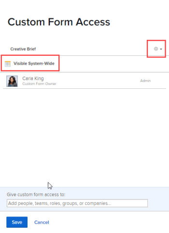

# Compartir un formulario personalizado

{#preview-fast-release-general}

Puede configurar el acceso para un formulario personalizado con el fin de controlar quién (persona, función, grupo, equipo, empresa, perfil empresarial) puede verlo, compartirlo y editarlo.

## Requisitos de acceso

+++ Expanda para ver los requisitos de acceso para la funcionalidad en este artículo.

<table style="table-layout:auto"> 
 <col> 
 <col> 
 <tbody> 
  <tr> 
   <td>Paquete de Adobe Workfront</td> 
   <td>
Cualquiera
</td> 
  </tr> 
  <tr> 
   <td>Licencia de Adobe Workfront</td> 
   <td>
Estándar

       
Plan
</td>
  </tr> 
  <tr> 
   <td>Configuraciones de nivel de acceso</td> 
   <td> 
Acceso administrativo a formularios personalizados
 </td> 
  </tr>  
 </tbody> 
</table>

Para obtener más información, consulte [Requisitos de acceso en la documentación de Workfront](/help/quicksilver/administration-and-setup/add-users/access-levels-and-object-permissions/access-level-requirements-in-documentation.md).

+++

## Acceso a los formularios personalizados {#access-to-custom-forms}

De forma predeterminada, cuando crea un nuevo formulario personalizado y alguien lo adjunta a un objeto, cualquier usuario asignado al objeto puede ver y rellenar el formulario. Esto incluye a los usuarios con licencias de colaborador o solicitud y a los usuarios externos.

Sin embargo, en un objeto en el que el formulario personalizado no esté adjunto, un usuario (incluso si tiene un nivel de acceso de planificador) no puede adjuntarlo desde el menú desplegable Formularios personalizados a menos que se cumpla una de las siguientes condiciones:

* Alguien compartió el formulario personalizado como &quot;Todos los usuarios del sistema pueden ver y adjuntar&quot;
* Alguien compartió el formulario personalizado con el usuario o con su equipo, función de trabajo, grupo, empresa o perfil empresarial que concede al menos el permiso Ver con la opción Adjuntar a datos personalizados seleccionada
* El usuario tiene una licencia estándar o de planificación y su nivel de acceso permite el acceso administrativo a los formularios personalizados

<!--

## Share a custom form from the list of forms

Rather than leaving a custom form in the default sharing state (described in [Access to custom forms](#access-to-custom-forms) in this article), you can configure specific levels of access to the form for certain users, job roles, groups, teams, and companies.

{{step-1-to-setup}}

1. In the left panel, click **Custom Forms**.
1. Select the custom form, then click .
1. In the box that displays, under **Give custom form access to**, start typing the name of the user, team, job role, group, company, or business profile you want to share the custom form with, then press **Enter** when the name displays.
1. To adjust access for the user, team, job role, group, company, or business profile you just added, click the drop-down menu to the right of the name, then configure one of the following available options and any of its advanced settings:

   <table style="table-layout:auto"> 
    <col> 
    <col> 
    <tbody> 
     <tr> 
      <td role="rowheader">View it</td> 
      <td> 
This option provides the ability to view and fill out the custom form on objects. At the object level, users must also have at least Contribute access with the <strong>Edit custom form</strong> advanced setting enabled. For example, if the form is attached to a project, users must have Contribute access to that project, or they will not be able to fill out the form.

      
      
<b>NOTE</b>: For users with Light and Contributor licenses (or Work, Review, and Request licenses), this is the highest available option.

      
      
Click <strong>Advanced Settings</strong> to specify whether you want to allow the following:
 
       <ul> 
        <li><strong>Attach to custom data</strong>: Ability to attach the custom form to projects, tasks, and issues for which they have Manage access</li> 
        <li> 
<strong>Share</strong>: Ability to share the custom form with others in the system
 
Users with a Light or Contributor license (or Work, Review, or Request license) can share a custom form only through the API or a custom forms report.
 </li>
       </ul> </td> 
     </tr> 
     <tr> 
      <td role="rowheader">Manage it</td> 
      <td> 
This option available only for users with a Standard or Plan license. 
 
In addition to being able to add the form to objects they have access to edit, users can also fully edit the custom form, including adding, editing, and deleting fields.
 
Click <strong>Advanced Settings</strong> to specify whether you want to allow following:
 
       <ul> 
        <li> 
<strong>Attach to custom data</strong>: Ability to attach the custom form to projects, tasks, and issues for which they have Manage access
 </li> 
        <li><strong>Delete</strong>: Delete the custom form from the system</li> 
        <li><strong>Share</strong>: Share the custom form with others in the system</li> 
       </ul> </td> 
     </tr> 
    </tbody> 
   </table>

1. (Optional) Repeat Steps 4-5 to add other names to the list and configure their options.
1. (Optional) If you want to limit access to the custom form (on objects where it's attached) to those you have specified in the previous steps, click the gear icon  in the upper right corner of the sharing box, then click **Remove system-wide access**.

   If you change your mind, you can click **Make this visible system-wide** (the default option).

   >[!NOTE]
   >
   >* When you make a custom form visible system-wide, you allow users only to see and fill it out on objects they are assigned to, not to attach it to other objects. You can grant the ability to attach the custom form to objects using the option "Attach to custom data" explained under step 5.
   >* Most organizations want to ensure that everyone in the system can fill out a custom form when it's attached to objects they work on and view its data in reports. If this is true for your organization, we recommend that you use **Make this visible system-wide**. When the option is configured this way, "Visible System-Wide" displays in the dialog box:
   >   
   >
   >   
   >If you are concerned about a custom form where users might enter sensitive data when it is attached to certain objects, limiting sharing for those *objects* might be better rather than limiting access to the form itself.

1. Click **Save**.

-->

## Compartir un formulario personalizado

En lugar de dejar un formulario personalizado en el estado de uso compartido predeterminado (descrito en [Acceso a formularios personalizados](#access-to-custom-forms) en este artículo), puede configurar niveles específicos de acceso al formulario para determinados usuarios, roles, grupos, equipos, empresas y perfiles empresariales.

{{step-1-to-setup}}

1. En el panel izquierdo, haga clic en **Formularios personalizados**.
1. Seleccione el formulario personalizado en la lista y haga clic en .

   O

   Abra un formulario personalizado o cree uno nuevo. A continuación, haga clic en **Compartir** en la parte superior derecha del diseñador de formularios.

1. En el cuadro para compartir, en **Conceder acceso a formulario personalizado a**, empiece a escribir el nombre del usuario, equipo, rol, grupo, compañía o perfil empresarial con el que desea compartir el formulario personalizado y, a continuación, presione **Entrar** cuando se muestre el nombre.
1. Para ajustar el acceso para el usuario, equipo, función de trabajo, grupo, compañía o perfil empresarial que acaba de agregar, haga clic en el menú desplegable a la derecha del nombre y, a continuación, configure una de las siguientes opciones disponibles y cualquiera de sus configuraciones avanzadas:

   <table style="table-layout:auto"> 
    <col> 
    <col> 
    <tbody> 
     <tr> 
      <td role="rowheader">Ver</td> 
      <td> 
Esta opción proporciona la capacidad de ver y rellenar el formulario personalizado en objetos. En el nivel de objeto, los usuarios también deben tener al menos acceso de tipo Contribuir con la configuración avanzada <strong>Editar formulario personalizado</strong> habilitada. Por ejemplo, si el formulario está adjunto a un proyecto, los usuarios deben tener acceso de tipo Contribuir a ese proyecto; de lo contrario, no podrán rellenarlo.

   
<b>NOTA</b>: Para los usuarios con licencias Light y de colaborador (o licencias de trabajo, revisión y solicitud), esta es la opción disponible más alta.
 
Haga clic en <strong>Ajustes avanzados</strong> para especificar si desea permitir lo siguiente:
 
       <ul> 
        <li><strong>Adjuntar a datos personalizados</strong>: capacidad para adjuntar el formulario personalizado a proyectos, tareas y problemas para los que tienen el acceso Administrar</li> 
        <li> 
<strong>Compartir</strong>: capacidad para compartir el formulario personalizado con otros usuarios del sistema
 
Los usuarios con una licencia Light o de colaborador (o licencia de trabajo, revisión o solicitud) solo pueden compartir un formulario personalizado a través de la API o un informe de formularios personalizados.
 </li>
       </ul> </td> 
     </tr> 
     <tr> 
      <td role="rowheader">Administrar</td> 
      <td> 
Esta opción solo está disponible para usuarios con una licencia estándar o de planificación. 
 
Además de poder añadir el formulario a los objetos a los que tienen acceso para editarlo, los usuarios también pueden editar completamente el formulario personalizado, lo que incluye la adición, edición y eliminación de campos.
 
Haga clic en <strong>Ajustes avanzados</strong> para especificar si desea permitir lo siguiente:
 
       <ul> 
        <li> 
<strong>Adjuntar a datos personalizados</strong>: capacidad para adjuntar el formulario personalizado a proyectos, tareas y problemas para los que tienen acceso de administración
 </li> 
        <li><strong>Eliminar</strong>: elimina el formulario personalizado del sistema</li> 
        <li><strong>Compartir</strong>: comparte el formulario personalizado con otros usuarios del sistema</li> 
       </ul> </td> 
     </tr> 
    </tbody> 
   </table>

1. (Opcional) Repita los pasos del 5 al 6 para añadir otros nombres a la lista y configurar sus opciones.
1. (Opcional) Si desea limitar el acceso al formulario personalizado (en objetos donde esté adjunto) a los especificados en los pasos anteriores, haga clic en la flecha desplegable debajo de la opción **Quién tiene acceso** y, a continuación, seleccione **Solo las personas invitadas pueden acceder**.

   Si cambia de opinión, puede seleccionar **Todos los usuarios del sistema pueden verlo**.

   >[!NOTE]
   >
   >* Cuando se hace visible un formulario personalizado en todo el sistema, se permite a los usuarios ver y rellenar únicamente los objetos a los que están asignados, no adjuntarlos a otros objetos. Puede conceder la capacidad de adjuntar el formulario personalizado a objetos mediante la opción “Adjuntar a datos personalizados” que se explica en el paso 6.
   >* La mayoría de las organizaciones desea garantizar que todos los miembros del sistema puedan rellenar un formulario personalizado cuando se adjunta a objetos en los que trabajan y ver sus datos en los informes. Si esto es así para su organización, le recomendamos que utilice la opción **Todos los usuarios del sistema pueden verlo**.
   >* Si selecciona **Todos los usuarios del sistema pueden ver y adjuntar**, todos los usuarios podrán adjuntar el formulario a otros objetos.
   >
   >Imagen de muestra en el entorno de vista previa:
   >
   >   
   >Imagen de muestra en el entorno de producción:
   >
   >   
   >Si le preocupa un formulario personalizado en el que los usuarios puedan introducir datos confidenciales cuando se adjuntan a determinados objetos, limitar el uso compartido de esos *objetos* podría ser más eficaz que limitar el acceso al propio formulario.

1. Haga clic en **Guardar**.

## Eliminar el acceso a un formulario personalizado

{{step-1-to-setup}}

1. En el panel izquierdo, haga clic en **Formularios personalizados**.
1. Seleccione el formulario personalizado en la lista y haga clic en .
1. En el cuadro para compartir, haga clic en el menú desplegable situado a la derecha del nombre del usuario, equipo, función, grupo, empresa o perfil empresarial que ya no desee que tenga acceso especial al formulario y seleccione **Quitar**.
1. (Opcional) Repita el paso anterior para los demás nombres que desee eliminar.
1. Haga clic en **Guardar**.
