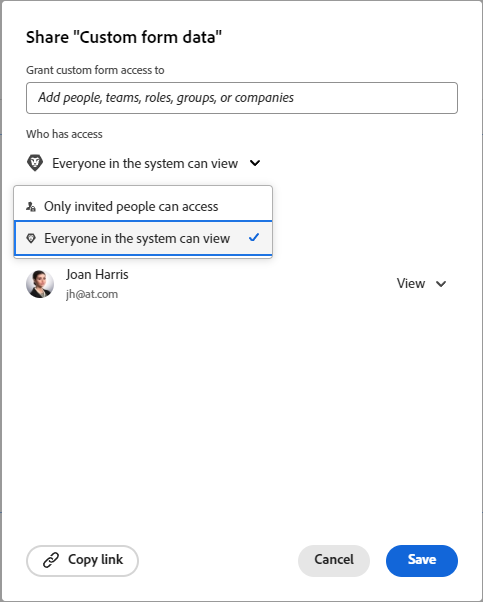

# Compartir un formulario personalizado

Puede configurar el acceso a un formulario personalizado para controlar quién (persona, función, grupo, equipo, compañía) puede verlo, compartirlo y editarlo.

## Requisitos de acceso

+++ Expanda para ver los requisitos de acceso para la funcionalidad en este artículo.

Debe tener el siguiente acceso para realizar los pasos de este artículo:

<table style="table-layout:auto"> 
 <col> 
 <col> 
 <tbody> 
  <tr data-mc-conditions=""> 
   <td role="rowheader"> 
Plan de Adobe Workfront
 </td> 
   <td>Cualquiera</td> 
  </tr> 
  <tr> 
   <td role="rowheader">Licencia de Adobe Workfront</td> 
   <td>
   
Nuevo: estándar

   
o

   
Actual: plan
</td>
  </tr> 
  <tr data-mc-conditions=""> 
   <td role="rowheader">Configuraciones de nivel de acceso</td> 
   <td> 
Acceso administrativo a formularios personalizados
 </td> 
  </tr> 
 </tbody> 
</table>

Para obtener más información sobre el contenido de esta tabla, consulte [Requisitos de acceso en la documentación de Workfront](/help/quicksilver/administration-and-setup/add-users/access-levels-and-object-permissions/access-level-requirements-in-documentation.md).

+++

## Acceso a los formularios personalizados {#access-to-custom-forms}

De forma predeterminada, cuando crea un nuevo formulario personalizado y alguien lo adjunta a un objeto, cualquier usuario asignado al objeto puede ver y rellenar el formulario. Esto incluye a los usuarios con licencias de solicitud y a los usuarios externos.

Sin embargo, en un objeto en el que el formulario personalizado no esté adjunto, un usuario (incluso si tiene un nivel de acceso de planificador) no puede adjuntarlo desde el menú desplegable Formularios personalizados a menos que se cumpla una de las siguientes condiciones:

* Alguien compartió el formulario personalizado con el usuario o con su equipo, función, grupo o compañía, y concedió al menos el permiso Ver con la opción Adjuntar a datos personalizados seleccionada
* El usuario tiene una licencia de planificación y su nivel de acceso permite el acceso administrativo a los formularios personalizados

## Compartir un formulario personalizado desde la lista de formularios

En lugar de dejar un formulario personalizado en el estado de uso compartido predeterminado (descrito en [Acceso a formularios personalizados](#access-to-custom-forms) en este artículo), puede configurar niveles específicos de acceso al formulario para determinados usuarios, funciones, grupos, equipos y empresas.

{{step-1-to-setup}}

1. En el panel izquierdo, haga clic en **Formularios personalizados**.
1. Seleccione el formulario personalizado y, a continuación, haga clic en el .
1. En el cuadro que se muestra, en **Dar acceso al formulario personalizado a**, empiece a escribir el nombre del usuario, equipo, función, grupo o compañía con el que desee compartir el formulario personalizado y, a continuación, presione **Intro** cuando se muestre el nombre.
1. Para ajustar el acceso del usuario, equipo, función, grupo o compañía que acaba de añadir, haga clic en el menú desplegable situado a la derecha del nombre y, a continuación, configure una de las siguientes opciones disponibles y cualquiera de sus opciones avanzadas:

   <table style="table-layout:auto"> 
    <col> 
    <col> 
    <tbody> 
     <tr> 
      <td role="rowheader">Verlo</td> 
      <td> 
Esta opción proporciona la capacidad de ver y rellenar el formulario personalizado en objetos. En el nivel de objeto, los usuarios también deben tener al menos acceso de tipo Contribuir con la configuración avanzada <strong>Editar formulario personalizado</strong> habilitada. Por ejemplo, si el formulario está adjunto a un proyecto, los usuarios deben tener acceso de tipo Contribuir a ese proyecto; de lo contrario, no podrán rellenarlo.

   
<b>NOTA</b>: Para los usuarios con licencias Light y de colaborador (o licencias de trabajo, revisión y solicitud), esta es la opción disponible más alta.

   
Haga clic en <strong>Ajustes avanzados</strong> para especificar si desea permitir lo siguiente:
 
       <ul> 
        <li><strong>Adjuntar a datos personalizados</strong>: capacidad para adjuntar el formulario personalizado a proyectos, tareas y problemas para los que tienen el acceso Administrar</li> 
        <li> 
<strong>Compartir</strong>: capacidad para compartir el formulario personalizado con otros usuarios del sistema
 
Los usuarios con una licencia Light o de colaborador (o licencia de trabajo, revisión o solicitud) solo pueden compartir un formulario personalizado a través de la API o un informe de formularios personalizados.
 </li>
       </ul> </td> 
     </tr> 
     <tr> 
      <td role="rowheader">Administrarlo</td> 
      <td> 
Esta opción solo está disponible para usuarios con una licencia estándar o de planificación. 
 
Además de poder añadir el formulario a los objetos a los que tienen acceso para editarlo, los usuarios también pueden editar completamente el formulario personalizado, lo que incluye la adición, edición y eliminación de campos.
 
Haga clic en <strong>Ajustes avanzados</strong> para especificar si desea permitir lo siguiente:
 
       <ul> 
        <li> 
<strong>Adjuntar a datos personalizados</strong>: capacidad para adjuntar el formulario personalizado a proyectos, tareas y problemas para los que tienen acceso de administración
 </li> 
        <li><strong>Eliminar</strong>: elimina el formulario personalizado del sistema</li> 
        <li><strong>Compartir</strong>: comparte el formulario personalizado con otros usuarios del sistema</li> 
       </ul> </td> 
     </tr> 
    </tbody> 
   </table>

1. (Opcional) Repita los pasos del 4 al 5 para añadir otros nombres a la lista y configurar sus opciones.
1. (Opcional) Si desea limitar el acceso al formulario personalizado (en objetos donde esté adjunto) a los usuarios especificados en los pasos anteriores, haga clic en el icono de engranaje  en la esquina superior derecha del cuadro para compartir y, a continuación, haga clic en **Eliminar el acceso en todo el sistema**.

   Si cambia de opinión, puede hacer clic en **Hacer esto visible en todo el sistema** (la opción predeterminada).

   >[!NOTE]
   >
   >* Cuando se hace visible un formulario personalizado en todo el sistema, se permite a los usuarios ver y rellenar únicamente los objetos a los que están asignados, no adjuntarlos a otros objetos. Puede conceder la capacidad de adjuntar el formulario personalizado a objetos mediante la opción “Adjuntar a datos personalizados” que se explica en el paso 5.
   >* La mayoría de las organizaciones desea garantizar que todos los miembros del sistema puedan rellenar un formulario personalizado cuando se adjunta a objetos en los que trabajan y ver sus datos en los informes. Si esto es así para su organización, le recomendamos que utilice la opción **Hacer esto visible en todo el sistema**. Cuando la opción se configura de esta manera, aparece “Visible en todo el sistema” en el cuadro de diálogo:
   >   
   >
   >   
   >Si le preocupa un formulario personalizado en el que los usuarios puedan introducir datos confidenciales cuando se adjunta a determinados objetos, limitar el uso compartido de dichos *objetos* podría ser una opción más recomendable que limitar el acceso al propio formulario.

1. Haga clic en **Guardar**.

## Compartir un formulario personalizado desde el diseñador de formularios

{{step-1-to-setup}}

1. En el panel izquierdo, haga clic en **Formularios personalizados**.
1. Abra un formulario personalizado o cree uno nuevo.
1. Haga clic en **Compartir** en la parte superior derecha del diseñador de formularios cuando esté listo para compartir el formulario.
1. En el cuadro que aparece, en **Conceder acceso al formulario personalizado a**, empiece a escribir el nombre del usuario, equipo, función, grupo o compañía con el que desea compartir el formulario personalizado y, a continuación, pulse **Intro** cuando se muestre el nombre.
1. Para ajustar el acceso del usuario, equipo, función, grupo o compañía que acaba de añadir, haga clic en el menú desplegable situado a la derecha del nombre y, a continuación, configure una de las siguientes opciones disponibles y cualquiera de sus opciones avanzadas:

   <table style="table-layout:auto"> 
    <col> 
    <col> 
    <tbody> 
     <tr> 
      <td role="rowheader">Verlo</td> 
      <td> 
Esta opción proporciona la capacidad de ver y rellenar el formulario personalizado en objetos. En el nivel de objeto, los usuarios también deben tener al menos acceso de tipo Contribuir con la configuración avanzada <strong>Editar formulario personalizado</strong> habilitada. Por ejemplo, si el formulario está adjunto a un proyecto, los usuarios deben tener acceso de tipo Contribuir a ese proyecto; de lo contrario, no podrán rellenarlo.

   
<b>NOTA</b>: Para los usuarios con licencias Light y de colaborador (o licencias de trabajo, revisión y solicitud), esta es la opción disponible más alta.
 
Haga clic en <strong>Ajustes avanzados</strong> para especificar si desea permitir lo siguiente:
 
       <ul> 
        <li><strong>Adjuntar a datos personalizados</strong>: capacidad para adjuntar el formulario personalizado a proyectos, tareas y problemas para los que tienen el acceso Administrar</li> 
        <li> 
<strong>Compartir</strong>: capacidad para compartir el formulario personalizado con otros usuarios del sistema
 
Los usuarios con una licencia Light o de colaborador (o licencia de trabajo, revisión o solicitud) solo pueden compartir un formulario personalizado a través de la API o un informe de formularios personalizados.
 </li>
       </ul> </td> 
     </tr> 
     <tr> 
      <td role="rowheader">Administrarlo</td> 
      <td> 
Esta opción solo está disponible para usuarios con una licencia estándar o de planificación. 
 
Además de poder añadir el formulario a los objetos a los que tienen acceso para editarlo, los usuarios también pueden editar completamente el formulario personalizado, lo que incluye la adición, edición y eliminación de campos.
 
Haga clic en <strong>Ajustes avanzados</strong> para especificar si desea permitir lo siguiente:
 
       <ul> 
        <li> 
<strong>Adjuntar a datos personalizados</strong>: capacidad para adjuntar el formulario personalizado a proyectos, tareas y problemas para los que tienen acceso de administración
 </li> 
        <li><strong>Eliminar</strong>: elimina el formulario personalizado del sistema</li> 
        <li><strong>Compartir</strong>: comparte el formulario personalizado con otros usuarios del sistema</li> 
       </ul> </td> 
     </tr> 
    </tbody> 
   </table>

1. (Opcional) Repita los pasos del 5 al 6 para añadir otros nombres a la lista y configurar sus opciones.
1. (Opcional) Si desea limitar el acceso al formulario personalizado (en objetos donde esté adjunto) a los especificados en los pasos anteriores, haga clic en la flecha desplegable debajo de la opción **Quién tiene acceso** y, a continuación, seleccione **Solo las personas invitadas pueden acceder**.

   Si cambia de opinión, puede seleccionar **Todos los usuarios del sistema pueden verlo**.

   >[!NOTE]
   >
   >* Cuando se hace visible un formulario personalizado en todo el sistema, se permite a los usuarios ver y rellenar únicamente los objetos a los que están asignados, no adjuntarlos a otros objetos. Puede conceder la capacidad de adjuntar el formulario personalizado a objetos mediante la opción “Adjuntar a datos personalizados” que se explica en el paso 6.
   >* La mayoría de las organizaciones desea garantizar que todos los miembros del sistema puedan rellenar un formulario personalizado cuando se adjunta a objetos en los que trabajan y ver sus datos en los informes. Si esto es así para su organización, le recomendamos que utilice la opción **Todos los usuarios del sistema pueden verlo**. Cuando la opción se configura de esta manera, aparece “Visible en todo el sistema” en el cuadro de diálogo:
   >   
   >
   >   
   >Si le preocupa que en un formulario personalizado los usuarios puedan introducir datos confidenciales cuando se adjuntan a determinados objetos, limitar el uso compartido de esos *objetos* podría ser más recomendable que limitar el acceso al propio formulario.

1. Haga clic en **Guardar**.

## Eliminar el acceso a un formulario personalizado de la lista de formularios

{{step-1-to-setup}}

1. En el panel izquierdo, haga clic en **Formularios personalizados**.
1. Seleccione el formulario personalizado y, a continuación, haga clic en el .
1. En el cuadro que aparece, haga clic en la X situada a la derecha del nombre del usuario, equipo, función, grupo o compañía que ya no desea que tenga acceso especial al formulario.
1. (Opcional) Repita el paso anterior para los demás nombres que desee eliminar.
1. Haga clic en **Guardar**.
