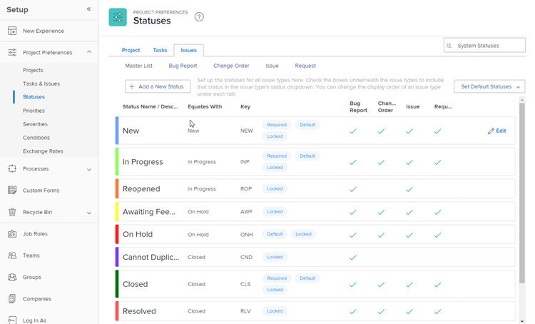

# Acceso a la lista de estados de problemas del sistema

Puede utilizar el estado de un problema para mostrar a los usuarios del sistema en qué fase de desarrollo se encuentra un problema en un momento determinado.

## Requisitos de acceso

+++ Expanda para ver los requisitos de acceso para la funcionalidad en este artículo.

Debe tener el siguiente acceso para realizar los pasos de este artículo:

<table style="table-layout:auto"> 
 <col> 
 <col> 
 <tbody> 
  <tr> 
   <td role="rowheader">plan de Adobe Workfront</td> 
   <td>Cualquiera</td> 
  </tr> 
  <tr> 
  <tr> 
   <td role="rowheader">Licencia de Adobe Workfront</td> 
   <td>
Nuevo: estándar

       
O

       
Actual: plan
</td>
  </tr> 
  </tr> 
  <tr> 
   <td role="rowheader">Configuraciones de nivel de acceso</td> 
   <td>[!UICONTROL Administrador del sistema]</td>
  </tr> 
 </tbody> 
</table>

Para obtener más información sobre esta tabla, consulte [Requisitos de acceso en la documentación de Workfront](/help/quicksilver/administration-and-setup/add-users/access-levels-and-object-permissions/access-level-requirements-in-documentation.md).

+++

## Acceder a estados de problemas

Puede acceder a los estados de problemas de nivel del sistema y modificarlos. Puede editar parte de la información sobre los estados predeterminados del sistema o crear nuevos estados personalizados. Para obtener más información sobre cómo crear estados personalizados o editar estados del sistema, vea [Crear o editar un estado](../../../administration-and-setup/customize-workfront/creating-custom-status-and-priority-labels/create-or-edit-a-status.md).

Para acceder a los estados de problemas del sistema:

{{step-1-to-setup}}

1. Haga clic en **Preferencias del proyecto** > **Estados**.

1. Haga clic en la ficha **Problemas** para ver los estados de problemas disponibles en Workfront.

   

## Estados de problemas del sistema

Workfront incluye 10 estados de problemas originales. Los primeros 4 elementos de la tabla siguiente son obligatorios, lo que significa que puede desbloquearlos, cambiarles el nombre y reordenarlos, pero no puede ocultarlos ni eliminarlos.

Puede agregar estados de problemas personalizados para que coincidan con las necesidades de su organización. Para obtener más información, consulte [Crear o editar un estado](../../../administration-and-setup/customize-workfront/creating-custom-status-and-priority-labels/create-or-edit-a-status.md).

Para los usuarios, cambiar el estado de un problema suele ser un proceso manual. Sin embargo, hay situaciones, descritas en la siguiente lista, en las que el estado de un problema cambia automáticamente, según otros factores que estén ocurriendo en el sistema.

La instancia de Workfront proporciona los siguientes estados de problemas:

<table style="table-layout:auto"> 
 <col> 
 <col> 
 <col> 
 <thead> 
  <tr> 
   <th>Estado del problema del sistema</th> 
   <th>Cómo puede utilizar el estado</th> 
   <th>Qué sucede en el estado</th> 
  </tr> 
 </thead> 
 <tbody> 
  <tr> 
   <td>Nuevo (estado obligatorio)</td> 
   <td>Este es el estado predeterminado de cada problema recién creado.</td> 
   <td>Si el problema está en un proyecto con el estado Actual, el problema se muestra en la pestaña Solicitudes de trabajo de los usuarios asignados al problema. Los usuarios ahora pueden empezar a trabajar en el problema.</td> 
  </tr> 
  <tr> 
   <td>En curso (estado requerido)</td> 
   <td> 
Puede colocar un problema en este estado para indicar que se ha iniciado el trabajo en ese problema.
 
Si la resolución del problema está conectada a otro objeto (una tarea, un proyecto u otro problema), el estado del problema se cambia a En curso automáticamente, cuando cambia el estado del objeto de resolución a En curso. 
 
Para obtener más información acerca de la resolución de objetos, vea <a href="../../../manage-work/issues/convert-issues/resolving-and-resolvable-objects.md" class="MCXref xref">Información general sobre la resolución y los objetos solucionables </a>.
 </td> 
   <td> 
Si el problema está en un proyecto con el estado Actual, el problema se muestra en la pestaña Trabajando en de los usuarios asignados al problema.
 
Cuando un problema está en curso, el problema muestra un valor para la fecha de inicio real.
 
 
 </td> 
  </tr> 
  <tr> 
   <td>Cerrado (estado obligatorio)</td> 
   <td> 
Puede marcar manualmente un problema como Cerrado cuando finalice el trabajo en él. 
 
Si la resolución del problema está conectada a otro objeto (una tarea, un proyecto u otro problema), el estado del problema se cambia a Cerrado automáticamente al cambiar el estado del objeto de resolución a Cerrado.
 
Para obtener más información acerca de la resolución de objetos, vea <a href="../../../manage-work/issues/convert-issues/resolving-and-resolvable-objects.md" class="MCXref xref">Información general sobre la resolución y los objetos solucionables </a>.
 </td> 
   <td> 
Cuando se cierra un problema, el problema se elimina de la lista Trabajando en del usuario asignado. En este caso, el problema muestra un valor para la fecha de finalización real. 
 
Cuando se hayan completado todas las tareas y se hayan cerrado los problemas de un proyecto, se podrá finalizar el proyecto.
 </td> 
  </tr> 
  <tr> 
   <td>En espera (estado obligatorio)</td> 
   <td> 
Puede marcar manualmente un problema como En espera para indicar que se ha producido un retraso al completarlo. 
 </td> 
   <td> 
Si el problema está en un proyecto con el estado Actual, el problema se muestra en la pestaña Trabajando en de los usuarios asignados al problema. 
 
Cuando todas las tareas se completan en un proyecto pero hay al menos un problema en espera en el proyecto, el proyecto no se puede completar. 
 </td> 
  </tr> 
  <tr> 
   <td>Reabierto (equivale a En curso)</td> 
   <td> 
Puede colocar un problema en este estado para indicar que el trabajo en ese problema no se completó cuando se cerró el problema anteriormente y que necesitaba reabrirse para completarlo.
 </td> 
   <td> 
Si el problema está en un proyecto con el estado Actual, el problema se muestra en la pestaña Solicitudes de trabajo de los usuarios asignados al problema. Los usuarios ahora pueden empezar a trabajar en el problema.
 
Este estado es importante en los informes para diferenciar entre los problemas que se abren por primera vez (normalmente en estado Nuevo) y los problemas que se abren después de haberse cerrado anteriormente (normalmente en estado Reabierto). 
 </td> 
  </tr> 
  <tr> 
   <td>Esperando comentarios (equivale a En espera)</td> 
   <td>Puede colocar un problema en este estado para indicar que está esperando comentarios (generalmente del contacto principal) antes de poder seguir trabajando en el problema. </td> 
   <td> 
Si el problema está en un proyecto con el estado Actual, el problema se muestra en la pestaña Trabajando en de los usuarios asignados al problema.
 
Si hay un problema en espera de comentarios, no se puede completar el proyecto.
 
Este estado es importante en los informes para diferenciar entre los problemas que están abiertos pero en proceso de trabajo (normalmente en estado En curso) y los problemas que están abiertos pero no se están trabajando porque se necesitan más comentarios para completarlos (normalmente en estado Esperando comentarios).
 </td> 
  </tr> 
  <tr> 
   <td>No se puede duplicar (equivale a cerrado)</td> 
   <td>Puede colocar un problema en este estado para indicar que lo está cerrando, pero no pudo ver el problema que activó la apertura del problema. El problema podría seguir existiendo, pero no se puede replicar en un momento determinado. </td> 
   <td> 
Este estado es importante en los informes para diferenciar entre los problemas que se han completado y aquellos cuyo problema se ha solucionado (normalmente con el estado Cerrado ) y los problemas cuyo problema no es visible en un momento determinado (normalmente con el estado No se puede duplicar ).
 
Cuando un problema se marca como No se puede duplicar, se elimina de la lista Trabajando en del usuario asignado. En este caso, el problema muestra un valor para Actual CompletionDate.
 
Si se han completado todas las tareas de un proyecto y algunos problemas están en el estado No se puede duplicar, el proyecto se puede finalizar.
 </td> 
  </tr> 
  <tr> 
   <td>Resuelto (equivale a cerrado)</td> 
   <td>Puede colocar un problema en este estado para indicar que está cerrando el problema y que el problema que lo creó se ha resuelto.</td> 
   <td> 
Este estado es importante en la creación de informes para diferenciar entre los problemas que se cierran con o sin una resolución (normalmente con el estado Cerrado) y los problemas que se cierran con una resolución real (normalmente con el estado Resuelto).
 
Cuando un problema se marca como Resuelto, se elimina de la lista Trabajando en del usuario asignado. En este caso, el problema muestra un valor para la fecha de finalización real.
 
Si se han completado todas las tareas de un proyecto y hay al menos un problema en estado Resuelto, se puede finalizar el proyecto. 
 </td> 
  </tr> 
  <tr> 
   <td>Verificación completa (equivale a cerrada)</td> 
   <td>Puede colocar un problema en este estado para indicar que lo está cerrando y que ha verificado que se ha resuelto el problema que lo generó.</td> 
   <td> 
Cuando un problema se marca como Verificado completado, se elimina de la lista Trabajando en del usuario asignado. En este caso, el problema muestra un valor para la fecha de finalización real.
 
Si se han completado todas las tareas de un proyecto y algunos problemas están en el estado Verificado como completado, se puede finalizar el proyecto.
 </td> 
  </tr> 
  <tr> 
   <td>No se puede resolver (equivale a cerrado)</td> 
   <td>Puede colocar un problema en este estado para indicar que lo está cerrando, pero el problema que lo ha generado no se puede resolver.</td> 
   <td> 
Este estado es importante en los informes para diferenciar entre los problemas que se cierran con o sin resolución (normalmente con estado Cerrado) y los problemas que se cierran sin resolución real (normalmente con estado No se resuelve).
 
Cuando un problema se marca como No se resuelve, se elimina de la lista Trabajando en del usuario asignado. En este caso, el problema muestra un valor para la fecha de finalización real.
 
Si se han completado todas las tareas de un proyecto y hay al menos un problema con el estado No se puede resolver, se puede finalizar el proyecto.
 </td> 
  </tr> 
 </tbody> 
</table>

## Personalización de estados de problemas

Un administrador de Workfront puede agregar estados de problemas de nivel de sistema y de grupo a Workfront y cambiar el orden en que los usuarios los ven. Para obtener más información, consulte [Crear o editar un estado](../../../administration-and-setup/customize-workfront/creating-custom-status-and-priority-labels/create-or-edit-a-status.md).

Un administrador de grupo puede agregar un estado personalizado específico a un grupo. Para obtener más información, consulte [Crear o editar un estado de grupo](../../../administration-and-setup/manage-groups/manage-group-statuses/create-or-edit-a-group-status.md).
