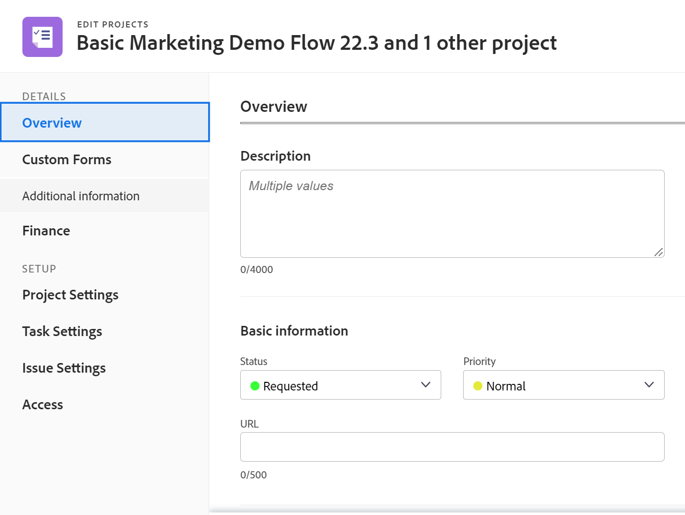

# Personalización de la vista Detalles mediante una plantilla de diseño

<!--The highlighted information on this page refers to functionality not yet generally available. It is available for all customers in the Preview environment and for a select group of customers in the Production environment.-->

Como administrador de Adobe Workfront, puede utilizar una plantilla de diseño para determinar qué información aparece cuando un usuario hace clic en el icono Detalles  en el panel izquierdo mientras ve una tarea, un problema, un documento, un programa o un portafolio.

<!--
or billing record
-->

También puede cambiar el orden de la información en la que aparece esta información. Por ejemplo, para todas las tareas que vean los usuarios, puede mover la información de Forms personalizada a la parte superior de la vista Detalles para todas las tareas que vean los usuarios.

Los cambios que realice en la vista Detalles de un objeto también determinan la disponibilidad y el orden de los campos que verán los usuarios en las siguientes áreas:

* Los cuadros &quot;Nuevo objeto&quot;, como Nueva tarea y Nuevo problema

   

* Pantallas &quot;Editar objeto&quot;, como Editar tarea, Editar problema y Editar proyecto

   

* Editar objetos cuando edita objetos de forma masiva. Actualmente, se admite para editar proyectos de forma masiva.

   

* Resumen  panel para listas de tareas y problemas

   

   >[!NOTE]
   >
   >Los cambios en las plantillas de diseño afectan al orden y la disponibilidad de los campos en el panel Resumen solo para las tareas y los problemas que se asignan al usuario que ha iniciado sesión.

* Los cuadros de conversión, como Convertir problema a tarea o Convertir problema a cuadros de proyecto.

   

Para obtener información sobre plantillas de diseño para grupos, consulte [Creación y modificación de las plantillas de diseño de un grupo](../../../administration-and-setup/manage-groups/work-with-group-objects/create-and-modify-a-groups-layout-templates.md).

## Requisitos de acceso

Debe tener el siguiente acceso para realizar los pasos de este artículo:

<table style="table-layout:auto"> 
 <col> 
 <col> 
 <tbody> 
  <tr> 
   <td role="rowheader">plan de Adobe Workfront</td> 
   <td>Cualquiera</td> 
  </tr> 
  <tr> 
   <td role="rowheader">Licencia de Adobe Workfront</td> 
   <td>Plan</td> 
  </tr> 
  <tr> 
   <td role="rowheader">Configuraciones de nivel de acceso</td> 
   <td> 
Para realizar estos pasos a nivel de sistema, necesita el nivel de acceso del administrador del sistema.
Para realizarlos para un grupo, debe ser administrador de dicho grupo
 
<b>NOTA</b>: Si todavía no tiene acceso, pregunte a su administrador de Workfront si establece restricciones adicionales en su nivel de acceso. Para obtener información sobre cómo un administrador de Workfront puede modificar su nivel de acceso, consulte <a href="../../../administration-and-setup/add-users/configure-and-grant-access/create-modify-access-levels.md" class="MCXref xref">Crear o modificar niveles de acceso personalizados</a>.
 </td> 
  </tr> 
 </tbody> 
</table>

## Personalice lo que ven los usuarios en la vista Detalles

1. Empiece a trabajar en una plantilla de diseño, tal como se describe en [Creación y administración de plantillas de diseño](../../../administration-and-setup/customize-workfront/use-layout-templates/create-and-manage-layout-templates.md).
1. Haga clic en la flecha hacia abajo  under **Personalización de lo que ven los usuarios** y haga clic en **Proyecto**, **Tarea**, **Problema**, **Programa** o **Portfolio.**
<!--
, or billing record
-->

1. En el **Detalles** , realice una de las acciones siguientes para personalizar lo que ven los usuarios en la vista Detalles:

   * Arrastrar cualquier encabezado de sección  para cambiar su orden.
   * Activar o desactivar opciones en **Información general** y **Forms personalizado** para mostrarlos u ocultarlos.

      Si oculta todos los campos de una de estas secciones, se oculta toda la sección.

      Todos los campos están habilitados de forma predeterminada.

1. Continúe personalizando la plantilla de diseño.

   O

   Si ha terminado de personalizar, haga clic en **Guardar**.

   >[!TIP]
   >
   >Puede hacer clic en Guardar en cualquier momento para guardar el progreso y luego seguir modificando la plantilla más tarde.
