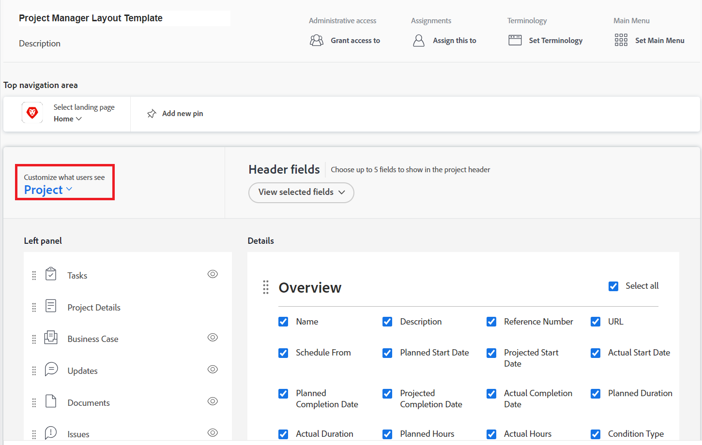
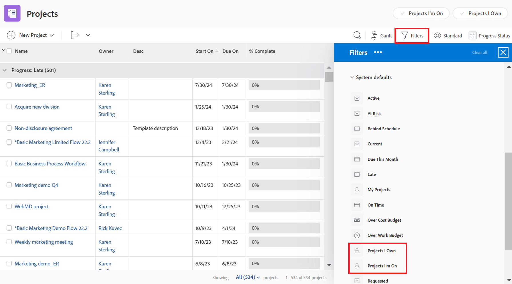

# Personalización de filtros, vistas y grupos mediante una plantilla de diseño

Como administrador de Adobe Workfront, puede utilizar una plantilla de diseño para especificar qué controles de lista aparecen en los menús desplegables Filtrar, Ver y Agrupar. Estos menús aparecen arriba de las listas en todo Workfront, como la lista de tareas de un proyecto:

Para obtener más información sobre las plantillas de diseño, consulte [Creación y administración de plantillas de diseño](../../../administration-and-setup/customize-workfront/use-layout-templates/create-and-manage-layout-templates.md).

Para obtener información sobre plantillas de diseño para grupos, consulte [Creación y modificación de las plantillas de diseño de un grupo](../../../administration-and-setup/manage-groups/work-with-group-objects/create-and-modify-a-groups-layout-templates.md).

## Requisitos de acceso

Debe tener el siguiente acceso para realizar los pasos de este artículo:

<table style="table-layout:auto"> 
 <col> 
 <col> 
 <tbody> 
  <tr> 
   <td role="rowheader">plan de Adobe Workfront</td> 
   <td>Cualquiera</td> 
  </tr> 
  <tr> 
   <td role="rowheader">Licencia de Adobe Workfront</td> 
   <td>Plan</td> 
  </tr> 
  <tr> 
   <td role="rowheader">Configuraciones de nivel de acceso</td> 
   <td> 
Para realizar estos pasos a nivel de sistema, necesita el nivel de acceso del administrador del sistema.
Para realizarlos para un grupo, debe ser administrador de dicho grupo.
 
<b>NOTA</b>: Si todavía no tiene acceso, pregunte a su administrador de Workfront si establece restricciones adicionales en su nivel de acceso. Para obtener información sobre cómo un administrador de Workfront puede modificar su nivel de acceso, consulte <a href="../../../administration-and-setup/add-users/configure-and-grant-access/create-modify-access-levels.md" class="MCXref xref">Crear o modificar niveles de acceso personalizados</a>.
 </td> 
  </tr> 
 </tbody> 
</table>

## Personalizar controles de lista de filtros, vistas y grupos:

1. Empiece a trabajar en una plantilla de diseño, tal como se describe en [Creación y administración de plantillas de diseño](../../../administration-and-setup/customize-workfront/use-layout-templates/create-and-manage-layout-templates.md).
1. Haga clic en la flecha hacia abajo  under **Personalización de lo que ven los usuarios** y haga clic en **Listas** en el menú desplegable que se muestra.

   

1. Haga clic en la flecha hacia abajo  under **Seleccione una lista para personalizar** y, a continuación, seleccione el tipo de objeto de Workfront para el que desea personalizar los controles de lista Filtro, Vista y Agrupación.

   

   >[!NOTE]
   >
   >Si selecciona Proyectos como la lista que desea personalizar y luego desactiva Proyectos en los que estoy activo o Proyectos de los que soy propietario en la sección Filtro , los usuarios ya no verán ni podrán utilizar ese filtro:
   >
   >* En la lista de filtros que se muestran cuando hacen clic en el icono de filtro  encima de una lista:
   >   
   >  
   >   
   >* En el encabezado del encabezado del área Proyectos :
   >   
   >  

1. (Opcional) Si desea cambiar el filtro, la vista o la agrupación predeterminados para la plantilla de diseño, pase el ratón sobre el filtro, la vista o la agrupación y, a continuación, haga clic en **Establecer como predeterminado**.

   Los valores predeterminados que elija determinan qué usuarios de Filtro, Vista y Agrupación verán en las listas a través de Workfront cuando se les asigne la plantilla de diseño. Si no cambia estos valores predeterminados, los usuarios verán todas las listas de la siguiente manera:

   * **Filtros**: Todo
   * **Ver**: Estándar (en su caso; algunas listas no tienen esta vista)
   * **Agrupación**: Nada

   Puede ocultar las opciones Todas, Estándar y Nada después de seleccionar diferentes valores predeterminados (consulte el paso 5), pero no se pueden eliminar.

   Puede eliminar cualquier otra opción que se utilice como predeterminada, pero primero debe seleccionar otra predeterminada.

   Para obtener información sobre la eliminación de filtros, vistas y agrupaciones, consulte [Crear, editar y compartir filtros, vistas y agrupaciones predeterminadas](../../../administration-and-setup/set-up-workfront/configure-system-defaults/create-and-share-default-fvgs.md).

1. Ocultar y agregar controles de lista como se indica a continuación:

   <table style="table-layout:auto"> 
    <col> 
    <col> 
    <tbody> 
     <tr> 
      <td role="rowheader">Ocultar un control de lista</td> 
      <td> 
Desactive o marque la casilla situada junto al control de lista que desee ocultar o mostrar.
 
Si una casilla de verificación está tenue, no puede ocultar ese control de lista. El valor predeterminado  para cada control de lista está atenuado porque no puede ocultar la configuración que está configurada como predeterminada.
 </td> 
     </tr> 
     <tr> 
      <td role="rowheader">Añadir un control de lista personalizado</td> 
      <td> 
 
        <ol> 
         <li value="1"> Haga clic en <strong>Agregar filtro</strong>, <strong>Agregar vista</strong>o <strong>Agregar agrupación</strong> en la parte inferior de la lista Filtro, Vista o Agrupación. En el cuadro que aparece, empiece a escribir el nombre de un control de lista personalizado existente creado anteriormente para su organización y, a continuación, haga clic en el nombre cuando aparezca.</li> 
         <li value="2"> Si desea que el nuevo control de lista personalizado se establezca como filtro, vista o agrupación predeterminados para la plantilla de diseño, haga clic en <strong>Establecer como predeterminado</strong>. </li> 
         <li value="3"> 
Haga clic en <strong>Agregar</strong> cuando haya terminado.
 
<b>NOTA</b>: 
Los usuarios pueden agregar controles de lista personalizados a sus propias listas. Si agrega controles de lista personalizados en una plantilla de diseño, se añaden los controles de lista y los suyos se mueven a la parte inferior del panel; el suyo no reemplaza el suyo.
 
Esto también ocurre si asigna al usuario a una nueva plantilla de diseño que tiene controles de lista personalizados. 
 
Para obtener información sobre la personalización de controles de lista, consulte <a href="../../../reports-and-dashboards/reports/reporting-elements/filters-overview.md" class="MCXref xref">Información general sobre filtros en Adobe Workfront</a>, <a href="../../../reports-and-dashboards/reports/reporting-elements/views-overview.md" class="MCXref xref">Información general sobre las vistas en Adobe Workfront</a>y <a href="../../../reports-and-dashboards/reports/reporting-elements/groupings-overview.md" class="MCXref xref">Información general sobre las agrupaciones en Adobe Workfront</a>.
 
 </li> 
        </ol> 
 </td> 
     </tr> 
    </tbody> 
   </table>

1. Continúe personalizando la plantilla de diseño.

   O

   Si ha terminado de personalizar, haga clic en **Guardar**.

   >[!TIP]
   >
   >Puede hacer clic en Guardar en cualquier momento para guardar el progreso y luego seguir modificando la plantilla más tarde.
