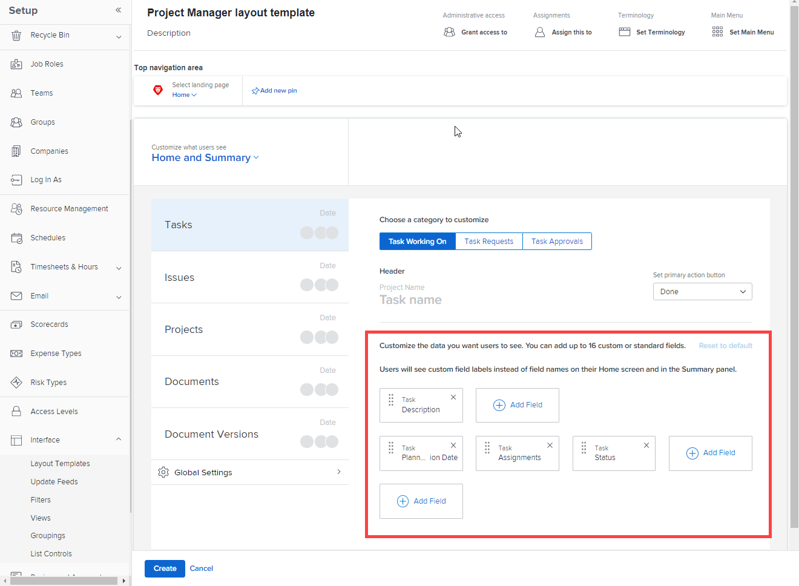

# Personalizar inicio y resumen mediante una plantilla de diseño

Puede utilizar una plantilla de diseño para configurar lo que los usuarios ven cuando hacen clic en una tarea o problema de Inicio y Resumen. Cada configuración que realice siguiendo los pasos a continuación afecta al área principal y al panel Resumen del mismo modo. Estas personalizaciones no se aplican al panel Resumen de documentos.

Puede configurar:

* Qué campos se muestran para una tarea o un problema en el área Detalles y en qué orden
* Indica si las actualizaciones, la hora registrada, los documentos adjuntos y las marcas de tiempo se muestran para una tarea o un problema seleccionados

También puede personalizar los campos que los usuarios ven en el área principal cuando hacen clic en una aprobación de proyecto, de documento o de versión de documento que les ha sido asignada.

Para obtener información sobre el área principal, consulte [Uso del área de inicio](../../../workfront-basics/using-home/using-the-home-area/use-the-home-area.md). Para obtener información sobre el panel Resumen, consulte [Resumen](../../../workfront-basics/the-new-workfront-experience/summary-overview.md).

Para obtener información sobre plantillas de diseño para grupos, consulte [Creación y modificación de las plantillas de diseño de un grupo](../../../administration-and-setup/manage-groups/work-with-group-objects/create-and-modify-a-groups-layout-templates.md).

## Requisitos de acceso

Debe tener el siguiente acceso para realizar los pasos de este artículo:

<table style="table-layout:auto"> 
 <col> 
 <col> 
 <tbody> 
  <tr> 
   <td role="rowheader">plan de Adobe Workfront</td> 
   <td>Cualquiera</td> 
  </tr> 
  <tr> 
   <td role="rowheader">Licencia de Adobe Workfront</td> 
   <td>Plan</td> 
  </tr> 
  <tr> 
   <td role="rowheader">Configuraciones de nivel de acceso</td> 
   <td> 
Para realizar estos pasos a nivel de sistema, necesita el nivel de acceso del administrador del sistema.
Para realizarlos para un grupo, debe ser administrador de dicho grupo.
 
<b>NOTA</b>: Si todavía no tiene acceso, pregunte a su administrador de Workfront si establece restricciones adicionales en su nivel de acceso. Para obtener información sobre cómo un administrador de Workfront puede modificar su nivel de acceso, consulte <a href="../../../administration-and-setup/add-users/configure-and-grant-access/create-modify-access-levels.md" class="MCXref xref">Crear o modificar niveles de acceso personalizados</a>.
 </td> 
  </tr> 
 </tbody> 
</table>

## Personalizar inicio y resumen mediante una plantilla de diseño

1. Empiece a trabajar en una plantilla de diseño, tal como se describe en [Creación y administración de plantillas de diseño](../../../administration-and-setup/customize-workfront/use-layout-templates/create-and-manage-layout-templates.md).

1. Haga clic en la flecha hacia abajo  under **Personalización de lo que ven los usuarios** y haga clic en **Inicio y resumen**.

1. En la lista que aparece a la izquierda, haga clic en el tipo de objeto (**Tareas**, **Problemas**, **Proyectos**, **Documentos** o **Versiones de documento**) que desea personalizar en Inicio y Resumen.

   <table style="table-layout:auto"> 
    <col> 
    <col> 
    <tbody> 
     <tr> 
      <td role="rowheader">Tareas</td> 
      <td> 
En Inicio, la configuración para esta configuración afecta al área a la derecha de una tarea cuando un usuario hace clic en la tarea. Y, en una lista de tareas, afecta al panel Resumen que aparece en la parte derecha de la página cuando un usuario selecciona una tarea y luego hace clic en el icono Abrir resumen .
 
Por ejemplo, puede determinar qué campos ven los usuarios en el área Detalles cuando seleccionan tareas en Inicio:
 

 
Y cuando seleccionan una tarea en el Resumen:
 
  
 </td> 
     </tr> 
     <tr> 
      <td role="rowheader">Problemas</td> 
      <td> 
En Inicio, la configuración para esta configuración afecta al área a la derecha de un problema cuando un usuario hace clic en el problema.
 
En una lista de problemas, esta configuración afecta al panel Resumen que aparece en la parte derecha de la página cuando un usuario selecciona un problema y luego hace clic en el icono Abrir resumen .
 </td> 
     </tr> 
     <tr> 
      <td role="rowheader">Proyectos</td> 
      <td>En Inicio, cuando un usuario hace clic en una aprobación de proyecto asignada, la configuración para esta configuración afecta al área a la derecha de la aprobación.</td> 
     </tr> 
     <tr> 
      <td role="rowheader">Documentos</td> 
      <td>En Inicio, cuando un usuario hace clic en una aprobación de documento asignada, la configuración para esta configuración afecta al área a la derecha de la aprobación.</td> 
     </tr> 
     <tr> 
      <td role="rowheader">Versiones de documento</td> 
      <td>En Inicio, cuando un usuario hace clic en una aprobación asignada para una versión concreta de un documento, la configuración para esta configuración afecta al área a la derecha de la aprobación.</td> 
     </tr> 
    </tbody> 
   </table>

   >[!IMPORTANT]
   >
   >Si una tarea no está asignada, el usuario asignado a la plantilla de diseño no verá las personalizaciones de campo en el Resumen.

1. (Condicional) Si hizo clic en Tareas o Problemas en el paso anterior, seleccione la categoría de tarea o problema que desea personalizar.

   

1. (Condicional) Si la variable **Botón Definir acción principal** aparece el menú desplegable (si selecciona **Tareas** o **Problemas** en la lista de la izquierda), haga clic en la acción principal (**Listo** o **Estado**) que desea que estén disponibles para los usuarios del área principal y del panel Resumen cuando vean una tarea o un problema.

   

1. Agregar  u ocultar  para el tipo de objeto seleccionado.

   

1. Repita los pasos 3 a 6 para personalizar el área principal y el panel Resumen para cualquier otro tipo de objeto.
1. Haga clic en **Configuración global**, cerca de la esquina inferior izquierda, active o desactive cualquiera de las siguientes opciones relacionadas con los objetos de Adobe Workfront en Inicio y Resumen:

   <table style="table-layout:auto"> 
    <col> 
    <col> 
    <tbody> 
     <tr> 
      <td role="rowheader">Mostrar actualizaciones de trabajo</td> 
      <td>Muestra las actualizaciones realizadas en una tarea o problema seleccionado en Inicio o Resumen. Esto incluye actualizaciones del sistema y actualizaciones realizadas por un usuario. Los usuarios aún pueden filtrar las actualizaciones del sistema, tal como se describe en <a href="../../../workfront-basics/updating-work-items-and-viewing-updates/update-work.md#enable" class="MCXref xref">Habilitar o deshabilitar actualizaciones del sistema</a> en <a href="../../../workfront-basics/updating-work-items-and-viewing-updates/update-work.md" class="MCXref xref">Actualizar trabajo</a>.</td> 
     </tr> 
     <tr> 
      <td role="rowheader">Registrar tiempo de trabajo</td> 
      <td>Muestra la opción Registrar el tiempo de trabajo cuando se selecciona una tarea o un problema, lo que permite a los usuarios iniciar sesión en los elementos de trabajo directamente desde las áreas de inicio y resumen.</td> 
     </tr> 
     <tr> 
      <td role="rowheader">Ver documentos asociados al trabajo</td> 
      <td>Muestra un área Documentos en Inicio y Resumen cuando se selecciona una tarea o problema, enumerando cualquier documento adjunto a la tarea o problema. Los usuarios pueden hacer clic en los documentos para verlos en una ventana de vista previa.</td> 
     </tr> 
     <tr> 
      <td role="rowheader">Ocultar marca de tiempo</td> 
      <td>Oculta las marcas de hora de los siguientes campos de fecha en Inicio y Resumen:
       <ul>
        <li>Fecha planificada de finalización</li>
        <li>Fecha de confirmación</li>
        <li>
Fecha de envío
</li>
       </ul>
<b>NOTA</b>: Cuando esta opción está activada, los elementos de trabajo que vencen después de vencerse se mueven a la agrupación Late de la lista de trabajo principal en función de la fecha, no de la hora.
</td> 
     </tr> 
    </tbody> 
   </table>

1. Continúe personalizando la plantilla de diseño.

   O

   Si ha terminado de personalizar, haga clic en **Guardar**.

Para obtener más información sobre las plantillas de diseño, consulte [Creación y administración de plantillas de diseño](../../../administration-and-setup/customize-workfront/use-layout-templates/create-and-manage-layout-templates.md).
