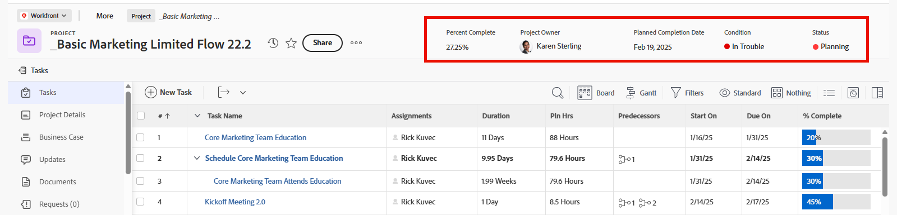

# Personalización de los encabezados de los objetos mediante una plantilla de diseño

Como administrador de Adobe Workfront o de un grupo, puede utilizar una plantilla de diseño para configurar los campos que ven los usuarios en el encabezado del objeto cuando abren la página de un objeto.

>[!IMPORTANT]
>
>Actualmente, la personalización de encabezados de objeto está disponible para proyectos, tareas, problemas, portafolios, programas, plantillas, registros de facturación, equipos, usuarios, empresas, grupos y tarjetas de tarifas.

Para obtener información sobre cómo crear plantillas de diseño, consulte [Crear y administrar plantillas de diseño](../use-layout-templates/create-and-manage-layout-templates.md).

Para obtener información acerca de las plantillas de diseño para grupos, consulte [Creación y modificación de las plantillas de diseño de un grupo](../../../administration-and-setup/manage-groups/work-with-group-objects/create-and-modify-a-groups-layout-templates.md).

Después de configurar una plantilla de diseño, debe asignarla a usuarios para que los cambios que ha realizado sean visibles para otros. Para obtener información acerca de cómo asignar una plantilla de diseño a los usuarios, consulte [Asignar usuarios a una plantilla de diseño](../use-layout-templates/assign-users-to-layout-template.md).

## Requisitos de acceso

+++ Expanda para ver los requisitos de acceso para la funcionalidad en este artículo.

<table style="table-layout:auto"> 
 <col> 
 <col> 
 <tbody> 
  <tr> 
   <td>Paquete de Adobe Workfront</td> 
   <td>
Cualquiera
</td> 
  </tr> 
  <tr> 
   <td>Licencia de Adobe Workfront</td> 
   <td>
Estándar

       
Plan
</td>
  </tr> 
  </tr> 
  <tr> 
   <td>Configuraciones de nivel de acceso</td> 
   <td> 
Para realizar estos pasos en el sistema, necesita el nivel de acceso de administrador del sistema.

        
Para realizarlos para un grupo, debe ser administrador de ese grupo.
 </td> 
  </tr> 
 </tbody> 
</table>

Para obtener más información, consulte [Requisitos de acceso en la documentación de Workfront](/help/quicksilver/administration-and-setup/add-users/access-levels-and-object-permissions/access-level-requirements-in-documentation.md).

+++

## Personalización de los encabezados de los objetos

1. Empiece a trabajar en una plantilla de diseño, tal como se describe en [Crear y administrar plantillas de diseño](../../customize-workfront/use-layout-templates/create-and-manage-layout-templates.md).
1. En el menú desplegable **Personalizar lo que ven los usuarios**, seleccione un objeto cuyo encabezado desee personalizar.
1. En la sección [!UICONTROL Campos de encabezado], pase el ratón sobre los campos actuales y realice una de las siguientes acciones:
   * Haga clic en el icono **x** para eliminar un campo

     O

   * Mantenga pulsado el icono **agarrar** para arrastrar y soltar el campo en una nueva ubicación.

   

1. Se pueden incluir hasta cinco campos en el encabezado de un objeto.

   Si ya tiene cinco campos seleccionados, debe quitar un campo para poder añadir uno nuevo.

1. En el cuadro **Agregar campo**, empiece a escribir el nombre de un campo personalizado o de un campo nativo de Workfront que desee agregar y, a continuación, selecciónelo cuando se muestre en la lista. El campo se añade inmediatamente a la derecha del cuadro Agregar campo y se muestra como el primer campo en la esquina superior derecha del encabezado del objeto.

   >[!TIP]
   >
   >* Puede agregar cualquier campo personalizado o nativo disponible en el área Información general de la sección Detalles de un objeto. Por ejemplo, solo los problemas tienen el campo Gravedad y ese campo no está disponible para agregar a proyectos o tareas.
   >
   >* Cuando un usuario edita un campo personalizado en el encabezado y está contenido en un formulario personalizado que no está adjunto al objeto, el formulario personalizado se agrega automáticamente al objeto.
   >
   >* Cuando agrega el campo &quot;Resuelto por&quot; al encabezado de un problema, el campo cambia a &quot;Resolviendo problema, tarea o proyecto&quot;, cuando hay un objeto de resolución asociado al problema.

   

1. (Opcional) Arrastre y suelte los campos en un orden diferente.

1. Siga personalizando la plantilla de diseño. Puede hacer clic en **Aplicar** en cualquier momento para guardar el progreso.

   O

   Si ha terminado de personalizar, haga clic en **Guardar y cerrar**.

