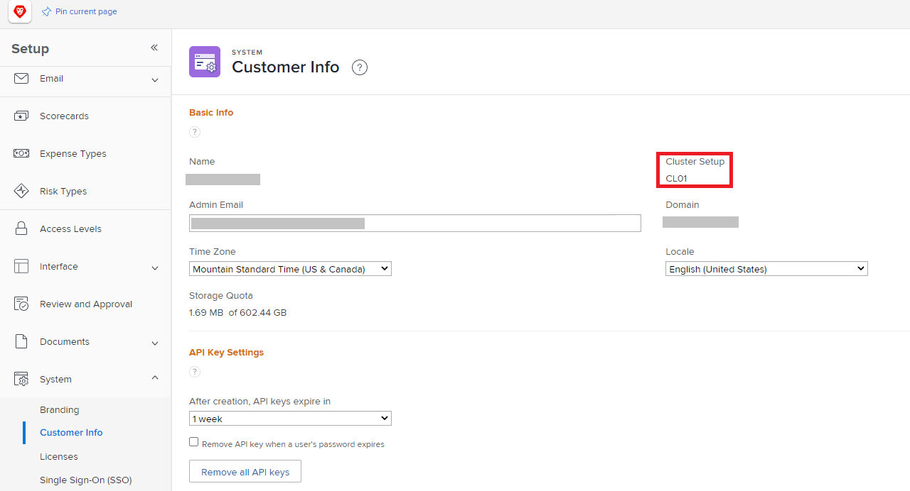

# Información general del cortafuegos

Dado que Adobe Workfront se comunica con la red de su organización, el cortafuegos de esta debe configurarse para permitir dicha comunicación. Los cortafuegos son medidas de seguridad muy efectivas que funcionan al separar la red de una organización de internet. Garantizan que solo los datos seleccionados y el tráfico de red puedan entrar o salir de la red de la organización. El cortafuegos permite o bloquea los datos en función del sitio que envía o recibe los datos. Como administrador de Adobe Workfront, debe asegurarse de que los datos enviados a o desde Workfront puedan pasar a través del cortafuegos de su organización.

Esto se logra a través de una lista de permitidos, que es esencialmente una “lista” de sitios a los que se les “permite” enviar o recibir datos a través del cortafuegos. Los sitios se pueden identificar de una de las dos maneras siguientes:

* **Dirección IP**: una serie de números como 52.31.132.175
* **Dominio**: parte de una dirección URL, como `thisdomain` en `www.thisdomain.com`.

Workfront utiliza direcciones IP y dominios específicos para la comunicación web. Deben añadirse a la lista de permitidos de su organización para poder utilizar Workfront en su organización.

Por lo general, la lista de permitidos la configura un administrador de red. Póngase en contacto con el administrador de red de su organización para asegurarse de que el cortafuegos permite estas direcciones IP. Si no sabe quién es el administrador de red, el departamento de TI de su organización puede indicarle la dirección correcta.

>[!IMPORTANT]
>
>Como administrador de Workfront, debe asegurarse de que estas direcciones IP y dominios se añadan a la lista de permitidos de su organización. Esto es así, incluso si no los añade usted mismo. Workfront no puede configurar la lista de permitidos de su organización.

## Recopilación de información para configurar el cortafuegos

Para configurar el cortafuegos para Workfront, el administrador de red debe saber qué direcciones IP y dominios añadir. Parte de esta información solo está disponible para administradores de Workfront. Como administrador de Workfront, debe localizar esta información y proporcionársela a su administrador de red.

>[!NOTE]
>
>La práctica recomendada para la seguridad es añadir solo las direcciones IP y los dominios que se conectan a la funcionalidad que su organización está utilizando de forma activa. Al proporcionar esta información, puede asegurarse de que se sigue esta práctica recomendada.

Proporcione al administrador de red la siguiente información:

<table style="table-layout:auto"> 
 <col> 
 <col> 
 <tbody> 
  <tr> 
   <td role="rowheader">Direcciones IP y dominios específicos que se permitirán</td> 
   <td> 
El artículo <a href="../../administration-and-setup/get-started-wf-administration/configure-your-firewall.md" class="MCXref xref">Configuración de la lista de permitidos del cortafuegos</a> contiene la lista de direcciones IP y dominios que su organización debe añadir a su lista de permitidos. 
 
Es posible que el administrador de la red no tenga acceso al artículo “Configuración de la lista de permitidos del cortafuegos”. En ese caso, debe proporcionárselo a ellos. No se recomienda imprimir una copia impresa (en papel). Una copia digital permite al administrador de la red copiar y pegar las direcciones, lo que resulta más rápido y preciso que escribir desde una copia impresa.
 </td> 
  </tr> 
  <tr> 
   <td role="rowheader">Su clúster</td> 
   <td>Para localizar el clúster de su organización, consulte <a href="#view-your-organization-s-cluster-and-workfront-package" class="MCXref xref">Ver el clúster de su organización y el paquete de Workfront</a>.</td> 
  </tr> 
  <tr> 
   <td role="rowheader">Su paquete de Workfront</td> 
   <td> 
Para encontrar el paquete de su organización, consulte <a href="#view-your-organization-s-cluster-and-workfront-package" class="MCXref xref">Ver el clúster de su organización y el paquete de Workfront.</a>
 </td> 
  </tr> 
  <tr> 
   <td role="rowheader">Su dominio</td> 
   <td> 
Para localizar el dominio, consulte la dirección web que utiliza para conectarse a Workfront.
 
Ejemplo: en la dirección web <code>greatcompany.my.workfront.com</code>, el dominio es "greatcompany"
 </td> 
  </tr> 
  <tr> 
   <td role="rowheader">Otros productos de Adobe Workfront</td> 
   <td> 
Informe al administrador de red si dispone de licencias para cualquiera de las siguientes opciones:
 
    <ul> 
     <li> 
Adobe Workfront Proof
 </li> 
     <li> 
Adobe Workfront Fusion 
 </li> 
    </ul> </td> 
  </tr> 
  <tr> 
   <td role="rowheader">Integraciones de Adobe Workfront</td> 
   <td>Informe al administrador de red si utiliza lo siguiente:
    <ul>
     <li>
Workfront para Microsoft Teams
</li>
    </ul></td> 
  </tr> 
  <tr> 
   <td role="rowheader">Funcionalidad adicional</td> 
   <td> 
Informe al administrador de red si utiliza lo siguiente:
 
    <ul> 
     <li> 
Una unidad de prueba de Workfront
 </li> 
    </ul> </td>
  </tr> 
 </tbody> 
</table>

>[!IMPORTANT]
>
>Si añade cualquiera de estos productos, integraciones o funcionalidades en una fecha posterior, debe ponerse en contacto con el administrador de red para que pueda ajustar la lista de permitidos.

### Vea el clúster y el paquete de Workfront de su organización {#view-your-organization-s-cluster-and-workfront-package}

{{step-1-to-setup}}

1. Haga clic en **Sistema** en el panel izquierdo.
1. Para ver el clúster, seleccione **Información del cliente**.

   El clúster se muestra cerca de la parte superior derecha de la sección **Información básica**.

   

1. Para ver el paquete de Workfront, seleccione **Licencias**.

   El paquete se muestra cerca de la esquina superior derecha de la página.

   
