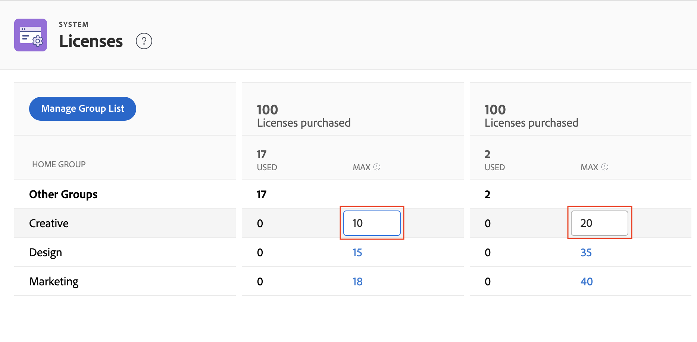

# Administrar las licencias disponibles en el sistema

<!-- Audited: 12/2023 -->

Como administrador de Adobe Workfront, puede acceder a información sobre su cuenta de Workfront, incluido el número de licencias adquiridas para su organización, así como el número de esas licencias que se utilizan actualmente.

## Requisitos de acceso

Debe tener el siguiente acceso para realizar los pasos de este artículo:

<table style="table-layout:auto">
 <col> 
 <col> 
 <tbody> 
  <tr> 
   <td role="rowheader">plan de Adobe Workfront</td> 
   <td>Cualquiera</td> 
  </tr> 
  <tr> 
   <td role="rowheader">Licencia de Adobe Workfront</td> 
   <td>
    
Nuevo: estándar

    
o

    
Actual: plan
</td> 
  </tr> 
  <tr> 
   <td role="rowheader">Configuraciones de nivel de acceso</td> 
   <td> 
Debe ser administrador de Workfront.
 </td> 
  </tr> 
 </tbody> 
</table>

Para obtener más información sobre esta tabla, consulte [Requisitos de acceso en la documentación de Workfront](/help/quicksilver/administration-and-setup/add-users/access-levels-and-object-permissions/access-level-requirements-in-documentation.md).

>[!NOTE]
>
>Las siguientes afirmaciones se aplican solamente a los nuevos planes.
>
>Para el plan seleccionado:
>
>1. Los administradores del sistema no pueden establecer límites para los grupos de inicio.
>2. Los administradores del sistema solo pueden ver el número total de licencias utilizadas en todos los grupos de inicio.
>3. Los administradores de grupo no pueden acceder a la página Licencias.
>
>Para los planes Prime y Ultimate:
>
>1. Los administradores del sistema pueden agregar Grupos de inicio a la página Licencias para ver el uso de las licencias en esos grupos y también pueden establecer límites de licencias.
>2. Los administradores del grupo pueden acceder a la página Licencias y ver la utilización de las licencias en los grupos que gestionan y que los administradores del sistema han añadido a la página Licencias.
>3. Los administradores de grupo no pueden ver información de otros grupos de inicio ni agregar máximos.

## Ver las licencias de su organización

El número de licencias en uso se actualiza automáticamente al asignar niveles de acceso a los usuarios que agrega a Workfront. Para obtener más información, consulte [Adición de usuarios](../../administration-and-setup/add-users/create-and-manage-users/add-users.md).

Para ver la información de licencia en el sistema:

{{step-1-to-setup}}

1. En la parte inferior del panel izquierdo, haga clic en **Sistema** > **Licencias**.

   Para obtener más información sobre las licencias enumeradas en esta página, consulte [Resumen de licencias](../../administration-and-setup/add-users/access-levels-and-object-permissions/wf-licenses.md).

   >[!NOTE]
   >
   >Las licencias de revisión solo están disponibles para los clientes que hayan adquirido el complemento Workfront Proof de pago además de su licencia de Workfront. Para obtener más información sobre este complemento, consulte [Workfront Proof: índice de artículos](../../workfront-proof/workfront-proof.md).

1. (Condicional) Si ve el mensaje **Para establecer un máximo, debe agregar un grupo de inicio**, agregue un grupo de inicio en el sistema como se explica en la sección [Agregar o quitar un grupo de inicio en la página Licencias](#add-or-remove-a-home-group-to-the-licenses-page) en este artículo.

   >[!NOTE]
   >
   >Para los nuevos planes, el plan Select no permite a los administradores ver las licencias por grupo de inicio. Solo puede ver el número total de licencias utilizadas. Los planes Prime y Ultimate permiten establecer el número máximo de licencias por grupo de inicio.

## Ver información sobre las licencias de los complementos de Workfront

Si su organización tiene el complemento Workfront Proof de pago, se muestra el número de licencias utilizadas y el número de licencias disponibles. Por ejemplo, **5 de 10 Licencias de revisión** indica que la organización está utilizando actualmente 5 de las 10 licencias de Workfront Proof que adquirieron.

Si su organización ha adquirido Workfront Goals, la información de la licencia de este producto también se muestra aquí. En este caso, puede ver la siguiente información:

* Cantidad total de licencias de Workfront Goals que su compañía ha adquirido
* Número de licencias de Workfront Goals asociadas a los usuarios. Es el número de usuarios a los que se debe otorgar al menos acceso de visualización a los objetivos en su nivel de acceso.

Para obtener información sobre los objetivos de Workfront, consulte [Información general sobre Adobe Workfront Goals](../../workfront-goals/goal-management/wf-goals-overview.md). Para obtener información sobre el acceso a los objetivos de Workfront, consulte [Concesión de acceso a Adobe Workfront Goals](../../administration-and-setup/add-users/configure-and-grant-access/grant-access-goals.md).

>[!NOTE]
>
>Workfront le permite asignar más licencias de Workfront Goals que haya adquirido. Sin embargo, cuando asigne más licencias de las que permite su contrato de Workfront Goals, un administrador de cuentas de Workfront se pondrá en contacto con usted para informarle de que ha superado su número contractual.
>

<!--
If an organization has other paid add-on products, their license information also displays here. If the organization doesn't have any paid add-on products, nothing displays here. (Drafted this because not sure this is accurate: Scenario Planner is an add-on product and its licenses are not displayed there.)
-->

>[!TIP]
>
>Los usuarios sin acceso administrativo pueden utilizar un informe de grupo para ver el recuento de licencias. En la pestaña Informe, cree un nuevo informe de grupo y añada las siguientes columnas:
>
>* Límite de tipo de licencia: límite de trabajador
>* Límite de tipo de licencia: Límite de planificador
>
>Para obtener más información sobre cómo crear un informe, consulte [Creación de un informe personalizado](../../reports-and-dashboards/reports/creating-and-managing-reports/create-custom-report.md).

## Ver información sobre asignaciones mensuales de pruebas y decisiones de documentos

>[!IMPORTANT]
>
>Los límites de decisión sobre pruebas y documentos se aplican solamente a los usuarios con las nuevas licencias. Para obtener más información, consulte [Información general sobre nuevas licencias](/help/quicksilver/administration-and-setup/add-users/how-access-levels-work/licenses-overview.md).

Las decisiones sobre pruebas y documentos son limitadas para todas las licencias de Workfront sin pago. Los límites se restablecen por usuario cada mes.

Los límites de decisión para cada licencia difieren según el plan en el que se encuentre. Puede ver la asignación mensual en Configuración > Licencias.

Para obtener más información sobre los límites de prueba y decisión de documentos, consulte [Información general sobre la decisión limitada de documentos y pruebas para usuarios no pagados](/help/quicksilver/review-and-approve-work/proof-doc-decision-limits.md).

## Agregar o quitar un grupo de inicio en la página Licencias {#add-or-remove-a-home-group-to-the-licenses-page}

<!--A Business or Enterprise Workfront Plan is required to use this feature. For more information about the various plans available, see [Workfront Plans.](https://www.workfront.com/plans)-->

A cada usuario se le puede asignar un solo Grupo de inicio. Workfront proporciona un recuento de licencias orientado al grupo calculando cuántas licencias se asignan y utilizan actualmente en cada grupo de inicio.

Si ve el mensaje **Para establecer un máximo, debe agregar un grupo de inicio** en la página Licencias, debe agregar al menos un grupo de inicio a la página Licencias.

>[!IMPORTANT]
>
>* Para administrar de forma eficaz las licencias con los grupos de inicio, se recomienda configurar grupos de inicio específicos para las unidades de negocio antes de actualizar el recuento máximo de licencias. Para obtener más información, consulte [Información general de grupos de inicio](../../administration-and-setup/manage-groups/groups-overview/home-groups.md).
>* Solo puede agregar grupos de nivel superior como grupos de inicio, no como subgrupos. Si un usuario tiene un subgrupo asignado como su grupo de inicio, su licencia se añade al recuento de licencias del grupo de nivel superior sobre ese subgrupo.
>

Para agregar o quitar un grupo de inicio a la página Licencias:

{{step-1-to-setup}}

1. En la parte inferior del panel izquierdo, haga clic en **Sistema** > **Licencias**.

1. Clic **Administrar lista de grupos**.
1. Empiece a escribir el nombre del grupo de nivel superior en la **Grupos de inicio** cuadro.
1. Para agregar el grupo, haga clic en su nombre cuando aparezca.

   O

   Para eliminar el grupo, haga clic en el icono X a la derecha de su nombre.

1. Haga clic en **Guardar**.

Como administrador de Workfront, puede establecer recuentos máximos de licencias para los grupos de inicio a fin de evitar que una unidad comercial use licencias de Workfront adquiridas para otras unidades comerciales. Para obtener instrucciones, consulte [Establecer el número máximo de licencias para un grupo de inicio](#set-the-maximum-license-count-for-a-home-group) en este artículo.

## Establecer el número máximo de licencias para un grupo de inicio {#set-the-maximum-license-count-for-a-home-group}

Como administrador de Workfront, puede establecer recuentos máximos de licencias para los grupos de inicio de nivel superior de su sistema. Esto le permite evitar que una unidad comercial use licencias de Workfront adquiridas para otras unidades comerciales de su organización.

De forma predeterminada, el recuento máximo de licencias está establecido en N/D, lo que significa que no hay límite.

Los administradores del grupo pueden ver el número de licencias asignadas y utilizadas en el grupo de inicio que administran. Para obtener más información, consulte [Ver el número de licencias asignadas y utilizadas en un grupo](../../administration-and-setup/manage-groups/create-and-manage-groups/view-number-licenses-allocated-used-group.md).

Para establecer el número máximo de licencias para un grupo de inicio:

{{step-1-to-setup}}

1. En la parte inferior del panel izquierdo, haga clic en **Sistema** > **Licencias**.

1. Busque el grupo de inicio en la lista.
1. En el **Max** del grupo, haga clic en el valor para el que desee establecer un máximo.
1. Escriba el número máximo y pulse Entrar.

   

   >[!NOTE]
   >
   >Para volver a establecer el valor de licencia máximo de un grupo como predeterminado, no escriba 0. En su lugar, elimine el número del cuadro. Establecer el valor máximo de licencia en 0 indica que no hay licencias asignadas a ese grupo.
