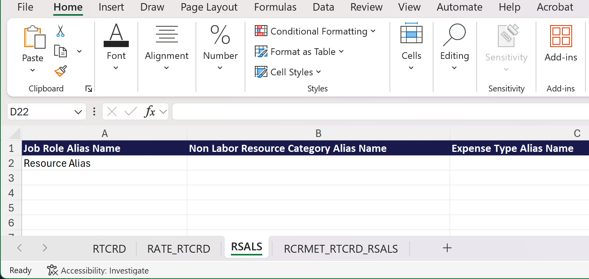

# Importar tarjetas de tarifas desde una plantilla

Puede utilizar un archivo de plantilla para crear las tarjetas de tarifas en Excel e importarlas en Adobe Workfront, en lugar de agregar todos los roles y tarifas manualmente.

Para ver las tarjetas de tasa de ejemplo descritas en este artículo, descargue el [archivo de muestra](assets/rate-cards-sample.zip).

Para obtener más información sobre las tarjetas de tarifas, consulte [Administrar tarjetas de tarifas](/help/quicksilver/administration-and-setup/manage-enterprise-operations/manage-rate-cards.md).

## Reglas importantes para trabajar con el archivo de plantilla

* Introduzca el rol o la categoría de recurso no laboral, pero no ambos.
* La secuencia de tarjetas de tasa de la ficha RATE_RTCRD debe coincidir con el orden de las tarjetas de la ficha RTCRD (1 para la primera, 2 para la segunda, etc.).
* La fecha de inicio y la fecha de finalización deben seguir los formatos permitidos.
* Las tarjetas de tarifas se pueden importar sin tarifas y actualizar más tarde.
* Los atributos personalizados (Agencia, Centro de costes, etc.) pueden variar. Consulte con el administrador del sistema los requisitos exactos.
* Las filas eliminadas en la plantilla no eliminarán los registros existentes en el sistema.

## Requisitos de acceso

+++ Expanda para ver los requisitos de acceso para la funcionalidad en este artículo.

<table style="table-layout:auto"> 
 <col> 
 <col> 
 <tbody> 
  <tr> 
   <td>[!DNL Adobe Workfront] paquete</td> 
   <td>Workflow Ultimate</td> 
  </tr> 
  <tr> 
   <td>[!DNL Adobe Workfront] licencia</td> 
   <td>[!UICONTROL Standard]</td> 
  </tr> 
  <tr> 
   <td>Configuraciones de nivel de acceso</td> 
   <td>Editar acceso a [!UICONTROL Rate Cards]</td> 
  </tr> 
 </tbody> 
</table>

Para obtener más información, consulte [Requisitos de acceso en la documentación de Workfront](/help/quicksilver/administration-and-setup/add-users/access-levels-and-object-permissions/access-level-requirements-in-documentation.md).

+++

## Rellene el archivo de plantilla

{{step-1-to-setup}}

1. El panel de navegación izquierdo, haga clic en [!UICONTROL **Tarjetas de tarifas**].
1. Haga clic en **Nueva tarjeta de tarifa** y luego haga clic en **Descargar plantilla de Excel**.
1. Siga las indicaciones del explorador para guardar el archivo de plantilla en el equipo.
1. Abra el archivo de plantilla en Excel.

   >[!TIP]
   >
   > Guarde el archivo con un nombre nuevo si desea mantener el archivo de plantilla vacío y utilizarlo de nuevo más tarde.

   La plantilla tiene dos pestañas. Ambas pestañas deben tener la información correcta para importar correctamente las tarjetas de tasa.

   * RTCRD: Definir las tarjetas de tasas (información básica)
   * RATE_RTCRD: Definir las tasas detalladas asociadas con cada tarjeta de tasas

### Rellene la ficha RTCRD (Configuración de tarjeta de tarifas)

Cree y enumere todas las tarjetas de tarifa en esta pestaña. Cada fila representa una tarjeta de tarifa.

1. Introduzca la información de una tarjeta de tarifa en cada fila:

   * **Nombre** (obligatorio): El nombre de la tarjeta de tarifa, como &quot;Facturación global 2025&quot;.

     Este nombre es el identificador principal de la tarjeta de tarifas. Cada tarjeta de tarifa debe tener un nombre único.

   * **Descripción** (opcional): una descripción de texto de forma libre de la tarjeta de tarifa. Use esto para describir el propósito, el ámbito o la validez, por ejemplo, &quot;Se aplica a los proyectos de Norteamérica&quot;.
   * **Empresa** (opcional): puede ser el nombre de la empresa o el identificador de la empresa. La importación reconocerá ambos.

     Ejemplo: Coffesta o _68c0234e00000541dd8c0757723daa68_

   * **Grupo** (opcional): puede ser el nombre o el identificador del grupo. La importación reconocerá ambos.

     Ejemplo: Marketing o _68c0234e00000541dd8c0757723daa68_

   * **Campos personalizados** (opcional): puede agregar columnas adicionales con nombres de campo personalizados si su entorno tiene requisitos específicos.

   >[!NOTE]
   >
   >* Como mínimo, debe introducir el nombre de cada tarjeta de tarifa.
   >* A cada tarjeta de tarifa se le asigna automáticamente un número de secuencia en función de su posición de fila. Por ejemplo, la primera tarjeta de tasa que defina (en la fila 2) es la secuencia 1, la siguiente es 2, y así sucesivamente. Estos números de secuencia se utilizan en la ficha RATE_RTCRD para adjuntar tasas.

### Rellene la pestaña RATE_RTCRD (Configuración de tarifas)

Defina todas las tasas que pertenecen a las tarjetas de tasas en esta pestaña.

Cada fila de la pestaña define una velocidad específica. Puede crear varias tasas en la misma tarjeta de tasa repitiendo la secuencia de la tarjeta de tasa.

Asegúrese de que las fechas no se superponen a menos que sea el propósito.

1. Introduzca la información de una tasa en cada fila:

   * **Nombre** (obligatorio): Una etiqueta para la fila de tarifa.

     La práctica recomendada es reutilizar el nombre de la tarjeta de tarifa para una mayor claridad, como &quot;Facturación global 2025: tarifa de desarrollador&quot;.

   * **Referencia de tarjeta de tarifa** (obligatorio): El número de secuencia de la tarjeta de tarifa a la que pertenece esta tarifa.

     Si la tarjeta de tarifa fue la primera que enumeró en la ficha RTCRD (fila 2), escriba 1. Si era el segundo, escriba 2, y así sucesivamente.

   * **Rol** (necesario si no se usa la categoría de recursos no laborales): El rol al que se aplica la tarifa. Puede ser el nombre de la función o el ID de la función. La importación reconocerá ambos.

     Ejemplo: Designer o _68c0234e00000541dd8c0757723daa68_

   * **Categoría de recurso no laboral** (obligatorio si no se usa el rol): La categoría de recurso no laboral a la que se aplica la tasa. Puede ser el nombre o el ID de la categoría. La importación reconocerá ambos.

     Ejemplo: cámara o _68c0234e00000541dd8c0757723daa68_

     >[!IMPORTANT]
     >
     >No puede escribir datos en las columnas **Rol** y **Categoría de recursos no laborales**. Se requiere una.

   * **Fecha de inicio** (opcional): La fecha en que la tarifa entra en vigencia.

     La fecha debe seguir uno de los formatos admitidos (según su ubicación): dd/MM/aaaa, dd/MM/aaaa, DD/MM/AAAA, DD/MM/AAAA, dd/MM/aa, dd/MM/aa, dd/MM/yyyy, dd/MM/yyyy, yyyy-MM-dd, yyyy-dd-MM

     Ejemplo: 01/01/2025

     Para obtener más información, consulte [Requisitos de formato de fecha](#date-formatting-requirements), más adelante.

   * **Fecha de finalización** (opcional): La fecha en que la tarifa deja de ser efectiva.

     Esta fecha debe seguir los mismos formatos admitidos que la fecha de inicio.

     Para obtener más información, consulte [Requisitos de formato de fecha](#date-formatting-requirements), más adelante.

   * **Valor** (opcional): Valor de velocidad numérico, por ejemplo 150. El valor predeterminado es 0.
   * **Moneda** (opcional): La moneda de la tarifa, por ejemplo USD, EUR, GBP. El valor predeterminado es la moneda del sistema.
   * **Bloqueado** (opcional): indica si la velocidad está bloqueada. Los valores válidos son True o False.
   * **Atributos** (opcional/personalizados): Las últimas columnas (Agencia, Ubicación, Centro de costos, etc.) son Atributos de tarifa que difieren según la configuración del cliente. Son campos personalizables que pueden variar según el entorno del cliente.

     Ejemplo: Agencia = &quot;1: Agencia&quot;, Ubicación = &quot;Chicago&quot;, Centro de coste = &quot;22: Centro de coste&quot;

### Rellene la pestaña RSALS (alias de tarjeta de tarifas)

Cree y enumere todos los alias de esta pestaña. Cada fila representa un alias.

Cuando la tarjeta de tasas se adjunta a un proyecto, el alias aparece en información como asignaciones de marcador de posición, gastos e informes, en lugar del nombre de rol interno. Solo puede existir un alias para cada combinación de rol y atributo dentro de una sola tarjeta de tarifa.

Se agrega un alias al sistema, pero no está conectado a un rol según la información de esta ficha.

1. Introduzca el nombre de un alias en cada fila.

   Introduzca sólo un nombre de alias por fila: un alias de rol, un alias de categoría de recurso no laboral o un alias de tipo de gasto.

### Rellene la pestaña RCRMET_RTCRD_RSALS (Metadatos de tarjeta de tasa)

En esta pestaña puede definir las conexiones entre los recursos y los alias de una tarjeta de tarifa específica.

1. Introduzca la información de cada fila:

   * **Tarjeta de tarifa** (obligatorio): El nombre o el número de secuencia de la tarjeta de tarifa a la que pertenecen el recurso y el alias. La tarjeta de tarifas debe aparecer en la pestaña RTCRD.

     Para un número de secuencia: si la tarjeta de tasa fue la primera que enumeró en la pestaña RTCRD (fila 2), introduzca 1. Si era el segundo, escriba 2, y así sucesivamente.

   * **Rol** (necesario si no se usan el tipo de gasto y la categoría de recursos no laborales): El rol al que está conectado el alias. Puede ser el nombre de la función o el ID de la función. La importación reconocerá ambos.

     Ejemplo: Designer o _68c0234e00000541dd8c0757723daa68_

   * **Tipo de gasto** (necesario si no se usan el Rol de trabajo y la Categoría de recursos no laborales): El tipo de gasto al que está conectado el alias. Puede ser el nombre del tipo de gasto o el ID del tipo de gasto. La importación reconocerá ambos.

     Ejemplo: Viaje o _68c0234e00000541dd8c0757723daa68_

   * **Categoría de recurso no laboral** (necesario si no se usan el rol y el tipo de gasto): La categoría de recurso no laboral a la que está conectado el alias. Puede ser el nombre o el ID de la categoría. La importación reconocerá ambos.

     Ejemplo: cámara o _68c0234e00000541dd8c0757723daa68_

     >[!IMPORTANT]
     >
     >No puede ingresar las tres columnas **Rol**, **Tipo de gasto** y **Categoría de recursos no laborales**. Se requiere una.

   * **Alias de recurso**: El alias introducido en la ficha RSALS.

### Requisitos de formato de fecha

Al preparar los datos de la tarjeta de tarifas para la importación, debe asegurarse de que las columnas de fecha tengan el formato **General**, no **Fecha**.

Si las columnas están configuradas en Formato de fecha, el sistema puede malinterpretar los valores durante el proceso de importación, lo que provoca errores o errores en las cargas. El uso del formato General conserva la representación numérica o textual sin procesar de la fecha, lo que permite al sistema validar y aplicar correctamente los valores.

Seguir estos pasos evitará problemas innecesarios y garantizará una importación fluida y precisa de los datos de tarifas.

1. Antes de guardar o cargar el archivo, seleccione las columnas de fecha en la hoja de cálculo.
1. Cambie el formato de columna a **General**.
1. Compruebe que los valores siguen mostrándose correctamente (por ejemplo, 01/01/2025 o 2025-01-01).

## Importar el archivo de plantilla

{{step-1-to-setup}}

1. El panel de navegación izquierdo, haga clic en [!UICONTROL **Tarjetas de tarifas**].
1. Haz clic en **Nueva tarjeta de tarifa** y luego haz clic en **Importar nuevas tarjetas de tarifa**.
1. Arrastre y suelte el archivo en el cuadro de diálogo o haga clic en **Seleccionar un archivo de Excel** para buscar el archivo en el equipo.
1. Haga clic en **Comenzar importación**.

   Si no hay problemas con el archivo, aparece un mensaje de confirmación y las nuevas tarjetas de tarifa aparecen en la lista.

1. Si el archivo contiene problemas, aparece un mensaje de error. Haga clic en **Ver problemas** para ver los problemas en una pantalla independiente.

   Debe corregir los problemas en el archivo de Excel e importarlo de nuevo antes de que las tarjetas de tarifas existan en Workfront.

## Actualizar tarjetas de tarifas existentes

Puede actualizar las tarifas en sus tarjetas de tarifas existentes utilizando la misma plantilla de Excel y cargar esos cambios en Workfront.

{{step-1-to-setup}}

1. El panel de navegación izquierdo, haga clic en [!UICONTROL **Tarjetas de tarifas**].
1. Haz clic en **Nueva tarjeta de tarifas** y luego haz clic en **Importar actualizaciones de la tarjeta de tarifas**.
1. Arrastre y suelte el archivo en el cuadro de diálogo o haga clic en **Seleccionar un archivo de Excel** para buscar el archivo en el equipo.
1. Haga clic en **Comenzar importación**.

   Si no hay problemas con el archivo, aparece un mensaje de confirmación y las nuevas tarjetas de tarifa aparecen en la lista.

1. Si el archivo contiene problemas, aparece un mensaje de error. Haga clic en **Ver problemas** para ver los problemas en una pantalla independiente.

   Debe corregir los problemas en el archivo de Excel e importarlo de nuevo antes de que las actualizaciones de la tarjeta de tarifas existan en Workfront.

