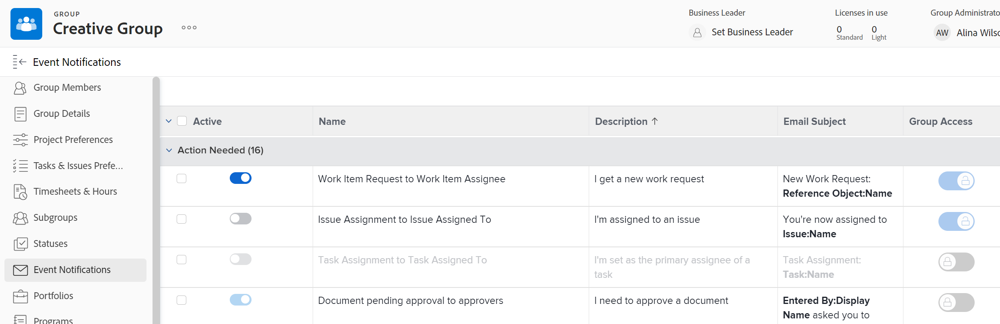

# Ver y configurar notificaciones de eventos para un grupo

Como administrador de grupos, puede ver las notificaciones de eventos activadas para un grupo que administra.

Además, si un administrador de Adobe Workfront desbloquea una notificación de evento, puede configurarla para un grupo de nivel superior que administra. La configuración de una notificación de evento consiste en activarla o desactivarla.

Un administrador de Workfront también puede hacerlo para cualquier grupo.

La configuración de una notificación de evento para un grupo afecta a los usuarios para los que dicho grupo, o uno de sus subgrupos, sea su grupo de inicio. En sus perfiles de usuario, estos usuarios ven las notificaciones de eventos activadas para su grupo principal en lugar de las notificaciones de eventos activadas en todo el sistema.

Para obtener información sobre cómo un administrador de Workfront desbloquea una notificación de evento, consulte [Desbloquear o bloquear la configuración de las notificaciones de eventos para todos los grupos](../../../administration-and-setup/manage-workfront/emails/unlock-configuration-of-event-notifications-for-groups.md).

Para obtener información sobre la configuración de notificación predeterminada para un evento, consulte [Notificaciones de eventos disponibles en Adobe Workfront](../../../administration-and-setup/manage-workfront/emails/event-notifications-available-in-wf.md).

## Requisitos de acceso

Debe tener lo siguiente para realizar los pasos de este artículo:

<table style="table-layout:auto"> 
 <col> 
 <col> 
 <tbody> 
  <tr> 
   <td role="rowheader"><a href="https://www.workfront.com/plans" target="_blank">plan de Workfront</a>*</td> 
   <td> 
Pro o superior
 </td> 
  </tr> 
  <tr> 
   <td role="rowheader"><a href="https://one.workfront.com/s/document-item?bundleId=the-new-workfront-experience&amp;topicId=Content%2FAdministration_and_Setup%2FAdd_users%2FAccess_levels_and_object_permissions%2Fwf-licenses.html&amp;_LANG=en" target="_blank">Licencia de Adobe Workfront</a>*</td> 
   <td> 
Plan 
 
Debe ser administrador de grupo del grupo o administrador de Workfront. Para obtener más información, consulte <a href="../../../administration-and-setup/manage-groups/group-roles/group-administrators.md" class="MCXref xref">Administradores de grupo</a> y <a href="../../../administration-and-setup/add-users/configure-and-grant-access/grant-a-user-full-administrative-access.md" class="MCXref xref">Conceder a un usuario acceso administrativo completo</a>.
 </td> 
  </tr> 
 </tbody> 
</table>

&#42;Si necesita saber qué plan o tipo de licencia tiene, póngase en contacto con el administrador de Workfront.

## Ver y configurar las notificaciones de eventos de un grupo

1. (Condicional y opcional) Si es administrador de Workfront y ya está en la página Notificaciones de correo electrónico (Configuración > Correo electrónico > Notificaciones), puede hacer lo siguiente y luego pasar al paso 6: Eliminar **Notificaciones de eventos del sistema** en el cuadro situado encima de la lista, empiece a escribir el nombre del grupo en el cuadro y, a continuación, haga clic en él cuando aparezca.
1. Haga clic en el **Menú principal** icono  en la esquina superior derecha de Adobe Workfront, haga clic en **Configuración** .

1. En el panel izquierdo, haga clic en **Grupos** .

1. Haga clic en el nombre del grupo de nivel superior.
1. En el menú de la izquierda, haga clic en **Notificaciones de eventos**.

   En la lista que se muestra, la variable **Activo** a la izquierda muestra qué notificaciones están activas (azul) e inactivas (gris) para el grupo.

1. Para activar o desactivar una notificación de evento desbloqueado: Haga clic en el botón de la sección <strong>Activo</strong> columna para activar  o desactivar  es así.

   >[!INFO]
   >
   >**Ejemplo:** Puede configurar las dos principales notificaciones de evento de grupo de marketing que se muestran a continuación y que se han desbloqueado para grupos.
 
 
   >* Si aparece un botón en la sección <strong>Activo</strong> la columna es gris y está atenuada , la notificación de evento está desactivada para todos los usuarios y los administradores de grupo no pueden activarla o editar su línea de asunto del correo electrónico
   >* Si aparece un botón en la sección <strong>Activo</strong> la columna es gris y no está atenuada , la notificación del evento es <strong>desactivado para todos los usuarios y</strong> los administradores del grupo pueden activarlo para sus grupos.
   >* Si aparece un botón en la sección <strong>Activo</strong> la columna es azul y atenuada , la notificación de evento se activa para todos los usuarios y los administradores de grupos no pueden desactivarla ni editar la línea de asunto de su correo electrónico para sus grupos.
   >* Si aparece un botón en la sección <strong>Activo</strong> la columna es azul y no atenuada , la notificación del evento es <strong>activada para todos los usuarios y</strong> los administradores del grupo pueden desactivarlo para sus grupos.

<!--
This step (with substeps) is for functionality from a Sprint 3 2021 story that got put on hold. Also see the PDF on the story for some text earlier in the article that needs to be added. 

1. To customize the email subject line of an event notification,
  1. Click the name of the event notification.
  1. In the <strong>Event Notification</strong> box that displays, in the <strong>Email Subject Line</strong> box, change the text and fields, including custom fields, then click <strong>Update</strong> to save the new subject lines for your emails.
  IMPORTANT: The names of the fields added must match the camel case syntax of our database structure. For more information about how our objects and their fields are named in the Workfront database, see the <a href="../../../wf-api/workfront-api.md" class="MCXref xref">Adobe Workfront API</a>.
  For more information about customizing the email subject line of an event notification, see <a href="../../../administration-and-setup/manage-workfront/emails/custom-email-subjects-event-notification.md" class="MCXref xref">Customize email subjects for event notifications</a>. 
-->

