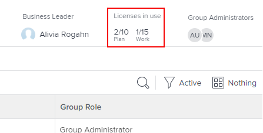

# Ver el número de licencias asignadas y utilizadas en un grupo

Como administrador de Adobe Workfront, puede ver los recuentos de los tipos individuales de licencias que se utilizan actualmente en su grupo y en sus subgrupos. Esto resulta útil cuando necesita evaluar si desea redistribuir licencias.

Si hay grupos por encima del grupo que administra, sus administradores también pueden hacerlo en su grupo. Lo mismo ocurre con los administradores de Workfront (para cualquier grupo).

>[!IMPORTANT]
>
>La licencia de un usuario se cuenta en un grupo en particular solo si el grupo es el grupo de inicio del usuario.

## Requisitos de acceso

Debe tener lo siguiente para realizar los pasos de este artículo:

<table style="table-layout:auto"> 
 <col> 
 <col> 
 <tbody> 
  <tr> 
   <td role="rowheader">plan Workfront*</td> 
   <td> 
Cualquiera
 </td> 
  </tr> 
  <tr> 
   <td role="rowheader">Licencia de Adobe Workfront*</td> 
   <td> 
Plan 
 
Debe ser administrador de grupo del grupo o de Workfront. Para obtener más información, consulte <a href="../../../administration-and-setup/manage-groups/group-roles/group-administrators.md" class="MCXref xref">Administradores de grupo</a> y <a href="../../../administration-and-setup/add-users/configure-and-grant-access/grant-a-user-full-administrative-access.md" class="MCXref xref">Conceder a un usuario acceso administrativo completo</a>.
 </td> 
  </tr> 
 </tbody> 
</table>

&#42;Si necesita saber qué plan o tipo de licencia tiene, póngase en contacto con su administrador de Workfront.

## Ver el número de licencias utilizadas en un grupo

1. Haga clic en el icono **Menú principal**  en la esquina superior derecha de Adobe Workfront y, a continuación, haga clic en **Configurar** .

1. En el panel izquierdo, haga clic en **Grupos** .

1. Haga clic en el nombre del grupo.
1. En la página que se muestra, en el área del encabezado cerca de la esquina superior derecha, vea el área de **Licencias en uso** para ver el número de licencias de **Plan** y **Trabajo** que se están usando actualmente.

   Si está viendo un grupo de nivel superior y el administrador de Workfront ha definido un número máximo de cada tipo de licencia para el grupo, también se muestran estos números. Por ejemplo, en el grupo siguiente, un máximo de 10 usuarios pueden tener una licencia de planificación y un máximo de 15 pueden tener una licencia de trabajo:

   

   Para obtener información sobre cómo un administrador de Workfront define un número máximo de licencias asignadas para un grupo, consulte la sección [Establecer el recuento máximo de licencias para un grupo de inicio](../../../administration-and-setup/get-started-wf-administration/manage-available-licenses-in-your-system.md#set) en el artículo [Administrar licencias disponibles en el sistema](../../../administration-and-setup/get-started-wf-administration/manage-available-licenses-in-your-system.md).

   >[!NOTE]
   >
   >Si el grupo que está viendo es un subgrupo, sólo puede ver el número de licencias que se están utilizando, no el número máximo de licencias asignadas para el grupo. Esto se debe a que los administradores de Workfront no definen un recuento máximo de licencias para un subgrupo.
   >
   >
   >

1. Para obtener recuentos independientes de cada tipo de licencia que se use actualmente en el grupo (incluidas Revisar y Solicitar), haga clic en el área de texto que se encuentra directamente debajo de **Licencias en uso:**

   

   El cuadro que aparece proporciona la misma información para los cuatro tipos de licencia de Workfront: Planificación, Trabajo, Revisión y Solicitud. En la parte inferior del cuadro, puede ver el número total de licencias que utilizan los miembros de este grupo o uno de sus subgrupos:

   

   En el caso de las licencias de revisión y solicitud, la columna Máx. siempre muestra Ilimitado.
