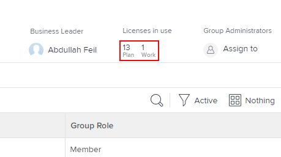

# Ver el número de licencias asignadas y utilizadas en un grupo

Como administrador de Adobe Workfront, puede ver los recuentos de los tipos individuales de licencias que se utilizan actualmente en su grupo y en sus subgrupos. Esto resulta útil cuando necesita evaluar si desea redistribuir las licencias.

Si hay algún grupo por encima del grupo que administra, sus administradores también pueden hacerlo por su grupo. Lo mismo ocurre con los administradores de Workfront (para cualquier grupo).

>[!IMPORTANT]
>
>La licencia de un usuario se cuenta en un grupo determinado solo si el grupo es el grupo en el que reside el usuario.

## Requisitos de acceso

Debe tener lo siguiente para realizar los pasos de este artículo:

<table style="table-layout:auto"> 
 <col> 
 <col> 
 <tbody> 
  <tr> 
   <td role="rowheader"><a href="https://www.workfront.com/plans" target="_blank">plan de Workfront</a>*</td> 
   <td> 
Equipo o superior
 </td> 
  </tr> 
  <tr> 
   <td role="rowheader"><a href="https://one.workfront.com/s/document-item?bundleId=the-new-workfront-experience&amp;topicId=Content%2FAdministration_and_Setup%2FAdd_users%2FAccess_levels_and_object_permissions%2Fwf-licenses.html&amp;_LANG=en" target="_blank">Licencia de Adobe Workfront</a>*</td> 
   <td> 
Plan 
 
Debe ser administrador de grupo del grupo o administrador de Workfront. Para obtener más información, consulte <a href="../../../administration-and-setup/manage-groups/group-roles/group-administrators.md" class="MCXref xref">Administradores de grupo</a> y <a href="../../../administration-and-setup/add-users/configure-and-grant-access/grant-a-user-full-administrative-access.md" class="MCXref xref">Conceder a un usuario acceso administrativo completo</a>.
 </td> 
  </tr> 
 </tbody> 
</table>

&#42;Si necesita saber qué plan o tipo de licencia tiene, póngase en contacto con el administrador de Workfront.

## Ver el número de licencias utilizadas en un grupo

1. Haga clic en el **Menú principal** icono  en la esquina superior derecha de Adobe Workfront, haga clic en **Configuración** .

1. En el panel izquierdo, haga clic en **Grupos** .

1. Haga clic en el nombre del grupo.
1. En la página que se muestra, en el área del encabezado cerca de la esquina superior derecha, vea la **Licencias en uso** para ver el número de **Plan** y **Trabajo** licencias actualmente en uso.

   Si visualiza un grupo de nivel superior y el administrador de Workfront ha definido un número máximo de cada tipo de licencia para el grupo, también se mostrarán estos números. Por ejemplo, en el grupo siguiente, un máximo de 10 usuarios pueden tener una licencia del Plan y 15 pueden tener una licencia de trabajo:

   

   Para obtener información sobre cómo define un administrador de Workfront un número máximo de licencias asignadas para un grupo, consulte la sección [Establezca el número máximo de licencias para un grupo en el hogar](../../../administration-and-setup/get-started-wf-administration/manage-available-licenses-in-your-system.md#set) en el artículo [Administre las licencias disponibles en su sistema](../../../administration-and-setup/get-started-wf-administration/manage-available-licenses-in-your-system.md).

   >[!NOTE]
   >
   >Si el grupo que está viendo es un subgrupo, solo puede ver la cantidad de licencias que se están utilizando, no el número máximo de licencias asignadas al grupo. Esto se debe a que los administradores de Workfront no definen un recuento máximo de licencias para un subgrupo.
   >
   >

1. Para obtener recuentos independientes de cada tipo de licencia utilizada actualmente en el grupo (incluidas la revisión y la solicitud), haga clic en el área de texto directamente debajo **Licencias en uso:**

   

   El cuadro que aparece proporciona la misma información para los cuatro tipos de licencia de Workfront: Planificar, Trabajar, Revisar y Solicitar. En la parte inferior del cuadro, puede ver el número total de licencias que utilizan los miembros de este grupo o uno de sus subgrupos:

   

   En el caso de las licencias de Revisión y Solicitud, la columna Máx. siempre muestra Ilimitado.
