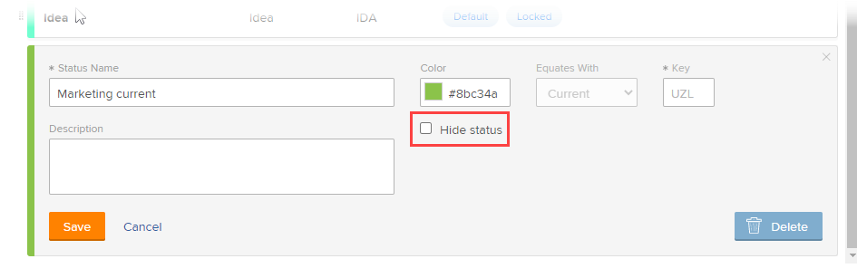

# Crear o editar un estado del grupo

Como administrador de grupos, puede crear estados personalizados para un grupo que administre. Esto ayuda a eliminar la necesidad de decenas de estados personalizados en toda la compañía y permite una mayor autonomía en las jerarquías de su grupo.

También puede editar un estado de nivel del sistema para un grupo que administre si un administrador de Workfront ha desbloqueado el estado. Para obtener más información, consulte [Estados de nivel del sistema bloqueados y desbloqueados](../../../administration-and-setup/customize-workfront/creating-custom-status-and-priority-labels/lock-or-unlock-a-custom-system-level-status.md).

Si hay grupos por encima del suyo, sus administradores también pueden hacer estas cosas por su grupo. Lo mismo ocurre con los administradores de Workfront (para cualquier grupo).

>[!NOTE]
>
>Los estados de grupos personalizados no se pueden mostrar en un proyecto cuando se visualiza el proyecto en una vista de Agile. Solo los estados de bloqueados predeterminados y personalizados están visibles al ver un proyecto en una vista de Agile. Para obtener información acerca de cómo personalizar una vista de Agile para un proyecto, consulte la sección [Crear o personalizar una vista de Agile](/help/quicksilver/reports-and-dashboards/reports/reporting-elements/create-edit-views.md#create-or-customize-an-agile-view) en el artículo [Crear o editar vistas en Adobe Workfront](/help/quicksilver/reports-and-dashboards/reports/reporting-elements/create-edit-views.md).

Para obtener información general sobre los estados, consulte [Información general sobre los estados](../../../administration-and-setup/customize-workfront/creating-custom-status-and-priority-labels/statuses-overview.md).

## Requisitos de acceso

+++ Expanda para ver los requisitos de acceso para la funcionalidad en este artículo.

<table style="table-layout:auto"> 
 <col> 
 <col> 
 <tbody> 
  <tr> 
   <td>paquete de Adobe Workfront</td> 
   <td>
Cualquiera
</td> 
  </tr> 
  <tr> 
   <td>Licencia de Adobe Workfront</td> 
   <td>
Estándar

       
Plan
</td>
  </tr>
  <tr> 
   <td>Configuraciones de nivel de acceso</td> 
   <td>Debe ser administrador de grupo del grupo o administrador del sistema.</td>
  </tr>
 </tbody> 
</table>

Para obtener más información, consulte [Requisitos de acceso en la documentación de Workfront](/help/quicksilver/administration-and-setup/add-users/access-levels-and-object-permissions/access-level-requirements-in-documentation.md).

+++

## Crear o editar un estado para un grupo

{{step-1-to-setup}}

1. En el panel izquierdo, haga clic en **Grupos** .

1. Haga clic en el nombre del grupo en el que desea crear o personalizar estados.
1. En el panel izquierdo, haga clic en **Estados**.

   Si el grupo que está visualizando es de nivel superior, la lista que se muestra incluye lo siguiente:

   * Estados bloqueados en el nivel del sistema.
   * Ya se han creado estados personalizados para el grupo.

   Además, si el grupo que está visualizando es un subgrupo, la lista también incluye lo siguiente:

   * Estados bloqueados que pertenecen a los grupos por encima del subgrupo.
   * Estados desbloqueados que pertenecían a los grupos por encima del subgrupo cuando se creó.

     Después de crear un subgrupo, los estados desbloqueados creados en los grupos por encima de él no se incluyen en la lista de estados del subgrupo. Sin embargo, si alguien bloquea uno de ellos más adelante, se incluye en la lista de estado del subgrupo. Para obtener más información, consulte [Cómo heredan los grupos los estados](../../../administration-and-setup/manage-groups/manage-group-statuses/how-groups-inherit-statuses.md).

1. Seleccione la pestaña del tipo de objeto (**Proyecto**, **Tareas** o **Problemas**) que desea asociar con el estado.

1. (Condicional) Si el estado es un estado de problema, asegúrese de que **Lista maestra** esté seleccionado.

   

   Para obtener información sobre cómo personalizar los demás tipos de problemas (Informe de errores, Solicitud de cambio, Problema, Solicitud), consulte [Personalizar tipos de problemas predeterminados](../../../administration-and-setup/set-up-workfront/configure-system-defaults/customize-default-issue-types.md).

1. (Condicional) Para crear un nuevo estado, haga clic en **Añadir nuevo estado**.

   O

   Para editar un estado existente, pasa el ratón sobre el estado que desea editar y, a continuación, haga clic en la opción **Editar** que se muestra en el extremo derecho.

   

   >[!NOTE]
   >Puede editar un estado para su grupo solo si:
   >      
   >* Administra el grupo para el que se creó el estado
   >* Un administrador de Workfront desbloqueó el estado en el sistema
   >* Un administrador de grupos de un grupo por encima de su grupo desbloqueó el estado
   >      
   >      
   >Al editar un estado existente, solo puede cambiar su nombre, descripción y color.
   >
   >Cuando edita un estado bloqueado, los cambios afectan a todos los subgrupos que heredaron el estado del grupo.
   >   
   >Por el contrario, la edición del estado de desbloqueado no afecta a los subgrupos que heredaron el estado del grupo.

1. Especifique la siguiente información.

   Si va a editar un estado, solo se pueden cambiar los 3 primeros ajustes.

   <table style="table-layout:auto"> 
    <col> 
    <col> 
    <tbody> 
     <tr> 
      <td role="rowheader">Nombre de estado</td> 
      <td> 
Escriba un nombre diferente para el estado. Este campo es obligatorio.
 
Cuando cree un nombre de estado, tenga en cuenta que otros usuarios del sistema pueden crear un estado con el mismo nombre. Recomendamos utilizar un nombre único para evitar confusiones a la hora de seleccionar estados en Workfront.

Si existen estados duplicados, el administrador de grupos debe actualizar los nombres para diferenciarlos. El único indicador de unicidad del sistema es la clave de estado.
 </td> 
     </tr> 
     <tr> 
      <td role="rowheader">Descripción</td> 
      <td>(Opcional) Escriba una descripción del estado. Esto comunica su finalidad a quienes lo utilizan.</td> 
     </tr> 
     <tr> 
      <td role="rowheader">Color</td> 
      <td> 
Personalice el color del estado haciendo clic en el campo de color y seleccionando un color en el panel de muestras. También puede introducir un número hexadecimal en el campo.
 
El color del estado se muestra en la esquina superior derecha de Workfront cuando un usuario ve el objeto.
 
  
 </td> 
     </tr> 
     <tr> 
      <td role="rowheader">Igual que</td> 
      <td> 
Seleccione una de las opciones de la lista que mejor describa la función del estado. Por ejemplo, si el nombre del estado es Listo, la opción con la que se equipara debe ser Completo.
 
Cada estado debe coincidir con una de estas opciones, ya que esto determina cómo funciona el estado.
 
Esta opción no se puede modificar una vez creado el estado.
 </td> 
     </tr> 
     <tr> 
      <td role="rowheader">Clave</td> 
      <td> 
Si va a crear un nuevo estado, escriba un código o una abreviatura para el estado o utilice el que se ha generado. Esta clave debe ser única en Workfront, ya que puede utilizarse para la creación de informes. Si intenta especificar una clave que ya está en uso en el sistema, el campo se vuelve rojo.
 
Podría resultarle útil utilizar una abreviatura que sea reconocible para quienes la utilicen.
 
Esta opción no se puede modificar una vez creado el estado.
 
No se puede cambiar el código de clave de los estados Planificación, Actual y Completo. Esto es importante si está creando un informe en modo de texto.
 </td> 
     </tr> 
     <tr> 
      <td role="rowheader">Ocultar estado</td> 
      <td> 
(Solo estados de proyecto y tarea)
 
Habilite esta opción si desea que el estado se oculte a los usuarios. Cuando está desactivada (la configuración predeterminada), todos los subgrupos por debajo del grupo pueden utilizar el estado.
 
Sugerencia: para ocultar el estado de un problema, desactive los cuatro tipos de problemas (Informe de errores, Solicitud de cambio, Problema, Solicitud).
 </td> 
     </tr> 
     <tr> 
      <td role="rowheader">Bloquear para todos los grupos</td> 
      <td> 
       
Si deja esta opción habilitada, los usuarios del grupo y sus subgrupos podrán ver y utilizar el estado, y los administradores de grupos no podrán personalizarlo para los subgrupos inferiores.
 
       
Cuando esta opción está desactivada, los administradores de grupos pueden personalizar el estado de los subgrupos inferiores.
 
       
<b>NOTA</b>: Puede usar tanto los estados bloqueado como desbloqueado en un proceso de aprobación de grupo. Si crea un proceso de aprobación de grupo con un estado de grupo desbloqueado, los usuarios pueden adjuntar el proceso de aprobación a cualquier proyecto, tarea o problema asociado al grupo.
 
       
Para obtener más información sobre los estados de bloqueo, consulte <a href="../../../administration-and-setup/manage-groups/manage-group-statuses/lock-or-unlock-a-custom-group-status.md" class="MCXref xref">Estados de grupos bloqueados y desbloqueados</a>.
 
       </td> 
     </tr>
    </tbody> 
   </table>

1. Haga clic en **Guardar**.

   El estado ya está disponible para todos los proyectos asociados a su grupo o subgrupo. Si lo ha bloqueado, está disponible para su uso en los subgrupos inferiores.

   Puede configurar el estado para que sea un estado predeterminado para el grupo. Para obtener más información, consulte [Utilizar un estado personalizado como estado predeterminado para un grupo](../../../administration-and-setup/manage-groups/manage-group-statuses/use-custom-statuses-as-default-statuses-group.md).

## Crear un estado personalizado para varios grupos

Si es administrador de Workfront, puede crear un estado personalizado para varios grupos, creando un estado para todo el sistema y ocultando ese estado a los grupos que no lo necesiten.

Si es administrador de grupos (o de Workfront), puede crear un estado personalizado para varios subgrupos dentro de una jerarquía de grupo que administre, creando un estado para un grupo de nivel superior y ocultando ese estado a cualquier subgrupo inferior que no lo necesite.

1. Si es administrador de Workfront, cree un estado desbloqueado en todo el sistema tal como se describe en [Crear o editar un estado](../../../administration-and-setup/customize-workfront/creating-custom-status-and-priority-labels/create-or-edit-a-status.md).
1. En el cuadro de la esquina superior derecha, elimine **Estados del sistema**, empiece a escribir el nombre del grupo donde desea ocultar el estado y, a continuación, haga clic en el nombre cuando aparezca.
1. Pase el puntero por encima del estado que quiera ocultar al grupo y luego haga clic en **Editar** cuando aparezca.

   

1. Habilite la opción **Ocultar estado** que aparece.

   

1. Haga clic en **Guardar**.

   El estado aparece atenuado y ya no será visible para todos los usuarios de ese grupo.

1. Repita los pasos 3 al 5 para ocultar el estado personalizado a cualquier otro grupo que no lo necesite.

