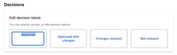

# Configuración de los ajustes de prueba predeterminados

Esta configuración le permite establecer valores predeterminados que se aplican a todas las pruebas nuevas creadas por los usuarios. Sin embargo, los usuarios pueden anular la mayoría de estas configuraciones al crear una prueba.

## Configurar nuevas configuraciones predeterminadas de prueba

1. Haga clic en el **Menú principal** icono  en la esquina superior derecha de Adobe Workfront, haga clic en **Configuración**.
1. En el panel izquierdo, haga clic en **Pruebas** > **Configuración de prueba**.
1. En el **Nuevos valores predeterminados de prueba** , configure las siguientes opciones:

   <table style="table-layout:auto"> 
    <col> 
    <col> 
    <tbody> 
     <tr> 
      <td role="rowheader" colspan="2"><b>Destinatarios</b></td> 
     </tr> 
     <tr> 
      <td role="rowheader">Inicio de sesión obligatorio</td> 
      <td> 
Los revisores deben iniciar sesión con su correo electrónico y contraseña antes de poder ver las pruebas creadas en la cuenta de su organización. Cuando está habilitada, los usuarios no pueden compartir la prueba con los revisores invitados.
 
<b>IMPORTANTE</b>: Cuando se habilita, se requiere inicio de sesión para todas las pruebas recién creadas.
 </td> 
     </tr> 
     <tr> 
      <td role="rowheader">Copiar propietario de la prueba original para las nuevas versiones</td> 
      <td> 
El propietario de la primera versión y de una prueba también es el propietario de todas las versiones consecutivas de la prueba, independientemente de quién cree estas versiones. Esta configuración está habilitada de forma predeterminada.
 </td> 
     </tr> 
     <tr> 
      <td role="rowheader">Permite a los usuarios eliminar los comentarios sobre las pruebas</td> 
      <td>Los usuarios pueden eliminar sus propios comentarios. Esta configuración está habilitada de forma predeterminada.</td> 
     </tr> 
     <tr> 
      <td role="rowheader">Requerir que las decisiones se firmen electrónicamente </td> 
      <td> 
Los responsables de la toma de decisiones deben introducir sus credenciales de inicio de sesión de Workfront cuando toman una decisión sobre una prueba.
 
<b>IMPORTANTE</b>: Cuando está habilitada, los usuarios no pueden compartir la prueba con revisores invitados que no tengan credenciales de inicio de sesión.
 </td> 
     </tr> 
     <tr> 
      <td role="rowheader" colspan="2"><b>Fecha límite</b></td> 
     </tr> 
     <tr> 
      <td role="rowheader">Establecer la fecha límite predeterminada</td> 
      <td> 
El sistema aplica esta fecha límite a todas las pruebas nuevas de la cuenta que no tengan un flujo de trabajo automatizado.
 </td> 
     </tr> 
     <tr> 
      <td role="rowheader">Notificar a los destinatarios antes de que la prueba esté en riesgo</td> 
      <td>Los destinatarios se notifican por correo electrónico antes de que la prueba se considere en riesgo según la fecha límite especificada arriba.</td> 
     </tr> 
     <tr> 
      <td role="rowheader" colspan="2"><b>Notificaciones por correo electrónico</b></td> 
     </tr> 
     <tr> 
      <td role="rowheader">Informar a los destinatarios cuando se les añada a una prueba</td> 
      <td>Se notifica a los destinatarios por correo electrónico cuando se añaden a una prueba.</td> 
     </tr> 
    </tbody> 
   </table>

1. Haga clic en **Guardar**.

## Configuración de las decisiones de prueba

Los usuarios pueden utilizar decisiones de prueba para indicar el estado de la prueba después de la revisión.

>[!NOTE]
>
>La lógica detrás de las decisiones de prueba se utiliza para calcular el estado general de un flujo de trabajo de prueba si hay varias decisiones de varios niveles. Las decisiones &quot;Aprobado&quot; y &quot;Aprobado con cambios&quot; déclencheur la siguiente etapa en un flujo de trabajo automático.

Para configurar las decisiones de prueba:

1. Haga clic en el **Menú principal** icono  en la esquina superior derecha de Adobe Workfront, haga clic en **Configuración**.
1. En el panel izquierdo, haga clic en **Pruebas** > **Configuración de prueba**.
1. En el **Decisiones**, puede

   1. **Cambiar el nombre de la decisión**: Haga clic en el texto dentro del cuadro de decisión y empiece a escribir la nueva etiqueta de decisión.

      >[!TIP]
      >
      >Mantenga la lógica de una decisión cuando le cambie el nombre. Por ejemplo, la decisión predeterminada Rechazada podría cambiarse a *Se requiere una nueva versión*, pero no debe cambiarse a *Enviar a impresoras*.

      

   1. **Reorganizar la orden de decisión**: Arrastre los cuadros de decisión en el orden en que desee que aparezcan en el visor de pruebas.

      

   1. **Ocultar una decisión**: Pase el ratón sobre el cuadro de decisión y haga clic en el icono Ocultar en la esquina superior derecha.

      

1. (Opcional) Para volver a los valores predeterminados de Workfront, haga clic en **Restaurar valores predeterminados**.
1. Haga clic en **Guardar**.
