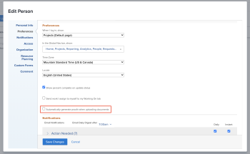

# Configurar si las pruebas se generan automáticamente

Se puede configurar si el sistema genera automáticamente las pruebas cuando los usuarios que especifique añadan documentos a Workfront. Esta opción está desactivada de forma predeterminada.

## Requisitos de acceso

Debe tener lo siguiente:

<table style="table-layout:auto"> 
 <col> 
 <col> 
 <tbody> 
  <tr> 
   <td role="rowheader"><a href="https://business.adobe.com/products/workfront/pricing.html" target="_blank">Plan de Adobe Workfront</a> </td> 
   <td>Cualquiera</td> 
  </tr> 
  <tr> 
   <td role="rowheader"><a href="../../../administration-and-setup/add-users/access-levels-and-object-permissions/wf-licenses.md" class="MCXref xref">Información general sobre licencias</a>*</td> 
   <td>Plan</td> 
  </tr> 
  <tr> 
   <td role="rowheader">Configuraciones de acceso</td> 
   <td> 
Debe ser administrador de Workfront. Para obtener información sobre los administradores de Workfront, consulte <a href="../../../administration-and-setup/add-users/configure-and-grant-access/grant-a-user-full-administrative-access.md" class="MCXref xref">Conceder a un usuario acceso administrativo completo</a>.
 </td> 
  </tr> 
 </tbody> 
</table>

&#42;Para saber qué plan, tipo de licencia o acceso tiene, póngase en contacto con su administrador de Workfront.

## Configurar si las pruebas se generan automáticamente para un solo usuario

1. Haga clic en el icono **Menú principal**  en la esquina superior derecha de Adobe Workfront, luego haga clic en **Usuarios** .
1. Seleccione un usuario con acceso a la revisión y luego haga clic en **Editar**.
1. En la sección **Preferencias**, habilite o deshabilite la casilla de verificación **Generar revisiones automáticamente al subir documentos**.

   

1. Haga clic en **Guardar cambios**.

## Configure si las pruebas se generan automáticamente para varios usuarios

1. Haga clic en el icono **Menú principal**  en la esquina superior derecha de Adobe Workfront, luego haga clic en **Usuarios** .
1. Seleccione usuarios con acceso a la revisión y luego haga clic en **Editar**.

   >[!IMPORTANT]
   >
   >Si ningún usuario tiene acceso de revisión, no aparece la opción Generar revisiones automáticamente al subir documentos.

1. En la sección **Preferencias**, habilite **Generar revisiones automáticamente al subir documentos** y, a continuación, seleccione **Sí** o **No**.

   

1. Haga clic en **Guardar cambios**.

