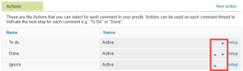

# Configurar opciones de revisión para su organización

Como administrador de Adobe Workfront o de Workfront Proof, puede personalizar la configuración de revisión predeterminada para su organización. Esta configuración incluye opciones de uso compartido predeterminadas, personalización de marca y mucho más.

## Requisitos de acceso

+++ Expanda para ver los requisitos de acceso para la funcionalidad en este artículo.

Debe tener lo siguiente:

<table style="table-layout:auto"> 
 <col> 
 <col> 
 <tbody> 
  <tr> 
   <td role="rowheader">Plan de Adobe Workfront*</td> 
   <td> 
Plan actual: pro o superior
 
o
 
Plan heredado: Premium o Select
 
Para obtener más información sobre el acceso de revisión con los diferentes planes, consulte <a href="../../../administration-and-setup/manage-workfront/configure-proofing/access-to-proofing-functionality.md" class="MCXref xref">Acceso a la funcionalidad de revisión en Workfront</a>.
 </td> 
  </tr> 
  <tr> 
   <td role="rowheader">Licencia de Adobe Workfront*</td> 
   <td> 
Plan actual: trabajo o plan
 
Plan heredado: cualquiera (debe tener la revisión habilitada para el usuario)
 </td> 
  </tr> 
  <tr> 
   <td role="rowheader">Configuraciones de nivel de acceso*</td> 
   <td> 
Debe haber seleccionado Administrador en el perfil de permisos de prueba. Para obtener más información, consulte <a href="../../../administration-and-setup/manage-workfront/configure-proofing/configure-a-users-proofing-access.md" class="MCXref xref">Configurar el acceso de revisión de un usuario</a>.
 </td> 
  </tr> 
 </tbody> 
</table>

&#42;Para saber qué plan, tipo de licencia o acceso tiene, póngase en contacto con el administrador de Workfront.

+++

## Configuración de acciones

Para obtener información acerca del uso de acciones en el visor de corrección, consulte [Utilizar acciones en comentarios de revisión](../../../review-and-approve-work/proofing/reviewing-proofs-within-workfront/comment-on-a-proof/use-actions-on-comments-in-viewer.md).

Puede configurar acciones para su organización de las siguientes maneras:

* [Añadir o cambiar el nombre de una acción](#add-or-rename-an-action)
* [Desactivar o reactivar una acción](#deactivate-or-reactivate-an-action)
* [Reordenar acciones](#reorder-actions)

### Añadir o cambiar el nombre de una acción {#add-or-rename-an-action}

{{step1-to-proofing}}

1. Haga clic en **Configuración** > **Configuración de la cuenta** en la esquina superior derecha de la interfaz de Workfront Proof y, a continuación, haga clic en la pestaña **Configuración**.

1. Realice una de las siguientes acciones:

   * Para crear una acción nueva, en la sección **Acciones**, haga clic en **Nueva acción**.

     No hay límite en la cantidad de acciones que puede configurar en su cuenta.

   * Para cambiar el nombre de una acción existente, haga clic en **Configuración** junto a la acción.

1. Escriba un nombre para la acción y haga clic en **Guardar**.
1. Haga clic en **Guardar.**.

### Desactivar o reactivar una acción {#deactivate-or-reactivate-an-action}

{{step1-to-proofing}}

1. Haga clic en **Configuración** > **Configuración de la cuenta** en la esquina superior derecha de la interfaz de Workfront Proof y, a continuación, haga clic en la pestaña **Configuración**.

1. Haga clic en **Configuración** junto a la acción que desee desactivar o reactivar.
1. Seleccione **Activar** o **Desactivar** y, a continuación, haga clic en **Guardar**.

### Reordenar acciones {#reorder-actions}

{{step1-to-proofing}}

1. Haga clic en **Configuración** > **Configuración de la cuenta** en la esquina superior derecha de la interfaz de Workfront Proof y, a continuación, haga clic en la pestaña **Configuración**.

1. Haga clic en las flechas azules arriba y abajo junto a **Configuración** para reordenar las acciones.

   

## Configuración de dispositivos personalizados para pruebas

Puede añadir cualquier dispositivo personalizado al sistema, lo que permite a los usuarios revisar el contenido interactivo y simular cómo aparece el contenido en un dispositivo específico.

Para obtener información sobre cómo los usuarios pueden seleccionar dispositivos al revisar el contenido interactivo, consulte [Cambiar la resolución de revisión interactiva en el visor de corrección](../../../review-and-approve-work/proofing/reviewing-proofs-within-workfront/review-a-proof/view-interactive-content-as-it-appears-in-device.md)

Para añadir un dispositivo personalizado:

{{step1-to-proofing}}

1. Haga clic en **Configuración** > **Configuración de la cuenta** en la esquina superior derecha de la interfaz de Workfront Proof y, a continuación, haga clic en la pestaña **Configuración**.

1. En la sección **Dispositivos personalizados para pruebas**, haga clic en **Añadir nuevo dispositivo**.

1. En el cuadro **Añadir nuevo dispositivo** que aparece, especifique la siguiente información:

   <table style="table-layout:auto"> 
    <col> 
    <col> 
    <tbody> 
     <tr> 
      <td role="rowheader">Nombre</td> 
      <td>El nombre que ven los usuarios al seleccionar el dispositivo en el visor de corrección de escritorio, según la descripción de <a href="../../../review-and-approve-work/proofing/reviewing-proofs-within-workfront/review-a-proof/view-interactive-content-as-it-appears-in-device.md" class="MCXref xref">Cambiar la resolución de revisión interactiva en el visor de corrección</a>.</td> 
     </tr> 
     <tr> 
      <td role="rowheader">Dimensiones</td> 
      <td>Especifique las dimensiones que desea utilizar para este dispositivo. Los usuarios ven las dimensiones que se muestran debajo del nombre del dispositivo.</td> 
     </tr> 
     <tr> 
      <td role="rowheader">Proporción</td> 
      <td>Especifique la proporción del dispositivo.</td> 
     </tr> 
     <tr> 
      <td role="rowheader">Tipo</td> 
      <td>Seleccione si el dispositivo es un móvil, una tableta o escritorio.</td> 
     </tr> 
     <tr> 
      <td role="rowheader">Cadena del agente de usuario</td> 
      <td>Introduzca el agente de usuario del dispositivo para proporcionar información que haga que el software se ejecute y muestre según lo diseñado para el dispositivo.
Para obtener el agente de usuario acceda a <a href="https://www.whatismybrowser.com/detect/what-is-my-user-agent">https://www.whatismybrowser.com/detect/what-is-my-user-agent</a> desde el dispositivo.
</td> 
     </tr> 
     <tr> 
      <td role="rowheader">Deshabilitado</td> 
      <td>Si se selecciona esta opción, el dispositivo no estará disponible para que los usuarios lo seleccionen cuando revisen pruebas interactivas.</td> 
     </tr> 
    </tbody> 
   </table>

1. Haga clic en **Crear**.

## Configuración de mensajes emergentes para pruebas

Puede configurar mensajes emergentes en las pruebas para comunicar información general a todos los revisores de su organización.

Puede configurar los mensajes para que aparezcan en las siguientes situaciones:

* **Mensaje al cargar**: se muestra cuando se abre por primera vez la prueba. Es útil para explicar a los usuarios cómo revisar una prueba o proporcionar un descargo de responsabilidad u otro texto legal.
* **Mensaje al tomar una decisión**: se muestra cuando un usuario selecciona una decisión sobre una prueba. Es útil para proporcionar a los usuarios listas de comprobación para tareas como el cumplimiento de la marca o la normativa. Para obtener información sobre las decisiones, consulte [Tomar una decisión sobre una revisión en el visor de corrección](../../../review-and-approve-work/proofing/reviewing-proofs-within-workfront/make-a-decision-on-a-proof/make-decisions-on-proof.md).

* **Texto del botón de confirmación**: la etiqueta que aparece en el botón del mensaje emergente al cargar que se explica más arriba.

Para crear mensajes emergentes para las pruebas:

1. Haga clic en **Editar** a la derecha del mensaje que desea personalizar.
1. Especifique un mensaje, incluya el formato adecuado y luego haga clic en **Guardar**.
1. (Opcional) Si personalizó el mensaje al cargar y también desea personalizar la etiqueta del botón de confirmación, haga clic en **Editar** a la derecha del **texto del botón de confirmación**, especifique una etiqueta y, a continuación, haga clic en **Guardar**.

## Configuración de valores predeterminados de la prueba

Para obtener información sobre la configuración de los valores predeterminados de la prueba para su organización, consulte [Configuración de valores predeterminados de la prueba](../../../administration-and-setup/manage-workfront/configure-proofing/configure-default-proof-settings.md).

## Configuración de valores predeterminados de uso compartido

Puede especificar con quién se pueden compartir las pruebas de su organización, qué versiones están disponibles para los revisores y cuándo las pruebas con un flujo de trabajo automatizado son visibles para los usuarios asociados a una fase determinada.

Para obtener información más detallada sobre la configuración de uso compartido en Workfront Proof, consulte [Configurar opciones de uso compartido para los usuarios](../../../administration-and-setup/manage-workfront/configure-proofing/configure-sharing-settings-users.md).

## Personalización de la marca en el sitio de Workfront Proof

Si utiliza Workfront Proof, puede configurar la personalización de marca en las siguientes áreas del sitio:

* La página de bienvenida que se muestra cuando se carga la prueba
* Pantallas de inicio y cierre de sesión
* Notificaciones por correo electrónico

Para obtener información detallada sobre cómo personalizar la marca del sitio de Workfront Proof, consulte [Personalización de la marca en el sitio de Workfront Proof](../../../workfront-proof/wp-acct-admin/branding/brand-wp-site.md).

## Configuración avanzada de contraseña

>[!IMPORTANT]
>
>Esta opción solo está disponible para planes Workfront heredados. Si está en un plan Pro, Business o para empresas de Workfront, ya no puede establecer las opciones avanzadas de contraseña.

En **Configuración avanzada de contraseña**, puede mejorar la seguridad de las contraseñas de los usuarios.

1. Haga clic en **Configuración** a la derecha de la opción que desee configurar:

   <table style="table-layout:auto"> 
    <col> 
    <col> 
    <tbody> 
     <tr> 
      <td role="rowheader">Longitud mínima de contraseña</td> 
      <td>La longitud predeterminada de la contraseña de Workfront Proof es de seis caracteres. Es posible que desee aumentar el número, según las políticas de su organización.</td> 
     </tr> 
     <tr> 
      <td role="rowheader"><strong>Combinación de caracteres</strong> </td> 
      <td>Puede obligar a los usuarios a utilizar una combinación de minúsculas, mayúsculas, números y símbolos en sus contraseñas. Elija cuántos caracteres debe contener la contraseña.</td> 
     </tr> 
     <tr> 
      <td role="rowheader"><strong>Máxima repetición de caracteres</strong> </td> 
      <td>Puede especificar cuántos caracteres se pueden repetir en la contraseña de cada usuario.</td> 
     </tr> 
     <tr> 
      <td role="rowheader">Vencimiento automático de contraseña</td> 
      <td>Obliga a los usuarios a cambiar la contraseña con regularidad. Elija con qué frecuencia lo harán.</td> 
     </tr> 
     <tr> 
      <td role="rowheader"><strong>Número de repeticiones de contraseña no permitidas</strong> </td> 
      <td>Configure el número de repeticiones de contraseña no permitidas en la cuenta.</td> 
     </tr> 
     <tr> 
      <td role="rowheader"><strong>Bloqueo de perfil</strong> </td> 
      <td>Bloquea a los usuarios de la cuenta después de una serie de intentos de inicio de sesión erróneos que especifique. También puede especificar cuánto tiempo deben esperar antes de que puedan acceder a su cuenta de nuevo.</td> 
     </tr> 
     <tr> 
      <td role="rowheader">Bloquear usuario si la contraseña no se restablece después de 30 días</td> 
      <td>Si el usuario no cambia la contraseña inicial en un plazo de 30 días a partir de la activación de su perfil, se le bloquea la cuenta. 
Los administradores de cuentas pueden desbloquear (reactivar) a los usuarios que el sistema bloquee automáticamente. Esto les dará siete días adicionales para cambiar la contraseña.
</td> 
     </tr> 
     <tr> 
      <td role="rowheader">Bloquear cuenta de usuario si está inactiva durante 120 días</td> 
      <td>Si el usuario no inicia sesión en Workfront Proof o en una prueba que requiera inicio de sesión durante 120 días, se le bloquea la cuenta.</td> 
     </tr> 
     <tr> 
      <td role="rowheader"><strong>Cambiar contraseña después del primer inicio de sesión</strong> </td> 
      <td>Requiere que los usuarios cambien la contraseña temporal después de iniciar sesión por primera vez.
Los administradores de cuentas pueden desbloquear (reactivar) a los usuarios que el sistema haya bloqueado automáticamente.

Para obtener más información sobre las contraseñas, consulte <a href="../../../workfront-proof/wp-getstarted/faqs/log-in-change-password.md" class="MCXref xref">Inicio de sesión y cambio de la contraseña y el correo electrónico para Workfront Proof</a>.
</td> 
     </tr> 
    </tbody> 
   </table>
