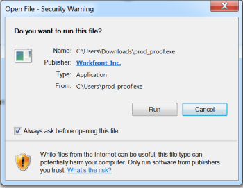

# Instalación del Visor de corrección de escritorio para su organización

<!--Audited: 05/2024-->

El Visor de corrección de escritorio, diseñado principalmente para revisar contenido interactivo, es una aplicación que debe instalarse en el equipo local de cada usuario. Como administrador de Adobe Workfront o de Workfront Proof, puede realizar esta instalación.

## Requisitos de acceso

+++ Expanda para ver los requisitos de acceso para la funcionalidad en este artículo.

Debe tener el siguiente acceso para realizar los pasos de este artículo:

<table style="table-layout:auto">
 <col> 
 <col> 
 <tbody> 
  <tr> 
   <td role="rowheader">Plan de Adobe Workfront</td> 
   <td> 
Plan actual: pro o superior
 
o
 
Plan heredado: Premium o Select
 
Para obtener más información sobre el acceso de revisión con los diferentes planes, consulte <a href="../../../administration-and-setup/manage-workfront/configure-proofing/access-to-proofing-functionality.md" class="MCXref xref">Acceso a la funcionalidad de revisión en Workfront</a>.
 </td> 
  </tr> 
  <tr> 
   <td role="rowheader">Licencia de Adobe Workfront</td> 
   <td> 
Plan actual: trabajo o plan
 
Plan heredado: cualquiera (debe tener la revisión habilitada para el usuario)
 </td> 
  </tr> 
  <tr> 
   <td role="rowheader">Configuraciones de nivel de acceso</td> 
   <td> 
Debe haber seleccionado Administrador en el perfil de permisos de prueba. Para obtener más información, consulte <a href="../../../administration-and-setup/manage-workfront/configure-proofing/configure-a-users-proofing-access.md" class="MCXref xref">Configurar el acceso de revisión de un usuario</a>.
 </td> 
  </tr> 
 </tbody> 
</table>

Para obtener más información sobre el contenido de esta tabla, consulte [Requisitos de acceso en la documentación de Workfront](/help/quicksilver/administration-and-setup/add-users/access-levels-and-object-permissions/access-level-requirements-in-documentation.md).

+++

## Requisitos del sistema

El Visor de corrección de escritorio es compatible con los siguientes sistemas operativos:

* Windows 7 y versiones posteriores, 32 y 64 bits
* Mac OS X 10.9 y versiones posteriores, 64 bits

## Requisitos previos

Para permitir que los usuarios usen el Visor de corrección de escritorio, debe configurar el sistema para iniciar el Visor de corrección de escritorio como la vista predeterminada para las revisiones interactivas antes de la instalación.

## Configure el Visor de corrección de escritorio como predeterminado para las revisiones interactivas

Después de instalar el Visor de corrección de escritorio para su organización, puede establecerlo como el visor predeterminado para las revisiones interactivas.

{{step1-to-proofing}}

1. Haga clic en **Configuración de la cuenta** cerca de la esquina superior derecha de Workfront Proof y, a continuación, haga clic en la pestaña **Configuración**.

1. En **Valores predeterminados de la prueba**, al final de la fila **Visor de corrección de escritorio para revisión interactiva**, haga clic en **Configuración**.

   

1. Haga clic en **Habilitado y predeterminado**, luego haga clic en **Guardar**.

## Instalación del Visor de corrección de escritorio para sus usuarios

* [Instalación del Visor de corrección de escritorio en Mac](#installing-the-desktop-proofing-viewer-on-mac)
* [Instalación del Visor de corrección de escritorio en Windows](#installing-the-desktop-proofing-viewer-on-windows)

### Instalación del Visor de corrección de escritorio en Mac {#installing-the-desktop-proofing-viewer-on-mac}

1. En el equipo del usuario, realice una de las siguientes acciones para descargar la aplicación:

   * Si está utilizando el entorno de producción, haga clic en [Descarga de producción de Mac para el Visor de corrección de escritorio](https://assets.proofhq.com/nativeviewer/desktop_viewer/Workfront+Proof-2.1.19.pkg).
   * Si está utilizando el entorno de vista previa, haga clic en [Descarga de vista previa de Mac para el Visor de corrección de escritorio](https://assets.preview.proofhq.com/nativeviewer/desktop_viewer/Workfront+Proof+Preview-2.1.19.pkg).

1. Abra el archivo que acaba de descargar para iniciar la instalación.
1. En el cuadro de instalación que aparece, haga clic en **Continuar** y, a continuación, en **Instalar**.

   

1. Asegúrese de que cada usuario complete la instalación abriendo una prueba interactiva desde el área Documentos de Workfront.

### Instalación del Visor de corrección de escritorio en Windows {#installing-the-desktop-proofing-viewer-on-windows}

1. En el equipo del usuario, realice una de las siguientes acciones para descargar la aplicación:

   * En el entorno de producción, haga clic en [Descarga de producción de Windows para el Visor de corrección de escritorio.](https://assets.proofhq.com/nativeviewer/desktop_viewer/Workfront+Proof+Setup+2.1.19.exe)
   * En el entorno de vista previa, haga clic en [Descarga de vista previa de Windows para el visor de corrección de escritorio](https://assets.preview.proofhq.com/nativeviewer/desktop_viewer/Workfront+Proof+Preview+Setup+2.1.19.exe).

1. Abra el archivo que acaba de descargar para iniciar la instalación.
1. En el cuadro de advertencia de seguridad que aparece, haga clic en **Ejecutar**.

   

   El visor de corrección de escritorio se instalará y ejecutará.

1. (Condicional) Si instala la aplicación mediante Internet Explorer, actualice la página de inicio en el explorador después de que se instale la aplicación.
1. Asegúrese de que cada usuario complete la instalación abriendo una prueba interactiva desde el área Documentos de Workfront.
