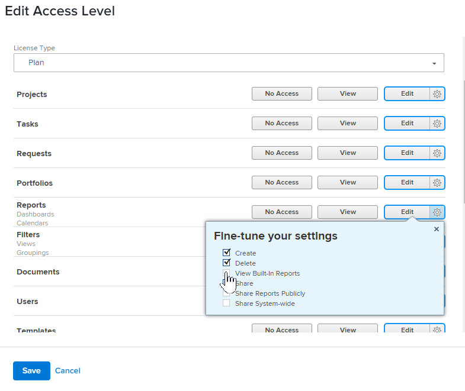

# Ocultar informes integrados

Adobe Workfront tiene una extensa lista de informes integrados predeterminados a los que los usuarios pueden acceder y ver. Como administrador de Workfront, puede modificar el nivel de acceso de un usuario para ocultar los informes integrados de modo que los usuarios no tengan acceso a ellos.

## Requisitos de acceso

+++ Expanda para ver los requisitos de acceso para la funcionalidad en este artículo.

<table style="table-layout:auto"> 
 <col> 
 <col> 
 <tbody> 
  <tr> 
   <td role="rowheader">Paquete de Adobe Workfront</td> 
   <td>Cualquiera</td> 
  </tr> 
  <tr> 
  <tr> 
   <td role="rowheader">Licencia de Adobe Workfront</td> 
   <td>
Estándar

       
Plan
</td>
  </tr> 
  </tr> 
  <tr> 
   <td role="rowheader">Configuraciones de nivel de acceso</td> 
   <td>Administrador del sistema</td>
  </tr> 
 </tbody> 
</table>

Para obtener más información sobre el contenido de esta tabla, consulte [Requisitos de acceso en la documentación de Workfront](/help/quicksilver/administration-and-setup/add-users/access-levels-and-object-permissions/access-level-requirements-in-documentation.md).

+++

## Ocultar informes integrados

{{step-1-to-setup}}

1. Haga clic en **Niveles de acceso**.
1. Seleccione el nivel de acceso para el cual desea ocultar los informes integrados y luego haga clic en **Editar**.
1. Para el objeto **Informes**, haga clic en el icono **Configuración** junto al nivel de acceso más alto disponible y, a continuación, anule la selección de **Ver informes integrados**.

   

1. Haga clic en **Guardar**.
