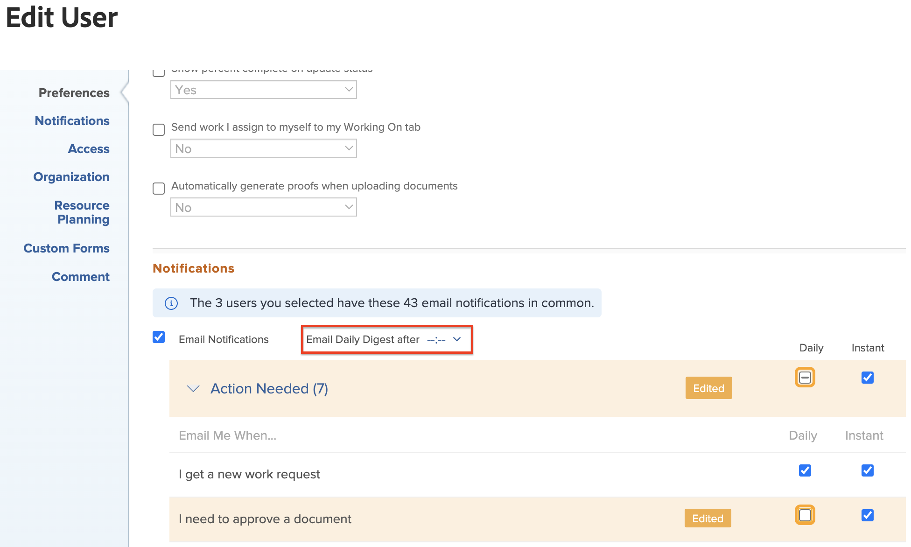

# Modificar la configuración de notificaciones por correo electrónico de varios usuarios

<!-- Audited: 12/2023 -->

Si es administrador de Adobe Workfront o tiene un nivel de acceso de Planificador que le permite editar la configuración de otros usuarios, puede definir la configuración de notificaciones para varios usuarios a la vez. Esto incluye especificar si los usuarios recibirán notificaciones cuando ocurran eventos o en un correo electrónico de resumen diario, tal como se describe en [notificaciones de Adobe Workfront](../../../workfront-basics/using-notifications/wf-notifications.md). Para obtener más información sobre el nivel de acceso necesario para editar usuarios, consulte [Conceder acceso a usuarios](../../../administration-and-setup/add-users/configure-and-grant-access/grant-access-other-users.md).

También puede configurar las notificaciones por correo electrónico para un usuario, incluido su propio perfil. Para obtener más información, consulte [Modificar sus propias notificaciones por correo electrónico](../../../workfront-basics/using-notifications/activate-or-deactivate-your-own-event-notifications.md).

## Requisitos de acceso

+++ Expanda para ver los requisitos de acceso para la funcionalidad en este artículo.

Debe tener el siguiente acceso para realizar los pasos de este artículo:

<table style="table-layout:auto"> 
 <col> 
 <col> 
 <tbody> 
  <tr> 
   <td role="rowheader">Plan de Adobe Workfront</td> 
   <td>Cualquiera</td> 
  </tr> 
  <tr> 
   <td role="rowheader">Licencia de Adobe Workfront</td> 
   <td> 
Nuevo plan: Standard 

 
o
 

Plan actual: Plan 
 
</td> 
  </tr> 
 </tbody> 
</table>

Para obtener más información sobre esta tabla, consulte [Requisitos de acceso en la documentación de Workfront](/help/quicksilver/administration-and-setup/add-users/access-levels-and-object-permissions/access-level-requirements-in-documentation.md).

+++

## Modificar la configuración de notificaciones por correo electrónico para varios usuarios

Cuando establece la configuración de las notificaciones por lote, únicamente puede cambiar la configuración que los usuarios seleccionados tienen en común.

Cuando modifica una configuración de notificación, aparece la etiqueta **Editada** para esa configuración de notificación para informarle de que esa configuración de notificación se ha modificado.

Para modificar la configuración de las notificaciones por correo electrónico para varios usuarios:

{{step-1-to-users}}

1. Seleccione los usuarios y haga clic en **Editar**.
1. En el cuadro **Editar persona** que aparece, haga clic en **Notificaciones**.

1. Expanda una categoría para ver la configuración de notificaciones relacionada con esa categoría.

   Si hay al menos un usuario seleccionado en el que las notificaciones no coinciden con las notificaciones de los demás usuarios seleccionados, la casilla de verificación de categoría de esa notificación contiene una línea horizontal .

1. Haga clic en cualquier notificación que desee que los usuarios reciban diaria o instantáneamente, o borre las notificaciones que desea que dejen de recibir.

   >[!NOTE]
   >
   >   Para la categoría **Comunicación**, puede seleccionar notificaciones individuales únicamente para envío instantáneo. Debe seleccionar todas las notificaciones que desea enviar en un resumen diario.

1. Si seleccionó que las notificaciones se enviaran como un resumen diario, seleccione la hora del día a la que desea que se envíe el resumen en la parte superior de la sección **Notificaciones** en el menú **Resumen diario de correo electrónico después de**.

   

   El resumen diario incluye eventos que cumplen los criterios de las notificaciones 24 horas antes de la hora seleccionada. Los usuarios reciben un correo electrónico de resumen diario para cada tipo de notificación.

   El resumen diario puede llegar después del tiempo seleccionado, según la cantidad de correos electrónicos en cola para su envío en el sistema. La hora indicada es la hora local según se especifica en la configuración del explorador.
