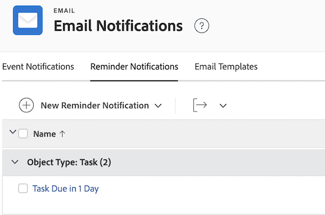

# Configurar notificaciones de recordatorio

<!-- Audited: 1/2024 -->

Como administrador de Workfront, puede crear avisos de recordatorio para los usuarios y asociarlos a objetos a los que quiera que presten especial atención.

Las notificaciones de recordatorio generan correos electrónicos que se envían a los usuarios en función de criterios específicos. Las notificaciones de recordatorio recuerdan a los usuarios de una acción que deben realizar para una tarea, un problema, un proyecto o una hoja de horas.

Después de crear las notificaciones de recordatorio, los usuarios pueden asociarlas manualmente a elementos de trabajo, como proyectos, tareas, problemas y plantillas de horas. Para obtener más información, vea [Adjuntar una notificación de aviso a un objeto](/help/quicksilver/workfront-basics/using-notifications/attach-reminder-notification-object.md).

<!--
DRAFTED IN FLARE:
An example of how this can be used would be helpful here and/or in the section 
<a href="../../../workfront-basics/using-notifications/wf-notifications.md#reminder-notifications" class="MCXref xref">Reminder notifications</a>
 in 
<a href="../../../workfront-basics/using-notifications/wf-notifications.md" class="MCXref xref">Adobe Workfront notifications</a>

-->

## Requisitos de acceso

+++ Expanda para ver los requisitos de acceso para la funcionalidad en este artículo.

<table style="table-layout:auto"> 
 <col> 
 <col> 
 <tbody> 
  <tr> 
   <td role="rowheader">Paquete de Adobe Workfront</td> 
   <td>Cualquiera</td> 
  </tr> 
  <tr> 
   <td role="rowheader">Licencia de Adobe Workfront</td> 
   <td> 
Estándar 

Plan
 
</td> 
  </tr> 
  <tr> 
   <td role="rowheader">Configuraciones de nivel de acceso</td> 
   <td> 
Planificador o superior, con acceso administrativo a las notificaciones de recordatorio
</td> 
  </tr> 
 </tbody> 
</table>

Para obtener más información, consulte [Requisitos de acceso en la documentación de Workfront](/help/quicksilver/administration-and-setup/add-users/access-levels-and-object-permissions/access-level-requirements-in-documentation.md).

+++

## Personalizar el correo electrónico de recordatorio

Puede personalizar el asunto, el cuerpo y el HTML en el correo electrónico de notificación de recordatorio.

O bien, puede utilizar el correo electrónico predeterminado incluido con la notificación del recordatorio. El correo electrónico predeterminado utiliza el nombre de notificación del recordatorio como asunto del correo electrónico y el nombre del objeto en el cuerpo del correo electrónico, incluido el evento que desencadenó la notificación.

Si desea personalizar el correo electrónico del recordatorio, debe crear una plantilla de correo electrónico y adjuntarla a la notificación del recordatorio.

Para obtener información sobre cómo crear una plantilla de correo electrónico, consulte [Configurar plantillas de correo electrónico](../../../administration-and-setup/manage-workfront/emails/configure-email-templates.md).

## Crear una notificación de recordatorio

{{step-1-to-setup}}

1. Haga clic en **Correo electrónico** > **Notificaciones** > **Notificaciones de recordatorio**.

   

1. Haga clic en **Nueva notificación de recordatorio**.

1. En la lista desplegable, haga clic en el tipo de objeto que desee asociar a la notificación de recordatorio.

   Por ejemplo, si desea adjuntar una notificación de recordatorio a una hoja de horas, haga clic en **Hoja de horas**.

1. En el cuadro **Nueva notificación de recordatorio** que aparece, especifique la siguiente información.

   <table style="table-layout:auto"> 
    <col> 
    <col> 
    <tbody> 
     <tr> 
      <td role="rowheader">Nombre de la notificación de recordatorio</td> 
      <td>Especifique un nombre para la notificación de recordatorio.</td> 
     </tr> 
     <tr> 
      <td role="rowheader">Período de calificación</td> 
      <td> 
Especifique el número de horas, días laborables, días (días naturales), semanas o meses antes o después de la fecha en el campo <strong>Timing</strong>.
 
<b>NOTA</b>:  
        <ul> 
         <li> 
Las notificaciones de recordatorio comienzan 24 horas después de la fecha especificada y una vez que se cumplen todos los criterios.
 </li> 
         <li> 
Las notificaciones de recordatorio para proyectos, tareas y problemas se disparan cada noche a la medianoche, hora de las montañas de Estados Unidos. Todos los objetos que cumplen los requisitos para recibir una notificación de recordatorio a partir de ese día inician una notificación a los usuarios designados poco después de esa fecha.
 </li> 
         <li> 
Los avisos del parte de horas se basan en la zona horaria de la organización y en la Fecha de finalización, Fecha de inicio o Fecha de la última actualización del parte de horas. Las zonas horarias de los usuarios individuales no afectan a la temporización de las notificaciones de recordatorio.
 
      </li> 
        </ul> 
 </td> 
     </tr> 
     <tr> 
      <td role="rowheader">Intervalo</td> 
      <td> 
Seleccione el evento que activa la notificación de recordatorio que se va a programar.
 
Si la notificación de recordatorio está destinada a proyectos, tareas o problemas, las opciones disponibles están relacionadas con la fecha de finalización o la fecha de inicio. La notificación del recordatorio tiene en cuenta la marca de tiempo de las fechas de finalización y de inicio de los proyectos, tareas y problemas.

   
Si la notificación de recordatorio está destinada a las hojas de hora, las opciones disponibles están relacionadas con la fecha de finalización, la fecha de inicio o la fecha de última actualización. La notificación de recordatorio para las plantillas de horas tiene en cuenta la marca de tiempo de las fechas de finalización, inicio y última actualización de la plantilla de horas. La plantilla de horas comienza a medianoche del día de la fecha de inicio (12:00 a.m.) y finaliza justo antes de la medianoche de la fecha de finalización (11:59 p.m.).

   
<b>NOTA</b>

      
Las notificaciones de recordatorio del parte de horas sólo se distribuyen una vez cada 24 horas.
 
Cuando configura varias notificaciones de recordatorio en un período de 24 horas, Workfront envía un correo electrónico de notificación con todos los recordatorios incluidos en esa notificación.

      
Por ejemplo, si configura tres notificaciones de recordatorio para que se activen 10 horas antes, 2 horas antes y 1 hora antes de la fecha de vencimiento, los tres recordatorios se combinarán en la misma notificación si se producen durante el mismo día.
 
Sin embargo, si establece una notificación de recordatorio para 26 horas antes y otra para 1 hora antes de una fecha de vencimiento, los usuarios recibirán dos notificaciones independientes. 

   </td> 
     </tr> 
     <tr> 
      <td role="rowheader">Criterios</td> 
      <td> 
Seleccione los criterios para calificar la notificación de recordatorio que se va a programar. Las notificaciones de recordatorio no se programan a menos que se cumpla la selección de criterios.
 
Las siguientes opciones de criterios están disponibles, dependiendo del tipo de objeto seleccionado en el paso 4:
 
       <ul> 
        <li><strong>Incompleto en Proyectos actuales:</strong> <i>(Disponible para recordatorios de tarea y de emisión)</i> La notificación del recordatorio está programada para enviarse sólo cuando el estado del objeto con el que se asocia la notificación del recordatorio no esté completado y el estado del proyecto sea Actual.</li> 
        <li><strong>Todo en proyectos actuales:</strong> <i>(disponible para recordatorios de tareas y problemas)</i> La notificación de recordatorio está programada para enviarse independientemente del estado del objeto y solo cuando el estado del proyecto al que está asociada la notificación de recordatorio sea Actual.</li> 
        <li><strong>Proyectos incompletos:</strong> <i>(disponible para avisos de proyectos)</i> La notificación de aviso está programada para enviarse cuando el estado del proyecto no sea Completado.</li> 
        <li><strong>Todos los proyectos:</strong> <i>(Disponible para los recordatorios de proyectos)</i> La notificación de recordatorio está programada para enviarse independientemente del estado del proyecto.</li> 
        <li><strong>Abrir partes de horas:</strong> <i>(Disponible para avisos de partes de horas)</i> La notificación de aviso está programada para enviarse cuando el estado del parte de horas es Abierto.</li> 
        <li><strong>Partes de horas enviados:</strong> <i>(Disponible para avisos de partes de horas)</i> La notificación de aviso está programada para enviarse cuando se envíe el estado del parte de horas.</li> 
        <li><strong>Abrir parte de horas o Menos de 40 horas por semana:</strong> <i>(Disponible para recordatorios de parte de horas)</i> La notificación del recordatorio está programada para enviarse cuando el estado del parte de horas esté abierto o cuando el parte de horas tenga menos de 40 horas registradas.</li> 
        <li><strong>Plantilla de correo electrónico:</strong> En la lista desplegable, seleccione una plantilla de correo electrónico para adjuntarla al recordatorio. Para obtener información sobre cómo generar una plantilla de correo electrónico, consulte <a href="../../../administration-and-setup/manage-workfront/emails/configure-email-templates.md" class="MCXref xref">Configurar plantillas de correo electrónico</a>.</li> 
       </ul> </td> 
     </tr> 
     <tr> 
      <td role="rowheader">Destinatarios</td> 
      <td>
En función del objeto para el que esté la notificación de recordatorio, seleccione entre los siguientes tipos de usuarios a los que desea recibir la notificación:

      <ul>
      <li>Asignado a</li>
      <li>Introducido por</li>
      <li>Equipo del proyecto (todos los usuarios del equipo del proyecto reciben el recordatorio)</li>
      <li>Usuarios asignados a tareas dependientes (los usuarios asignados a tareas dependientes reciben el recordatorio)</li>
      <li>Propietario del proyecto</li>
      <li>Asignado a (los usuarios asignados a una tarea o a un problema reciben el recordatorio)</li>
      <li>Propietario de hoja de horas</li>
      <li>Aprobador de hoja de horas</li>
      <li>Gerente de propietario de hoja de horas</li></ul>
      </td> 
     </tr> 
    </tbody> 
   </table>

1. Haga clic en **Guardar**.
1. Adjuntar la notificación de recordatorio a un elemento de trabajo, como se describe en [Adjuntar una notificación de recordatorio a un objeto](../../../workfront-basics/using-notifications/attach-reminder-notification-object.md).

## Recibir una notificación de recordatorio

Cuando se cumple la condición en el elemento que tiene adjunta la notificación de recordatorio, se activa una notificación por correo electrónico al usuario definido en la notificación de recordatorio.

Para obtener más información sobre la recepción de notificaciones de recordatorio, consulta la sección [Notificaciones de recordatorio](../../../workfront-basics/using-notifications/wf-notifications.md#reminder-notifications) en [Notificaciones de Adobe Workfront](../../../workfront-basics/using-notifications/wf-notifications.md).

## Entrega de notificación de recordatorio de prueba

Las notificaciones de recordatorio se activan todas las noches a medianoche, hora de la montaña. Todos los objetos que cumplen los requisitos para recibir una notificación de recordatorio activan una notificación a los usuarios designados poco después.

Para que las notificaciones de recordatorio se activen manualmente, se debe cumplir primero la condición del recordatorio.\
Por ejemplo, si se establece un recordatorio para que se active una hora después de la fecha de finalización planificada de un proyecto, esa hora debe haber pasado entre el momento en que se estableció el recordatorio y ahora. Los proyectos en los que se haya aprobado la fecha planificada de finalización antes de activar el recordatorio no almacenarán en déclencheur notificaciones.

Para que una notificación de recordatorio se almacene en déclencheur manualmente:

{{step-1-to-setup}}

1. Haga clic en **Sistema** > **Diagnóstico** en la esquina inferior izquierda de Workfront.

1. Haga clic en **Enviar notificaciones de recordatorio** y espere la confirmación en la parte superior de la pantalla de que se han enviado.

   Los usuarios designados en la notificación de recordatorio recibirán un correo electrónico.

