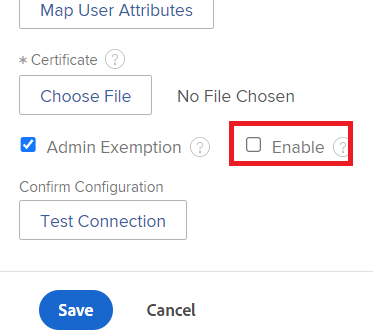

# Administrar claves API

<!--
DON'T DELETE, DRAFT OR HIDE THIS ARTICLE. IT IS LINKED TO THE PRODUCT, THROUGH THE CONTEXT SENSITIVE HELP LINKS.

-->

>[!IMPORTANT]
>
>Workfront ya no recomienda el uso del punto final ni de las claves API `/login`. En lugar de ello, utilice uno de los siguientes métodos de autenticación:
>
>* Autenticación de servidor con JWT
>* Autenticación de usuario con OAuth2
>
>Para obtener instrucciones sobre cómo configurar estos métodos de autenticación, consulte [Crear aplicaciones OAuth2 para integraciones de Workfront](/help/quicksilver/administration-and-setup/configure-integrations/create-oauth-application.md)
>
>Para obtener instrucciones sobre el uso de la autenticación de servidor en Workfront, consulte [Configuración y uso de las aplicaciones OAuth 2 personalizadas de su organización mediante el flujo JWT](/help/quicksilver/wf-api/api/oauth-app-jwt-flow.md)
>
>Para obtener instrucciones sobre el uso de la autenticación de usuarios en Workfront, consulte [Configuración y uso de las aplicaciones OAuth 2 personalizadas de su organización mediante el flujo del código de autorización](/help/quicksilver/wf-api/api/oauth-app-code-token-flow.md)

Para minimizar las vulnerabilidades de seguridad de la API, los administradores de Adobe Workfront pueden administrar las claves de API utilizadas para que las aplicaciones puedan acceder a Workfront en nombre de un usuario.

Puede restablecer o eliminar su clave de API de administrador actual, configurar las claves de API para que caduquen y eliminar las claves de API de todos los usuarios.

Algunos ejemplos de aplicaciones que aprovechan la API de Workfront son los siguientes:

* Integraciones de documentos como Dropbox, Google Drive y Workfront DAM
* Aplicaciones móviles de Workfront

>[!IMPORTANT]
>
>Al restablecer o eliminar una clave de API, cualquier aplicación que aproveche la API de Workfront y se autentique en Workfront mediante esta clave de API debe volver a configurarse para recuperar el acceso a Workfront.

## Requisitos de acceso

+++ Expanda para ver los requisitos de acceso para la funcionalidad en este artículo.

<table style="table-layout:auto"> 
 <col> 
 <col> 
 <tbody> 
  <tr> 
   <td role="rowheader">Paquete de Adobe Workfront</td> 
   <td>
Cualquiera
</td> 
  </tr> 
  <tr> 
   <td role="rowheader">Licencia de Adobe Workfront</td> 
   <td>
Estándar

Plan
</td> 
  </tr> 
  <tr> 
   <td role="rowheader">Configuraciones de nivel de acceso</td> 
   <td> 
Debe ser administrador de Workfront.
 
 </td> 
  </tr> 
 </tbody> 
</table>

Para obtener más información, consulte [Requisitos de acceso en la documentación de Workfront](/help/quicksilver/administration-and-setup/add-users/access-levels-and-object-permissions/access-level-requirements-in-documentation.md).

+++

## Claves de API de Workfront

Cada usuario de Workfront tiene una clave de API única. Esta clave se genera por usuario cuando el usuario accede a una integración que aprovecha la API de Workfront (como la aplicación móvil de Workfront o una integración de documentos).

>[!NOTE]
>
> Las claves de API que genere en el entorno de producción se copian en el entorno de vista previa durante la actualización semanal. Las claves de API que genere en el entorno de vista previa se sobrescribirán con las claves de API del entorno de producción durante la actualización semanal.

Los administradores de Workfront también tienen una clave de API única. Cuando una aplicación utiliza una clave de API de administrador para acceder a Workfront, la aplicación tiene acceso de administrador a Workfront.

## Administración de una clave de API de administrador

Puede generar, restablecer o eliminar la clave de API de su cuenta de usuario de administrador.

{{step-1-to-setup}}

1. Haga clic en **Sistema >** **Información del cliente.**
1. (Condicional) Realice una de las siguientes acciones:

   Para generar una clave API: en la sección **Configuración de clave API**, haga clic en **Generar clave API**.

   O\
   Para restablecer una clave de API: en la sección **Configuración de clave API**, haga clic en **Restablecer** y, a continuación, en **Restablecer.**

   O

   Para quitar la clave de API: en la sección **Configuración de clave API**, haga clic en **Quitar** y, a continuación, en **Quitar**.

<!--

   Remove me October 2026

## Generate an API Key for Non-Admin Users

You can generate and manage API Keys for users in roles other than Workfront administrator.

>[!NOTE]
>
>This is not available if your organization's Workfront instance is enabled with Adobe IMS. See your network or IT administrator if you need more information.

1. (Conditional) If your organization uses Single Sign-On (SSO) access management, temporarily disable the option requiring SSO authentication.

   {{step-1-to-setup}} 
   
   1. Expand **System**, then click **Single Sign-on (SSO)**. 
   1. In the **Type** field, select the type of SSO your organization uses.
   1. With the type selected, scroll down and clear the **Enable** checkbox. 
        
   1. Click **Save**.

1. In the address bar of a browser, enter the following API call:

   `<domain>`.my.workfront.com/attask/api/v7.0/user?action=generateApiKey&username=**username**&password=**password**&method=PUT

   Replace `<domain>` with your Workfront domain name, and username and password with the user's Workfront credentials.

1. (Conditional) Enable the option requiring SSO authentication if you disabled it in Step 1.

   {{step-1-to-setup}}
   
   1. Expand **System**, then click **Single Sign-on (SSO)**.
   
   1. Select your SSO method in the **Type** drop down menu.
   1. Check the checkbox requiring SSO authentication.

   -->

## Configure cuándo caducan las claves API

Puede configurar las claves API de modo que caduquen para todos los usuarios del sistema. Cuando la clave API de un usuario caduca, el usuario debe volver a autenticarse en cualquier aplicación que utilice la API de Workfront para acceder a Workfront. Puede cambiar la frecuencia con la que caducan las claves API. También puede configurar si las claves API caducan cuando caduca la contraseña de un usuario.

{{step-1-to-setup}}

1. Haga clic en **Sistema** > **Información del cliente**.
1. En el área **Configuración de clave API**, en la lista desplegable **Después de la creación**, **Las claves API caducan en**, seleccione el periodo de tiempo en el que desea que caduquen las claves API.

   Al cambiar esta opción, el nuevo periodo de tiempo comienza a partir del momento en que realizó el cambio. Por ejemplo, si cambia esta opción de *1 mes* a *6 meses*, las claves API caducarán dentro de 6 meses a partir del momento en que realice el cambio.

   De forma predeterminada, las claves API caducan cada mes.

1. Para configurar las claves API para que caduquen cuando caduquen las contraseñas de los usuarios, habilite **Quitar clave API cuando caduque la contraseña de un usuario**.

   Esta opción no está habilitada de forma predeterminada.

   Para obtener información sobre cómo configurar las contraseñas de usuario para que caduquen, consulte [Configurar las preferencias de seguridad del sistema](../../../administration-and-setup/manage-workfront/security/configure-security-preferences.md).

1. Haga clic en **Guardar**.

## Eliminar las claves API de todos los usuarios

Si le preocupa una infracción de seguridad concreta en relación con su sistema de Workfront, puede quitar las claves API simultáneamente para todos los usuarios.

>[!IMPORTANT]
>
>Al quitar las claves API de todos los usuarios, se invalidan TODAS las claves API de todos los usuarios del sistema. Esta acción hará que todas las integraciones en Workfront arrojen un error hasta que genere una nueva clave API en Workfront y actualice todas las integraciones.

{{step-1-to-setup}}

1. Expanda **Sistema** y, a continuación, haga clic en **Información del cliente**.

1. En el área **Configuración de clave API**, haga clic en **Quitar todas las claves API** y, a continuación, haga clic en **Quitar** **Todo**.

<!--

Remove me October 2026

## Restricting API logins with an X.509 certificate

>[!IMPORTANT]
>
>The procedure described in this section applies only to organizations that have not yet been onboarded to the Adobe Business Platform. Logging in to Workfront through the Workfront API is not available if your organization has been onboarded to the Adobe Business Platform.
>
>For a list of procedures that differ based on whether your organization has been onboarded to the Adobe Business Platform, see [Administration differences between Adobe Workfront and Adobe Business Platform](../../../administration-and-setup/get-started-wf-administration/actions-in-admin-console.md).

>[!NOTE]
>
>This is not available if your organization's Workfront instance is enabled with Adobe IMS. See your network or IT administrator if you need more information.

Third-party applications can communicate with Workfront through the API. To increase the security of your Workfront site, you can configure Workfront to restrict API login requests by uploading an X.509 certificate to Workfront. Once enabled, all login requests through the API must include a client certificate in addition to username and password.

* [Obtain the X.509 certificate](#obtain-the-x-509-certificate) 
* [Upload the certificate to Workfront](#upload-the-certificate-to-workfront) 
* [Verify API login calls are restricted](#verify-api-login-calls-are-restricted)

### Obtain the X.509 certificate {#obtain-the-x-509-certificate}

Obtain a valid X.509 certificate from a trusted Certificate Authority (such as Verisign), and save it to a temporary location on your workstation. 

### Upload the certificate to Workfront {#upload-the-certificate-to-workfront}

After you have obtained the X.509 certificate from your Certificate Authority, you need to upload it to Workfront.

1. Click the **Main Menu** icon  in the upper-right corner of Adobe Workfront, then click **Setup** .  

1. Expand **System**, then click **Customer Info**.

1. In the **API Key Settings** area, select **Require X.509 Certificate for API logins**.
1. Click **Change Certificate**.
1. On your workstation, browse to and select the X.509 certificate that you previously downloaded.
1. (Optional) Click **View Details** next to the certificate name to view the following details about the certificate:

   * Subject Common Name
   * Subject Organization
   * Subject Organization Unit
   * Issuer Common Name
   * Issuer Organization
   * Issuer Organization Unit
   * Serial Number
   * Issue Date
   * Expiration Date

1. Click **Save**. 

### Verify API login calls are restricted {#verify-api-login-calls-are-restricted}

Prior to configuring your instance of Workfront to require an X.509 certificate, perform an API request to the `/login` endpoint using valid username and password parameters. You will receive a 200 response that contains a sessionID.

After making the X.509 certificate a requirement via the customer info page in your instance of Workfront, make another login attempt. This time you will receive a 500 error response with the following message: "Untrusted request. Please contact your system administrator and attach certificate."

After confirming that the X.509 certificate is required, perform the same login request with an additional parameter for apiCertificate set to the value of your certificate. If this operation was performed correctly you will receive a 200 response that contains a valid sessionID.

-->
