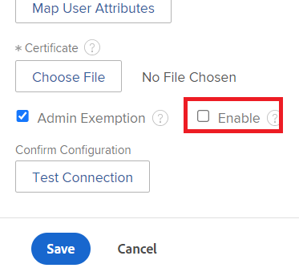

# Administrar claves API

<!--DON'T DELETE, DRAFT OR HIDE THIS ARTICLE. IT IS LINKED TO THE PRODUCT, THROUGH THE CONTEXT SENSITIVE HELP LINKS.

-->

Para minimizar las vulnerabilidades de seguridad de la API, los administradores de Adobe Workfront pueden administrar las claves de API utilizadas para permitir que las aplicaciones accedan a Workfront en nombre de un usuario.

Puede restablecer o eliminar su clave de API de administrador actual, configurar las claves de API para que caduquen y eliminar las claves de API de todos los usuarios.

Algunos ejemplos de aplicaciones que aprovechan la API de Workfront son:

* Integraciones de documentos como Dropbox, Google Drive y Workfront DAM
* Aplicaciones móviles de Workfront

>[!IMPORTANT]
>
>Al restablecer o eliminar una clave de API, cualquier aplicación que aproveche la API de Workfront y se autentique en Workfront mediante esta clave de API debe volver a configurarse para recuperar el acceso a Workfront.

## Requisitos de acceso

+++ Expanda para ver los requisitos de acceso para la funcionalidad en este artículo.

Debe tener el siguiente acceso para realizar los pasos de este artículo:

<table style="table-layout:auto"> 
 <col> 
 <col> 
 <tbody> 
  <tr> 
   <td role="rowheader">plan de Adobe Workfront</td> 
   <td>Cualquiera</td> 
  </tr> 
  <tr> 
   <td role="rowheader">Licencia de Adobe Workfront</td> 
   <td>Plan</td> 
  </tr> 
  <tr> 
   <td role="rowheader">Configuraciones de nivel de acceso</td> 
   <td> 
Debe ser administrador de Workfront.
 
<b>NOTA</b>: Si todavía no tiene acceso, pregunte al administrador de Workfront si ha establecido restricciones adicionales en su nivel de acceso. Para obtener información sobre cómo un administrador de Workfront puede modificar su nivel de acceso, vea <a href="../../../administration-and-setup/add-users/configure-and-grant-access/create-modify-access-levels.md" class="MCXref xref">Crear o modificar niveles de acceso personalizados</a>.
 </td> 
  </tr> 
 </tbody> 
</table>

+++

## Claves de API de Workfront

Cada usuario de Workfront tiene una clave de API única. Esta clave se genera por usuario cuando el usuario accede a una integración que aprovecha la API de Workfront (como la aplicación móvil de Workfront o una integración de documentos).

>[!NOTE]
>
> Las claves de API que genere en el entorno de producción se copian en el entorno de vista previa durante la actualización semanal. Las claves API que genere en el entorno de vista previa se sobrescribirán con las claves API de producción durante la actualización semanal.

Los administradores de Workfront también tienen una clave de API única. Cuando una aplicación utiliza una clave de API de administrador para acceder a Workfront, la aplicación tiene acceso de administrador a Workfront.

## Administración de una clave de API de administrador

Puede generar, restablecer o eliminar la clave de API de su cuenta de usuario de administrador.

>[!NOTE]
>
>También puede generar una clave de API a través de la API. Para obtener más información, consulte la sección [API de suscripción a evento](../../../wf-api/general/event-subs-api.md) en [API de suscripción a evento](../../../wf-api/general/event-subs-api.md).

{{step-1-to-setup}}

1. Haga clic en **Sistema >** **Información del cliente.**
1. (Condicional) Realice una de las siguientes acciones:

   Para generar una clave API: en la sección **Configuración de clave API**, haga clic en **Generar clave API**.

   O\
   Para restablecer una clave API: en la sección **Configuración de la clave API**, haga clic en **Restablecer** y, a continuación, en **Restablecer.**

   O

   Para quitar la clave API: en la sección **Configuración de la clave API**, haga clic en **Quitar** y, a continuación, en **Quitar**.

## Generación de una clave de API para usuarios no administradores

Puede generar y administrar claves de API para usuarios con funciones distintas de administrador de Workfront.

>[!NOTE]
>
>Esto no está disponible si la instancia de Workfront de su organización está habilitada con Adobe IMS. Consulte al administrador de red o de TI si necesita más información.

1. (Condicional) Si su organización utiliza la administración de acceso de inicio de sesión único (SSO), deshabilite temporalmente la opción que requiere autenticación de SSO.

   {{step-1-to-setup}}

   1. Expanda **Sistema** y haga clic en **Inicio de sesión único (SSO)**.
   1. En el campo **Tipo**, seleccione el tipo de SSO que utiliza su organización.
   1. Con el tipo seleccionado, desplácese hacia abajo y desactive la casilla de verificación **Habilitar**.
      
   1. Haga clic en **Guardar**.

1. En la barra de direcciones de un explorador, introduzca la siguiente llamada de API:

   `<domain>`**.my.workfront.com/attask/api/v7.0/user?action=generateApiKey&amp;username=**nombre de usuario**&amp;contraseña=**contraseña**&amp;método=PUT

   Reemplace `<domain>` con su nombre de dominio de Workfront, y su nombre de usuario y contraseña con las credenciales de Workfront del usuario.

1. (Condicional) Habilite la opción que requiere autenticación SSO si la deshabilitó en el paso 1.

   {{step-1-to-setup}}

   1. Expanda **Sistema** y haga clic en **Inicio de sesión único (SSO)**.

   1. Seleccione su método SSO en el menú desplegable **Tipo**.
   1. Marque la casilla de verificación que requiere autenticación SSO.

## Configurar cuándo caducan las claves API

Puede configurar las claves API para que caduquen para todos los usuarios del sistema. Cuando la clave API de un usuario caduca, el usuario debe volver a autenticarse en cualquier aplicación que utilice la API de Workfront para acceder a Workfront. Puede cambiar la frecuencia con la que caducan las claves API. También puede configurar si las claves de API caducan cuando caduca la contraseña de un usuario.

{{step-1-to-setup}}

1. Haga clic en **Sistema** > **Información del cliente**.
1. En el área **Configuración de clave API**, en la lista desplegable **Después de la creación**, **Las claves API caducan en**, seleccione el periodo de tiempo en el que desea que caduquen las claves API.

   Al cambiar esta opción, el nuevo periodo de tiempo comienza a partir del momento en que realizó el cambio. Por ejemplo, si cambia esta opción de *1 mes* a *6 meses*, las claves de API caducarán dentro de 6 meses a partir del momento en que realice el cambio.

   De forma predeterminada, las claves API caducan cada mes.

1. Para configurar las claves API para que caduquen cuando caduquen las contraseñas de los usuarios, seleccione **Quitar clave API cuando caduque la contraseña de un usuario**.

   Esta opción no está seleccionada de forma predeterminada.

   Para obtener información sobre cómo configurar las contraseñas de usuario para que caduquen, consulte [Configurar las preferencias de seguridad del sistema](../../../administration-and-setup/manage-workfront/security/configure-security-preferences.md).

1. Haga clic en **Guardar**.

## Eliminar las claves API de todos los usuarios

Si le preocupa una infracción de seguridad concreta en relación con su sistema Workfront, puede quitar las claves de API simultáneamente para todos los usuarios.

>[!IMPORTANT]
>
>Al eliminar las claves API de todos los usuarios, se invalidan TODAS las claves API de todos los usuarios del sistema. Esta acción hará que todas las integraciones en Workfront fallen hasta que genere una nueva clave de API en Workfront y actualice todas las integraciones.

{{step-1-to-setup}}

1. Expanda **Sistema** y, a continuación, haga clic en **Información del cliente**.

1. En el área **Configuración de clave API**, haga clic en **Quitar todas las claves API** y, a continuación, haga clic en **Quitar** **Todo**.

## Restricción de los inicios de sesión en la API con un certificado X.509

>[!IMPORTANT]
>
>El procedimiento descrito en esta sección se aplica solo a las organizaciones que aún no se han incorporado a Adobe Business Platform. El inicio de sesión en Workfront a través de la API de Workfront no está disponible si su organización se ha incorporado a Adobe Business Platform.
>
>Para obtener una lista de procedimientos que difieren según si su organización se ha incorporado a Adobe Business Platform, consulte [Diferencias de administración basadas en la plataforma (Adobe Workfront/Adobe Business Platform)](../../../administration-and-setup/get-started-wf-administration/actions-in-admin-console.md).

Las aplicaciones de terceros pueden comunicarse con Workfront a través de la API. Para aumentar la seguridad del sitio de Workfront, puede configurar Workfront para que restrinja las solicitudes de inicio de sesión de API cargando un certificado X.509 en Workfront. Una vez habilitado, todas las solicitudes de inicio de sesión a través de la API deben incluir un certificado de cliente, además del nombre de usuario y la contraseña.

>[!NOTE]
>
>Esto no está disponible si la instancia de Workfront de su organización está habilitada con Adobe IMS. Consulte al administrador de red o de TI si necesita más información.

* [Obtener el certificado X.509](#obtain-the-x-509-certificate)
* [Cargar el certificado en Workfront](#upload-the-certificate-to-workfront)
* [Verificar que las llamadas de inicio de sesión de API estén restringidas](#verify-api-login-calls-are-restricted)

### Obtener el certificado X.509 {#obtain-the-x-509-certificate}

Obtenga un certificado X.509 válido de una autoridad de certificación de confianza (como Verisign) y colóquelo en una ubicación temporal de su estación de trabajo.

### Cargue el certificado en Workfront {#upload-the-certificate-to-workfront}

Una vez que haya obtenido el certificado X.509 de su autoridad de certificación, deberá cargarlo en Workfront.

1. Haga clic en el icono **Menú principal**  en la esquina superior derecha de Adobe Workfront y, a continuación, haga clic en **Configurar** .

1. Expanda **Sistema** y, a continuación, haga clic en **Información del cliente**.

1. En el área **Configuración de clave API**, seleccione **Habilitar certificado X.509**.
1. En la estación de trabajo, busque y seleccione el certificado X.509 que descargó anteriormente.
1. (Opcional) Haga clic en **Ver detalles** junto al nombre del certificado para ver los siguientes detalles sobre el certificado:

   * Nombre común del sujeto
   * Organización del sujeto
   * Unidad de organización del sujeto
   * Nombre común del emisor
   * Organización emisora
   * Unidad de organización emisora
   * Número de serie
   * Fecha de emisión
   * Fecha de caducidad

1. Haga clic en **Guardar**.

### Verificar que las llamadas de inicio de sesión de API estén restringidas {#verify-api-login-calls-are-restricted}

Antes de configurar la instancia de Workfront para que requiera un certificado X.509, realice una solicitud de API al extremo `/login` utilizando parámetros de nombre de usuario y contraseña válidos. Recibirá una respuesta de 200 que contiene un sessionID.

Después de hacer que el certificado X.509 sea un requisito a través de la página de información del cliente en su instancia de Workfront, realice otro intento de inicio de sesión. Esta vez recibirá una respuesta de error 500 con el siguiente mensaje: &quot;Untrusted request. Póngase en contacto con el administrador del sistema y adjunte un certificado&quot;.

Después de confirmar que se requiere el certificado X.509, realice la misma solicitud de inicio de sesión con un parámetro adicional para apiCertificate establecido en el valor de su certificado. Si esta operación se realizó correctamente, recibirá una respuesta de 200 que contiene un sessionID válido.
