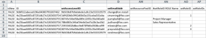

# Importar datos en Adobe Workfront mediante una plantilla de inicio rápido

Los &quot;Kick-Starts&quot; son libros de Excel especialmente formateados que se pueden rellenar con datos que se desea importar en Workfront. Adobe Workfront proporciona una plantilla de inicio rápido que puede utilizar para ello, tal como se explica en [Inicio rápido del importador de datos](../../../administration-and-setup/manage-workfront/using-kick-starts/kick-starts-data-importer.md).

Este proceso se divide en tres tareas principales:

* En primer lugar, se exporta una plantilla Inicio rápido como un archivo de hoja de cálculo
* En segundo lugar, rellene la hoja de cálculo con los datos
* Por último, se importa la hoja de cálculo rellenada en Workfront

Cada uno de estos procedimientos se describe en el orden apropiado en este artículo.

## Requisitos de acceso

Debe tener el siguiente acceso para realizar los pasos de este artículo:

<table style="table-layout:auto"> 
 <col> 
 <col> 
 <tbody> 
  <tr> 
   <td role="rowheader">plan de Adobe Workfront</td> 
   <td>Cualquiera</td> 
  </tr> 
  <tr> 
   <td role="rowheader">Licencia de Adobe Workfront</td> 
   <td>Plan</td> 
  </tr> 
  <tr> 
   <td role="rowheader">Configuraciones de nivel de acceso</td> 
   <td> 
Debe ser administrador de Workfront.
 
<b>NOTA</b>: Si todavía no tiene acceso, pregunte a su administrador de Workfront si establece restricciones adicionales en su nivel de acceso. Para obtener información sobre cómo un administrador de Workfront puede modificar su nivel de acceso, consulte <a href="../../../administration-and-setup/add-users/configure-and-grant-access/create-modify-access-levels.md" class="MCXref xref">Crear o modificar niveles de acceso personalizados</a>.
 </td> 
  </tr> 
 </tbody> 
</table>

## Limitaciones

Puede importar un gran número de objetos en Workfront mediante una plantilla de inicio rápido. Sin embargo, tenga en cuenta las siguientes limitaciones:

* La importación de datos de este modo no actualiza la información de los registros que ya existen en Workfront
* Solo se pueden importar registros nuevos y su información
* No importe más de 2000 registros a la vez para garantizar que no se agote el tiempo de espera de la importación

## Exportar una plantilla de inicio rápido como un archivo de hoja de cálculo

Al exportar una plantilla de inicio rápido, recibirá un libro de hoja de cálculo de Excel en blanco. En los procedimientos siguientes de este artículo, rellenará el libro con su información y, a continuación, lo importará de nuevo en Workfront.

Para exportar una plantilla de inicio rápido:

1. Haga clic en el **Menú principal** icono  en la esquina superior derecha de Adobe Workfront, haga clic en **Configuración** .

1. Haga clic en **Sistema** > **Exportar datos (inicio rápido)**.

1. Haga clic en **Más opciones** y, a continuación, seleccione los tipos de información que desea incluir.

   Cada opción que seleccione representa una colección de varias fichas en la hoja de cálculo exportada. Por ejemplo, si selecciona la opción Informe , todos los objetos necesarios para crear un informe se incluirán en la hoja de cálculo (vistas, filtros, agrupaciones, informes).

   Puede utilizar todos los tipos de objetos enumerados a continuación para importar datos en Workfront. (La única excepción es la opción Niveles de acceso . La hoja de datos Niveles de acceso de una exportación se proporciona con fines de referencia; permite asignar un nivel de acceso a una nueva cuenta de usuario por ID.)

   La plantilla de cada uno de los tipos de objeto se puede exportar en los siguientes formatos de archivo y contiene las siguientes hojas:

   <table style="table-layout:auto"> 
    <col> 
    <col> 
    <col> 
    <thead> 
     <tr> 
      <th> 
<strong>Objeto</strong> 
 </th> 
      <th> 
<strong>Exportaciones como</strong> 
 </th> 
      <th> 
<strong>Hojas de la hoja de cálculo exportada</strong> 
 </th> 
     </tr> 
    </thead> 
    <tbody> 
     <tr> 
      <td scope="col"> 
Panel
 
Todos los tableros del sistema están disponibles para la exportación. Puede seleccionar hasta 100 paneles específicos en una sola exportación.
 </td> 
      <td scope="col">Exporta como archivo ZIP</td> 
      <td scope="col"> 
Parámetro
 
Opción del parámetro
 
Grupo de parámetros
 
Parámetro de categoría
 
Categoría
 
Informe
 
Sección de la ficha de portal
 
Panel
 
Preferencias
 </td> 
     </tr> 
     <tr> 
      <td scope="col"> 
Informe
 
Todos los informes del sistema están disponibles para la exportación. Puede seleccionar hasta 100 informes específicos en una sola exportación.
 </td> 
      <td scope="col">Exporta como archivo ZIP </td> 
      <td scope="col"> 
Parámetro
 
Opción del parámetro
 
Grupo de parámetros
 
Parámetro de categoría
 
Categoría
 
Informe
 
Preferencias
 </td> 
     </tr> 
     <tr> 
      <td scope="col"> 
Ruta de aprobación
 </td> 
      <td scope="col"> 
Exporta como archivo de Excel
 </td> 
      <td scope="col"> 
Aprobador de pasos
 
Paso de aprobación
 
Ruta de aprobación
 
Proceso de aprobación
 
Preferencias
 </td> 
     </tr> 
     <tr> 
      <td scope="col"> 
Datos personalizados
 </td> 
      <td scope="col"> 
Exporta como archivo de Excel
 </td> 
      <td scope="col"> 
Parámetro
 
Opción del parámetro
 
Grupo de parámetros
 
Parámetro de categoría
 
Categoría
 
Preferencias
 </td> 
     </tr> 
     <tr> 
      <td scope="col"> 
Tipo de gasto
 </td> 
      <td scope="col"> 
Exporta como archivo de Excel
 </td> 
      <td> 
Tipo de gasto
 
Preferencias
 </td> 
     </tr> 
     <tr> 
      <td> 
Tipo de hora
 </td> 
      <td scope="col"> 
Exporta como archivo de Excel
 </td> 
      <td> 
Tipo de hora
 
Preferencias
 </td> 
     </tr> 
     <tr> 
      <td> 
Equipo
 </td> 
      <td scope="col"> 
Exporta como archivo de Excel
 </td> 
      <td> 
 Miembro del equipo
 
Equipo
 
Preferencias 
 </td> 
     </tr> 
     <tr> 
      <td> 
Usuario
 </td> 
      <td> 
Exporta como archivo de Excel. Para ver la lista completa de opciones, haga clic en <strong>Más opciones</strong>.
 </td> 
      <td> 
Usuario
 
Preferencias
 </td> 
     </tr> 
     <tr> 
      <td>Nivel de acceso</td> 
      <td>Exporta como archivo de Excel</td> 
      <td> 
Nivel de acceso
 
Preferencias
 </td> 
     </tr> 
     <tr> 
      <td>Asignación</td> 
      <td>Exporta como archivo de Excel</td> 
      <td> 
Asignación
 
Preferencias
 </td> 
     </tr> 
     <tr> 
      <td>Compañía</td> 
      <td>Exporta como archivo de Excel</td> 
      <td> 
 Compañía
 
Preferencias 
 </td> 
     </tr> 
     <tr> 
      <td>Plantilla de mensaje de correo electrónico</td> 
      <td>Exporta como archivo de Excel</td> 
      <td> 
Plantilla de mensaje de correo electrónico
 
Preferencias 
 </td> 
     </tr> 
     <tr> 
      <td>Gasto</td> 
      <td>Exporta como archivo de Excel</td> 
      <td> 
 Gasto'
 
Preferencias 
 </td> 
     </tr> 
     <tr> 
      <td>Página externa</td> 
      <td>Exporta como archivo de Excel</td> 
      <td> 
 Página externa
 
Preferencias 
 </td> 
     </tr> 
     <tr> 
      <td>Filtro</td> 
      <td>Exporta como archivo ZIP</td> 
      <td> 
 Filtro
 
Preferencias 
 </td> 
     </tr> 
     <tr> 
      <td>Grupo</td> 
      <td>Exporta como archivo de Excel</td> 
      <td> 
 Grupo
 
Preferencias 
 </td> 
     </tr> 
     <tr> 
      <td>Agrupación</td> 
      <td>Exporta como archivo ZIP</td> 
      <td> 
 Agrupación
 
Preferencias 
 </td> 
     </tr> 
     <tr> 
      <td>Hora</td> 
      <td>Exporta como archivo de Excel</td> 
      <td> 
 Hora
 
Preferencias 
 </td> 
     </tr> 
     <tr> 
      <td>Problema</td> 
      <td>Exporta como archivo de Excel</td> 
      <td> 
 Problema
 
Preferencias 
 </td> 
     </tr> 
     <tr> 
      <td>Función</td> 
      <td>Exporta como archivo de Excel</td> 
      <td> 
 Función del trabajo
 
Preferencias 
 </td> 
     </tr> 
     <tr> 
      <td>Ruta de hitos</td> 
      <td> Exporta como archivo de Excel</td> 
      <td> 
 Hito
 
Ruta de hitos
 
Preferencias 
 </td> 
     </tr> 
     <tr> 
      <td>Nota</td> 
      <td>Exporta como archivo de Excel</td> 
      <td> 
 Nota
 
Preferencias 
 </td> 
     </tr> 
     <tr> 
      <td>Portafolio</td> 
      <td>Exporta como archivo de Excel</td> 
      <td> 
 Portafolio
 
Preferencias 
 </td> 
     </tr> 
     <tr> 
      <td>Proyecto</td> 
      <td>Exporta como archivo de Excel</td> 
      <td> 
 Cola
 
Proyecto
 
Regla de enrutamiento
 
Tema de la cola
 
Preferencias 
 </td> 
     </tr> 
     <tr> 
      <td>Estimación de recursos</td> 
      <td>Exporta como archivo de Excel</td> 
      <td> 
 Estimación de recursos
 
Preferencias 
 </td> 
     </tr> 
     <tr> 
      <td>Conjunto de recursos</td> 
      <td>Exporta como archivo de Excel</td> 
      <td> 
 Conjunto de recursos
 
Preferencias 
 </td> 
     </tr> 
     <tr> 
      <td>Riesgo</td> 
      <td>Exporta como archivo de Excel</td> 
      <td> 
 Riesgo
 
Preferencias 
 </td> 
     </tr> 
     <tr> 
      <td>Tipo de riesgo</td> 
      <td> Exporta como archivo de Excel</td> 
      <td> 
 Tipo de riesgo
 
Preferencias
 </td> 
     </tr> 
     <tr> 
      <td>Tarjeta de puntuación</td> 
      <td>Exporta como archivo de Excel</td> 
      <td> 
Preguntas de tarjeta de puntuación
 
Opción de tarjeta de puntuación
 
Tarjeta de puntuación
 
Preferencias 
 </td> 
     </tr> 
     <tr> 
      <td>Tarea</td> 
      <td>Exporta como archivo de Excel</td> 
      <td> 
 Tarea
 
Preferencias 
 </td> 
     </tr> 
     <tr> 
      <td>Plantilla</td> 
      <td> Exporta como archivo de Excel</td> 
      <td> 
 Cola
 
Plantilla
 
Regla de enrutamiento
 
Tema de la cola
 
Preferencias 
 </td> 
     </tr> 
     <tr> 
      <td>Asignación de plantilla</td> 
      <td>Exporta como archivo de Excel</td> 
      <td> 
 Asignación de plantilla
 
Preferencias 
 </td> 
     </tr> 
     <tr> 
      <td>Tarea de plantilla</td> 
      <td>Exporta como archivo de Excel</td> 
      <td> 
 Tarea de plantilla
 
Preferencias 
 </td> 
     </tr> 
     <tr> 
      <td>Hoja de horas</td> 
      <td> Exporta como archivo de Excel</td> 
      <td> 
 Perfil de hoja de horas
 
Hoja de horas
 
Preferencias 
 </td> 
     </tr> 
     <tr> 
      <td>Vista </td> 
      <td> 
Exporta como archivo ZIP
 </td> 
      <td> 
 Vista
 
Preferencias 
 </td> 
     </tr> 
    </tbody> 
   </table>

1. Haga clic en **Descargar**.
1. Continuar con [Rellene la plantilla de hoja de cálculo con los datos](#populate-the-spreadsheet-template-with-your-data) para rellenar la plantilla con su información.

## Rellene la plantilla de hoja de cálculo con los datos {#populate-the-spreadsheet-template-with-your-data}

* [Acerca de las pestañas (hojas de datos) incluidas en la hoja de cálculo](#about-the-tabs-data-sheets-included-in-the-spreadsheet)
* [Importar un registro](#import-a-record)
* [Incluir fechas](#include-dates)
* [Usar caracteres comodín](#use-wildcards)
* [Sustitución de nombres de atributos para ID](#attribute-name-substitution-for-ids)

### Acerca de las pestañas (hojas de datos) incluidas en la hoja de cálculo {#about-the-tabs-data-sheets-included-in-the-spreadsheet}

>[!TIP]
>
>Para comprender mejor cómo tendrá que dar formato a la información en cada columna cuando rellene la plantilla Inicio rápido, considere la posibilidad de realizar una práctica ejecutada exportando un Inicio rápido con datos de Workfront existentes en los objetos que esté intentando importar. Para obtener instrucciones, consulte [Exportar datos de Adobe Workfront mediante Kick-Starts](../../../administration-and-setup/manage-workfront/using-kick-starts/export-data-from-wf-via-kick-starts.md).

Al abrir una plantilla en blanco Inicio de marca, hay una serie de fichas (hojas de datos) disponibles. Dependen de los objetos que haya seleccionado para la descarga. Cada uno representa un objeto de la aplicación, como proyecto, tareas, horas, tablero y usuarios:

Cuando se abre una de estas pestañas, la fila 2 muestra los campos de cada objeto que se pueden definir durante una importación. En el encabezado de una columna, después de la palabra &quot;set&quot;, el nombre del campo aparece tal como aparece en la base de datos. Estos campos actúan como encabezados de columna.

>[!IMPORTANT]
>
>Para evitar errores, asegúrese de lo siguiente:
>
>* No elimine o modifique estos campos de ninguna manera. Por ejemplo, no cambie su orden o sus nombres.
>* Rellene todos los campos con un encabezado de columna en negrita. Representan los campos obligatorios.
>
>  Sin embargo, si un campo obligatorio contiene un valor predeterminado establecido en las preferencias del sistema, no es necesario rellenarlo.
>
>  Por ejemplo, en la **Proyecto PROJ** , la pestaña **setCondition** y **setConditionType** los campos se pueden dejar vacíos, pero la variable **setGroupID** y **setName** no puede.

### Importar un registro  {#import-a-record}

Cada fila de la hoja corresponde a un objeto único.

1. Complete la celda en la variable **isNew** columna:

   * Si el objeto que está importando es nuevo, escriba **TRUE** para importar los datos de la fila.
   * Si el objeto ya está en Workfront, escriba **FALSE** para ignorar la fila.

1. Complete la celda en la variable **ID** de una de las siguientes maneras:

   * Si el objeto que está importando es nuevo (y ha escrito **TRUE** en el **isNew** ), especifique cualquier número para el ID. Este número debe ser único en la hoja de cálculo.

   * Si el objeto que está importando ya existe en el sistema Workfront (y usted escribió&#x200B;**FALSE** en el **isNew** ), el ID debe ser el GUID alfanumérico que exista en Workfront para ese objeto.

      **Ejemplo:** Para un proyecto, el valor mostrado en la variable **setGroupID** debe ser una de las siguientes:

      * El GUID de un grupo existente en su instancia de Workfront
      * El valor (número) de la columna ID de la variable **Grupo GRUPO** hoja si está creando un nuevo grupo durante la importación

         

1. Introduzca valores para los campos obligatorios y cualquier otro campo que desee rellenar durante la importación.
1. (Opcional) Para agregar datos personalizados:

   * Cree una nueva columna para cada campo personalizado que desee incluir en el proceso de importación.
   * Asigne un nombre a cada nueva columna para su campo personalizado correspondiente de la siguiente manera: **DE:[Nombre del campo personalizado como aparece en Workfront]**.
   * En la columna **setCategoryID**, escriba el GUID del formulario personalizado existente en el que reside este campo personalizado. Este campo es obligatorio al importar datos personalizados.
   * Si necesita añadir varios valores de datos en el campo personalizado (como botones de opción, casillas de verificación o listas), utilice el delimitador de datos personalizado de barra vertical &quot;|&quot; que aparece en la pestaña Preferencias para separar los valores.

      **Ejemplo:** Escriba A|D en la columna DE:Departamentos para rellenar el departamento A y el departamento D en el formulario personalizado.

### Incluir fechas  {#include-dates}

Workfront puede procesar la mayoría de los formatos de fecha. Sin embargo, debe asegurarse de que la columna de fecha de la hoja de cálculo tenga el formato de fecha. La importación fallará si la columna tiene el formato general, un número o texto.

>[!TIP]
>
>La mayoría de las personas encuentran más fácil utilizar el formato MM/DD/AAAA (por ejemplo: 10/7/2022).

Workfront también acepta valores de hora como parte de la fecha (por ejemplo: 07/10/2022 01:30 o 07/10/2022 1:00 PM).

Si omite una hora en la fecha, Workfront realiza una de las siguientes acciones:

* Asume que son las 12:00 AM. Para ver el resultado de fecha esperado, la zona horaria del sistema debe coincidir con la del huso horario.
* Si se encuentra en un objeto asociado a una programación, el tiempo se retrasa hasta el primer momento que la programación lo permita.

>[!NOTE]
>
>Al utilizar una marca de tiempo UNIX, debe incluir tres ceros adicionales al final del valor.
>
>Por ejemplo, si la marca de tiempo es 7336899000, introduciría 7336899000000 en la celda.

### Usar caracteres comodín {#use-wildcards}

Puede utilizar los siguientes comodines al rellenar la hoja de cálculo de la plantilla Inicio rápido:

<table style="table-layout:auto"> 
 <col> 
 <col> 
 <thead> 
  <tr> 
   <th> 
<strong>Comodín</strong> 
 </th> 
   <th> 
<strong>Comportamiento</strong> 
 </th> 
  </tr> 
 </thead> 
 <tbody> 
  <tr> 
   <td> 
$$HOY
 </td> 
   <td> 
Cuando se usa en un <strong>setDate</strong> , este comodín establece la fecha como medianoche del día en que se importa el Inicio de marca.
 
Puede modificar el comodín mediante la sintaxis estándar permitida con el comodín en un filtro.
 
Example: </b>"><b>Ejemplo: </b>Si desea que un proyecto comience el lunes de la semana en el que se importa, independientemente del día en el que realice la importación, puede utilizar <strong>$$TODAYbw</strong>. Esto establece la fecha de inicio planeada del proyecto como 12:00 AM el domingo. Como la programación del proyecto probablemente no permita trabajar en ese momento, empezará a las 9:00 AM del lunes por la mañana.
 </td> 
  </tr> 
  <tr> 
   <td> 
$$AHORA
 </td> 
   <td> 
Cuando se usa en un <strong>setDate</strong> , este comodín establece la fecha según el momento en el que cree el registro durante la importación de inicio rápido.
 
Puede modificar el comodín mediante la sintaxis estándar permitida con el comodín en un filtro.
 
Example: </b>"><b>Ejemplo: </b>Si desea que un proyecto se inicie 3 horas después de la importación, puede usar <strong>$$AHORA+3h</strong>.
 </td> 
  </tr> 
  <tr> 
   <td> 
$$USER.ID
 </td> 
   <td> 
Cuando se usa en un <strong>setAssignedToID</strong> Para otros campos basados en userID, este comodín asigna el trabajo o asocia el registro con la persona que realiza la importación.
 </td> 
  </tr> 
  <tr> 
   <td> 
$$CUSTOMER
 </td> 
   <td> 
Este comodín se agregó específicamente para las importaciones de usuarios de inicio rápido. Cuando se crea una cuenta de Workfront, se crea un usuario con el nivel de acceso Administrador del sistema. El nombre de usuario asignado al administrador predeterminado se puede usar como prefijo al crear otros usuarios en la cuenta.
 
Como los nombres de usuario deben ser únicos en todos los clientes, esto es útil cuando tiene varias personas con nombres de usuario muy comunes, como John Smith, que podría tener un nombre de usuario "jsmith". Al anteponer la asignación de nombre de usuario con el nombre de usuario predeterminado del administrador, se garantiza que cada nombre de usuario sea único (por ejemplo: <strong>$$CUSTOMER.jsmith</strong>).
 
Sugerencia: Una forma más elegante de garantizar que los nombres de usuario sean únicos en todo el sistema es introducir la dirección de correo electrónico del individuo en la variable <strong>setUsername</strong> campo .
 </td> 
  </tr> 
 </tbody> 
</table>

### Sustitución de nombres de atributos para ID  {#attribute-name-substitution-for-ids}

Aunque es recomendable utilizar ID siempre que sea posible, a veces resulta inconveniente hacer referencias cruzadas de ID de una hoja a otra al configurar un **setAttributeID** valor. Puede hacer referencia a los valores por su nombre simplemente cambiando el encabezado de la columna.

**Ejemplos:**

* **(importación de proyectos)**

   Al importar proyectos, establezca la variable **setGroupID** de los proyectos yendo a la **Grupo GRUPO** , tomando nota de los ID de grupo respectivos y pegándolos en las celdas correctas (**setGroupID** ) en la **Proyecto PROJ** hoja.

   Esto es factible cuando se trabaja con unos pocos grupos y proyectos, pero si se trabaja con varios de cada uno, no es práctico.

   Para realizar la sustitución de nombres de atributos para el ejemplo descrito anteriormente, debe cambiar la variable **setGroupID** encabezado de columna a **#setGroupID GROUP****nombre**. A continuación, puede hacer referencia al grupo de cada proyecto por su nombre.

   >[!NOTE]
   >
   >La opción para utilizar la sustitución de nombres de atributos se limita a referencias solo para registros existentes. No se puede utilizar la sustitución de nombres para los objetos que se están creando en la misma importación.

* **(importación de usuarios)**

   Al importar usuarios, rellene el **setRoleID** de una lista de funciones de la **Función** pestaña .

   Algunos de los ID de función son para registros que ya existen en la cuenta y otros se crean durante la importación.

   Para los nuevos registros de usuario asignados a funciones existentes, puede utilizar la sustitución de nombres. Para los registros de usuario nuevos asignados a funciones recién importadas, no puede.

   Así puede usar ambos métodos en el mismo archivo de importación:

   * Agregue una columna en la hoja de cálculo a la izquierda del **setRoleID** para abrir el Navegador.
   * Asigne un nombre a la nueva columna **#setRoleID Nombre de ROLE**.
   * Para las asignaciones de funciones a registros existentes, introduzca los nombres de funciones en la variable **#setRoleID Nombre de ROLE** para abrir el Navegador.

      Para las asignaciones de funciones a nuevos registros de funciones, introduzca el ID que asignó en la hoja Función ROLE de setRoleID.

      

## Importación de los datos de la hoja de cálculo en Workfront

Después de rellenar la plantilla de Excel con los datos, puede cargarla en Workfront.

La importación de inicio rápido es compatible con los siguientes tipos de archivo:

* Excel basado en XML (&#42;.xlsx)
* Excel heredado (&#42;.xls)
* Comprimido (&#42;ZIP) archivo xlsx o xls

   >[!NOTE]
   >
   >Debe utilizar un archivo ZIP al importar hojas de cálculo de Excel que hagan referencia a informes, documentos o avatares, o bien ver, filtrar o agrupar archivos de propiedades. Cuando se utiliza un archivo de importación comprimido, la variable &#42;El archivo ZIP debe tener el mismo nombre que la variable &#42;.xlsx o &#42;.xls y todo el contenido deben estar en el mismo nivel de estructura de archivos (sin carpetas).

Para importar los datos de la hoja de cálculo de la plantilla en Workfront:

1. Haga clic en el **Menú principal** icono  en la esquina superior derecha de Adobe Workfront, haga clic en **Configuración** .

1. Haga clic en **Sistema** >**Importar datos (inicio rápido)**.

1. En el **Carga de datos con la hoja de cálculo Kick-Start** , haga clic en **Elegir archivo** y, a continuación, busque y seleccione la hoja de cálculo rellenada.

1. Haga clic en **Cargar.**

   Si el archivo de Excel tarda más de 5 minutos en cargarse en Workfront, se agota el tiempo de espera de la aplicación y no se puede cargar el archivo.

   Intente importar los datos en lotes más pequeños de objetos.

1. (Condicional) Si utiliza Workfront Fusion, ahora puede activar los FLO o escenarios.
