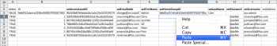

# Escenario de Kick-Starts: preparación de empresa, grupo, función y Kick-Starts de usuario

Cuando comience a implementar Adobe Workfront, en lugar de introducir datos manualmente, puede importar la lista de clientes, los departamentos internos, las funciones del trabajo y la información del usuario.

## Requisitos de acceso

+++ Expanda para ver los requisitos de acceso para la funcionalidad en este artículo.

Debe tener el siguiente acceso para realizar los pasos de este artículo:

<table style="table-layout:auto"> 
 <col> 
 <col> 
 <tbody> 
  <tr> 
   <td role="rowheader">Plan de Adobe Workfront</td> 
   <td>Cualquiera</td> 
  </tr> 
  <tr> 
   <td role="rowheader">Licencia de Adobe Workfront</td> 
   <td>
   
 Nuevo: estándar

   o
   
Actual: plan
</td> 
  </tr> 
  <tr> 
   <td role="rowheader">Configuraciones de nivel de acceso</td> 
   <td>[!UICONTROL System Administrator]</td> 
  </tr> 
 </tbody> 
</table>

Para obtener más información sobre el contenido de esta tabla, consulte [Requisitos de acceso en la documentación de Workfront](/help/quicksilver/administration-and-setup/add-users/access-levels-and-object-permissions/access-level-requirements-in-documentation.md).

+++

## Qué se puede importar

En la tabla siguiente se muestran las empresas, los grupos y los roles que se van a importar:

<table style="table-layout:auto"> 
 <col> 
 <col> 
 <col> 
 <thead> 
  <tr> 
   <th><strong>Compañías</strong> </th> 
   <th><strong>Grupos</strong> </th> 
   <th><strong>Funciones</strong> </th> 
  </tr> 
 </thead> 
 <tbody> 
  <tr> 
   <td valign="top"> 
Acme, Co
 
Workfront, Inc.
 
<em>Su compañía</em> 
 
XYZ, Inc.
 </td> 
   <td valign="top"> 
Finanzas
 
IT 
 
Marketing 
 
Ventas
 </td> 
   <td valign="top"> 
Analista empresarial
 
Controlador creativo
 
Diseñador
 
Gerente de recursos
 
Líder de equipo de Scrum
 
Escritor técnico
 
Desarrollador web
 </td> 
  </tr> 
 </tbody> 
</table>

Los nombres de las funciones deben ser únicos. No se pueden importar los roles existentes.

En las tablas siguientes se muestran los usuarios que se van a importar y varios atributos de usuario para cada uno:

### Usuario 1

| **Nombre** | Chris |
|---|---|
| **Apellido** | Manning |
| **Nombre de usuario/Correo electrónico** | mailto:cmanning@foo.com |
| **Contraseña** | updateMe |
| **Acceso** | Miembro del equipo |
| **Compañía** | &lt;*Su compañía>* |
| **Grupo de inicio** | Marketing |
| **Función** | Analista empresarial |

{style="table-layout:auto"}

### Usuario 2

| **Nombre** | Jennifer |
|---|---|
| **Apellido** | Campbell |
| **Nombre de usuario/Correo electrónico** | jcampbell@foo.com |
| **Contraseña** | updateMe |
| **Acceso** | Gerente del proyecto |
| **Compañía** | &lt;*Su compañía>* |
| **Grupo de inicio** | Marketing |
| **Función** | Gerente del proyecto |

{style="table-layout:auto"}

### Usuario 3

| **Nombre** | Jill |
|---|---|
| **Apellido** | Sullivan |
| **Nombre de usuario/Correo electrónico** | jsullivan@foo.com |
| **Contraseña** | updateMe |
| **Acceso** | Servicios de asistencia |
| **Compañía** | &lt;*Su compañía>* |
| **Grupo de inicio** | Ventas |
| **Función** | Representante de ventas |

{style="table-layout:auto"}

### Usuario 4

| **Nombre** | Marc |
|---|---|
| **Apellido** | Lewis |
| **Nombre de usuario/Correo electrónico** | mlewis@foo.com |
| **Contraseña** | updateMe |
| **Acceso** | Administrador de portafolios |
| **Compañía** | &lt;*Su compañía>* |
| **Grupo de inicio** | Finanzas |
| **Función** | Controlador |

{style="table-layout:auto"}

### Usuario 5

| **Nombre** | Pam |
|---|---|
| **Apellido** | Reynolds |
| **Nombre de usuario/Correo electrónico** | preynolds@foo.com |
| **Contraseña** | updateMe |
| **Acceso** | Gerente del proyecto |
| **Compañía** | *Su compañía>* |
| **Grupo de inicio** | Marketing |
| **Función** | IT |

{style="table-layout:auto"}

### Usuario 6

| **Nombre** | Ray |
|---|---|
| **Apellido** | Andrews |
| **Nombre de usuario/Correo electrónico** | randrews@foo.com |
| **Contraseña** | updateMe |
| **Acceso** | Administrador |
| **Compañía** | *Su compañía>* |
| **Grupo de inicio** | Gerente de recursos |
| **Función** | ninguno |

{style="table-layout:auto"}

## Descargar una plantilla de Kick-Start

{{step-1-to-setup}}

1. Haga clic en **Sistema** > **Kick-Starts** > **Importar datos.**

1. Haga clic en **Más opciones** para ver la lista completa de opciones de importación.
1. Seleccione los objetos de nivel de acceso, compañía, grupo, función y usuario que desea importar.

## Introducir información de la compañía

1. Abra el archivo **Workfront.xlsx** que acaba de descargar.

   >[!TIP]
   >
   >Al trabajar con hojas de datos muy anchas, puede utilizar la herramienta Congelar panel (o equivalente) del editor de hojas de cálculo para facilitar el trabajo con la hoja de cálculo.

1. Vaya a la hoja “Compañía CMPY”.

   Debe estar vacío a menos que las empresas ya estén en el sistema. 

   

1. Especifique TRUE en la columna **isNew**.
1. Repita esta acción para cada compañía que añada. (En este ejemplo, complete esta acción para las filas 3-6, ya que se están añadiendo cuatro compañías).

   

1. Especifique un ID único.

   Esto debe hacerse para cada fila de la columna de ID. Los números enteros que comienzan por 1 funcionan bien al crear nuevos registros.

   

1. Establezca un Nombre.

   Especifique los nombres de cada cliente en la columna **setName**.

   

1. Vaya a la hoja Grupo GRUPO.

   A menos que ya haya creado grupos en Workfront, esta hoja debería mostrar sólo el grupo predeterminado proporcionado con cada cuenta de Workfront.

    

1. Configure la columna **isNew**. Según el escenario, se importarán 4 grupos, así que deberá especificar TRUE en las filas 4 a 7 para la columna &quot;isNew&quot;.
1. Especifique un ID único.

   Esto debe hacerse para cada fila de la columna de ID. Los números enteros que comienzan por 1 funcionan bien al crear nuevos registros.

   

1. Establezca un Nombre.

   Especifique los nombres de cada departamento en la columna **setName**.

   

   Especifique la información de función. Vaya a la hoja FUNCIÓN Función.

1. A menos que ya haya creado o eliminado funciones en su cuenta, esta hoja debe mostrar 8 funciones que se proporcionan con cada cuenta de Workfront.

   

1. Instrucción Set True.

   Se están importando siete funciones; escriba TRUE en las filas 12 a 18 de la columna &quot;isNew&quot;.

   

1. Especifique un ID único.

   Esto debe hacerse para cada fila de la columna de ID. Los números enteros que comienzan por 1 funcionan bien al crear nuevos registros.

   

   

1. Proporcione nombres para cada función escribiéndolos en la columna setName.

   

1. Proporcione los detalles adicionales que sean necesarios.

   Incluya las tarifas de facturación, las tarifas de coste y las descripciones de las funciones que está creando, según sea necesario.

1. Vaya a la hoja de usuario USUARIO para introducir la información de usuario.

   A menos que ya haya creado usuarios en su cuenta, esta hoja solo debe mostrar el usuario administrador que se ha proporcionado con cada cuenta de Workfront.

    

1. Establezca el valor True especificando TRUE en las filas 4 a 9 de la columna &quot;isNew&quot;, ya que se están importando 6 usuarios.

   

1. Seleccione un ID único especificando un ID único en cada fila para la columna ID. Normalmente, los números enteros que empiezan por 1 funcionan bien para los registros nuevos.

   

1. Introduzca los nombres de cada usuario en las columnas &quot;setFirstName&quot; y &quot;setLastName&quot;.

   

1. Defina valores detallados especificando valores en las columnas &quot;setEmail&quot;, &quot;setPassword&quot; y &quot;setUsername&quot;.

   

1. Especifique los valores del nivel de acceso.

   Por ejemplo, Chris Manning, que es miembro del equipo, busca el ID en la hoja Nivel de acceso ACSLVL para el nivel de acceso miembro del equipo. Copie el ID en el portapapeles y péguelo en la hoja de usuario USUARIO de la columna **setAccessLevelID** en la fila de Chris.

   Repita este paso para cada usuario y nivel de acceso.

    

1. Especifique los detalles del grupo de inicio.

   Según el escenario, Chris Manning pertenece al grupo de marketing. En la hoja Grupo de GRUPO, busque el identificador del grupo de marketing, cópielo en el portapapeles y en la hoja Usuario de USUARIO péguelo en la columna **setHomeGroupID** en la fila de Chris.Repita este paso para cada asignación de usuario y grupo.

    

1. Especifique los detalles de la compañía.

   Todos los usuarios de este escenario pertenecen a la misma compañía. En la hoja Compañía CMPY, busque el ID de la compañía *Su propia compañía *compañía, copie el ID en el portapapeles y, en la pestaña Usuario de USUARIO, pegue este valor en cada fila de la columna &quot;setCompanyID&quot;.

   Repita este paso para cada asignación de usuario y grupo.

   

   

1. Especifique los detalles de la función.

   Según el escenario, Chris Manning tendrá la función de Analista empresarial. En la hoja Rol de ROL, busque el identificador de la función Analista empresarial, cópielo en el portapapeles y en la hoja Usuario de USUARIO, péguelo en la columna &quot;setRoleID&quot; de la fila de Chris.Repita este paso para cada asignación de usuario y grupo.

   

   

1. Rellene otros detalles del usuario según sea necesario y, a continuación, guarde el archivo.
1. Importe el archivo de Excel.

   Siga las instrucciones proporcionadas en [Importar datos en Adobe Workfront a través de una plantilla de Kick-Start](/help/quicksilver/administration-and-setup/manage-workfront/using-kick-starts/import-data-via-kickstarts.md).
