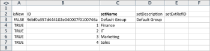
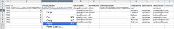

# Escenario de Kick-Starts: preparación de empresa, grupo, función y Kick-Starts de usuario

Cuando comience a implementar Adobe Workfront, en lugar de introducir datos manualmente, puede importar la lista de clientes, los departamentos internos, las funciones del trabajo y la información del usuario.

## Requisitos de acceso

+++ Expanda para ver los requisitos de acceso para la funcionalidad en este artículo.

Debe tener el siguiente acceso para realizar los pasos de este artículo:

<table style="table-layout:auto"> 
 <col> 
 <col> 
 <tbody> 
  <tr> 
   <td role="rowheader">Plan de Adobe Workfront</td> 
   <td>Cualquiera</td> 
  </tr> 
  <tr> 
   <td role="rowheader">Licencia de Adobe Workfront</td> 
   <td>
   
 Nuevo: estándar

   o
   
Actual: plan
</td> 
  </tr> 
  <tr> 
   <td role="rowheader">Configuraciones de nivel de acceso</td> 
   <td>[!UICONTROL System Administrator]</td> 
  </tr> 
 </tbody> 
</table>

Para obtener más información sobre el contenido de esta tabla, consulte [Requisitos de acceso en la documentación de Workfront](/help/quicksilver/administration-and-setup/add-users/access-levels-and-object-permissions/access-level-requirements-in-documentation.md).

+++

## Qué se puede importar

En la tabla siguiente se muestran las empresas, los grupos y los roles que se van a importar:

| Compañías | Grupos | Funciones |
|---|---|---|
| Acme, Co 
Workfront, Inc. 
_Su compañía_ 
XYZ, Inc. | Finanzas 
IT 
Marketing 
Ventas | Analista empresarial 
Controlador creativo 
Diseñador 
Gerente de recursos 
Líder de equipo de Scrum 
Escritor técnico 
Desarrollador web |

{style="table-layout:auto"}

Los nombres de las funciones deben ser únicos. No se pueden importar los roles existentes.

En las tablas siguientes se muestran los usuarios que se van a importar y varios atributos de usuario para cada uno:

### Usuario 1

| Atributo | Valor |
|---|---|
| **Nombre** | Chris |
| **Apellido** | Manning |
| **Nombre de usuario/Correo electrónico** | mailto:cmanning@foo.com |
| **Contraseña** | updateMe |
| **Acceso** | Miembro del equipo |
| **Compañía** | &lt;*Su compañía>* |
| **Grupo de inicio** | Marketing |
| **Función** | Analista empresarial |

{style="table-layout:auto"}

### Usuario 2

| Atributo | Valor |
|---|---|
| **Nombre** | Jennifer |
| **Apellido** | Campbell |
| **Nombre de usuario/Correo electrónico** | jcampbell@foo.com |
| **Contraseña** | updateMe |
| **Acceso** | Gerente del proyecto |
| **Compañía** | &lt;*Su compañía>* |
| **Grupo de inicio** | Marketing |
| **Función** | Gerente del proyecto |

{style="table-layout:auto"}

### Usuario 3

| Atributo | Valor |
|---|---|
| **Nombre** | Jill |
| **Apellido** | Sullivan |
| **Nombre de usuario/Correo electrónico** | jsullivan@foo.com |
| **Contraseña** | updateMe |
| **Acceso** | Servicios de asistencia |
| **Compañía** | &lt;*Su compañía>* |
| **Grupo de inicio** | Ventas |
| **Función** | Representante de ventas |

{style="table-layout:auto"}

### Usuario 4

| Atributo | Valor |
|---|---|
| **Nombre** | Marc |
| **Apellido** | Lewis |
| **Nombre de usuario/Correo electrónico** | mlewis@foo.com |
| **Contraseña** | updateMe |
| **Acceso** | Administrador de portafolios |
| **Compañía** | &lt;*Su compañía>* |
| **Grupo de inicio** | Finanzas |
| **Función** | Controlador |

{style="table-layout:auto"}

### Usuario 5

| Atributo | Valor |
|---|---|
| **Nombre** | Pam |
| **Apellido** | Reynolds |
| **Nombre de usuario/Correo electrónico** | preynolds@foo.com |
| **Contraseña** | updateMe |
| **Acceso** | Gerente del proyecto |
| **Compañía** | *Su compañía>* |
| **Grupo de inicio** | Marketing |
| **Función** | IT |

{style="table-layout:auto"}

### Usuario 6

| Atributo | Valor |
|---|---|
| **Nombre** | Ray |
| **Apellido** | Andrews |
| **Nombre de usuario/Correo electrónico** | randrews@foo.com |
| **Contraseña** | updateMe |
| **Acceso** | Administrador |
| **Compañía** | *Su compañía>* |
| **Grupo de inicio** | Gerente de recursos |
| **Función** | ninguno |

{style="table-layout:auto"}

## Descargar una plantilla de Kick-Start

{{step-1-to-setup}}

1. Haga clic en **Sistema** > **Kick-Starts** > **Importar datos.**

1. Haga clic en **Más opciones** para ver la lista completa de opciones de importación.
1. Seleccione los objetos de nivel de acceso, compañía, grupo, función y usuario que desea importar.
1. Haga clic en **Descargar**.

## Introducir información de la compañía

1. Abra el archivo **Workfront.xlsx** que acaba de descargar.

   >[!TIP]
   >
   >Al trabajar con hojas de datos muy anchas, puede utilizar la herramienta Congelar panel (o equivalente) del editor de hojas de cálculo para facilitar el trabajo con la hoja de cálculo.

1. Vaya a la hoja **Compañía CMPY**.

   Debe estar vacío a menos que las empresas ya estén en el sistema.

    

1. Escriba **TRUE** en la columna **isNew**.

   Repita esta acción para cada compañía que añada. (En este ejemplo, complete esta acción para las filas 3-6, ya que se están añadiendo cuatro compañías).

   

1. Escriba un **ID** único.

   Debe introducir un ID para cada fila. Los números enteros que comienzan por 1 funcionan bien al crear nuevos registros.

   

1. Escriba los nombres de cada cliente en la columna **setName**.

   

1. Vaya a la hoja **GROUP Group**.

   A menos que ya haya creado grupos en Workfront, esta hoja debería mostrar sólo el grupo predeterminado proporcionado con cada cuenta de Workfront.

    

1. Escriba **TRUE** en la columna **isNew**.

   Según el escenario, se importarán 4 grupos, así que escriba **TRUE** en la columna **isNew** para las filas 4 a 7.

1. Escriba un **ID** único.

   Debe introducir un ID para cada fila. Los números enteros que comienzan por 1 funcionan bien al crear nuevos registros.

   

1. Escriba los nombres de cada departamento en la columna **setName**.

   

1. Vaya a la hoja de **ROL**.

   A menos que ya haya creado o eliminado funciones en su cuenta, esta hoja debe mostrar 8 funciones que se proporcionan con cada cuenta de Workfront.

   

1. Escriba **TRUE** en la columna **isNew**.

   Según el escenario, se importarán 7 roles, así que escriba **TRUE** en la columna **isNew** para las filas de la 12 a la 18.

   

1. Escriba un **ID** único.

   Debe introducir un ID para cada fila. Los números enteros que comienzan por 1 funcionan bien al crear nuevos registros.

   

1. Escriba un nombre para cada rol en la columna **setName**.

   

1. Proporcione los detalles adicionales que sean necesarios.

   Incluya las tarifas de facturación, las tarifas de coste y las descripciones de las funciones que está creando, según sea necesario.

1. Vaya a la hoja **USUARIO**.

   A menos que ya haya creado usuarios en su cuenta, esta hoja solo debe mostrar el usuario administrador que se ha proporcionado con cada cuenta de Workfront.

    

1. Escriba **TRUE** en la columna **isNew**.

   Según el escenario, se importarán 6 usuarios, así que escriba **TRUE** en la columna **isNew** para las filas 4 a 9.

   

1. Escriba un **ID** único.

   Debe introducir un ID para cada fila. Los números enteros que comienzan por 1 funcionan bien al crear nuevos registros.

   

1. Escriba los nombres de cada usuario en las columnas **setFirstName** y **setLastName**.

   

1. Defina valores detallados introduciendo valores en las columnas **setEmail**, **setPassword** y **setUsername**.

   

1. Especifique los valores del nivel de acceso.

   Por ejemplo, Chris Manning es miembro del equipo. Busque el identificador en la hoja **Nivel de acceso ACSLVL** para el nivel de acceso de miembro del equipo. Copie el identificador y, en la hoja **USUARIO**, péguelo en la columna **setAccessLevelID** de la fila de ese usuario.

   Repita este paso para cada usuario y nivel de acceso.

    

1. Introduzca los detalles del grupo de inicio del usuario.

   Según el escenario, Chris Manning pertenece al grupo de marketing. En la hoja **Grupo de grupo**, busque el identificador del grupo de marketing, cópielo y en la hoja **Usuario** péguelo en la columna **setHomeGroupID** de la fila del usuario. palo de golfRepita este paso para cada asignación de usuario y grupo.

    

1. Introduzca los detalles de la compañía del usuario.

   Todos los usuarios de este escenario pertenecen a la misma compañía. En la hoja **CMPY Company**, busque el identificador de la compañía **Your Own Company**, copie el identificador y, en la ficha **USER User**, pegue este valor en cada fila de la columna **setCompanyID**.&#x200B;

   Repita este paso para cada asignación de usuario y grupo.

    

1. Introduzca los detalles de la función del usuario.

   Según el escenario, Chris Manning tendrá la función de Analista empresarial. En la hoja **Rol**, busque el identificador de la función Analista de negocios, cópielo y, en la hoja **Usuario**, péguelo en la columna **setRoleID** de la fila del usuario. palo de golfRepita este paso para cada asignación de usuario y grupo.

    

1. Rellene otros detalles del usuario según sea necesario y, a continuación, guarde el archivo.
1. Importe el archivo de Excel.

   Siga las instrucciones proporcionadas en [Importar datos en Adobe Workfront a través de una plantilla de Kick-Start](/help/quicksilver/administration-and-setup/manage-workfront/using-kick-starts/import-data-via-kickstarts.md).

>[!NOTE]
>
>Los usuarios importados a Workfront se crean en un estado de Desactivado y Pendiente de aprobación.
> 
>Si un usuario no abandona el estado de Desactivado y Pendiente de aprobación en unos minutos, puede añadir el lote de usuarios directamente a Adobe Admin Console.
>
>Para obtener instrucciones, consulte [Administrar varios usuarios | Carga masiva de CSV](https://helpx.adobe.com/es/enterprise/using/bulk-upload-users.html) en la documentación de Adobe.
