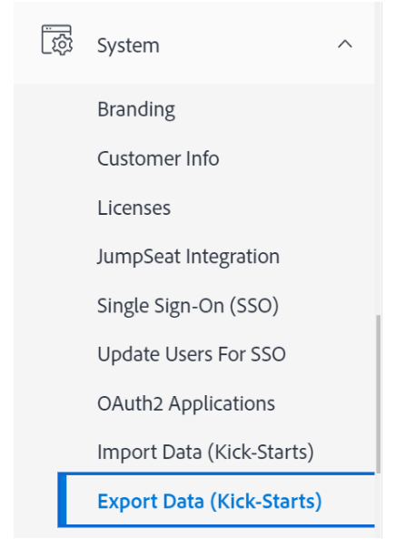
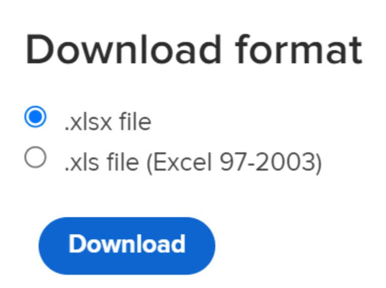

# Caso de Kick-Starts: importar campos personalizados de varias opciones en Workfront

Puede importar campos personalizados con varias opciones en Adobe Workfront mediante la funcionalidad de KickStart.

Estos son algunos ejemplos de campos personalizados con varias opciones:

* Lista desplegable de selección múltiple
* Lista desplegable
* Casillas de verificación
* Botones de radio

Estos campos a veces pueden tener muchas (a veces cientos) de opciones. La importación de estos datos mediante la funcionalidad de KickStart puede ahorrarle, como administrador de Workfront, mucho tiempo y ayudarle a evitar errores.

>[!IMPORTANT]
>
>Debe seguir los pasos descritos en las secciones siguientes, en este orden, para importar campos personalizados con varias opciones mediante un kick-start:
>
>1. Exportar datos personalizados existentes de Workfront (paso opcional)
>1. Exportar la plantilla de Kick-Starts para datos personalizados
>1. Rellenar la hoja de cálculo de KickStarts de Excel
>1. Cargar la hoja de cálculo de Excel en Workfront

## Exportar datos personalizados existentes de Workfront (paso opcional)

Si no está familiarizado con la estructura de la base de datos de Workfront o con el archivo de KickStart que Workfront necesita para importar información, le recomendamos que primero exporte un archivo de KickStart de Workfront con información existente, similar a la de los campos que desea importar.

Por ejemplo, si desea importar formularios o campos personalizados, primero debe exportar un archivo de KickStart con datos personalizados existentes.

Exportar primero los datos existentes le permite analizarlos y ver cómo se deben formatear los nuevos datos.

Si conoce bien los objetos y la estructura de la base de datos de Workfront, puede continuar con la sección siguiente.

Para exportar datos existentes desde Workfront:

{{step-1-to-setup}}

1. Expanda **Sistema** en el menú de la izquierda y luego haga clic en **Exportar datos (Kick-Starts)**.

   

1. Seleccione **Datos personalizados** en la sección **Qué incluir**.

   

1. Elija **.xlsx archivo** en la sección **Formato de descarga**.

   >[!TIP]
   >
   >    Según la cantidad de datos personalizados que tenga en el sistema, esto puede tardar mucho tiempo.

   

1. Haga clic en **Descargar**. Un archivo .xlsx se descarga en el equipo. Vaya a y ábralo.

   

1. Examine el archivo descargado y tome nota de los siguientes detalles:

   * El archivo contiene varias hojas. Es posible que no necesite conocer la información de cada hoja, pero utilizará algunas de las hojas para importar la información. Tómese un tiempo para familiarizarse con su contenido y especialmente con el formato del contenido de cada hoja.
   * Preste especial atención a los nombres de columna y al formato en el que se muestran los datos de cada columna.
   * No debe cambiar los nombres ni el orden de las columnas en ninguna de las hojas. Los encabezados de columna indican los campos que debe rellenar con la información, en cada fila. Si el encabezado de la columna aparece en negrita, es un campo obligatorio, por lo que debe contener información.

   >[!IMPORTANT]
   >
   >Es posible que algunos encabezados de columna no se muestren en negrita, pero es posible que sigan siendo necesarios.

   * Guarde el archivo descargado para referencia futura y continúe a la siguiente sección.

## Exportar la plantilla de Kick-Starts para datos personalizados

Después de analizar la información sobre los campos personalizados existentes en el sistema, puede descargar una nueva plantilla de inicio para la importación.

{{step-1-to-setup}}

1. Expandir **Sistema** en el menú de la izquierda.

1. Haga clic en **Importar datos (Kick-Starts)**.

   

1. En el área **Descargar hoja de cálculo de KickStart** en blanco, elija la casilla **Datos personalizados** y haga clic en **Descargar**.

   

   Un archivo de inicio de sesión en blanco se descarga en el equipo.

   >[!NOTE]
   >
   >El número de hojas del archivo, sus nombres y el número y los nombres de las columnas de cada hoja deben ser idénticos a los de la descarga de inicio de la sección anterior, que contenía los datos personalizados existentes.

## Rellenar la hoja de cálculo de KickStarts de Excel

Antes de rellenar la hoja de cálculo de Excel, descargue la plantilla de inicio tal como se describe en la sección anterior.

>[!IMPORTANT]
>
>No intente importar información mediante una hoja de cálculo de Excel ad hoc. Todas las hojas de cálculo para importar información en Workfront mediante la funcionalidad de inicio rápido deben coincidir con el contenido de los archivos que descargue de Workfront y que se describen en este artículo.

Para rellenar la hoja de cálculo de Excel con información para los nuevos campos personalizados:

1. Abra la hoja de cálculo de Excel que descargó en la sección anterior y observe varias hojas. Cada hoja representa un objeto en la aplicación.

   >[!INFO]
   >
   >Por ejemplo, **Parámetro** (que hace referencia al campo personalizado), **Parámetro Option**(que hace referencia a la opción del campo personalizado), **Categoría** (que hace referencia al formulario personalizado).
   >
   >Debe escribir los nombres de los objetos y sus atributos en el formato admitido por la base de datos de Workfront.
   >
   >Para obtener información acerca del significado de estos objetos, vea el [Glosario de [!DNL Adobe Workfront] terminología](../../../workfront-basics/navigate-workfront/workfront-navigation/workfront-terminology-glossary.md).
   >
   >Para obtener información sobre los nombres de los objetos de la base de datos de Workfront, consulte [Explorador de API](../../../wf-api/general/api-explorer.md).
   >
   >

1. Asegúrese de que la siguiente información tenga el formato correcto:

   * La primera fila de cada hoja debe permanecer vacía; de lo contrario, la importación genera un error.
   * Los encabezados de columna de cada hoja representan los atributos de los objetos que se pueden definir durante una importación. Todos los encabezados de columna deben permanecer en el mismo orden en el que se encuentran al exportar la hoja y no se puede cambiar el nombre.
   * Los encabezados de columna en negrita son campos obligatorios y deben tener un valor.

     >[!TIP]
     >
     >Algunas columnas son obligatorias, aunque no aparecen en negrita. Por ejemplo, las columnas `isNew` y `ID` no están en negrita, pero son campos obligatorios.

1. Seleccione la hoja `**PARAM Parameter`** y agregue información acerca de los nuevos campos personalizados en las siguientes columnas requeridas:

   * **`isNew`** = escriba **`TRUE`** en esta columna para cada línea que represente un nuevo campo personalizado. Esto indica que el campo es nuevo y no existe en Workfront.

     >[!TIP]
     >
     >    Si una línea representa un campo existente que ya se encuentra en Workfront, debe escribir **`isNew`** = **`FALSE`**.

   * **`ID`** = debe ser un número único para cada línea que represente un nuevo campo. Puede utilizar cualquier número que comience por 1, siempre que cada nuevo campo tenga un número único.
   * **`setDataType`** = para cada línea que represente un nuevo campo, escriba el tipo de datos que admite el campo. El tipo de datos debe introducirse tal como aparecería en la base de datos. Seleccione entre los siguientes tipos de datos:
      * **`NMBR`** para número
      * **`CURC`** para moneda
      * **`TEXT`** para texto
   * `**setDisplaySize**`= el tamaño de visualización (&#39;**setDisplaySize**&#39;) de cualquier campo personalizado de opciones múltiples siempre es 0.
   * **`setDisplayType`** = para cada línea que represente un nuevo campo, escriba el tipo de presentación del campo. El tipo de presentación debe introducirse tal como aparecería en la base de datos.

     Para los campos personalizados de varias opciones, seleccione una de las siguientes opciones:

      * **`MULT`** para Lista desplegable de selección múltiple
      * **`SLCT`** para menú desplegable
      * **`RDIO`** para botones de opción
      * **`CHCK`** para casillas de verificación

     >[!TIP]
     >
     >Para encontrar la información de Tipo de datos y Tipo de presentación, consulte el [Explorador de API](../../../wf-api/general/api-explorer.md), expanda el objeto **Parameter** y busque estos atributos en la ficha **campos**.

   * **`setName`** = escriba el nombre de los campos personalizados tal como desea que se muestren en Workfront.

     >[!INFO]
     >
     >Por ejemplo, podríamos importar dos campos personalizados, llamados _Brand_, un campo de casilla de verificación y _Media_, un campo de botón de opción.

   * Las columnas **`setName`** y **`setValue`** suelen contener la misma información y deben reflejar los nombres deseados en la interfaz de Workfront para el nuevo campo.

   El valor de un campo es el nombre que aparece en los informes, por ejemplo, mientras que el nombre se muestra en los formularios personalizados adjuntos a los objetos.

   Para obtener más información, vea [Diseñar un formulario con el diseñador de formularios](/help/quicksilver/administration-and-setup/customize-workfront/create-manage-custom-forms/form-designer/design-a-form/design-a-form.md).

   

1. Seleccione la hoja **`POPT Parameter Options`** y agregue información sobre las opciones de cada campo personalizado en las siguientes columnas requeridas:

   * **`isNew`** = escriba **`TRUE`** en esta columna para cada línea que represente una nueva opción de campo.

     >[!TIP]
     >
     >    Si una línea representa una opción existente, debe escribir **`isNew`** = **`FALSE`**.

   * **`ID`** = debe ser un número único para cada línea que represente una nueva opción. Puede utilizar cualquier número que comience por 1, siempre que cada nueva opción tenga un número único.
   * **`setIsDefault`** = escriba `TRUE` para las opciones que desee mostrar de forma predeterminada, y `FALSE` para todas las demás opciones, para cada campo.  Por ejemplo, queremos que _Nike_ sea la opción predeterminada para _Brand_ y _Print_ sea la opción predeterminada para _Media_.

     >[!TIP]
     >
     >Solo puede tener una opción predeterminada para cada campo.

   * **`setParameterID`** = las opciones correspondientes al campo personalizado _Marca_ tienen un **`setParameterID`** de 1, y las opciones correspondientes a _Medios_ tienen un **`setParameterID`**de 2. Las hojas `PARAM` y `POPT` se hacen referencia entre sí para indicar qué opciones pertenecen a cada campo personalizado.
   * **`setDisplayOrder`**= la columna de orden de visualización indica el orden en que se mostrarán las opciones en el campo personalizado. Puede comenzar con 1 y continuar en orden ascendente para todas las opciones, independientemente de los campos a los que pertenezcan. Lo importante aquí es tener números únicos para cada opción.
   * Las columnas **`setLabel`** y `**setValue`** generalmente contienen la misma información y deben reflejar los nombres deseados en la interfaz de usuario de Workfront. El valor de una opción es el nombre que se muestra en los informes, por ejemplo, mientras que la etiqueta se muestra en los formularios personalizados cuando se adjunta a un objeto. Para obtener más información, vea [Diseñar un formulario con el diseñador de formularios](/help/quicksilver/administration-and-setup/customize-workfront/create-manage-custom-forms/form-designer/design-a-form/design-a-form.md).
   * **`setIsHidden`** = escriba `TRUE` si desea que cualquiera de las opciones esté oculta.

   

1. (Opcional) Si también desea crear un formulario personalizado en el que posteriormente pueda agregar los nuevos campos, seleccione la hoja **`CTGY Category`** y actualice las siguientes columnas necesarias para la información del formulario personalizado:

   * **`isNew`** = escriba **`TRUE`** en esta columna para cada línea que represente un nuevo formulario personalizado.
   * **`ID`** = escriba un número único para cada línea que represente un formulario nuevo. Puede utilizar cualquier número que comience por 1, siempre que cada nueva opción o línea tenga un número único.
   * **`setGroupID`** = agregue el Id. de grupo a su grupo de inicio o a cualquier otro grupo del sistema cuyos miembros desee que tengan acceso a este formulario. Este campo es obligatorio.

   Para averiguar el `ID` de un grupo, puede generar un informe de grupo y agregar el campo `ID` en la vista, o bien desplazarse a un grupo y encontrar la dirección URL del grupo. El ID de grupo aparecerá en la dirección URL de la página del grupo. Por ejemplo, si la dirección URL del grupo es `https://companyName.my.workfront.com/group/575b000800467a6f66e747932c807464/members`, el identificador de grupo es `575b000800467a6f66e747932c807464`.

   * **`setCatObjCode` **= este es el código de objeto para el tipo de objeto para el que desea crear el formulario. Introduzca un código de las siguientes opciones:
      * **`CMPY`** para la compañía
      * **`TASK`** para tarea
      * **`PROJ`** para el proyecto
      * **`PORT`** para Portfolio
      * **`PRGM`** para el programa
      * **`USER`** para el usuario
      * **`DOCU`** para el documento
      * **`OPTASK`** para el problema
      * **`EXPNS`** de gasto
      * **`ITRN`** para iteración
      * **`BILL`** para registros de facturación
      * **`GROUP`** para el grupo

     >[!NOTE]
     >
     >En el caso de los formularios de varios objetos, introduzca el primer objeto que seleccionaría al crear un formulario en la interfaz de usuario. Por ejemplo, establezca `setCatObjCode` en `TASK`, si desea seleccionar Tarea en la interfaz de Workfront y, a continuación, Problema, Portfolio, etc., pero no desea que el formulario esté disponible para Proyectos.

   * **`setName`** = es el nombre del formulario personalizado tal como desea que aparezca en la interfaz de Workfront.

     

1. Guarde la hoja de cálculo como un archivo .xls o .xlsx en el equipo. La hoja de cálculo de Excel está rellenada y lista para importarse en Workfront.

## Cargar la hoja de cálculo de Excel en Workfront

Después de realizar los pasos descritos en las secciones anteriores, continúe con lo siguiente para cargar los campos y formularios nuevos en Workfront:

{{step-1-to-setup}}

1. Haga clic en **Sistema > Importar datos (Kick-Starts)**.

1. Haga clic en **Elegir archivo** en la sección **Cargar datos con hoja de cálculo de KickStart**.

1. Busque la hoja de cálculo de Excel que ha preparado en el equipo y selecciónela cuando la encuentre.  Cuando Workfront reconoce el archivo, el botón Upload se vuelve de color azul.
1. Haga clic en **Cargar.**

   

1. Se muestra una notificación de que la importación se ha realizado correctamente. En función de la cantidad de información que esté importando, este paso puede tardar entre unos segundos y un minuto.

   

   Los nuevos campos y formularios personalizados ya están en el sistema de Workfront. Puede encontrarlos en el área de Forms personalizado de la Configuración.

   >[!NOTE]
   >
   >Los nuevos formularios y los campos importados aún no están conectados. El formulario se importará sin campos personalizados. Debe agregar manualmente los campos al nuevo formulario personalizado o a otro formulario personalizado existente.

   Para obtener información acerca de cómo agregar campos a formularios personalizados, vea [Diseñar un formulario con el diseñador de formularios](/help/quicksilver/administration-and-setup/customize-workfront/create-manage-custom-forms/form-designer/design-a-form/design-a-form.md).

1. (Condicional) Si la importación no se realizó correctamente, recibirá un mensaje de error con el problema. Intente identificar el campo, la hoja y el número de fila en los que se encontró el problema, corrija la información en el archivo de Excel y, a continuación, intente importar el archivo una vez más.

   

1. (Condicional) Según el problema, como se indica en el mensaje de error, es posible que ya se haya importado parte de la información. Debe realizar una de las siguientes acciones antes de volver a importar la hoja:

   * Elimine la información que se importó correctamente desde Workfront desde el área de Forms personalizado y, a continuación, realice la corrección que indica el mensaje de error.
   * Indique que un campo o formulario ya está en el sistema para los campos o formularios que ya se han importado y, a continuación, realice la corrección.
Para indicar que un campo o un formulario personalizado ya se encuentra en Workfront, debe asegurarse de que el campo `inNew` esté marcado como `FALSE` en las hojas que contienen información sobre el formulario (`CTGY`) o el campo (`PARAM`) en la hoja de importación de inicio.
